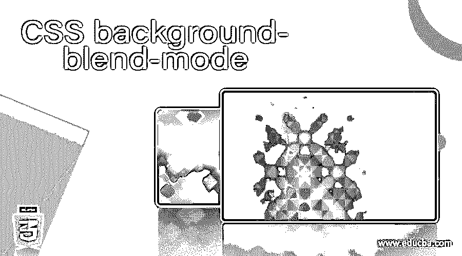
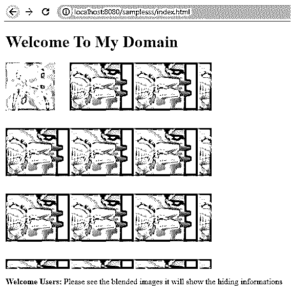
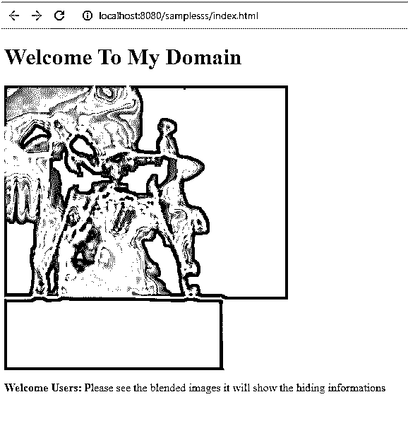
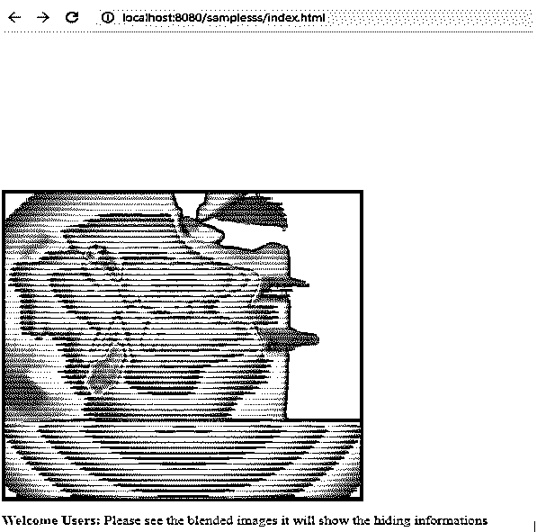

# CSS 背景混合模式

> 原文：<https://www.educba.com/css-background-blend-mode/>




## CSS 背景介绍-混合模式

在级联样式表(CSS)中，两个或多个图像与单个图像连接在一起，也称为混合图像。它还可能需要背景显示，如颜色、动画等。这些是一些必须通过其视图启用的现代功能，因此两个或多个图像与一些背景功能混合。这些类型的要求将需要用户在应用程序中有更多的需求和设施，因为在背景混合模式下，它有自己的属性，可以通过每个背景层的混合模式启用和定义。在这篇文章中，我们将讨论 CSS 背景混合模式。

**语法和参数:**

<small>网页开发、编程语言、软件测试&其他</small>

我们知道 CSS 代码是与 HTML 页面结合在一起编写的，或者我们必须用。css 扩展。如果我们在网页 HTML 中使用 CSS 代码，它有一个单独的标签叫做

```
<html>
<head>
<style>
.pencil-effect{
background:
url(filename.jpg);
url(file.jpg);
background-blend-mode:difference;
---some css scripts based on the user requirements—
}
</style>
</head>
<body>
</body>
</html>
```

上面的代码是 CSS 中背景混合模式属性的基本语法，我们使用了一种叫做铅笔效果的效果，我们也可以根据客户的要求使用一些不同的效果。因此，背景混合模式在 URL 代码中传递图像之前具有属性，同样，我们将使用不同类型的属性，并根据各部分传递参数。

### 背景混合模式属性如何在 CSS 中工作？

在表示层中，CSS 是 web 应用程序中最重要的部分之一，如果一张图片讲述了图片中的数十万个单词，那么图片的混合也是值得的。我们使用网页表示层的设计可能性是明智的。CSS 混合模式具有其中一种模式或方式，通过目前的应用程序在网页中更加用户友好。因此，每次模式需要页面的每个图示的背景颜色时，它都会启用 CSS 页面中的属性。因此，它可以包括其他类似的属性，如混合-混合模式和隔离属性，使用户能够在醒目的保护和照片效果的帮助下捕捉视图，web 应用程序只做一些动画软件，如 Adobe Photoshop 等。

我们可以在 CSS 表单的背景图片中使用多个属性。同样，在逗号的帮助下，使用单独使用的函数，一个以上的渐变被渲染在另一个之上。图像有不同的格式，如 jpg，png 等，也有字节，千字节，兆字节，千兆字节等。我们已经看到了具有背景混合模式属性的一组不同的动画模式。光谱背景是用背景图像显示光谱的全部颜色的模式之一。格子背景是另一种带有格子图案的动画脚本，它使用渐变来启用背景混合模式属性。

圆形的背景是使用径向渐变的动画效果之一。铅笔素描效果用于摄影效果。我们使用逗号操作符来分隔两个图像背景位置，每个位置将对应于背景图像的单个副本。第一幅图像将仅在 x 轴上从中心位置指向像素格式的左侧，从 y 轴开始，中心位置将向上指向像素符号。在第二种类型中，背景复制图像将做相反的位置，从向下移动到右边的位置。对于特别相关的图像，我们将提高图像的亮度以及增加图像对比线条的次要效果。与其他效果相同的场景，即黑板效果和夜视效果，这些效果将根据客户的要求将图像与一些动画效果混合在一起。

### CSS 背景混合模式的例子

让我们讨论 CSS 背景混合模式的例子。

#### 示例#1

**代码:**

```
<!DOCTYPE html>
<html>
<head>
<style>
#sma {
width: 402px;
height: 403px;
background-repeat: no-repeat, repeat;
background-image: url("second.jpg"),url("first.jpg");
background-blend-mode: screen, difference, lighten;
}
</style>
</head>
<body>
<h1>Welcome To My Domain</h1>
<div id="sma"></div>
<p><b>Welcome Users:</b> Please see the blended images it will show the hiding information’s</p>
</body>
</html>
```

**输出:**




#### 实施例 2

**代码:**

```
<!DOCTYPE html>
<html>
<head>
<style>
#smb {
width: 402px;
height: 403px;
background:
url("first.jpg"),
url("second.jpg");
background-size: *cover*;
background-blend-mode: *difference*;
background-position:
calc(52% — 2px) calc(54% — 2px),
calc(53% + 2px) calc(56% + 2px);
filter: brightness(4) invert(2) grayscale(3);
}
</style>
</head>
<body>
<h1>Welcome To My Domain</h1>
<div id="smb"></div>
<p><b>Welcome Users:</b> Please see the blended images it will show the hiding informations</p>
</body>
</html>
```

**输出:**




#### 实施例 3

**代码:**

```
<!DOCTYPE html>
<html>
<head>
<style>
#smb{
width: 402px;
height: 403px;
background:
url("first.jpg"),
radial-gradient(
rgba(2,256,1,.7),
black
),
repeating-linear-gradient(
transparent 5,
rgba(1,5,2,.3) 7px,
transparent 8px
);
}
#ght {
width: 402px;
height: 403px;
background:
url("first.jpg"),
radial-gradient(
rgba(0,255,0,.4),
black
),
repeating-linear-gradient(
transparent 0,
rgba(0,0,0,.5) 6px,
transparent 7px
);
background-blend-mode: overlay;
background-size: cover;
}
</style>
</head>
<body>
<h1>Welcome To My Domain</h1>
<div id="smb"></div>
<div id="ght"></div>
<p><b>Welcome Users:</b> Please see the blended images it will show the hiding informations</p>
</body>
</html>
```

**输出:**




上面的三个例子将解释背景混合属性在 CSS 网页中启用的不同情况。我们使用的动画效果在网页背景图像的目的，它增加了梯度以及背景混合模式，我们可以使用任何数量的图像格式的风格，即使它会接受动画图像格式一样。PDS photoshop 软件文件也接受它在基于网络的应用程序中增加的优点作为样式表。

### 结论

Web 应用程序将使用一些表示概念，它在业务中影响和吸引用户。因此，web 应用程序必须从业务角度支持用户以及他们的成长。CSS 的概念和属性在吸引用户和业务增长方面是业界最好的。

### 推荐文章

这是一个 CSS 背景混合模式的指南。这里我们讨论 CSS 背景混合模式的介绍以及背景混合模式属性在 CSS 中是如何工作的？分别是。您也可以看看以下文章，了解更多信息–

1.  [CSS 子选择器](https://www.educba.com/css-child-selector/)
2.  [CSS 溢出换行](https://www.educba.com/css-overflow-wrap/)
3.  [CSS in React](https://www.educba.com/css-in-react/)
4.  [CSS 文本颜色](https://www.educba.com/css-text-color/)


