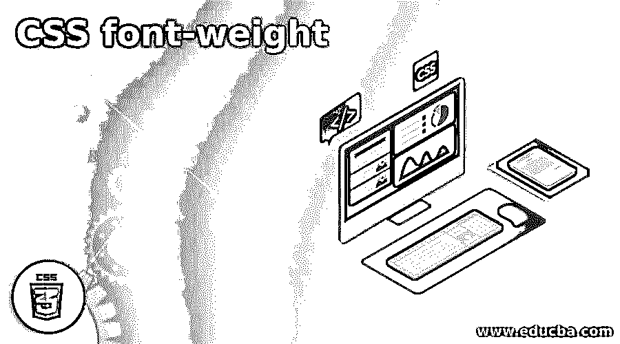
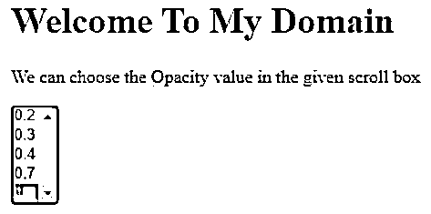

# CSS 字体粗细

> 原文：<https://www.educba.com/css-font-weight/>




## CSS 字体粗细介绍

CSS 字体粗细是用于设置字体粗细的属性之一，但字体的粗细也是可用的，它主要取决于基于客户要求的网页上使用的字体家族。该属性不仅设置粗细，还设置了字体家族中已安装在字体内部的可用字体的粗细或粗细，或者浏览器定义的粗细也可以接受关键字值或任何内置值，它必须是数字格式。

**语法和参数:**

<small>网页开发、编程语言、软件测试&其他</small>

CSS 代码是在 html 页面中使用样式标签编写的；我们可以遵循一些规则和语法来定制更有吸引力的网页。我们可以使用字体样式来创建用户友好的 web 应用程序，它们具有自己的属性、特性和用户指定值的元素。

```
<html>
<head>
<style>
.first
{
font-weight: ; //numeric format values only supported
}
</style>
</head>
<body>
---some html codes----
</body>
</html>
```

以上代码是在 CSS 样式表中初始化字体粗细属性值的基本语法。我们只使用数字支持的值，或者是关键字类型的值，或者是 CSS 代码中预定义的值。使用这两种类型的支持值，我们可以在字体样式表中将它们称为参数或参数集。

### 字体粗细在 CSS 中是如何工作的？

*   CSS 样式的代码，我们使用了很多属性，默认值是文本，数字，特殊字符等等。使用这些类型的值，我们可以启用它们的 CSS 属性的特定属性，以使演示更加用户友好，客户满意度对业务前景非常重要。例如，我们可以在 html 代码中使用字体元素属性；它是一个默认的 html 标签，ID 或者一些内置的类。
*   当我们在 html 中使用 CSS 字体时，基于标签的元素(如 font-weight)是默认的，也是在 html 代码中使用最广泛的元素之一，用于放置不同范围和 CSS 样式表示的文本，具有更大的粗体和厚度。它也有助于 CSS 样式代码中的元素。它主要用于 html 的标签中，因为
*   在 font-weight 属性中，我们已经说过它只接受数值类型的值，可以是关键字类型的值，也可以是一些预定义类型的数值。有些关键词是正常的，加粗的，更轻的，更粗的。如果假设关键字值是正常的，根据用户的需要，在 100 到 900 之间的一些范围内的可用数值类型可以变化。因此，它映射到数值 400，该值也是粗体的，它映射到 700，以便查看任何类型的效果值范围，而不是 400 或 700。字体与一些内置字体一起使用，与这些指定的权重相匹配。
*   假设粗体的字体值范围为 700，而普通字体值范围为 400。在这种情况下，该版本具有浏览器将使用的字体系列的一部分，如果属性不可用，将模拟用户浏览器并自动更改粗体或普通版本，它不会模拟其他不可用的权重字体通常主要用于常规和轻型格式，以识别具有替代思想的网页的字体权重。

### CSS 字体粗细示例

下面是 CSS 字体粗细的示例:

#### 示例#1

**代码:**

```
<!DOCTYPE html>
<html>
<head>
<title>Welcome To My Domain</title>
<style>
.first > div {
padding: 0 20px;
font-family: 'Open Sans';
}
div.second {
font-weight: 100;
}
div.third {
font-weight: 300;
}
div.four {
font-weight: 200;
}
div.five {
font-weight: 400;
}
div.six {
font-weight: 500;
}
div.seven {
font-weight: 600;
}
div.eight {
font-weight: 700;
}
div.nine {
font-weight: 800;
}
div.ten {
font-weight: 900;
}
div.eleven {
font-weight: 200;
}
div.twelve {
font-weight: 100;
}
</style>
</head>
<body>
<div class="first">
<h3>Have a Nice day</h3>
<div class="second">Welcome</div>
<div class="third">Welcome</div>
<div class="four">Welcome</div>
<div class="five">Welcome</div>
<div class="six">Welcome</div>
<div class="seven">Welcome</div>
<div class="eight">Welcome</div>
<div class="nine">Welcome</div>
<div class="ten">Welcome</div>
<div class="eleven">Welcome</div>
<div class="twelve">Welcome</div>
</div>
<div class="first">
<h3>Welcome Users</h3>
<div class="second">
Have a nice Day
<p>Gud day</p>
</div>
<div class="second">
Welcome
<p>Welcome</p>
</div>
<div class="opacity80">
Gud day
<p>Welcome</p>
</div>
<div class="opacity70">
Gud day
<p>Welcome</p>
</div>
<div class="opacity60">
Gud day
<p>Welcome</p>
</div>
<div class="opacity50">
Gud day
<p>Welcome</p>
</div>
<div class="opacity40">
Gud day
<p>Welcome</p>
</div>
<div class="opacity30">
Gud day
<p>Welcome</p>
</div>
<div class="opacity20">
Gud day
<p>Welcome</p>
</div>
<div class="opacity10">
Gud day
<p>Welcome</p>
</div>
<div class="opacity0">
Gud day
<p>Welcome</p>
</div>
<p><small>Welcome <code>To</code> My Domain</small></p>
</div>
</body>
</html>
```

**输出:**


#### 实施例 2

**代码:**

```
<!DOCTYPE html>
<html>
<head>
<style>
#first {
font-weight: lighter;
}
</style>
</head>
<body>
<h1>Welcome To My Domain</h1>
<p id="first">We can choose the Opacity value in the given scroll box</p>
<select onchange="demo(this);" size="5">
<option>0.2
<option>0.3
<option>0.4
<option>0.7
<option selected="selected">1
</select>
</body>
</html>
```

**输出:**

**

** 

#### 实施例 3

**代码:**

```
<!DOCTYPE html>
<html>
<head>
<title>Welcome To My Domain</title>
<style>
.first > div {
src: url('WWW.facebook.com');
font-family:'MutatorSans';
font-style: normal;
}
div.second {
font: 1rem monospace;
white-space: nowrap;
}
div.third {
font-weight: inherit;
text-transform: uppercase;
font: 1.5rem 'MutatorSans', sans-serif;
}
div.four {
font-weight: initial;
}
div.five {
font-weight: unset;
}
</style>
</head>
<body>
<div class="first">
<h3>Have a Nice day</h3>
<div class="second">Welcome</div>
<div class="third">Welcome</div>
<div class="four">Welcome</div>
<div class="five">Welcome</div>
</div>
<div class="first">
<h3>Welcome Users</h3>
<div class="second">
Have a nice Day
<p>Gud day</p>
</div>
<p><small>Welcome <code>To</code> My Domain</small></p>
</div>
</body>
</html>
```

**输出:**


### 结论

font-weight 属性用于突出显示数值类型的网页中显示的字体。网页在正确的位置使用这些值，因为它检查并确认网页中的其他数据不受影响。

### 推荐文章

这是一个 CSS 字体粗细的指南。在这里，我们讨论介绍，字体粗细如何在 CSS 中工作？和示例。您也可以看看以下文章，了解更多信息–

1.  [CSS 链接颜色](https://www.educba.com/css-link-color/)
2.  [CSS 子选择器](https://www.educba.com/css-child-selector/)
3.  [CSS 溢出换行](https://www.educba.com/css-overflow-wrap/)
4.  [CSS 水平对齐](https://www.educba.com/css-horizontal-align/)


