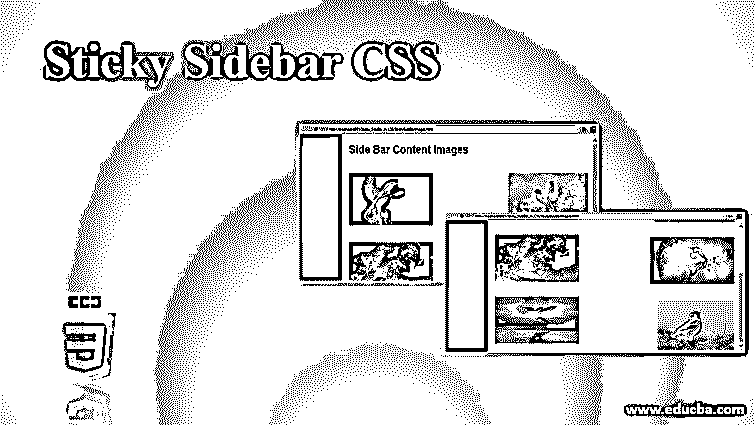
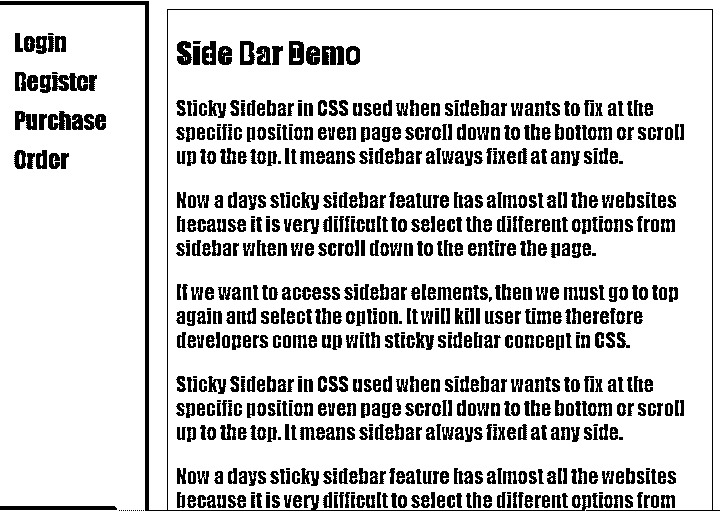
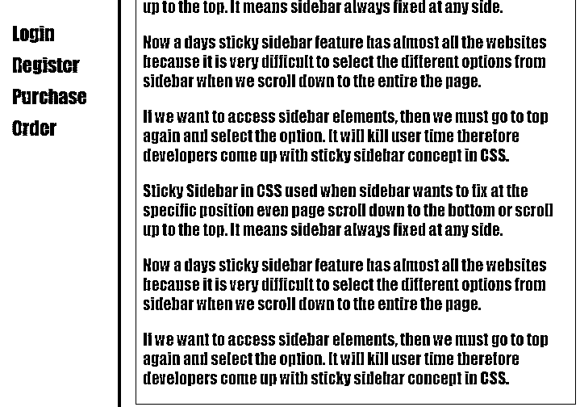
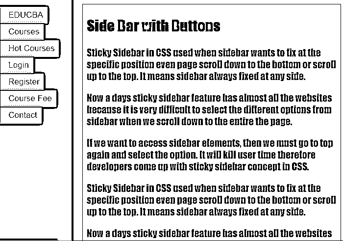
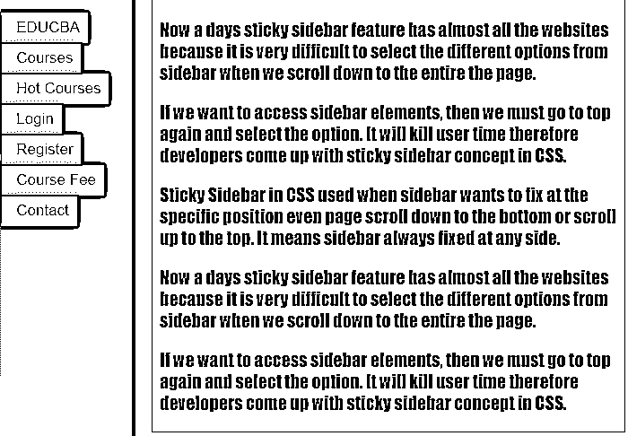
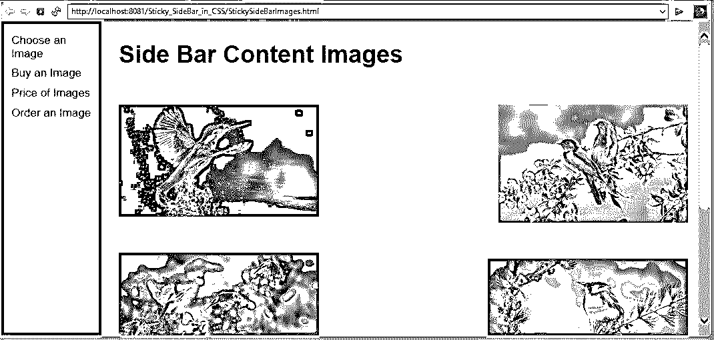
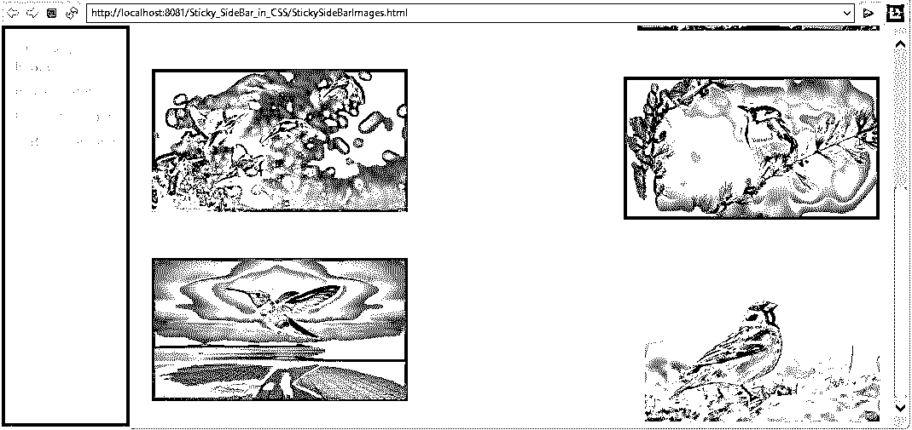

# 粘性侧栏 CSS

> 原文：<https://www.educba.com/sticky-sidebar-css/>




## 粘性侧栏 CSS 介绍

CSS 中的 Sticky Sidebar 是在侧边栏需要固定在特定位置时使用的，即使页面向下滚动到底部或向上滚动到顶部。这意味着侧边栏总是固定在任何一边。现在一天的粘性边栏功能几乎覆盖了所有网站，因为当我们向下滚动到整个页面时，很难从边栏中选择不同的选项。如果我们想要访问侧边栏元素，那么我们必须再次回到顶部并选择选项。这会浪费用户的时间，因此，开发者想出了粘性边栏。

**优势:**

<small>网页开发、编程语言、软件测试&其他</small>

*   轻松访问侧栏元素。

**为什么 CSS 胜过 HTML？**

*   如果我们有 1000 个页面，所有 1000 个页面的元素都有相同的样式。如果我们编写相同的逻辑 1000 次，这在编程语言中根本不是推荐的方式，因为它会浪费处理时间。
*   我们可以使用级联样式表(CSS)在一个地方编写公共逻辑，并在 HTML 文件中调用 CSS 文件，而不是编写 1000 次公共逻辑。

**在 HTML 中调用 CSS 文件:**

*   通过使用这个链接，我们可以调用 HTML 页面的所有 CSS 样式。

### 如何在 CSS 中创建粘性侧边栏？

在 CSS 侧边栏中可以通过使用位置属性来粘着，请参考下面的语法以便更好地理解。

**语法:**

```
//HTML Page Code
<!-- Side Bar elements -->
<div class="sideBar">
<a href="#">Name1</a>
<a href="#">Name2</a>
<a href="#">Name3</a>
<a href="#">Name4</a>
<a href="#">Name5</a>
<a href="#">Name6</a>
.
.
.
.
</div>
<!-- Main content of the page-->
<div class="main">
//some code
</div>
//CSS Code
.sidBar {
position: fixed; /* Make the sidebar immovable*/
z-index: 1; /* Side bar stays at the top */
top: 0;
left: 0;
overflow-x: hidden; /* restricting horizontal scroll */
}
```

### CSS 中粘性边栏的例子

下面是 css 中粘性边栏的例子:

#### 示例#1

粘性边栏

**代码:**

```
<!DOCTYPE html>
<html>
<head>
<meta charset="ISO-8859-1">
<title>Sticky SideBar</title>
<style>
h2 {
color: brown;
}
.sideBar {
height: 100%;
width: 150px;
overflow-x: hidden;
padding-top: 22px;
position: fixed;
z-index: 1;
top: 0;
left: 0;
background-color: green;
padding-top: 22px;
}
body {
font-family: fantasy;
}
.content {
margin-left: 160px; /* Same as the width of the side bar */
font-size: 20px;
padding: 0px 8px;
border: 1px;
border-color: blue;
border-style: solid;
}
.sideBar a {
padding: 5px 7px 5px 15px;
color: blue;
text-decoration: none;
font-size: 24px;
display: block; /* is not allowing to have other block of elements inside the element */
}
.sideBar a:hover {
color: brown;
}
@media screen and (max-height: 500px) {
.sideBar {
padding-top: 14px;
}
.sideBar a {
font-size: 17px;
}
}
</style>
</head>
<body>
<div class="sideBar">
<a href="#">Login</a>
<a href="#">Register</a>
<a href="#">Purchase</a>
<a href="#">Order</a>
</div>
<div class="content">
<h2>Side Bar Demo</h2>
<p>Sticky Sidebar in CSS used when sidebar wants to fix at the
specific position even page scroll down to the bottom or scroll up to
the top. It means sidebar always fixed at any side.
<p>Now a days sticky sidebar feature has almost all the websites
because it is very difficult to select the different options from
sidebar when we scroll down to the entire the page.</p>
<p>If we want to access sidebar elements, then we must go to top
again and select the option. It will kill user time therefore
developers come up with sticky sidebar concept in CSS.</p>
<p>Sticky Sidebar in CSS used when sidebar wants to fix at the
specific position even page scroll down to the bottom or scroll up to
the top. It means sidebar always fixed at any side.
<p>Now a days sticky sidebar feature has almost all the websites
because it is very difficult to select the different options from
sidebar when we scroll down to the entire the page.</p>
<p>If we want to access sidebar elements, then we must go to top
again and select the option. It will kill user time therefore
developers come up with sticky sidebar concept in CSS.</p>
</div>
</body>
</html>
```

**输出:**







**代码解释:**正如你在上面的例子中看到的，在滚动前和滚动后，侧边栏没有移动，它是固定的，所以我们达到了我们的要求。

#### 实施例 2

带按钮的粘性边栏

**代码:**

```
<!DOCTYPE html>
<html>
<head>
<title>Sticky SideBar</title>
<style>
h2 {
color: brown;
}
.sideBar {
height: 100%;
width: 150px;
overflow-x: hidden;
padding-top: 22px;
position: fixed;
z-index: 1;
top: 0;
left: 0;
background-color: green;
padding-top: 22px;
}
body {
font-family: fantasy;
}
.content {
margin-left: 160px; /* Same as the width of the side bar */
font-size: 20px;
padding: 0px 8px;
border: 1px;
border-color: blue;
border-style: solid;
}
.sideBar button {
padding: 5px 7px 5px 15px;
color: blue;
text-decoration: none;
font-size: 24px;
display: block; /* is not allowing to have other block of elements inside the element */
}
.sideBar button:hover {
color: brown;
}
@media screen and (max-height: 500px) {
.sideBar {
padding-top: 14px;
}
.sideBar button {
font-size: 17px;
}
}
</style>
</head>
<body>
<div class="sideBar">
<button>EDUCBA</button>
<button>Courses</button>
<button>Hot Courses</button>
<button>Login</button>
<button>Register</button>
<button>Course Fee</button>
<button>Contact</button>
</div>
<div class="content">
<h2>Side Bar with Buttons</h2>
<p>Sticky Sidebar in CSS used when sidebar wants to fix at the
specific position even page scroll down to the bottom or scroll up to
the top. It means sidebar always fixed at any side.
<p>Now a days sticky sidebar feature has almost all the websites
because it is very difficult to select the different options from
sidebar when we scroll down to the entire the page.</p>
<p>If we want to access sidebar elements, then we must go to top
again and select the option. It will kill user time therefore
developers come up with sticky sidebar concept in CSS.</p>
<p>Sticky Sidebar in CSS used when sidebar wants to fix at the
specific position even page scroll down to the bottom or scroll up to
the top. It means sidebar always fixed at any side.
<p>Now a days sticky sidebar feature has almost all the websites
because it is very difficult to select the different options from
sidebar when we scroll down to the entire the page.</p>
<p>If we want to access sidebar elements, then we must go to top
again and select the option. It will kill user time therefore
developers come up with sticky sidebar concept in CSS.</p>
</div>
</body>
</html>
```

**输出:**







**代码解释:**正如你在上面的例子中看到的，在滚动前和滚动后，侧边栏没有移动，它是固定的，所以我们达到了我们的要求。

#### 实施例 3

粘性边栏和图像

**代码:**

```
<!DOCTYPE html>
<html>
<head>
<meta charset="ISO-8859-1">
<title>Sticky SideBar</title>
<link rel="stylesheet" href="StickySideBarImages.css">
</head>
<body>
<div class="sideBar">
<a href="#">Choose an Image</a>
<a href="#">Buy an Image</a>
<a href="#">Price of Images</a>
<a href="#">Order an Image</a>
</div>
<div class="content">
<h2>Side Bar Content Images</h2>
<p class="a"></p>
<p class="b"></p>
<p class="c"></p>
<p class="d"></p>
<p class="e"></p>
<p class="f"></p>
</div>
</body>
</html>
```

CSS 代码:StickySideBarImages.css

```
h2 {
color: blue;
}
.sideBar {
height: 100%;
width: 150px;
overflow-x: hidden;
padding-top: 22px;
position: fixed;
z-index: 1;
top: 0;
left: 0;
background-color: fuchsia;
padding-top: 22px;
}
body {
font-family: sans-serif;
}
.a
{
float: left;
}
.b
{
float: right;
}
.c
{
float: left;
}
.d
{
float: right;
}
.e
{
float: left;
}
.f
{
float: right;
}
.content {
margin-left: 160px; /* Same as the width of the side bar */
font-size: 24px;
padding: 0px 8px;
}
.sideBar a {
padding: 5px 7px 5px 15px;
color: navy;
text-decoration: none;
font-size: 24px;
display: block; /* is not allowing to have other block of elements inside the element */
}
.sideBar a:hover {
color: lime;
}
@media screen and (max-height: 500px) {
.sideBar {
padding-top: 14px;
}
.sideBar a {
font-size: 17px;
}
}
```

**输出:**







**代码解释:**正如你在上面的例子中看到的，在滚动前和滚动后，侧边栏没有移动，它是固定的，所以我们达到了我们的要求。

### 推荐文章

这是一个粘性边栏 CSS 的指南。在这里，我们讨论了简介和如何创建一个粘性侧边栏，以及不同的例子和代码实现。您也可以看看以下文章，了解更多信息–

1.  [CSS 颜色透明](https://www.educba.com/css-color-transparent/)
2.  [文本装饰 CSS](https://www.educba.com/text-decoration-css/)
3.  [CSS 盒子模型](https://www.educba.com/css-box-model/)
4.  [CSS 颜色代码](https://www.educba.com/css-color-codes/)


