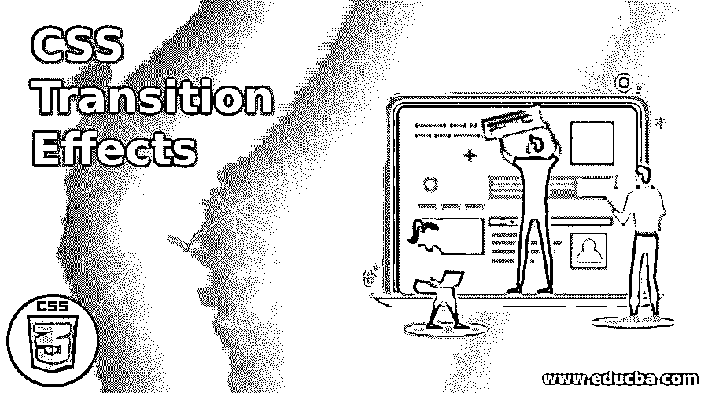
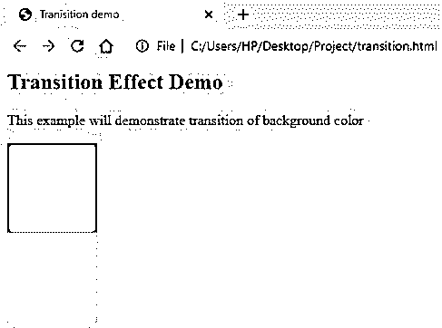
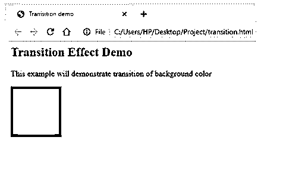
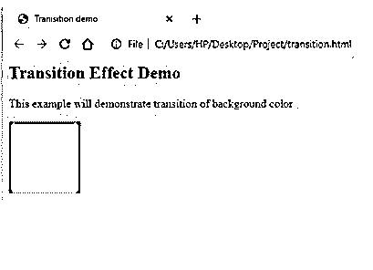
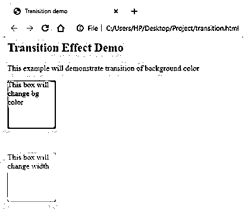
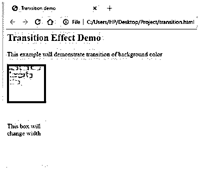
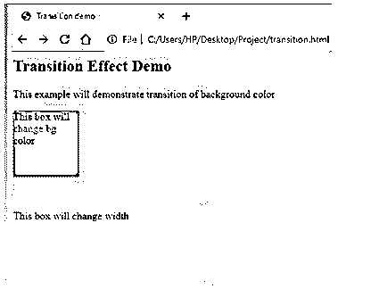
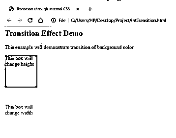
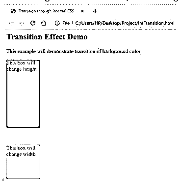
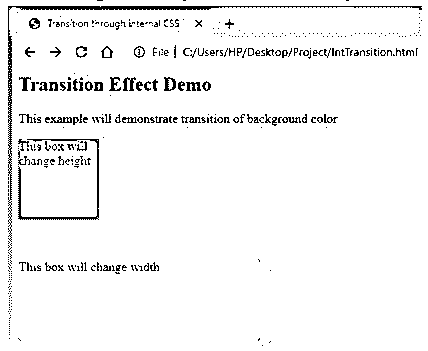

# CSS 过渡效果

> 原文：<https://www.educba.com/css-transition-effects/>




## CSS 过渡效果介绍

我们已经看到级联样式表在本质上是非常动态的。一端是像文本颜色一样简单的功能，另一端是像悬停这样的功能，用户可以使用这些功能定制悬停如何为每个元素单独工作。另一个类似的动态特征是过渡效应。利用 CSS 的这一特性，开发人员可以将页面上的对象制作成动画，以过渡到任何需要的状态。基本上，转换是一个属性，它是转换属性、转换持续时间、转换定时功能、转换延迟的简写。如果我们把他们都集中在一起，就可以有一个平稳的过渡程序。

**语法:**

<small>网页开发、编程语言、软件测试&其他</small>

属性转换是一种简写属性。

```
transition: transition-property transition-duration transition-timing-duration transition-delay
```

现在，这些值被传递为用于快速属性转换的参数，也可以用作单独的和分离的属性，其中可以传递相应的值以获得所需的转换效果。

### CSS 过渡效果的示例

以下是 CSS 过渡效果的示例:

#### 示例#1

通过外部 CSS 使用单独的过渡属性。

**一个**。由于我们在这个例子中使用了外部 CSS，我们将首先从创建 CSS 页面开始。

**b** 。我们将用一组属性创建两个 ID。然而，ID 将具有不同的转换属性，因此我们可以演示可能的转换类型。除了 ID，我们还将创建一个伪 ID 来定义悬停效果，它将捕获应该发生的转换。ID 和伪 ID 的集合如下所示。

**代码:**

```
#div1{
height: 100px;
width: 100px;
background-color: violet;
transition-property: background-color;
transition-duration: 2s;
transition-timing-function: linear;
transition-delay: 1s;
}
#div1:hover{
background-color: blue;
}
```

**c** 。最终的 CSS 代码应该是这样的。

**代码:**

```
#div1{
height: 100px;
width: 100px;
background-color: violet;
transition-property: background-color;
transition-duration: 2s;
transition-timing-function: linear;
transition-delay: 1s;
}
#div1:hover{
background-color: blue;
}
#div2{
height: 100px;
width: 100px;
background-color: yellow;
transition-property: width;
transition-duration: 2s;
transition-timing-function: linear;
transition-delay: 1s;
}
#div2:hover{
width: 300px;
}
```

**d** 。接下来，我们将为 HTML 页面编码。

**e** 。编码应该是这样的，标题部分应该调用外部 CSS 页面，正文部分应该有元素，使用在 CSS 页面上创建的 ID。

**f** 。最终的 HTML 页面代码应该类似于下面的代码片段。

**代码:**

```
<html>
<head>
<title>Transition demo</title>
<link rel = "stylesheet" href = "transition.css">
</head>
<body>
<h2>Transition Effect Demo</h2>
<p>This example will demonstrate transition effect for background</p>
<div id="div1"></div>
<div id="div2"></div>
</body>
</html>
```

**g** 。上面页面的前景如下所示。




**h** 。悬停在紫色框上时，它会像这样改变颜色。




**我**。悬停在黄色框上时，它的宽度会像这样扩大。




#### 实施例 2

通过外部 CSS 使用速记转换属性。

**一个**。在 CSS 代码中，我们将创建类似于前面例子的 ID。但是，我们将使用速记转换属性，而不是使用单独的属性进行转换。具有悬停功能的 ID 和伪 ID 应该如下所示。

**代码:**

```
#div1{
height: 100px;
width: 100px;
background-color: violet;
transition: background-color 2s linear 1s;
}
#div1:hover{
background-color: blue;
}
```

**b** 。最终的 CSS 代码可以类似于下面的代码。

**代码:**

```
#div1{
height: 100px;
width: 100px;
background-color: violet;
transition: background-color 2s linear 1s;
}
#div1:hover{
background-color: blue;
}
#div2{
height: 100px;
width: 100px;
background-color: yellow;
transition: width 2s linear 1s;
}
#div2:hover{
width: 300px;
}
```

**c** 。我们将为 HTML 部分编码。我们可以使用其他元素代替< div >，但是要确保正确调用 ID。对于这个例子，我们将使用段落元素< p >来演示过渡。

**d** 。HTML 代码应该类似于下面的代码。

**代码:**

```
<html>
<head>
<title>Transition demo</title>
<link rel = "stylesheet" href = "transition.css">
</head>
<body>
<h2>Transition Effect Demo</h2>
<p>This example will demonstrate transition of backgroundcolor</p>
<p id="div1">This box will change bgcolor</p>
<br>
<p id="div2">This box will change width</p>
</body>
</html>
```

**e** 。上面页面的前景如下所示。




**f** 。悬停在紫色框上时，它会像这样改变颜色。




**g** 。悬停在黄色框上时，它的宽度会像这样扩大。




#### 实施例 3

通过内部 CSS 使用速记转换属性。

**一个**。因为我们在这个例子中使用了内部 CSS，所以我们将直接为 HTML 页面编码。

**b** 。我们将在 head 部分定义样式。这将为<风格/ >标签完成。

**c** 。具有过渡效果的 ID 将在这里进行编码。样式标记的代码应该类似于下面这样。

**代码:**

```
<style>
#cl1{
height: 100px;
width: 100px;
background-color: violet;
transition: height 2s linear 1s;
}
#cl1:hover{
height: 200px;
}
#cl2{
height: 100px;
width: 100px;
background-color: yellow;
transition: width 2s linear 1s;
}
#cl2:hover{
width: 300px;
</style>
```

**d** 。现在，在主体部分，我们将调用这些具有各种元素的 ID，以便可以演示转换。整个 HTML 页面的代码应该如下所示。

**代码:**

```
<html>
<head>
<title>Transition through internal CSS</title>
<style>
#cl1{
height: 100px;
width: 100px;
background-color: violet;
transition: height 2s linear 1s;
}
#cl1:hover{
height: 200px;
}
#cl2{
height: 100px;
width: 100px;
background-color: yellow;
transition: width 2s linear 1s;
}
#cl2:hover{
width: 300px;
}
</style>
</head>
<body>
<h2>Transition Effect Demo</h2>
<p>This example will demonstrate transition of background color</p>
<p id="cl1">This box will change height</p>
<br>
<p id="cl2">This box will change width</p>
</body>
</html>
```

**e** 。上面页面的前景如下所示。




**f** 。悬停在紫色盒子上时，它会像这样改变高度。




**g** 。悬停在黄色框上时，它的宽度会像这样扩大。




### 结论

因此，在上面的例子中，我们已经了解了 CSS 中的过渡属性的一些基本用法。开发人员可以探索单独的属性或简写属性，无论哪一个更喜欢，以查看如何有效地使用该功能。

### 推荐文章

这是一个 CSS 过渡效果的指南。这里我们讨论 CSS 过渡效果的介绍和例子。您也可以看看以下文章，了解更多信息–

1.  [CSS 溢出](https://www.educba.com/css-overflow/)
2.  [CSS 翻译](https://www.educba.com/css-translate/)
3.  [CSS Clearfix](https://www.educba.com/css-clearfix/)
4.  [CSS 计数器](https://www.educba.com/css-counter/)


