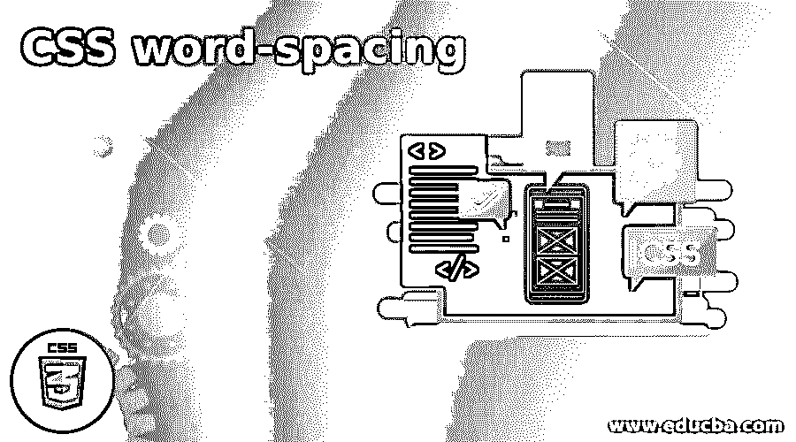
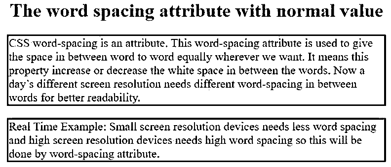
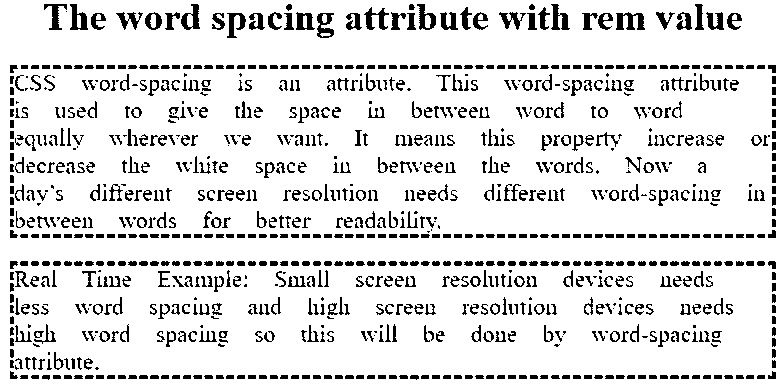
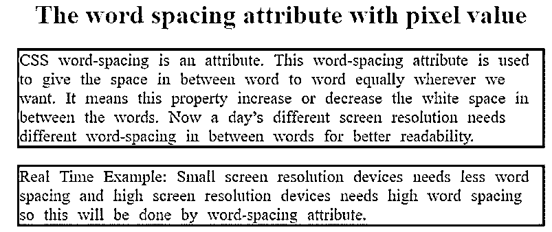
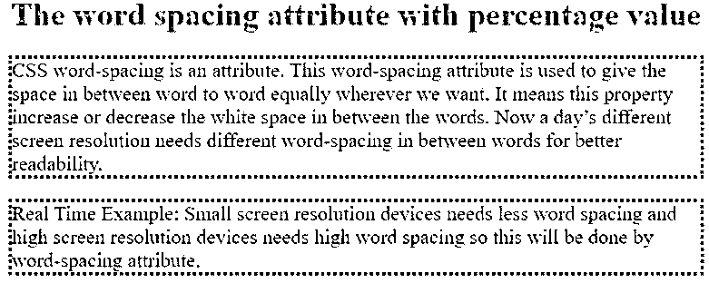

# CSS 单词间距

> 原文：<https://www.educba.com/css-word-spacing/>




## CSS 单词间距介绍

CSS 单词间距是一个属性。这个单词间距属性用于在我们需要的任何地方给单词之间相等的间距。这意味着该属性增加或减少单词之间的空白。现在，一天不同的屏幕分辨率需要不同的单词间距以获得更好的可读性。是文字可读性更好。

**实时示例:**

<small>网页开发、编程语言、软件测试&其他</small>

小屏幕分辨率的设备不需要单词间距，而高屏幕分辨率的设备需要大的单词间距，因此单词间距属性可以做到这一点。

### CSS 中的单词间距是如何工作的？

单词间距基于此单词间距属性接受的值工作。基于这个值，词与词之间的距离被决定。

单词间距的可能值:

*   常态
*   雷姆
*   像素
*   百分率

#### 1.常态

这是默认的单词空间。

**语法:**

```
element
{
word-spacing: normal;
}
```

#### 2.雷姆

这将给出相对于字体大小的根元素的单词间距元素。

**语法:**

```
element
{
word-spacing: 1rem;
}
```

#### 3.像素

这将给出以像素为单位的单词间距。

**语法:**

```
element
{
word-spacing: 3px;
}
```

#### 4.百分率

这将给出单词间距的百分比。

**语法:**

```
element
{
word-spacing: 10%;
}
```

### CSS 单词间距的例子

下面提到了不同的例子:

#### 示例#1

具有正常值的单词间距。

**代码:**

```
<!DOCTYPE html>
<html>
<head>
<style>
p {
word-spacing: normal;
border: solid 3px red;
font-size: 20px;
color: blue;
}
h1
{
text-align: center;
color: green;
}
</style>
</head>
<body>
<h1>The word spacing attribute with normal value</h1>
<p>CSS word-spacing is an attribute. This word-spacing attribute is used to give the space in between word to word equally wherever we want. It means this property increase or decrease the white space in between the words. Now a day’s different screen resolution needs different word-spacing in between words for better readability.</p>
<p>Real Time Example: Small screen resolution devices needs less word spacing and high screen resolution devices needs high word spacing so this will be done by word-spacing attribute.</p>
</body>
</html>
```

**输出:**




#### 实施例 2

带 rem 值的单词间距。

**代码:**

```
<!DOCTYPE html>
<html>
<head>
<style>
p {
word-spacing: 1rem;
border: dashed 3px blue;
font-size: 20px;
color: fuchsia;
}
h1
{
text-align: center;
color: brown;
}
</style>
</head>
<body>
<h1>The word spacing attribute with rem value</h1>
<p>CSS word-spacing is an attribute. This word-spacing attribute is used to give the space in between word to word equally wherever we want. It means this property increase or decrease the white space in between the words. Now a day’s different screen resolution needs different word-spacing in between words for better readability.</p>
<p>Real Time Example: Small screen resolution devices needs less word spacing and high screen resolution devices needs high word spacing so this will be done by word-spacing attribute.</p>
</body>
</html>
```

**输出:**

**

** 

#### 实施例 3

具有正常值的单词间距。

**代码:**

```
<!DOCTYPE html>
<html>
<head>
<style>
p {
word-spacing: 7px;
border: ridge 3px orange;
font-size: 20px;
color: navy;
}
h1
{
text-align: center;
color: red;
}
</style>
</head>
<body>
<h1>The word spacing attribute with pixel value</h1>
<p>CSS word-spacing is an attribute. This word-spacing attribute is used to give the space in between word to word equally wherever we want. It means this property increase or decrease the white space in between the words. Now a day’s different screen resolution needs different word-spacing in between words for better readability.</p>
<p>Real Time Example: Small screen resolution devices needs less word spacing and high screen resolution devices needs high word spacing so this will be done by word-spacing attribute.</p>
</body>
</html>
```

**输出:**




#### 实施例 4

具有正常值的单词间距。

**代码:**

```
<!DOCTYPE html>
<html>
<head>
<style>
p {
word-spacing: 20%;
border: dotted 3px green;
font-size: 20px;
color: red;
}
h1
{
text-align: center;
color: orange;
}
</style>
</head>
<body>
<h1>The word spacing attribute with percentage value</h1>
<p>CSS word-spacing is an attribute. This word-spacing attribute is used to give the space in between word to word equally wherever we want. It means this property increase or decrease the white space in between the words. Now a day’s different screen resolution needs different word-spacing in between words for better readability.</p>
<p>Real Time Example: Small screen resolution devices needs less word spacing and high screen resolution devices needs high word spacing so this will be done by word-spacing attribute.</p>
</body>
</html>
```

**输出:**




### 结论

单词间距属性用于给出单词之间的间距。该属性值可以是正常值、rem、px 和百分比。

### 推荐文章

这是一个 CSS 单词间距的指南。这里我们讨论引言；CSS 中的单词间距是如何工作的？并分别举例说明。您也可以看看以下文章，了解更多信息–

1.  [CSS 文本转换](https://www.educba.com/css-text-transform/)
2.  [CSS 中的边框图像](https://www.educba.com/border-images-in-css/)
3.  [CSS 后代选择器](https://www.educba.com/css-descendant-selector/)
4.  [CSS 背景剪辑](https://www.educba.com/css-background-clip/)


