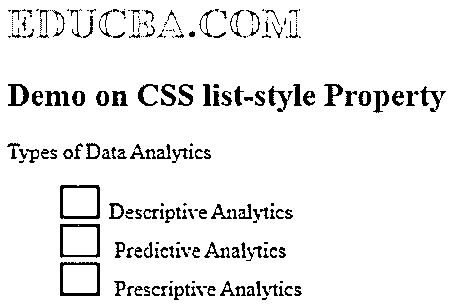
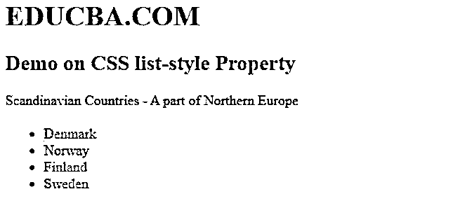
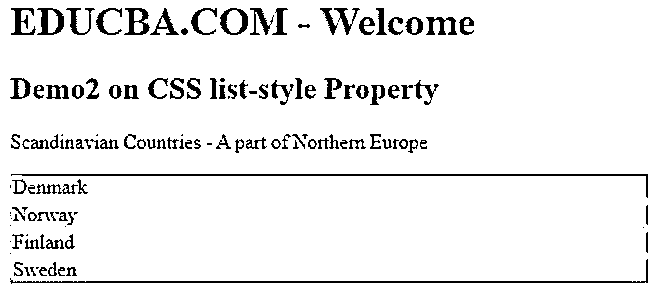

# CSS 列表样式

> 原文：<https://www.educba.com/css-list-style/>


## CSS 列表样式介绍

CSS list-style 通过定义列表元素上的位置、外观和图像(如

1.  and

**语法和参数:**

<small>网页开发、编程语言、软件测试&其他</small>

通用语法在下面的一个声明中给出，如下所示:

```
List-style: list-style type | position | image | inherit ;
```

这是一个速记属性，同时包含所有三种样式。

这里，

*   列表样式定义了列表的类型，如方形、椭圆形。
*   list-position 定义标记的内部或外部位置。
*   list- image 定义列表是否分配有图像或没有图像。

### CSS 中列表样式的属性是如何工作的？

HTML 中有两种主要的列表类型，即有序列表和无序列表。众所周知，风格是网页设计的主要部分。这个属性与三个常见的属性值一起工作，即类型、位置、图像，正如我们在前面的语法中所述。如果这个值中的任何一个被忽略，它们将恢复到初始阶段。

通过将字体、颜色、边框等属性应用到

1.  、

    元素。所有这些样式都受单个列表项的影响。让我们从这种类型的物业开始吧。这个列表样式有子属性，比如类型、位置、图像。这些提供了一个与我们添加的风格更加一致的列表。

**1。list-style-type:** 表示列表项标记的类型。它接受一些值，如圆盘，圆，正方形，十进制，罗马，拉丁等。可将其设置为无以隐藏标记，即移除项目符号。列表元素可以显示为:列表项。

**2。list-style-position:** 给出了标记的位置，是放在列表内容内部还是外部。前者将项目标记作为列表内容的一部分，后者是将项目标记放在列表内容之前的默认值。向左填充到外部。

```
List-style : circle inside | outside;
```

**3。list-style-image:** 这样，一个图像可以嵌入到标记中，并接受缺省值 none 和一个 URL 作为路径位置。

```
List -style : square inside url (ff.jpg);
```

当样式类型设置为“无”时，我们可能会注意到列表项前有一些额外的空格。在这种情况下，当我们将填充设置为零时，看不到额外的空间。

首先，我们更喜欢带有无序列表标记的列表。

**代码:**

**。CSS**

```
li.circle {
list-style-type: circle;
}
li.square {
list-style-type: square;
}
```

**。html**

```
<ul>
<li class="circle"> Biscuits</li>
<li class="square">Chocolate Traybake</li>
<li>Snack Well</li>
<li>Udi’s Gluten Soft Baked</li>
<li>Nabisco Ginger Snaps</li>
</ul>
```

**浏览器兼容性:**

所有浏览器都很好地支持这个属性。上面的代码说明第一个列表项使用了一个圆形标记，这个标记是用类“circle”完成的，第二个列表项使用了“square”。HTML 页面显示了相应代码的输出。

### CSS 列表样式的示例

下面给出了所有上述属性的演示，以及如何在给定的示例中为列表和列表项添加颜色:

#### 示例#1

对 ul 标签实现特定于列表的图像样式。

**代码:**

```
<!DOCTYPE html>
<html>
<head>
<title>
Demo on CSS list-style Property
</title>
<style>
ul {
list-style: square inside
url("paper.jpg");
}
</style>
</head>
<body>
<h1 style = "color:skyblue;">
EDUCBA.COM
</h1>
<h2>
Demo on CSS list-style Property
</h2>
<p>Types of Data Analytics</p>
<ul>
<li>Descriptive Analytics</li>
<li> Predictive Analytics</li>
<li> Prescriptive Analytics</li>
</ul>
</body>
</html>
```

上面的代码片段解释了标记样式是由 URL 路径位置分配的。图像嵌入在列表中，而不是方形或圆形标记列表。

**输出:**




#### 实施例 2

使用列表样式的类型属性。

**代码:**

```
<html>
<head>
Welcome to this Page
</head>
<body>
<ul style = "list-style-type:disc;">
<li>Computer Programming</li>
<li>Data Structures and Algorithms</li>
<li>Software Engineering</li>
</ul>
<ul style = "list-style-type:square;">
<li>Grid and Cloud Computing</li>
<li>Data Mining</li>
<li>Big Data</li>
</ul>
<ol style = "list-style-type:decimal;">
<li>Classification</li>
<li>Prediction</li>
<li>Clustering</li>
</ol>
<ol style = "list-style-type:lower-alpha;">
<li>IBM Data Science</li>
<li>Data Analytics</li>
<li>Artificial Engineering</li>
</ol>
<ol style = "list-style-type:lower-roman;">
<li>Regression Analysis</li>
<li>Probability and Queuing Concepts</li>
<li>Computing Task</li>
</ol>
</body>
</html>
```

所有的样式子属性都在列表样式属性中给出。

**输出:**


#### 实施例 3

带有 CSS 样式的列表样式属性-边框，颜色。

**代码:**

```
<!DOCTYPE html>
<html>
<head>
<title>
CSS list-style Property
</title>
<style>
ul {
list-style-type: disc inside;
border: 3px solid yellow;
background-color: lightred;
}
li {
margin: 1px;
background-color: lightblue;
}
</style>
</head>
<body>
<h1 style = "color:brown;">
EDUCBA.COM
</h1>
<h2>
Demo on CSS list-style Property
</h2>
<p>Scandinavian Countries - A part of Northern Europe</p>
<ul>
<li>Denmark</li>
<li>Norway</li>
<li>Finland</li>
<li>Sweden</li>
</ul>
</body>
</html>
```

**输出:**




#### 实施例 4

显示不同列表项的示例有不同的列表制定者。

**代码:**

```
<!DOCTYPE html>
<html>
<head>
<style>
ul li:nth-child(2) {
list-style: square inside;
}
ul li:nth-child(3) {
list-style: square;
color: red;
}
ul li:nth-child(4) {
font-size: 2px;
color: blue;
}
</style>
</head>
<body>
<ul>
<li>List Style property is applied to all the list items</li>
<li>marker style for the individual items can also be changed.</li>
<li>And the color of the marker is given based on the color of the element</li>
<li>The size of marker also increases with the size of li content</li>
</ul>
</body>
</html>
```

在上面的代码片段中，列表项被赋予了标记样式，即所有列表项的样式都被改变了。

**输出:**

**

** 

#### 实施例 5

给出列表间距。

**代码:**

```
<!DOCTYPE html>
<html>
<head>
<title>
CSS list-style Property
</title>
<style>
ul {
list-style: none;
padding: 0;
}
li {
padding: px 1px;
background-color: light red;
border: 2px solid pink;
}
</style>
</head>
<body>
<h1 style = "color:blue;">
EDUCBA.COM - Welcome
</h1>
<h2>
Demo2 on CSS list-style Property
</h2>
<p>Scandinavian Countries - A part of Northern Europe</p>
<ul>
<li>Denmark</li>
<li>Norway</li>
<li>Finland</li>
<li>Sweden</li>
</ul>
</body>
</html>
```

看看这里，列表项前没有空格。

**输出:**




### 结论

在本文中，我们已经看到了如何通过正确的语法和示例来使用 CSS 列表样式的属性。CSS 用于应用自定义样式，这反过来使 list-property 应用样式。我们还简单讨论了如何为网页中的列表项设置背景颜色。因此，在本教程结束时，我们将开始在 CSS 样式列表。

### 推荐文章

这是一个 CSS 列表风格的指南。这里我们讨论一下入门，列表式属性在 CSS 中是如何工作的？和示例。您也可以看看以下文章，了解更多信息–

1.  [CSS in React](https://www.educba.com/css-in-react/)
2.  [CSS 背景剪辑](https://www.educba.com/css-background-clip/)
3.  [CSS 文本颜色](https://www.educba.com/css-text-color/)
4.  [CSS 组合子](https://www.educba.com/css-combinators/)


