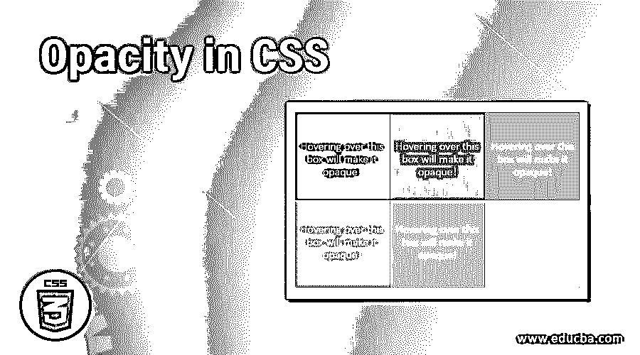
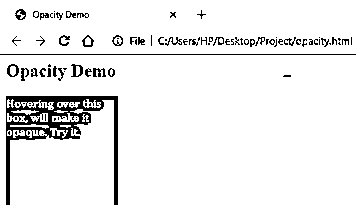
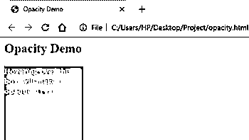
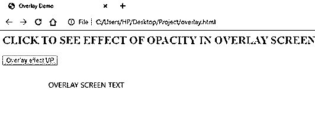
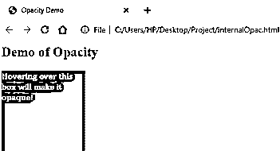
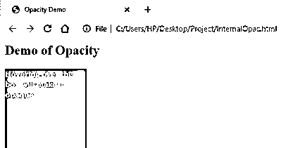

# CSS 中的不透明度

> 原文：<https://www.educba.com/opacity-in-css/>




## CSS 中的不透明度介绍

您命名一个特性或属性，级联样式表就有了它。它充满了选项，随着您探索的深入，这些选项会不断扩展。很多时候，我们会遇到一个看起来不透明或透明的图像。有时，悬停在对象上也会改变其不透明度。所有这些都由 CSS 属性 Opacity 处理。通过使用该属性，开发人员可以选择元素在页面上的不透明程度。此功能主要用于覆盖屏幕，这样主页的内容和覆盖屏幕的内容一样可见。

**语法**

<small>网页开发、编程语言、软件测试&其他</small>

不透明度的语法是:

```
opacity:value (percentage/decimal)
```

该属性可用于设计任何元素的样式。就像其他功能一样，它可以被添加进来。开发人员可以根据需要添加不透明度。

### 在 CSS 中实现不透明度的示例

让我们看一些例子来更好地理解。

#### 示例#1

使用外部 CSS 和悬停功能演示不透明度

对于这个例子，我们使用外部 CSS。因此，我们将首先创建 CSS 文件。在 CSS 文件中，我们将为段落元素编写样式。为了演示不透明特性，我们将编写一个悬停子类，其中将使用不透明特性。

CSS 编码应该如下:

**代码:**

```
p{
background-color: blueviolet;
color: white;
font-family: Cambria, Cochin, Georgia, Times, 'Times New Roman', serif;
height: 150px;
width: 150px;
font-style: bold;
}
p:hover{
opacity: 50%;
}
```

*   这个例子的 HTML 代码非常简单。首先，在 head 部分，我们将调用外部样式表。
*   然后，在主体部分，我们将使用段落元素

    来演示不透明特性。HTML 文件的代码如下所示:

```
<html>
<head>
<title>Opacity Demo</title>
<link rel = "stylesheet" href = "opacity.css">
</head>
<body>
<h2>Opacity Demo</h2>
<p>Hovering over this box, will make it opaque. Try it.</p>
</body>
</html>
```

*   一旦我们保存该文件并通过浏览器打开它，我们将看到以下输出:




*   悬停在盒子上方会使其变得不透明，如下所示:




#### 实施例 2

通过外部 CSS 在覆盖屏幕中使用不透明度

对于这个例子，我们将使用外部 CSS。因此，我们将从创建 CSS 开始。在 CSS 文件中，我们将首先创建一个 ID，它将具有覆盖屏幕的样式。

相同的代码将如下所示:

**代码:**

```
#ID1{
position: fixed;
display: none;
height: 50%;
width: 50%;
background-color: lightblue;
opacity: 50%;
cursor: pointer;
}
```

*   我们还将定义一个类，它将具有覆盖屏幕上内容的样式属性。代码将如下所示:

```
.content{
font-family: 'Segoe UI', Tahoma, Geneva, Verdana, sans-serif;
color: darkblue;
margin: 100px;
}
```

*   结合 ID 和类，最终的 CSS 类将如下所示:

```
#ID1{
position: fixed;
display: none;
height: 50%;
width: 50%;
background-color: lightblue;
opacity: 50%;
cursor: pointer;
}
.content{
font-family: 'Segoe UI', Tahoma, Geneva, Verdana, sans-serif;
color: darkblue;
margin: 100px;
}
```

*   接下来，我们将为 HTML 页面编码。由于这个例子使用了外部 CSS，我们将在 head 部分调用外部 CSS 文件。
*   现在，由于我们需要覆盖屏幕，我们将定义一些 JavaScript 函数。这将在脚本标记的 body 部分进行编码。相同的代码将如下所示:

```
<script>
function up() {
document.getElementById("ID1").style.display = "block";
}
function down() {
document.getElementById("ID1").style.display = "none";
}
</script>
```

*   现在，使用这些函数和 CSS 脚本，我们将为 body 部分中的元素编写代码，如下所示:

```
<div id="ID1" onclick="down()">
<div class="content">OVERLAY SCREEN TEXT</div>
</div>
<h2>CLICK TO SEE EFFECT OF OPACITY IN OVERLAY SCREEN</h2>
<button onclick="up()">Overlay effect UP</button>
```

*   因此，最终的 HTML 代码应该是这样的:

```
<html>
<head>
<title>Overlay Demo</title>
<link rel = "stylesheet" href = "overlay.css">
</head>
<body>
<script>
function up() {
document.getElementById("ID1").style.display = "block";
}
function down() {
document.getElementById("ID1").style.display = "none";
}
</script>
<div id="ID1" onclick="down()">
<div class="content">OVERLAY SCREEN TEXT</div>
</div>
<h2>CLICK TO SEE EFFECT OF OPACITY IN OVERLAY SCREEN</h2>
<button onclick="up()">Overlay effect UP</button>
</body>
</html>
```

*   保存该文件并通过浏览器打开它，将得到以下输出:


*   单击该按钮将弹出覆盖屏幕，并给出以下输出:




点击覆盖屏幕上的任何地方都会使它消失。

#### 实施例 3

使用内部 CSS 的不透明度

由于我们使用内部 CSS，我们将直接为 HTML 页面编码。在 head 部分，我们将使用

代码应该如下所示:

**代码:**

```
<style>
p{
background-color: green;
color: white;
font-family: Cambria, Cochin, Georgia, Times, 'Times New Roman', serif;
height: 150px;
width: 150px;
font-style: bold;
}
p:hover{
opacity: 50%;
}
</style>
```

*   现在，在 body 部分，我们将调用 paragraph 元素

    来演示不透明特性。

*   最终的 HTML 代码应该是这样的:

```
<html>
<head>
<title>Opacity Demo</title>
<style>
p{
background-color: green;
color: white;
font-family: Cambria, Cochin, Georgia, Times, 'Times New Roman', serif;
height: 150px;
width: 150px;
font-style: bold;
}
p:hover{
opacity: 50%;
}
</style>
</head>
<body>
<h2>Demo of Opacity</h2>
<p>Hovering over this box will make it opaque!</p>
</body>
</html>
```

*   如果通过浏览器打开，html 页面的输出将如下所示:




*   将鼠标悬停在绿色框上会使其变得不透明，如下图所示:




**解释:**在上面的例子中，我们看到了利用不透明属性的各种方法和目的。然而，它不仅仅局限于上述选项。你可以尝试用图像做实验，设置想要的不透明度。这是一个可以根据用户要求使用的功能。有效地使用这些功能将会带来更好的最终用户体验。开发人员可以自由地以不同的组合检查和试验各种 CSS 特性，从而相应地获得各种结果。

### 推荐文章

这是一个关于 CSS 中不透明度的指南。在这里，我们讨论了 CSS 中不透明性的语法介绍，并举例说明了如何更好地理解不透明性的用法。您也可以浏览我们的其他相关文章，了解更多信息——

1.  [CSS 梯度发生器](https://www.educba.com/css-gradient-generator/)
2.  [CSS 颜色图表](https://www.educba.com/css-color-chart/)
3.  [CSS 验证器](https://www.educba.com/css-validator/)
4.  [CSS 盒子模型](https://www.educba.com/css-box-model/)


