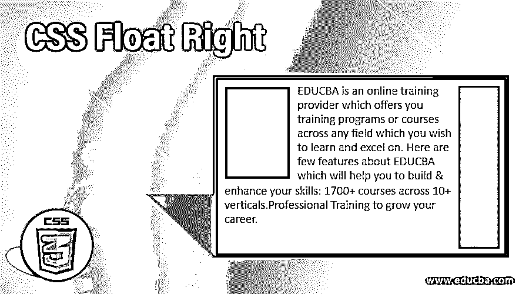
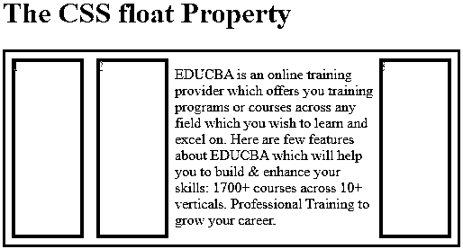
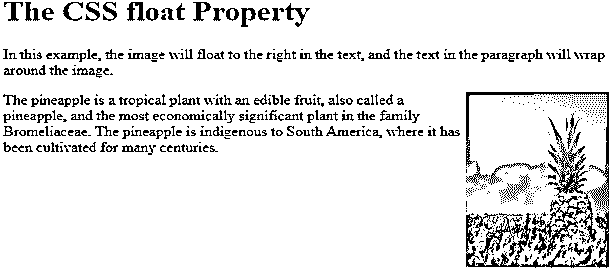
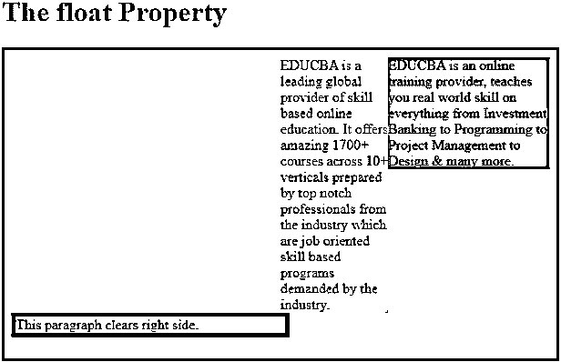
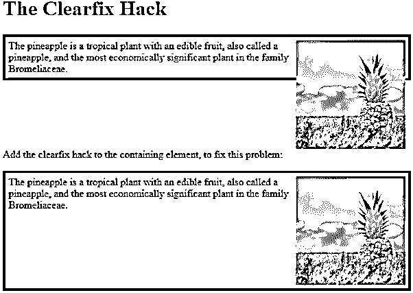

# CSS 向右浮动

> 原文：<https://www.educba.com/css-float-right/>




## CSS 右浮动简介

CSS 的 Float 属性允许文本和行内元素在元素的左侧或右侧环绕。CSS 的这个浮动属性强制布局元素在父元素内部浮动，其他元素环绕在父元素周围。该属性通常使元素左浮动、右浮动、无浮动或继承浮动。CSS 的 float 属性用于将图像或任何布局元素连同将环绕它的行内元素一起放置在容器内。此属性不用于设计任何元素布局，而是仅用于在图像周围环绕文本。

### CSS 右浮动是如何工作的？

在 CSS 中，float right 属性通常用于指定应该浮动的元素，并且这些元素围绕它浮动。为了避免或清除这个问题，我们使用 clear property。让我们看看下面这个右浮动属性的语法。

<small>网页开发、编程语言、软件测试&其他</small>

**语法:**

```
Float: none | left | right | initial | inherit;
```

*   **none:** 元素不浮动的地方。
*   **left:** 元素浮动到容器的左侧。
*   **right:** 元素浮动到容器的右边。
*   **initial:** 将其值设置为默认值。
*   **inherit:** 从父元素继承值。

### 实现 CSS 右浮动的示例

下面显示了在一个程序中使用 float: right 和 float: left 属性。

#### 示例#1

**代码:**

```
<!DOCTYPE html>
<html>
<head>
<title> Educba Training </title>
<style>
section {
border: 3px solid black;
width: 80%;
float: left;
}
div {
margin: 7px;
width: 80px;
height: 200px;
}
.left {
float: left;
background: red;
}
.right {
float: right;
background: blue;
}
</style>
</head>
<body>
<h1>The CSS float Property</h1>

<div class="left">1</div>
<div class="left">2</div>
<div class="right">3</div>
<p> EDUCBA is an online training provider which offers you training programs or courses across any field which you wish to learn and excel on. Here are few features about EDUCBA which will help you to build & enhance your skills: 1700+ courses across 10+ verticals. Professional Training to grow your career. </p>

</body>
</html>
```

**输出:**




在上面的程序中，我们看到我们同时使用了 float 属性，比如颜色为“蓝色”的 float: right 和颜色为“红色”的 float: left，并且文本位于中心，因为在元素的两侧都有 float 元素，因此文本被包裹在其中。

#### 示例#2

**代码:**

Float 是 CSS 定位属性，用于将文本环绕在用于创建整个 web 布局的图像周围。为了清除这个 float，我们有另一个名为 as clear 的属性，它也有 4 个不同的值，比如 both、left、right 和 none。对吧

让我们看一个 CSS 右浮动属性的例子:

**语法:**

```
float: right;
```

**代码:**

```
<!DOCTYPE html>
<html>
<head>
<title> Educba Training </title>
<style>
img {
float: right;
}
</style>
</head>
<body>
<h1>The CSS float Property</h1>
<p>In this example, the image will float to the right in the text, and the text in the paragraph will wrap around the image.</p>
<p>
The pineapple is a tropical plant with an edible fruit, also called a pineapple, and the most economically significant plant in the family Bromeliaceae. The pineapple is indigenous to South America, where it has been cultivated for many centuries. </p>
</body>
</html>
```

**输出:**




在上面的程序中，我们可以看到我们演示了 float: right 属性，上面截图中的文本在元素布局的右侧用图像包装。

#### 示例#3

**代码:**

这个 clear 属性用于清除指定的浮动文本。当该属性应用于任何浮动元素(边距边缘的底部)时，它将被移动到所有相关浮动的边距边缘之下。该属性有 4 个值，如右、左、无和两个值。现在让我们看看如何使用 clear property 通过例子和语法来清除这些浮动元素。

**语法:**

```
clear: none | both | right | left;
```

让我们看看如何使用这个 clear 属性来清除布局中右边的浮动元素。

**代码:**

```
<!DOCTYPE html>
<html>
<head>
<title> Educab Training </title>
<style>
.wrapper{
border:3px solid black;
padding:8px;
}
.right {
border: 5px solid black;
clear: right;
}
.black {
float: right;
margin: 0;
background-color: grey;
color: blue;
width:30%;
}
.red {
float: right;
margin: 0;
background-color: pink;
width:20%;
}
p {
width: 50%;
}
</style>
</head>
<body>
<h1>The float Property</h1>
<div class="wrapper">
<p class="black">EDUCBA is an online training provider, teaches you real world skill on everything from Investment Banking to Programming to Project Management to Design & many more.</p>
<p class="red">EDUCBA is a leading global provider of skill based online education. It offers amazing 1700+ courses across 10+ verticals prepared by top notch professionals from the industry which are job oriented skill based programs demanded by the industry. </p>
<p class="right">This paragraph clears right side.</p>
</div>
</body>
</html>
```

**输出:**




在上面的程序中，我们可以看到我们已经清除了元素布局右侧的文本元素。

#### 实施例#4

还有另一个概念叫做 clearfix hack，当浮动元素或者说图像比容器文本高时，它就会溢出容器。为了避免这种情况，我们可以使用 clearfix hack，如下所示。

```
<!DOCTYPE html>
<html>
<head>
<style>
div {
border: 4px solid black;
padding: 5px;
}
.img1
float: right;
}
.clearfix::after {
content: "";
clear: both;
display: table;
}
.img2 {
float: right;
}
</style>
</head>
<body>
<h1>The Clearfix Hack</h1>
<div>

The pineapple is a tropical plant with an edible fruit, also called a pineapple, and the most economically significant plant in the family Bromeliaceae.</div>
<p style="clear:right">Add the clearfix hack to the containing element, to fix this problem:</p>
<div class="clearfix">

The pineapple is a tropical plant with an edible fruit, also called a pineapple, and the most economically significant plant in the family Bromeliaceae.</div>
</body>
</html>
```

**输出:**




在上面的程序中，我们可以看到第一个图像比文本高，所以为了让它适合容器，然后使用“clearfix hack”清除两个浮动元素并显示在表中。

### 结论

在这篇文章中，我们总结了 CSS 右浮动的概念，它用于将文本环绕在图像的右边。这个 float 属性有不同的值，比如 left、right、none、initial 和 inherit。但是我们在彩车上讨论过:对。还有一个叫做“clear”的属性，用来清除这些浮动元素，它也有 4 个不同的值，比如 none、both、left 和 right。还有另一个称为 clearfix hack 的属性，当图像比文本高时使用，当文本换行时图像溢出。

### 推荐文章

这是一个 CSS 右浮动的指南。在这里，我们讨论一个 CSS 右浮动的介绍，它是如何与编程的例子。您也可以浏览我们的其他相关文章，了解更多信息——

1.  [CSS 动画过渡](https://www.educba.com/css-animation-transition/)
2.  [CSS 溢出](https://www.educba.com/css-overflow/)
3.  [CSS Clearfix](https://www.educba.com/css-clearfix/)
4.  [文字装饰 CSS](https://www.educba.com/text-decoration-css/)


