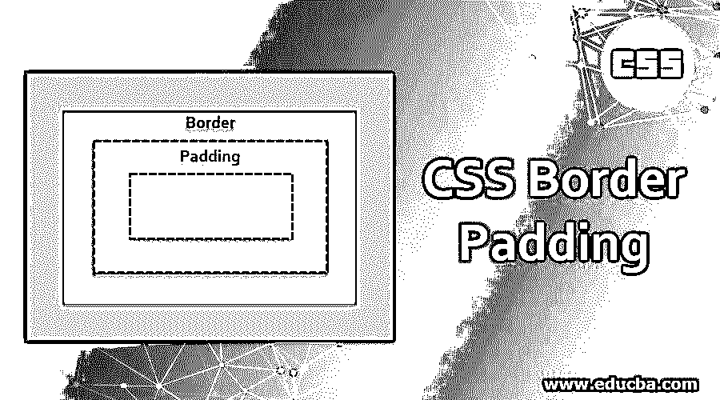
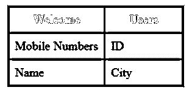
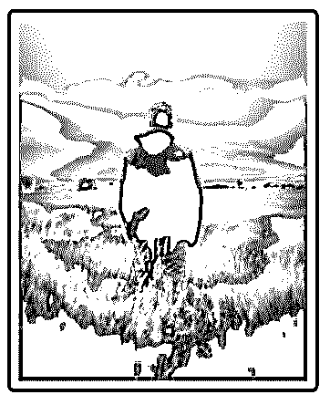

# CSS 边框填充

> 原文：<https://www.educba.com/css-border-padding/>




## CSS 边框填充介绍

填充被定义为 HTML 内容和它的边框之间的空间。一般来说，填充会在 HTML 元素中创建一些额外的空间，我们可以在文档中提到像素填充、百分比格式值。CSS 边框填充值应该是长度、百分比或一些继承父 HTML 元素的值，如果我们在文档中使用一组百分比值，它包含一些到前端代码的框对齐。

**语法:**

<small>网页开发、编程语言、软件测试&其他</small>

填充和边框的基本语法如下。

**CSS 边框:**

```
<html>
<head>
<style>
.sample
{
border-style; ;
border-style; ;
---------------
}
</style>
</head>
</html>
```

**CSS 填充:**

```
<html>
<head>
<style>
.sample
{
border:
padding:
}
----------some style tag codes-------
</style>
</head>
</html>
```

以上两个代码是 HTML 文档中 CSS 边框和填充的基本语法。我们可以根据用户需求在

### CSS 中的边框填充是如何工作的？

Padding 包含一些 CSS 样式，它们有自己的属性，可以用来控制 HTML 标签中的列表和更复杂的元素。我们可以用一组不同的包含四个边的用户需求框来设置我们自己的自定义值，这样 CSS 填充将使用 HTML 元素的所有四个边。一些 CSS 边框填充属性，如顶部填充、底部填充、左侧填充和右侧填充，是一些必须用于网页定制目的的属性。每个属性都有一组不同的对齐功能，它们的值在自定义用户时会有所不同和相同。我们可以在填充中设置图像，以便使用一些 HTML 编辑器来编辑内容，甚至根据用户要求更改一些 CSS 样式，来设置图像和 HTML 内容之间的缓冲值集。我们可以为填充样式的所有边选择性地添加图像。

在边框中，我们可以设置所有边的边框，主要是上边、左边、右边和下边。我们可以在 HTML 表中设置边界，用于存储和检索后端 SQL、非 SQL 数据库中的数据。即使一些 clob，blob 数据从前端到后端需要更多的空间和大小，然后边框将用于分隔视图内容，如虚线，虚线等边框类型。这将有助于隔离前端视图中的数据。用户将确定哪些数据像图像，视频和 HTML 内容值在数据库的后端。

border 也是速记属性之一，它设置 HTML 内容的宽度、高度、颜色和样式。我们知道速记属性省略了子值，并重新分配给初始值。主要是我们在 HTML 文档中使用的图像。图像的边框集不接受用户定义或自定义的值，我们将它指定为 none。就像 CSS 中的轮廓概念一样，我们在轮廓和边框之间也有一些相似之处。border 属性接受 style 标签中的一个或多个值，这是基于我们必须借助其属性在网页中添加边框值的要求。

主要是 HTML 表格有一个边界来对齐数据隔离。当我们将 CSS 样式中的边框应用于 HTML 表格时，它可以应用 HTML 的实际表格，而不会单独提到表格单元格。我们可以在 HTML 和 CSS 中使用这些类，我们知道这些类的实际好处。我们可以在样式标签中设置边框，在类的帮助下，同样可以在一些标签中调用它。CSS 样式类在一个地方设置所有样式，除此之外，每个 HTML 元素都将添加到代码中。

### CSS 边框填充的示例

以下是一些例子:

#### 示例#1

```
<html>
<head>
<style>
.sample{
background: green;
color: red;
margin: 53px;
padding: 19px;
position: relative;
}
.sample:before {
border: 7px solid green;
content: "Hi Users";
position: absolute;
top: -49px;
bottom: -14px;
left: -19px;
right: -18px;
}
</style>
</head>
<div class="sample">
Welcome to my domain
</div>
</html>
```

**输出:**


#### 实施例 2

```
<html>
<head>
<style>
.sample { background-color:green;border-collapse:collapse; }
.sample th { background-color:green;color:red;width:55%; }
.sample td, .sample th { padding:7px;border:3px solid blue; }
</style>
</head>
<table class="sample">
<tr>
<th>Welcome</th><th>Users</th>
</tr>
<tr>
<td>Mobile Numbers</td><td>ID/td>
</tr>
<tr>
<td>Name</td><td>City</td>
</tr>
</table>
</html>
```

**输出:**




#### 实施例 3

```
<html>
<head>
<style>
.sample {
border: 3px solid green;
border-radius: 6px;
padding: 7px;
width: 253px;
}
</style>
</head>
<div class="sample">

</div>
</html>
```

**输出:**




在上面的三个例子中，我们在样式标签元素中使用了边框和填充。第一个例子是网页上的边框和填充的基本例子，我们已经在 CSS 样式中创建和声明了边框和填充值。第二个示例将使用带有 CSS 样式对齐的 HTML 表格，以便在网页上使用边框和填充，它将对齐表格值以便从数据库中存储和检索。最后一个例子将在两种对齐方式的帮助下使用网页中的图像。

### 结论

上述概念解释了 CSS 填充和边框样式在网页中的用法，它需要覆盖各种各样的背景，如宽度、高度和样式。在网络浏览器的某些方面，HTML 页面的布局充满了争论和警告。

### 推荐文章

这是一个 CSS 边框填充的指南。在这里，我们讨论介绍，边框填充如何在 CSS 中工作，以及相应的例子和适当的语法。您也可以浏览我们的其他相关文章，了解更多信息——

1.  [CSS 内联样式](https://www.educba.com/css-inline-style/)
2.  [CSS 形状生成器](https://www.educba.com/css-shape-generator/)
3.  [CSS 闪烁文本](https://www.educba.com/css-blinking-text/)
4.  [CSS 边框生成器](https://www.educba.com/c-plus-plus-struct/)


