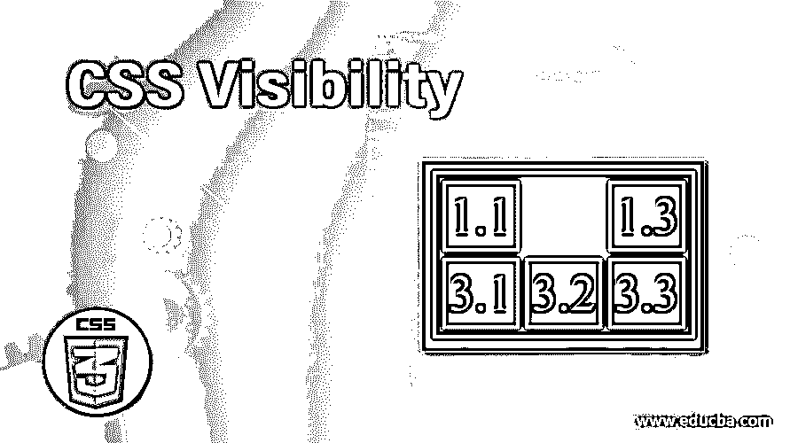
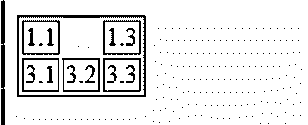

# CSS 可见性

> 原文：<https://www.educba.com/css-visibility/>




## CSS 可见性介绍

CSS 中的 visibility 属性用于控制元素在网页上是否可见。但是用 visibility 属性隐藏的元素确实会占用网页上的空间。为了克服这种情况，我们通常使用值为 none 的 display 属性来隐藏和删除元素。

**语法:**

<small>网页开发、编程语言、软件测试&其他</small>

可见性属性可以使用四个值:可见、隐藏、折叠、初始和继承。可以使用以下语法进行设置:

```
visibility :  visible | hidden | collapse | initial | inherit | unset
```

### CSS 中可见性的属性值

属性值的示例如下:

**1。可见性属性的隐藏值:**

它从网页中隐藏元素。尽管它从视图中隐藏了该元素，但是该元素仍然根据其高度和宽度继续占据网页上的空间。让我们通过下面的例子来理解这种行为:

#### 例子

让我们创建一个名为 try.php 的文件，内容如下:

**代码:**

```
<!DOCTYPE html>
<html>
<head>
<title>
This is an example for visibility property in CSS with value Hidden.
</title>
<style>
h1 {
color : blue ;
}
.checkme {
Visibility : hidden ; // defining the value for visibility
}
body {
text-align : center ;
}
</style>
</head>
<body>
<h1> Edu CBA </h1>
<h2> The element’s visibility is set to hidden </h2>
<p class="checkme"> This text is not visible in the browser. </p>
</body>
</html>
```

**代码解释:**当在浏览器中执行上述代码时，会显示以下输出，其中显示文本“我们是技术人员的技术门户。我们提供所有最新技术的教程，本教程我们将学习 CSS 中的可见性属性。”已隐藏:

**输出:**


**2。Visibility 属性的 Visible 值:**Visibility CSS 属性在被赋值“visible”时从网页中取消隐藏元素，也是 CSS 属性的默认值。让我们通过下面的例子来看看它的作用。

#### 例子

现在，让我们更改中的属性值。请调用“可见”而不是“隐藏”。

**代码:**

```
<!DOCTYPE html>
<html>
<head>
<title>
This is an example for visibility property in CSS with value visible.
</title>
<style>
h1 {
color : blue ;
}
.checkme {
Visibility : visible ; // Visibility values changed to visible
}
body {
text-align : center ;
}
</style>
</head>
<body>
<h1> Edu CBA </h1>
<h2> visibility is set to visible </h2>
<p class="checkme">
We are a technology portal for techies. We provide tutorials for all the latest technologies and this tutorial we are learning about the Visibility property in CSS.
</p>
</body>
</html>
```

上述代码产生以下输出:

**输出:**


**3。collapse:**CSS 可见性的折叠值用于行、列、行组和列组。具有此属性的行和列在网页视图中仍然是隐藏的，但同一表格的其他行和列继续显示，就像隐藏的行、列、行组和列组实际上是可见的一样。该值是专门为快速删除行或列元素而设计的，而不必计算与之关联的每隔一行或每隔一列的宽度和高度。使用可见性值折叠的唯一问题是，并不是所有现代浏览器都完全支持它。因此，大多数官方 CSS 文档都建议不要在当前的网页设计中使用它。

#### 例子

让我们通过下面的例子更详细地理解折叠的工作方式。

**代码:**

```
<!DOCTYPE html>
<html>
<head>
<title>
This is an example for visibility property in CSS with value visible.
</title>
<style>
.checkme {
Visibility : collapse ;
}
table {
Border : 1px solid red ;
}
td {
border : 1px solid gray;
}
body {
text-align : center ;
}
</style>
</head>
<body>
<table>
<tr>
<td>1.1</td>
<td class="checkme">1.2</td>
<td>1.3</td>
</tr>
<tr class="checkme">
<td>2.1</td>
<td>2.2</td>
<td>2.3</td>
</tr>
<tr>
<td>3.1</td>
<td>3.2</td>
<td>3.3</td>
</tr>
</table>
</body>
</html>
```

执行上述代码时，浏览器窗口中的输出如下:

**输出:**




我们清楚地看到，具有折叠 CSS 值的单元格不可见，但确实继续占据浏览器中的空间。

**4。Visibility CSS 属性的初始值:**Visibility 属性的值，当设置为 Initial 时，表示元素必须引用属性的初始值。

**5。CSS 可见性的继承值:**当子元素值设置为 Inherit 时，它采用父元素的计算值。

**6。CSS Visibility 属性的 Unset 值:**当一个元素的值被设置为 unset 时，它可能被设置为 initial 或者 inherit。这取决于是否设置了父值，如果没有，那么它的行为就像初始值一样。

### 推荐文章

这是一个 CSS 可见性的指南。这里我们讨论基本概念以及 visibility 属性如何与它提供的不同值一起工作。您也可以看看以下文章，了解更多信息–

1.  [CSS 形状生成器](https://www.educba.com/css-shape-generator/)
2.  [CSS 闪烁文本](https://www.educba.com/css-blinking-text/)
3.  [CSS 列表](https://www.educba.com/css-lists/)
4.  [CSS 梯度发生器](https://www.educba.com/css-gradient-generator/)


