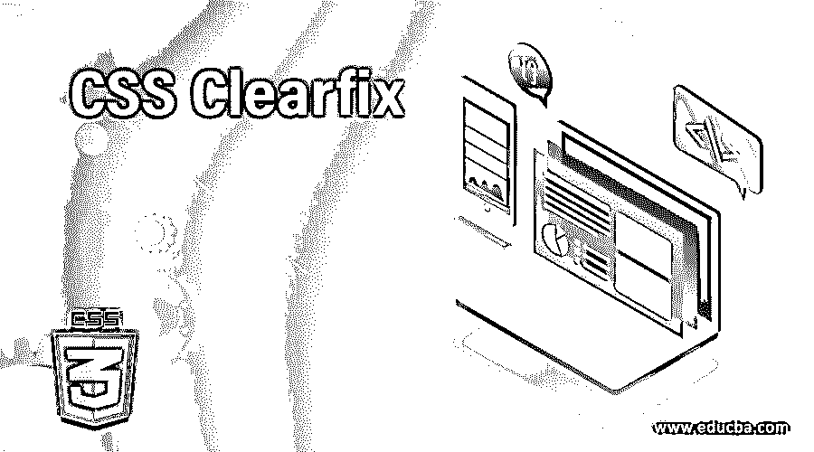
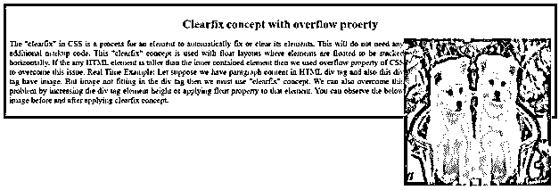
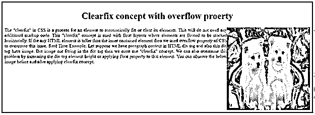
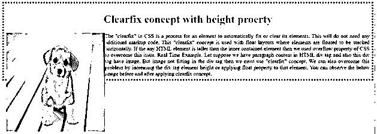
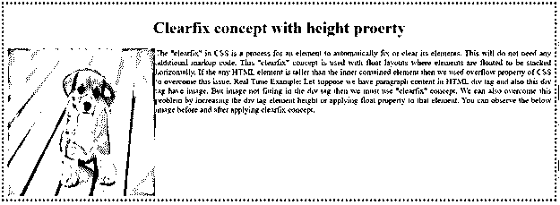
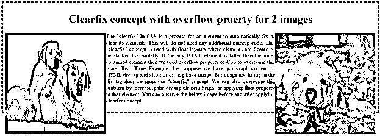
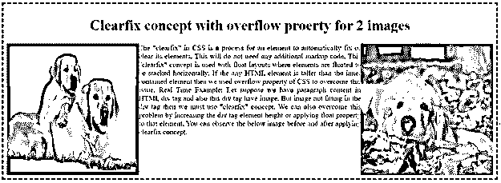

# CSS Clearfix

> 原文：<https://www.educba.com/css-clearfix/>

## CSS Clearfix 简介

CSS 中的“clearfix”是一个元素自动修复或清除其元素的过程。这将不需要任何额外的标记代码。这个“clearfix”概念用于浮动布局，其中元素被浮动以水平堆叠。如果任何 HTML 元素比内部包含的元素高，那么我们使用 CSS 的溢出属性来解决这个问题。

**实时示例:**假设我们在 HTML div 标签中有段落内容，并且这个 div 标签也有图像。但是图像不适合 div 标签，那么我们必须使用“clearfix”概念。我们还可以通过增加 div 标签元素的高度或者对该元素应用 float 属性来解决这个问题。您可以观察应用 clearfix 概念前后的下图。

<small>网页开发、编程语言、软件测试&其他</small>

### Clearfix 在 CSS 中是如何工作的？

CSS clearfix 用于修复所需元素的溢出元素。这可以通过 3 个属性来实现:

*   溢出属性
*   高度属性
*   浮动属性

这三个 CSS 属性都用于修复溢出元素。

**语法:**

**1。**溢出属性

`div
{
overflow: auto
}`

**2。**高度属性

`div
{
height: value;
}`

**3。**浮动属性

`div
{
float: value;
}`

### 实现 CSS Clearfix 的示例

下面是要实现的示例:

#### 1.具有溢出属性的 Clearfix

**代码:**

`<!DOCTYPE html>
<html>
<meta charset="ISO-8859-1">
<title>ClearFix in CSS</title>
<head>
<!-- CSS Styles -->

</head>
<body>

<h1>Clearfix concept with overflow proerty</h1>
 The
"clearfix" in CSS is a process for an element to automatically fix or
clear its elements. This will do not need any additional markup code.
This "clearfix" concept is used with float layouts where elements are
floated to be stacked horizontally. If the any HTML element is taller
than the inner contained element then we used overflow property of CSS
to overcome this issue. Real Time Example: Let suppose we have
paragraph content in HTML div tag and also this div tag have image.
But image not fitting in the div tag then we must use "clearfix"
concept. We can also overcome this problem by increasing the div tag
element height or applying float property to that element. You can
observe the below image before and after applying clearfix concept.

</body>
</html>`

**输出:**应用溢出属性前。

**输出:**应用溢出属性后。

#### 2.具有高度属性的 Clearfix

**代码:**

`<!DOCTYPE html>
<html>
<meta charset="ISO-8859-1">
<title>ClearFix in CSS</title>
<head>
<!-- CSS Styles -->

</head>
<body>

<h1>Clearfix concept with height proerty</h1>
 The
"clearfix" in CSS is a process for an element to automatically fix or
clear its elements. This will do not need any additional markup code.
This "clearfix" concept is used with float layouts where elements are
floated to be stacked horizontally. If the any HTML element is taller
than the inner contained element then we used overflow property of CSS
to overcome this issue. Real Time Example: Let suppose we have
paragraph content in HTML div tag and also this div tag have image.
But image not fitting in the div tag then we must use "clearfix"
concept. We can also overcome this problem by increasing the div tag
element height or applying float property to that element. You can
observe the below image before and after applying clearfix concept.

</body>
</html>`

**输出:**应用高度属性前。

**输出:**应用高度属性后。

#### 3.Clearfix 具有两个图像的溢出和浮动属性。

**代码:**

`<!DOCTYPE html>
<html>
<meta charset="ISO-8859-1">
<title>ClearFix in CSS</title>
<head>
<!-- CSS Styles -->

</head>
<body>

<h1>Clearfix concept with overflow proerty for 2 images</h1>

The "clearfix" in CSS is a process for an element to
automatically fix or clear its elements. This will do not need any
additional markup code. This "clearfix" concept is used with float
layouts where elements are floated to be stacked horizontally. If the
any HTML element is taller than the inner contained element then we
used overflow property of CSS to overcome this issue. Real Time
Example: Let suppose we have paragraph content in HTML div tag and
also this div tag have image. But image not fitting in the div tag
then we must use "clearfix" concept. We can also overcome this
problem by increasing the div tag element height or applying float
property to that element. You can observe the below image before and
after applying clearfix concept.

</body>
</html>`

**输出:**应用溢出属性前。

**输出:**应用溢出属性后。

### 结论

CSS 中的 clearfix 适用于 HTML 的溢出元素。这种 clearfix 概念可以通过为所需元素设置 height 或设置 overflow 属性或设置 float 属性来克服元素溢出。

### 推荐文章

这是一个 CSS Clearfix 的指南。这里我们讨论一个介绍，如何用 css 创建 clearfix 工作，用代码和输出实现例子。您也可以浏览我们的其他相关文章，了解更多信息——

1.  [CSS 填充](https://www.educba.com/css-padding/)
2.  [CSS 位置](https://www.educba.com/css-position/)
3.  [CSS 溢出](https://www.educba.com/css-overflow/)
4.  [CSS 验证器](https://www.educba.com/css-validator/)

