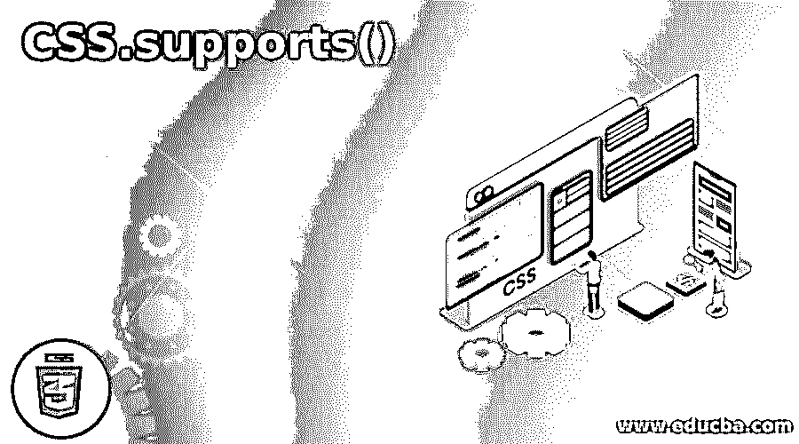

# CSS.supports()

> 原文：<https://www.educba.com/css-supports/>




## CSS.supports()简介

以下文章提供了 CSS.supports()的概述。CSS @supports 定义为支持条件，也称为功能查询，有助于检查浏览器对 CSS 属性值的支持，是设计工作流程中使用的 CSS3 条件规则规范的一部分。我们测试的条件应该放在括号内，如果我们尝试使用更多的括号，有效的代码将是这样的。运算符“与”或“或”有助于将不同功能的检测链接起来。

### CSS.supports()的语法

CSS 支持的语法如下所示:

<small>网页开发、编程语言、软件测试&其他</small>

```
@supports (condition)
{
.ex
{
// CSS Style
}
}
```

这里的条件是几组带有要测试的值的属性。所以第一个语句就像一个 if 语句，我们这样说，如果那个属性被支持，那么在样式元素里面做所有的事情。甚至逻辑操作符也可以和括号一起使用，这样就清楚了。有不同类型的值对。

有关定义的值，请参考下表。

| **序列号** | **值** | **描述** |
| One | 和 | 值对与合取结合 |
| Two | 运筹学 | 这是一个分离 |
| Three | 不 | 这是一个否定 |

### CSS 如何支持()函数的工作原理？

CSS 支持函数返回一个布尔值(写一个条件语句),指定浏览器是否支持 CSS 功能。我们还可以使用和、或对支持系统执行多重检查。这些规则可以嵌套，这使得使用复杂查询时代码更容易。理想情况下，浏览器对 CSS3 版本的支持是可变的，这是一个很好的实践，检测是使用 JavaScript 执行的。为了实现这一点，我们引入了 CSS 样式@support 函数。

因此，即使 JavaScript 被禁用，这个函数也能很好地进行检测。因此，当我们编写代码时，它们对媒体查询非常熟悉。

让我们看看他们与运营商的合作。

#### 1.非关键字

就像检查浏览器支持一样，我们也可以使用运算符 not 来检查该功能是否受支持。

该示例如下所示:

```
@supports not (display: flex)
{
.aaa {
Display: grid;
}
}
```

当 not 与其他运算符组合使用时，没有必要将 NOT 关键字括在两个括号中，这样，当它是第一个条件时，括号是必需的。

让我们举一个这样的例子:

**有效非**

```
@supports not (display: flex) and ((display: grid) or (display: table))
{
}
```

**无效不**

```
@supports
display: flex) or (display: table) not (display: table) {
}
```

#### 2.和关键字

这用于检查两个条件，如果两个条件都为真，则执行 style 语句。换句话说，它们有助于多个必需条件。

#### 3.或关键字

析取类型，用于多个可选样式。我们也可以一起使用 AND、OR 来测试条件。

### CSS.supports()的示例

下面是 CSS.supports()的示例。以下是实施支持的不同场景。

#### 示例#1

显示 NOT 运算符

**代码:**

```
<!DOCTYPE html>
<html>
<head>
<title>Supports Demo</title>
<style>
* {
box-sizing: border-box;
font-family: Algeria, sans-serif;
}
.main {
max-width: 80%;
height: auto;
background-color: #084F66;
margin: 0 auto;
padding: 0;
}
.city {
margin: 0;
padding: 0;
background: linear-gradient(rgb(12, 185, 242), rgb(6, 49, 64));
}
img {
display: inline;
width: 90%;
height: auto;
}
@supports(mix-blend-mode: saturation) {
.city img {
mix-blend-mode: overlay;
}
}
@supports not (mix-blend-mode: saturation) {
.city img {
opacity: 0.7;
}
}
.aa {
text-align: center;
padding-top: 52px;
font-size: 10px;
}
</style>
</head>
<body>
<h1> @Supports examples </h1>
<div class="main">


</div>
<p class="aa">Demo by Sunitha Eswaraiah. <a href="https://www.educba.com/css-layout/?source=leftnav" target="_blank">Read the content</a>.</p>
</body>
</html>
```

**输出:**


#### 实施例 2

用 AND 运算符实现

**代码:**

```
<!DOCTYPE html>
<html>
<head>
<title>Supports Example using AND Keyword</title>
<style>
@supports (display: grid) and (display: -webkit-flex) {
div h1 {
display: -moz-flex;
justify-content: -moz-flex-start;
color: purple;
border: 6px solid purple;
padding: 18px;
font-size: 30px;
}
}
</style>
</head>
<body>
<div>
<h1> Styling Example </h1>
</div>
</body>
</html>
```

**输出:**


#### 实施例 3

使用 AND 运算符支持边框样式

**代码:**

```
<!DOCTYPE html>
<html>
<head>
<title>Supports rule using AND </title>
<style>
@supports (border-radius: 4px) and (box-shadow: 2px 2px 3px blue) {
div h1 {
border-radius:4px;
box-shadow: 2px 2px 3px blue
justify-content: flex-start;
color: red;
border: 6px solid yellow;
padding: 15px;
font-size: 30px;
}
}
</style>
</head>
<body>
<div>
<h1>@support rule in CSS</h1>
</div>
</body>
</html>
```

上面的代码谈到了测试多个属性。这里我们已经测试了边框半径和阴影。因此，如果满足所有这些条件，它将返回 true。

**输出:**


#### 实施例 4

CSS 变量支持

**代码:**

```
<!DOCTYPE html>
<html>
<head>
<style>
section {
color: green;
}
@supports(--css: variables) {
section {
--my-color: red;
color: var(--my-color, 'pink');
}
}
h1 {
text-align: center;
max-width: 500px;
margin: 40px auto;
}
</style>
</head>
<body>
  <h1>If the text is supported by the browser. It is displayed in Red color. If not it is displayed as green</h1>
</body>
</html>
```

上面的代码选择了 section 部分，在浏览器中用一种颜色显示文本内容。

**输出:**


#### 实施例 5

使用或@supports 函数

**代码:**

```
<!DOCTYPE html>
<html lang="en">
<head>
<meta charset="UTF-8">
<title>@Supports CSS with all value</title>
<meta name="viewport" content="width=device-width">
<link rel="stylesheet" href="styl.css" />
<style>
@supports (display:grid) and (transform:rotate(20deg)){
p{
font-size: 2rem;
color: orange;
}
}
@supports (not (display:rainbow)) or (display:block){
p{
font-size: 3rem;
text-shadow: 4px 4px 4px blue;
}
}
</style>
</head>
<body>

<h1> <center>@Supports CSS Demo</center></h1>

<styl>
<p>If you're trying to achieve a goal, there will be roadblocked. I have had them; everybody has had them personally. But obstacles don't have to stop you. If you run into a barrier, don't turn around and give up the goal. Clear out how to climb it, go through it, or work around it.</p>
</styl>
<script>
</script>
</body>
</html>
```

**输出:**


### 结论

最后，在本文中，我们看到了如何在 CSS 中创建一个支持函数。因此，我们的结论是，CSS 是一个很好的创新，如果网页浏览器不支持 CSS 的本质，它会简单地忽略页面。此外，我们已经看到了如何在支持系统中使用操作符。@support 函数是 CSS 规范的一大补充。根据项目的不同，我们会更多更好地使用这个规则。

### 推荐文章

这是一个 CSS.supports()的指南。这里我们讨论 CSS.supports()的介绍，这个函数是如何工作的，以及相应的例子。您也可以看看以下文章，了解更多信息–

1.  [CSS 加载器](https://www.educba.com/css-loader/)
2.  [CSS 网格布局](https://www.educba.com/css-grid-layout/)
3.  [CSS 标度()](https://www.educba.com/css-scale/)
4.  [CSS 选择器第 n 个子节点](https://www.educba.com/css-selector-nth-child/)


