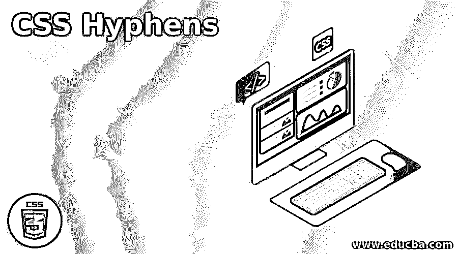
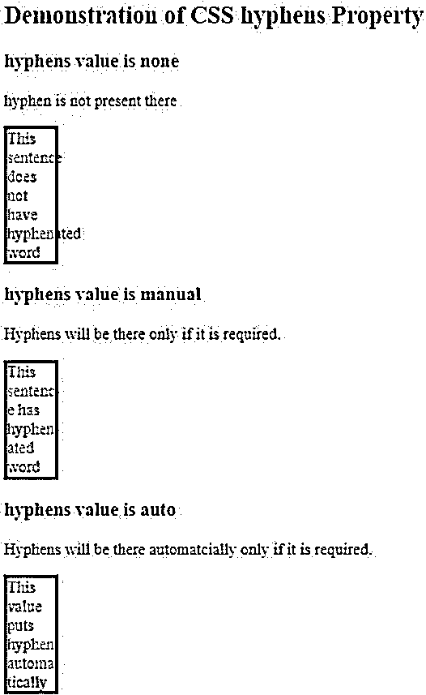
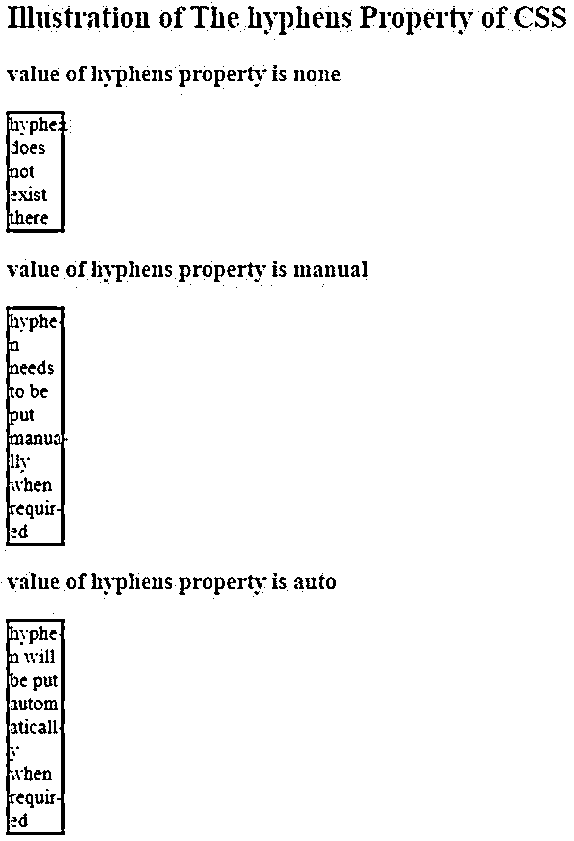
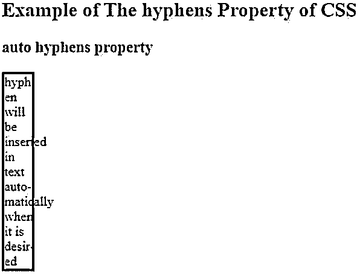
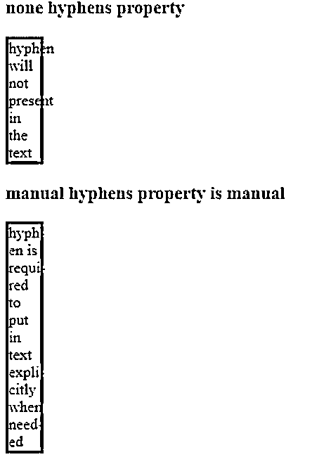

# CSS Hyphens

> 原文：<https://www.educba.com/css-hyphens/>




## CSS 连字符介绍

当在使用 CSS 的样式和对齐的帮助下用 HTML 编码页面时，您可能希望根据需要将部分或全部文本的单词包装在页面的边框内。CSS 连字符属性有助于获得应用于 CSS 连字符组件中文本的单词的文本摘要的限制，通过利用不同的参数值来实现更好的 HTML 用户界面设计，该设计符合您在项目中的期望设计，从而增加您的网页的更多流量参与。在这里，我们将通过几个例子，看到通过在文本的单词内放置 CSS 连字符属性，可以用来在 HTML 页面的区域内换行的过程。

### CSS 连字符的语法和参数

下面给出了提到的语法和参数:

<small>网页开发、编程语言、软件测试&其他</small>

```
hyphens: none|manual|auto|initial|inherit;
```

#### 因素

现在你可能会问 CSS 连字符中属性的参数是什么？实际上，这些是各种类型的连字符值，用于指示区域或边框内文本的换行。

为此，您可以参考下表，其中详细说明了参数值。

| **值** | **描述** |
| 没有人 | 顾名思义，在这种情况下，文本中没有带连字符的单词。因此，单词将在区域或边界上流动。尽管这不是期望的情况。仅仅是因为文字会从它的边界流出。这将最终导致糟糕的设计和你的网页外观，这并不意味着良好的用户流量。除非特别要求，否则应该避免这种情况，并在 HTML 代码的 CSS 部分使用正确的连字符值。 |
| 指南 | CSS 的连字符属性的默认值是手动的。当断字属性为手动时，用户需要手动在单词内的所需区域提供连字符，以便您根据要求获得摘要输出。但是在这种情况下，每次都需要运行代码，检查所需的大小写并输入连字符。有点烦人的工作。 |
| 汽车 | 不需要人工干预。当连字符的属性为自动时，连字符会自动插入单词中的所需区域，以便您可以根据需要换行。 |
| 最初的 | 该值将默认的连字符属性。 |
| 继承 | 子元素自动获取父元素属性。 |

### CSS 中的连字符属性是如何工作的？

*   您必须利用 HTML 中 CSS 的基本语法，使用所需的连字符属性参数值，以便在输出中生成所需的带有正确连字符的文本换行。
*   您可以浏览示例，了解如何通过在 CSS 中使用不同的连字符属性值来使用正确的连字符将文本换行。
*   还可以查看代码示例的注释部分，了解在哪里以及如何放置这些值以获得正确的换行和断字。

### CSS 连字符的示例

下面是提到的例子:

#### 示例#1

在第一个例子中，我们将浏览断字属性 CSS 的说明。当断字值为手动时，您需要将连字符明确地放在文本中所需的位置，以便在输出时得到所需的换行。在 auto 的情况下，算法自动进行总结。检查代码中的行内注释。

**代码:**

```
<!DOCTYPE html>
<html>
<head>
<style>
body {
text-align: left;
}
div {
width: 48px;
border: 3px solid green;
background-color: yellow; // color of background
}
//defining different values of hyphens
div.n {
hyphens: none;
}
div.m {
hyphens: manual;
}
div.a {
hyphens: auto;
}
</style>
</head>
<body>
<h2>Demonstration of CSS hyphens Property</h2>
<h3>hyphens value is none</h3>
<p>hyphen is not present there</p>
<div class="n">
This sentence does not have hyphenated word
</div>
<h3>hyphens value is manual</h3>
<p>Hyphens will be there only if it is required.</p>
<div class="m">
This sentenc-e has hyphen-ated word
</div>
<h3>hyphens value is auto</h3>
<p>Hyphens will be there automatcially only if it is required.</p>
<div class="a">
This value puts hyphen automa-tically
</div>
</body>
</html>
```

**输出:**




#### 实施例 2

在第二种情况下，你会看到 CSS 的断字属性的另一个例子。

**代码:**

```
<!DOCTYPE html>
<html>
<head>
<style>
body {
text-align: left;
}
div {
width: 42px;
border: 2px solid black;
background-color: aqua;
}
div.nne {
hyphens: none;
}
div.manl {
hyphens: manual;
}
div.ato {
hyphens: auto;
}
</style>
</head>
<body>
<h2>Illustration of The hyphens Property of CSS</h2>
<h3>value of hyphens property is none</h3>
<div class="nne">hyphen does not exist there</div>
<h3>value of hyphens property is manual</h3>
<div class="manl">hyphe-n needs to be put manua-lly when requir-ed</div>
<h3>value of hyphens property is auto</h3>
<div class="ato">hyphe-n will be put autom-aticall-y when requir-ed</div>
</body>
</html>
```

**输出:**




#### 实施例 3

在本例中，您将经历连字符属性的另一个示例。在这种情况下，您将看到如何输入断字值以获得正确的摘要文本。

**代码:**

```
<!DOCTYPE html>
<html>
<head>
<style>
body {
text-align: left;
}
div {
width: 33px;
border: 3px solid indigo;
background-color: white;
}
div.ato {
hyphens: auto;
}
div.nne {
hyphens: none;
}
div.manl {
hyphens: manual;
}
</style>
</head>
<body>
<h2>Example of The hyphens Property of CSS</h2>
<h3>auto hyphens property </h3>
<div class="ato">hyph-en will be inserted in text auto-matically when it is desir-ed</div>
<h3>none hyphens property </h3>
<div class="nne">hyphen will not present in the text</div>
<h3>manual hyphens property is manual</h3>
<div class="manl">hyph-en is requi-red to put in text expli-citly when need-ed</div>
</body>
</html>
```

**输出:**







### 结论

我们在这里总结“CSS 连字符属性”。在本文中，我们举例说明了如何通过 CSS 部分在 HTML 页面代码中使用连字符属性值。这篇文章对那些参与 HTML 和 CSS 前端开发和设计的人非常有用。

### 推荐文章

这是一个 CSS 连字符的指南。这里我们讨论 CSS 连字符的介绍，连字符属性是如何工作的，以及相应的例子。您也可以看看以下文章，了解更多信息–

1.  [CSS 按钮边框](https://www.educba.com/css-button-border/)
2.  [CSS 属性选择器](https://www.educba.com/css-attribute-selector/)
3.  [CSS 换行](https://www.educba.com/css-line-break/)
4.  [复选框 CSS](https://www.educba.com/checkbox-css/)


