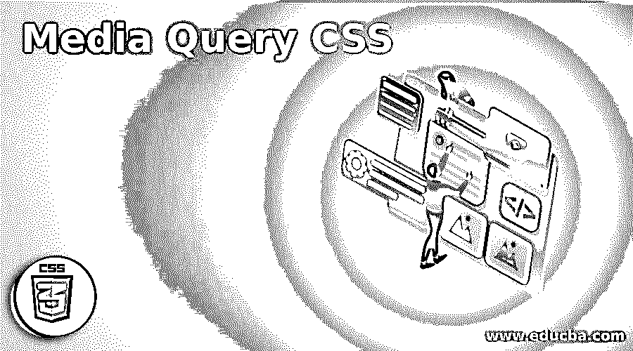
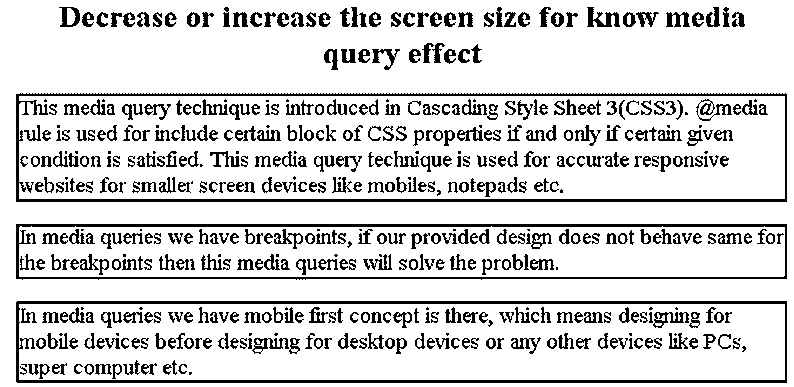
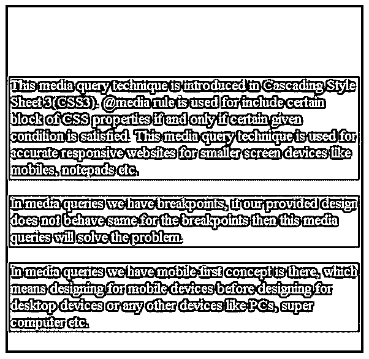
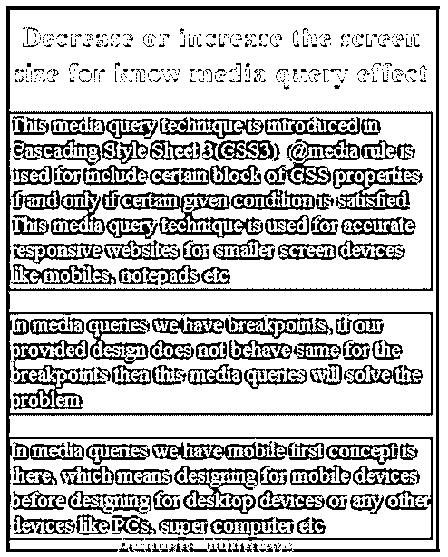
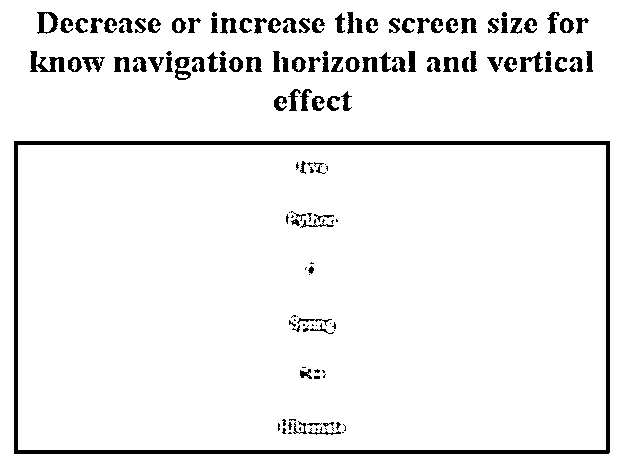
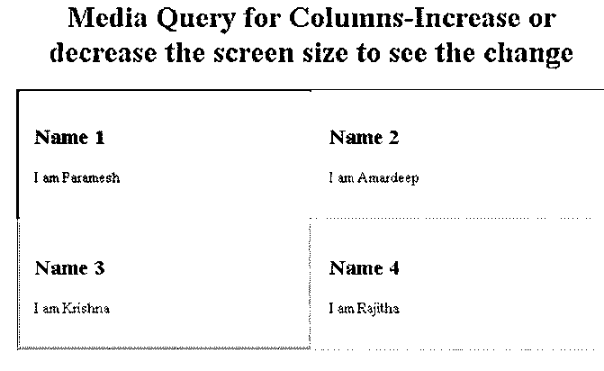
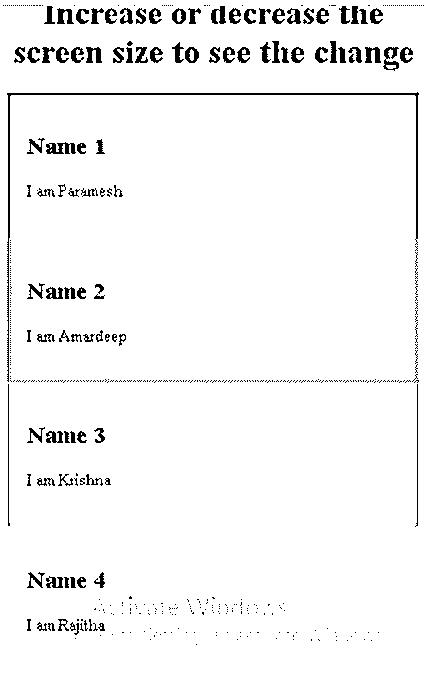

# 媒体查询 CSS

> 原文：<https://www.educba.com/media-query-css/>




## 媒体查询 CSS 介绍

级联样式表 3(CSS3)中介绍了这种媒体查询技术。当且仅当满足特定给定条件时，使用@media 规则来包含 CSS 属性的特定块。这种技术用于小屏幕设备如手机、笔记本等的精确响应网站。在媒体查询中，我们有断点，如果我们提供的设计对于断点没有相同的表现，那么这个媒体查询将解决问题。

在媒体询问中，我们有移动第一的概念，这意味着在为桌面设备或任何其他设备如 PC、超级计算机等设计之前，先为移动设备设计。通过使用@media 规则，为不同的媒体设备或不同的媒体类型应用不同的样式。主要用于媒体查询，为台式机、手机、笔记本电脑、平板电脑提供准确响应的网页。我们还可以将此媒体查询应用于打印文档或屏幕阅读器，如 print、speech 或 print(媒体类型)。我们必须将这种媒体风格应用到手机、电脑、笔记本等设备的屏幕上。比实际宽度小或大的设备。

<small>网页开发、编程语言、软件测试&其他</small>

**媒体查询的目的**

媒体询问的目的如下:

*   媒体查询用于检查。
*   视口的高度和宽度。
*   设备的高度和宽度。
*   平板电脑或手机在纵向模式或横向模式(方向)设备分辨率。

### 如何在 CSS 中使用媒体查询？

*   在 CSS 中,@media 查询包含不同的媒体类型，还包含一个或多个表达式，这些表达式将被解析为假或真。

**语法:**

```
@media mediatype and (expressions) {
//CSS Properties
}
```

**举例:**

**代码:**

```
@media screen and (min-width: 580px) {
body {
background-color: red;
}
}
```

### 媒体查询 CSS 示例

下面是一些例子:

#### 示例#1

包含内容的媒体查询。

**HTML 和 CSS 代码:MediaQueryContent.html**

```
<!DOCTYPE html>
<html>
<head>
<title>
Media Query
</title>
<style>
/*By default screen becomes background is white and text is brown in color*/
body {
background-color: white;
color: brown;
}
p
{
border: solid 2px navy;
font-size: 24px;
}
/*If screen is 800px or less then background is red and text is white in color*/
@media screen and (max-width: 800px) {
body {
background-color: red;
color: white;
}
}
/*If screen is 550px or less then background is fuchsia and text is white in color*/
@media screen and (max-width: 550px) {
body {
background-color: fuchsia;
color: white;
}
}
h1
{
color: green;
text-align:center;
}
</style>
</head>
<body>
<h1>Decrease or increase the screen size for know media query effect</h1>
<p>This media query technique is introduced in Cascading Style Sheet 3(CSS3). @media rule is used for include certain block of CSS properties if and only if certain given condition is satisfied. This media query technique is used for accurate responsive websites for smaller screen devices like mobiles, notepads etc.</p>
<p>In media queries we have breakpoints, if our provided design does not behave same for the breakpoints then this media queries will solve the problem.</p>
<p>In media queries we have mobile first concept is there, which means designing for mobile devices before designing for desktop devices or any other devices like PCs, super computer etc.
</p>
</body>
</html>
```

**输出:**




**屏幕尺寸 800 像素以下:**

**

** 

**屏幕尺寸 800 像素以下:**

**

** 

#### 实施例 2

导航栏。

**HTML 和 CSS 代码:NavMediaQuery.html**

```
<!DOCTYPE html>
<html>
<head>
<title>
Media Query
</title>
<style>
* {
box-sizing: border-box;
}
/*If screen is more than 700px then navigation becomes horizontal*/
.navBar {
overflow: hidden;
background-color: brown;
}
/* Style for navBar links */
.navBar a {
float: left;
text-align: center;
padding: 16px 18px;
text-decoration: none;
display: block;
color: fuchsia;
}
/* color change by hovering */
.navBar a:hover {
background-color: lightpink;
color: black;
}
/*If screen is 700px or less then navigation becomes vertical*/
@media screen and (max-width: 700px) {
.navBar a {
float: none;
width: 100%;
}
}
h1
{
color: green;
text-align:center;
}
</style>
</head>
<body>
<h1>Decrease or increase the screen size for know navigation horizontal and vertical effect</h1>
<div class="navBar">
<a href="#">Java</a>
<a href="#">Python</a>
<a href="#">C</a>
<a href="#">Spring</a>
<a href="#">C++</a>
<a href="#">HIbernate</a>
</div>
</body>
</html>
```

**输出:**

**默认屏幕尺寸:**


**屏幕尺寸小于等于 700 像素:**




#### 实施例 3

列媒体查询。

**HTML 和 CSS 代码:ColumnsMediaQuery.html**

```
<!DOCTYPE html>
<html>
<head>
<title>
Media Query
</title>
<style>
* {
box-sizing: border-box;
}
/* create 4 columns equally */
.columnClass {
width: 25%;
padding: 20px;
float: left;
color: brown;
}
/* clear the floats */
.rowClass:after {
display: table;
clear: both;
content: "";
}
/*If screen is 800px or less then column width becomes 50% means 2 rows*/
@media screen and (max-width: 800px) {
.columnClass {
width: 50%;
}
}
/*If screen is 800px or less then column width becomes 100% means 1 rows*/
@media screen and (max-width: 500px) {
.columnClass {
width: 100%;
}
}
h1
{
color: green;
text-align:center;
}
</style>
</head>
<body>
<h1>Media Query for Columns-Increase or decrease the screen size to see the change</h1>
<div class="rowClass">
<div class="columnClass" style="background-color:#aaa;">
<h2>Name 1</h2>
<p>I am Paramesh</p>
</div>
<div class="columnClass" style="background-color:#bbb;">
<h2>Name 2</h2>
<p>I am Amardeep</p>
</div>
<div class="columnClass" style="background-color:#ccc;">
<h2>Name 3</h2>
<p>I am Krishna</p>
</div>
<div class="columnClass" style="background-color:#ddd;">
<h2>Name 4</h2>
<p>I am Rajitha</p>
</div>
</div>
</body>
</html>
```

**输出:**

**800 像素以下屏幕尺寸:**




**500 像素以下屏幕尺寸:**




**默认屏幕尺寸:**


### 结论

CSS 中的媒体查询用于为手机、笔记本等小屏幕设备设置精确的屏幕尺寸。根据屏幕大小，页面将使用 width 属性调整屏幕大小。

### 推荐文章

这是一个媒体查询 CSS 的指南。这里我们讨论有目的的媒体查询 CSS 的介绍，如何使用媒体查询和例子。您也可以看看以下文章，了解更多信息–

1.  [CSS z 索引](https://www.educba.com/css-z-index/)
2.  [粘性侧边栏 CSS](https://www.educba.com/sticky-sidebar-css/)
3.  [带 CSS 的 XML](https://www.educba.com/xml-with-css/)
4.  [CSS 边框生成器](https://www.educba.com/css-border-generator/)


