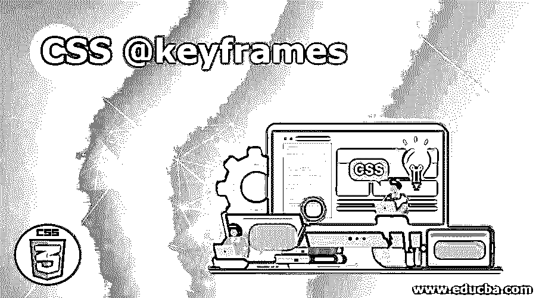
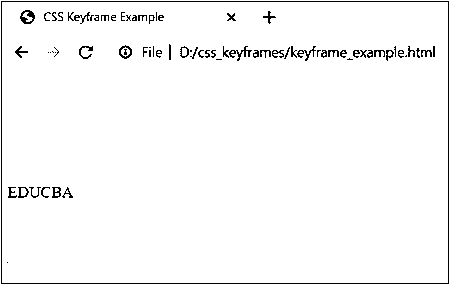
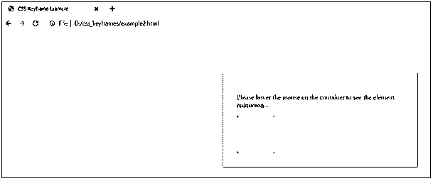
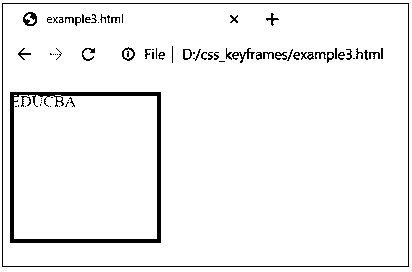
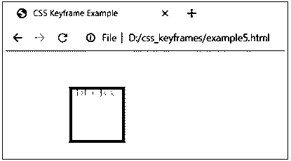
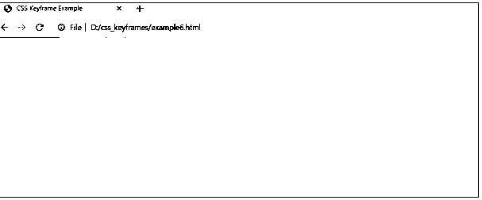
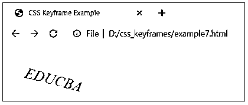
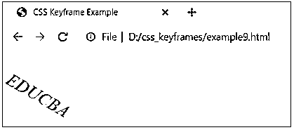

# css @关键帧

> 原文：<https://www.educba.com/css-keyframes/>




## CSS @关键帧简介

@keyframes 规则规定了动画的代码。CSS at-rule @keyframes 通过指定动画链中的关键帧样式来管理 CSS 动画过程中所需的步骤。与过渡相比，它允许动画序列对关键步骤进行更多的控制。

动画是通过从一组 CSS 样式逐渐移动到另一组 CSS 样式来制作的。我们可以在动画过程中多次修改 CSS 样式。定义样式转换是以百分比发生还是使用“从”和“到”关键字发生，这与 0 %和 100 %相同。0 %是动画的开始，100 %是动画的完成。

<small>网页开发、编程语言、软件测试&其他</small>

### 句法

CSS @keyframes 的语法可以写成如下所示:

@ key frames name _ of _ animation { key frames-selector { CSS style here…} }

当关键帧规则没有定义动画的开始或结束状态(即 0%从和 100%到)时，浏览器可以使用元素的现有样式作为开始/结束状态。它可以用来使一个元素从它的初始状态来回运动。

举个例子，

```
@keyframes background_color {
0% {
background-color: blue;
}
100% {
background-color: grey;
}
}
```

0%和 100%是关键帧选择器，为每个关键帧指定一个关键帧规则。对于关键帧规则，关键帧声明块由属性和值组成。

### @keyframes 在 CSS 中是如何工作的？

若要使用关键帧，请使用 animation-name 属性随后使用的名称构建一个@keyframes 规则，以使动画符合其关键帧参数。每个@keyframes 规则都包含一个关键帧选择器样式列表，该列表指定关键帧出现时的百分比以及动画，还包含一个包含关键帧样式的块。

### CSS @关键帧的示例

我们将借助例子讨论如何在 CSS 中使用@keyframes 模块。

#### 示例#1

**代码:**

```
<!DOCTYPE html>
<html>
<head>
<meta http-equiv="Content-Type" content="text/html; charset=windows-1252">
<title> CSS Keyframe Example </title>
<style>
div {
width: 80px;
height: 80px;
background: blue;
position: relative;
animation: animation_one 5s infinite;
}
@keyframes animation_one {
0%   {top: 0px; background: #ffd630; width: 80px;}
100% {top: 250px; background: #F5F5F5; width: 250px;}
}
</style>
</head>
<body><br>
<div>EDUCBA</div>
</body>
</html>
```

**输出:**




在接下来的例子中，使用上面的步骤来显示 html 页面的结果。

#### 实施例 2

**代码:**

```
<!DOCTYPE html>
<html lang="en">
<head>
<meta charset="utf-8">
<title>CSS Keyframe Example</title>
<style>
.box {
margin: 50px;
width: 80px;
height: 80px;
background: blue;
position: relative;
animation-name: animation_two;
animation-duration: 3s;
}
@-webkit-keyframes animation_two {
from {left: 0;}
to {left: 75%;}
}
</style>
</head>
<body>
<div class="box"></div>
</body>
</html>
```

**输出:**


#### 实施例 3

**代码:**

```
<!DOCTYPE html>
<html lang="en">
<head>
<meta charset="utf-8">
<title>CSS Keyframe Example</title>
<style>
.container {
margin: 100px auto;
min-width: 200px;
max-width: 400px;
padding: 2em;
border: 1px solid grey;
}
.myelement {
padding: 20px;
width: 50px;
height: 50px;
background-color: #ffd630;
position: relative;
}
.container:hover .myelement1 {
animation: animation_three 3s linear both;
}
@keyframes animation_three {
0% {
left: 0;
top: 0;
}
50% {
left: 100px;
top: -100px;
}
100% {
left: 250px;
top: 0;
}
}
</style>
</head>
<body>
<div class="container">
<p>Please hover the mouse on the container to see the element animation...</p>
<div class="myelement myelement1">
</div>
</div>
</body>
</html>
```

**输出:**




#### 实施例 4

**代码:**

```
<!DOCTYPE html>
<html>
<head>
<style>
div {
width: 150px;
height: 150px;
position: relative;
animation: animation_four 4s infinite;
}
@keyframes animation_four {
0%   {top: 0px; left: 0px; background: #BA55D3;}
25%  {top: 0px; left: 100px; background: #DB7093;}
50%  {top: 100px; left: 100px; background: #8B4513;}
75%  {top: 100px; left: 0px; background: #00FF7F;}
100% {top: 0px; left: 0px; background: #DC143C;}
}
</style>
</head>
<body>
<div>EDUCBA</div>
</body>
</html>
```

**输出**




#### 实施例 5

**代码:**

```
<!DOCTYPE html>
<html lang="en">
<head>
<meta charset="utf-8">
<title>CSS Keyframe Example</title>
<style>
.mydiv {
margin: 50px;
width: 80px;
height: 80px;
background: blue;
position: relative;
animation: animation_five 3s linear 0s infinite alternate;
}
@keyframes animation_five {
from {left: 0;}
to {left: 30%;}
}
</style>
</head>
<body>
<div class="mydiv"> EDUCBA </div>
</body>
</html>
```

**输出:**




#### 实施例 6

**代码:**

```
<!DOCTYPE html>
<html lang="en">
<head>
<meta charset="utf-8">
<title>CSS Keyframe Example</title>
<style>
.container {
margin: 100px auto;
min-width: 200px;
max-width: 400px;
}
.myelement {
margin: 0 auto;
width: 75px;
height: 75px;
background-color: #ffd630;
border-radius: 50%;
position: relative;
top: 0;
animation: animation_six 2s infinite;
}
@keyframes animation_six {
from {
top: 50px;
animation-timing-function: ease-out;
}
25% {
top: 70px;
animation-timing-function: ease-in;
}
50% {
top: 100px;
animation-timing-function: ease-out;
}
75% {
top: 50px;
animation-timing-function: ease-in;
}
to {
top: 150px;
}
}
</style>
</head>
<body>
<div class="container">
<div class="myelement"></div>
</div>
</body>
</html>
```

**输出:**




#### 实施例 7

**代码:**

```
<!DOCTYPE html>
<html lang="en">
<head>
<meta charset="utf-8">
<title>CSS Keyframe Example</title>
<style>
.mytxt {
font-size: 25px;
font-style: italic;
color: #0099cc;
-webkit-transform-origin: left center;
-ms-transform-origin: left center;
transform-origin: left center;
animation: animation_fall 5s infinite;
}
@keyframes animation_fall {
from {
-webkit-transform: rotate(0) translateX(0);
transform: rotate(0) translateX(0);
opacity: 1;
}
to {
-webkit-transform: rotate(90deg) translateX(200px);
transform: rotate(90deg) translateX(200px);
opacity: 0;
}
}
</style>
</head>
<body>
<div>
<p class="mytxt"> EDUCBA </p>
</div>
</body>
</html>
```

**输出:**




#### 实施例 8

**代码:**

```
<!DOCTYPE html>
<html lang="en">
<head>
<meta charset="utf-8">
<title>CSS Keyframe Example</title>
<style>
.container {
margin: 50px auto;
min-width: 350px;
}
.myelement {
margin: 0 auto;
width: 80px;
height: 80px;
background-color: #DB7093;
margin-bottom: 100px;
position: relative;
left: 0;
}
.myelement1 {
background-color: #DC143C;
-webkit-animation: animation_shake 6s infinite;
animation: animation_shake 6s infinite;
}
@keyframes animation_shake {
0%, 15%, 25%, 35%, 45%, 55% {
left: 80px;
transform: rotate(90deg);
}
5%,
10%,
20%,
30%,
40%,
50%{
left: -80px;
transform: rotate(-90deg);
}
}
</style>
</head>
<body>
<div class="container">
<div class="myelement myelement1"></div>
</div>
</body>
</html>
```

**输出:**


#### 实施例 9

**代码:**

```
<!DOCTYPE html>
<html lang="en">
<head>
<meta charset="utf-8">
<title>CSS Keyframe Example</title>
<style>
.mytxt {
font-size: 25px;
font-style: italic;
color: #0099cc;
transform-origin: left center;
animation: animation_fall 5s infinite;
}
@keyframes animation_fall {
from {
transform: rotate(0) translateX(0);
opacity: 0.5;
}
50%,
60% {
transform: rotate(45deg) translateX(0);
opacity: 1;
}
to {
transform: rotate(45deg) translateX(100px);
opacity: 0.5;
}
}
</style>
</head>
<body>
<div>
<p class="mytxt"> EDUCBA </p>
</div>
</body>
</html>
```

**输出:**




### 结论

正如我们已经展示的，@keyframe rule 由您想要在关键帧声明块中为其制作动画的属性和值组成。关键帧用于定义动画不同阶段的动画属性值。@keyframes at-rule 由一组封装的 CSS 样式的规则组成，这些规则描述了属性值如何随时间变化。

### 推荐文章

这是一个 CSS @keyframes 的指南。在这里，我们讨论@keyframes 在 CSS 中是如何工作的，并给出编程示例以便更好地理解。您也可以看看以下文章，了解更多信息–

1.  [CSS 翻译](https://www.educba.com/css-translate/)
2.  [CSS 颜色图表](https://www.educba.com/css-color-chart/)
3.  [CSS 过渡效果](https://www.educba.com/css-transition-effects/)
4.  [CSS 溢出](https://www.educba.com/css-overflow/)


