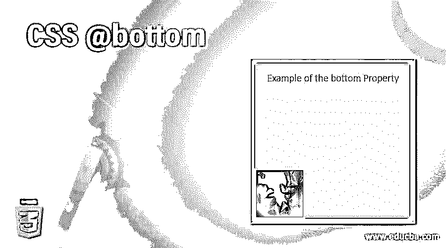
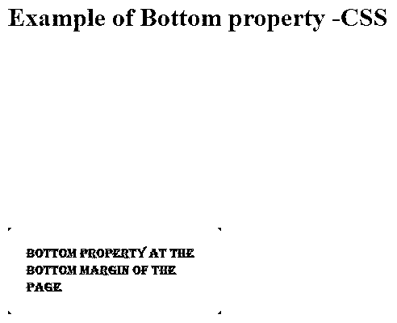
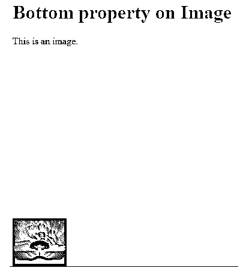
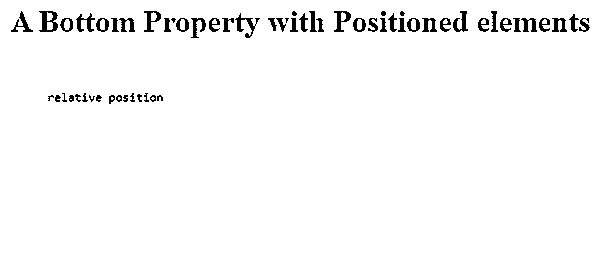
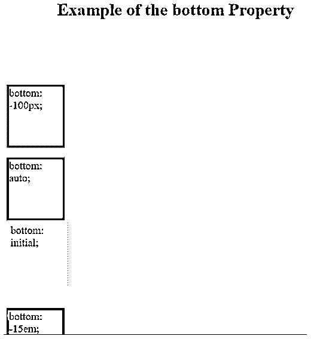
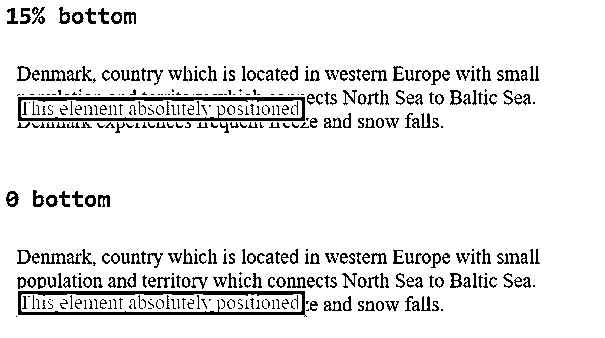

# CSS @底部

> 原文：<https://www.educba.com/css-bottom/>




## CSS @bottom 简介

CSS Bottom 被定义为 Bottom 属性指定添加了 position 属性的元素的垂直位置。它给出了任何浏览器窗口中“参考元素”框底部边缘的偏移，这是一个从视口底部改变的元素。bottom 属性不影响静态位置。在这个主题中，我们将学习 CSS @bottom。

### 语法和参数

一般语法如下所示:

<small>网页开发、编程语言、软件测试&其他</small>

```
.container
{
bottom: value;
}
Value: length |percentage |auto | initial;
```

#### 因素

这些参数定义为:

*   **长度:**px 或 em 中指定的值可以是负值也可以是正值
*   **百分比:**该值指定了框元素高度的百分比。
*   **自动:**默认值。并把身高当做一个数值。
*   **inherit:** 该值继承其父容器值。

**样本示例**

```
bottom: 4px         /* length */
bottom: 1.4em
bottom: 20%         / *<percentages */
bottom: auto
bottom: inherit
```

当一个值被赋值为正值时，元素从给定的边移开，负值移向它。比如如果下:-15px；这会将段落设置在窗口下边缘的下方。

### @bottom 在 CSS 中是如何工作的？

在这里，让我们通过观察它们对不同位置的元素的影响来看看这个属性是如何工作的。

**相对定位:**当位置被设置为这个属性时，底部添加一个相应的偏移量到底部边缘，将它的位置从原始形式移动到它的顶部。通常，顶部属性在许多方面会覆盖底部属性。基于底部值的偏移应用于元素本身。

**绝对位置:**这样的话，元素会相对于最近的父元素向上移动。为了理解这个例子，将在下一节中给出。

**Static:** 这是默认值，不影响任何元素。

对于 JavaScript，语法如下所示

```
Object.style.bottom="50px";
```

### 例子

让我们通过一个例子来看看这个底层属性是如何工作的:

#### 示例#1

让我们举个例子——对绝对属性的影响。

**代码:**

```
<!DOCTYPE html>
<html lang="en">
<head>
<meta charset="utf-8">
<title>Example of CSS bottom property</title>
<style>
p {
width: 220px;
position: absolute;
bottom: 100px;
padding: 22px;
font: bold 16px algerian;
background: LightBlue;
}
h1
{
color : red;
}
</style>
</head>
<body>
<h1> Example of Bottom property -CSS </h1>
<p>Bottom Property at the bottom margin of the Page</p>
</body>
</html>
```

**输出:**




##### 实施例#1a

使用相同的模式，我们可以在底部属性中放置一个图像。

**代码:**

```
<html>
<head>
<style type="text/css">
img
{
position:absolute;
bottom:0px
}
h1
{
color: aqua;
}
</style>
</head>
<body>
<h1>Bottom property on Image </h1>

<p>This is an image.</p>
</body>
</html>
```

**输出:**




#### 实施例 2

位置设置为“相对”并使用值“长度”。

**代码:**

```
<!DOCTYPE html>
<html>
<head>
<style>
div.square {
width: 12rem;
height: 12rem;
display: flex;
justify-content: center;
align-items: center;
background-color: solid purple;
position: relative;
bottom: 60px;
}
div.outborder {
display: inline-block;
border: 3px dashed yellow;
margin: 30px 0 1 30px;
}
</style>
</head>
<body>
<h1>A Bottom Property with Positioned elements</h1>
<div class="outborder">
<div class="square">
<pre> relative position </pre> </div>
</div>
</body>
</html>
```

当相对于相对位置在元素上设置底部时，元素从文档的原始位置向上移动。将底部指定为 60px，将其位置移动到顶部。

**输出:**




#### 实施例 3

为底部属性设置默认值。

**代码:**

```
<html>
<head>
<title> Bottom - Demo </title>
</head>
<body>
<h1 style="color:purple;">Welcome to the Home Page</h1>
<p style="position: fixed; bottom: auto; justify-content: center;
align-items: center; border: 3px dashed yellow;
margin: 30px 0 1 30px;">
This property makes a paragraph content to be auto adjusted from the margin of bottom page.
</p>
</body>
</html>
```

**输出:**


#### 实施例 4

**代码:**

```
<!DOCTYPE html>
<html>
<head>
<title>
CSS bottom Property- Demo
</title>
<style>
div{
position: relative;
width: 100px;
height: 110px;
font-size: 20px;
}
#length {
bottom: -100px;
border: 4px solid purple;
}
#emvalue {
bottom: -20em;
border: 4px solid aqua;
}
#autovalue {
bottom: auto;
border: 4px solid darkviolet;
}
#initdefault{
bottom: initial;
border: 7px solid yellow ;
}
h1{
text-align: center;
}
</style>
</head>
<body>
<h1> Example of the bottom Property </h1>
<div id = "length"> bottom: -100px; </div>
<div id = "emvalue"> bottom: -15em; </div>
<div id = "autovalue"> bottom: auto; </div>
<div id = "initdefault"> bottom: initial; </div>
</body>
</html>
```

**输出:**




#### 实施例 5

一个演示静态元素底部属性的例子。

**代码:**

```
<html>
<style>
.main-b {
position: static;
right: 20px;
bottom: -20px;
background-color: blue;
padding: 12px;
}
.derived-b {
padding: 12px;
background-color: Orange;
}
</style>
<body>
<div class="parent-b">
<div class="derived-b">
inner element.
</div>
<div class="main-b">
the main element.
</div>
<div class="derived-b">
SUb-element.
</div>
</div>
</body>
<html>
```

上面的代码显示了 static，其中如果我碰巧改变了右下方的值，我们可以看到未改变的输出。

**输出:**


#### 实施例 6

**代码:**

```
<!DOCTYPE html>
<html>
<head>
<title>CSS bottom property with bottom</title>
<style>
div {
font-family: Algeria;
font-size: 22px;
}
.A {
border: 12px solid yellow;
position: relative;
}
div.abc, div.xyz {
background-color: red;
border: 2px solid orange;
}
div.abc {
bottom: 15%;
position: absolute;
}
div.xyz {
bottom: 0;
position: absolute;
}
</style>
</head>
<body>
<h1><code><b>15% bottom</b></code></h1>
<div class="A">Denmark, country which is located in western Europe with small population and territory which connects North Sea to Baltic Sea. Denmark experiences frequent freeze and snow falls. <div class="abc">This element absolutely positioned.</div>
</div>
<br />
<h1><code><b>0 bottom</b></code></h1>
<div class="A">Denmark, country which is located in western Europe with small population and territory which connects North Sea to Baltic Sea. Denmark experiences frequent freeze and snow falls. <div class="xyz">This element absolutely positioned.</div>
</div>
</body>
</html>
```

在这里，我们可以看到在底部用绝对位置计算的百分比值。这个代码有两个绝对定位的

类，Abc 类的底值是 15，xyz 是 0。在输出中，我们可以看到“0”底部值将文本放置在底部边缘，而 15 %值将底部文本放置在很高的位置。

**输出:**




### 结论

因此，在文章的最后，这篇 CSS 文章解释了如何使用名为 Bottom 的属性及其工作原理和示例。在这里，我们看到了一个组织良好的解释，其中有很多如何在 CSS 中使用它的例子。这个属性和类似 left-right 的属性有助于显示准确的位置。

### 推荐文章

这是一个 CSS @bottom 的指南。在这里，我们讨论@bottom 如何在 CSS 中工作以及编程示例。您也可以阅读以下文章，了解更多信息——

1.  [CSS @关键帧](https://www.educba.com/css-keyframes/)
2.  [CSS 排版](https://www.educba.com/css-typography/)
3.  [CSS 新 rap](https://www.educba.com/css-nowrap/)
4.  [CSS 格式化程序](https://www.educba.com/css-formatter/)


