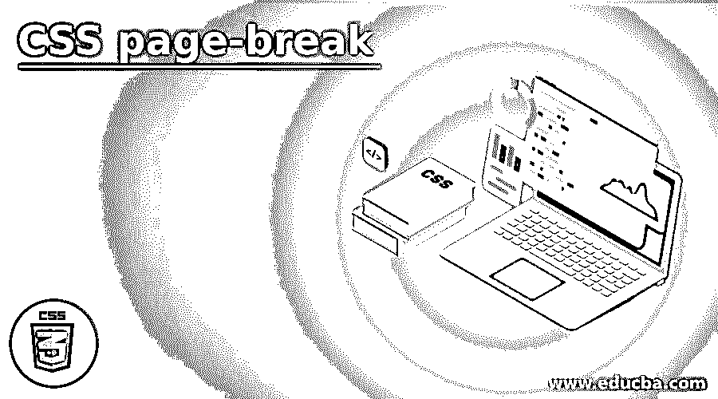
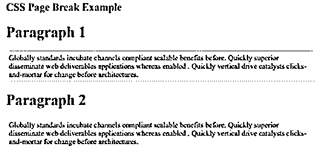
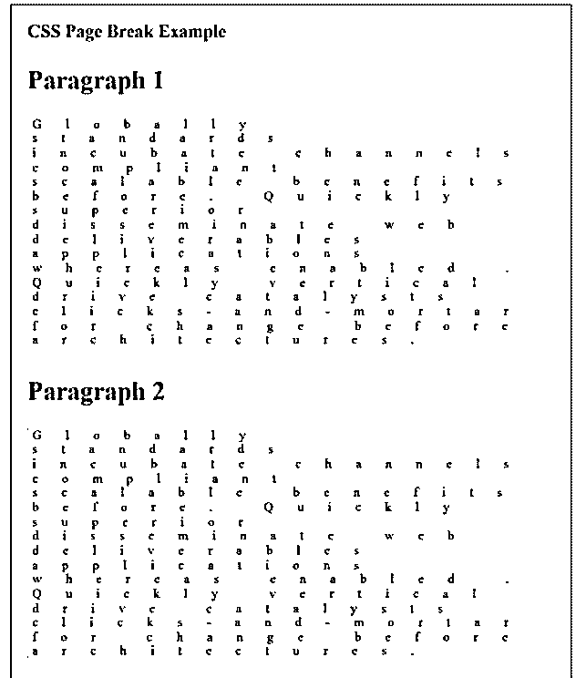
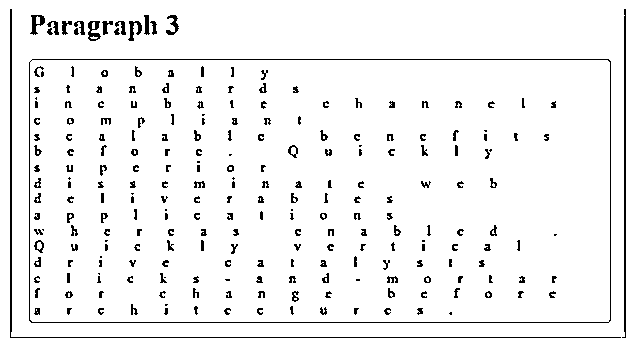

# CSS 分页

> 原文：<https://www.educba.com/css-page-break/>




## CSS 分页符介绍

下面的文章提供了 CSS 分页符的概要。分页是一种操作，它定义了网页在打印时将被分割的位置。CSS 提供了定义文档打印时的行为的功能。对于分页，CSS 提供了三个主要属性，它们是分页前、分页后和分页内。这些属性可以应用于网页上包含内容的单个元素。则这些属性将在打印网页时分解应用了该属性的页面。每当内容应该被打印并且应该是可读的并且显示得更像一本书时，应用这个属性是很重要的。

### CSS 分页符属性

下面给出了 CSS 分页符属性:

<small>网页开发、编程语言、软件测试&其他</small>

#### 1.分页前

此属性在指定分页符的元素前添加分页符。该属性不能用于空 div 元素或定位为绝对的元素。

**CSS 语法:**

```
page-break-before: auto | always | left | right | avoid | initial | inherit;
```

**值:**

*   **自动:**自动分页符。默认值。
*   **总是:**总是在元素前分页。
*   **left:** 在元素前插入分页符，并将下一页格式化为左页。
*   **right:** 在元素前插入分页符，并将下一页格式化为右页。
*   **避免:**尽可能避免在元素前分页。
*   **初始:**设置为默认值。
*   **inherit:** 从元素的父元素继承属性。

**举例:**

**代码:**

```
<!DOCTYPE html>
<html>
<head>
<title>
CSS page break
</title>
<style>
.all-display{
border : #81D4FA 2px solid;
background-color : #03a9f400;
text-align :left;
padding-left : 20px;
padding-right: 15px;
height : auto;
width : auto;
}
.heading {
font-weight: bold;
font-size: 15px;
width: 95%;
}
.content1 > p, .content2 > p, .content3 > p {
border: 1px solid #ccc;
margin-top: 4px;
padding: 5px;
border-radius: 5px;
background-color: azure;
}
@media print {
.content2, .content3 {
page-break-before: always;
}
}
</style>
</head>
<body>
<div class = "all-display">
<div class = "heading">
<h2> CSS Page Break Example </h2>
</div>
<div class = "content1">
<h1> Paragraph 1 </h1>
<p>Globally standards incubate  channels compliant  scalable benefits before.
Quickly superior disseminate  web deliverables applications whereas enabled .
Quickly vertical drive catalysts clicks-and-mortar  for change before  architectures. </p>
</div>
<div class = "content2">
<h1> Paragraph 2 </h1>
<p> Globally standards incubate  channels compliant  scalable benefits before.
Quickly superior disseminate  web deliverables applications whereas enabled .
Quickly vertical drive catalysts clicks-and-mortar  for change before  architectures. </p>
</div>
<div class = "content3">
<h1> Paragraph 3 </h1>
<p> Globally standards incubate  channels compliant  scalable benefits before.
Quickly superior disseminate  web deliverables applications whereas enabled .
Quickly vertical drive catalysts clicks-and-mortar  for change before  architectures.
</p>
</div>
</div>
</body>
</html>
```

**输出:**


打印预览第 1 页


打印预览第 2 页


打印预览第 3 页

我们对第 1 段和第 2 段应用了分页属性。这将在每页上打印每个段落的内容。

**Note:** Kindly use the print preview function of the browser to see the print output layout.

#### 2.分页后

此属性在指定分页符的元素后添加分页符。该属性不能用于空 div 元素或定位为绝对的元素。

**CSS 语法:**

```
page-break-after: auto | always | left | right | avoid | initial | inherit;
```

**值:**

*   **自动:**自动分页符。默认值。
*   **总是:**总是在元素后分页。
*   **left:** 在元素后插入分页符，并将下一页格式化为左页。
*   **right:** 在元素后插入分页符，并将下一页格式化为右页。
*   **避免:**如果可能的话，避免在元素后分页。
*   **初始:**设置为默认值。
*   **inherit:** 从元素的父元素继承属性。

**举例:**

**代码:**

```
<!DOCTYPE html>
<html>
<head>
<title>
CSS page break
</title>
<style>
.all-display{
border : #81D4FA 2px solid;
background-color : #03a9f400;
text-align : left;
padding-left : 20px;
padding-right: 15px;
height : auto;
width : auto;
}
.heading {
font-weight: bold;
font-size: 15px;
width: 95%;
}
.content1 > p, .content2 > p, .content3 > p {
border: 1px solid #ccc;
margin-top: 4px;
padding: 5px;
border-radius: 5px;
background-color: azure;
}
@media print {
.content2 {
page-break-after: always;
}
}
</style>
</head>
<body>
<div class = "all-display">
<div class = "heading">
<h2> CSS Page Break Example </h2>
</div>
<div class = "content1">
<h1> Paragraph 1 </h1>
<p>Globally standards incubate  channels compliant  scalable benefits before.
Quickly superior disseminate  web deliverables applications whereas enabled .
Quickly vertical drive catalysts clicks-and-mortar  for change before  architectures. </p>
</div>
<div class = "content2">
<h1> Paragraph 2 </h1>
<p> Globally standards incubate  channels compliant  scalable benefits before.
Quickly superior disseminate  web deliverables applications whereas enabled .
Quickly vertical drive catalysts clicks-and-mortar  for change before  architectures. </p>
</div>
<div class = "content3">
<h1> Paragraph 3 </h1>
<p> Globally standards incubate  channels compliant  scalable benefits before.
Quickly superior disseminate  web deliverables applications whereas enabled .
Quickly vertical drive catalysts clicks-and-mortar  for change before  architectures.
</p>
</div>
</div>
</body>
</html>
```

**输出:**




打印预览第 1 页


打印预览第 2 页

网页上的输出将是相同的，但是由于我们已经对第二段应用了分页符后属性，并将一个属性设置为 always，这将在第二段后应用分页符，并且第三段将显示在第二页上。

#### 3.内部分页符

此属性试图避免在指定它的元素中出现分页符。此属性不能用于定位为绝对的元素。

**CSS 语法:**

```
page-break-before: auto | avoid | initial | inherit;
```

**值:**

*   **自动:**自动分页符。默认值。
*   **避免:**尽可能避免元素内部分页。
*   **初始:**设置为默认值。
*   **inherit:** 从元素的父元素继承属性。

**举例:**

**代码:**

```
<!DOCTYPE html>
<html>
<head>
<title>
CSS page break
</title>
<style>
.all-display{
border : #81D4FA 2px solid;
background-color : #03a9f400;
text-align : left;
padding-left : 20px;
padding-right: 15px;
height : auto;
width : auto;
}
.heading {
font-weight: bold;
font-size: 15px;
width: 95%;
}
.content1 > p, .content2 > p, .content3 > p {
border: 1px solid #ccc;
margin-top: 4px;
padding: 5px;
border-radius: 5px;
background-color: azure;
letter-spacing: 30px;
}
.content1, .content2, .content3 {
margin-top: 30px;
margin-bottom: 10px;
}
@media print {
.content1, .content2, .content3 {
page-break-inside: avoid;
}
}
</style>
</head>
<body>
<div class = "all-display">
<div class = "heading">
<h2> CSS Page Break Example </h2>
</div>
<div class = "content1">
<h1> Paragraph 1 </h1>
<p>Globally standards incubate  channels compliant  scalable benefits before.
Quickly superior disseminate  web deliverables applications whereas enabled .
Quickly vertical drive catalysts clicks-and-mortar  for change before  architectures. </p>
</div>
<div class = "content2">
<h1> Paragraph 2 </h1>
<p> Globally standards incubate  channels compliant  scalable benefits before.
Quickly superior disseminate  web deliverables applications whereas enabled .
Quickly vertical drive catalysts clicks-and-mortar  for change before  architectures. </p>
</div>
<div class = "content3">
<h1> Paragraph 3 </h1>
<p> Globally standards incubate  channels compliant  scalable benefits before.
Quickly superior disseminate  web deliverables applications whereas enabled .
Quickly vertical drive catalysts clicks-and-mortar  for change before  architectures.
</p>
</div>
</div>
</body>
</html>
```

**输出:**




打印预览第 1 页




打印预览第 2 页

在这里，我们调整了 CSS 属性，使段落的内容在打印时分成多页。尝试在不使用和使用 page-break-inside 属性的情况下运行此示例，并查看打印预览输出。在第二种情况下，打印输出将包含同一页上所有内容的所有段落。

### 结论

分页符允许我们在打印页面时指定元素上的分隔符。我们也可以在里面避免分页符。CSS 主要提供了三个属性来实现这一点。

### 推荐文章

这是一个 CSS 分页符的指南。这里我们讨论 CSS 分页符的介绍以及详细解释的属性。您也可以看看以下文章，了解更多信息–

1.  [媒体查询 CSS](https://www.educba.com/media-query-css/)
2.  [CSS 中的径向梯度](https://www.educba.com/radial-gradient-in-css/)
3.  [CSS 滚动条](https://www.educba.com/css-scrollbar/)
4.  [CSS 动画过渡](https://www.educba.com/css-animation-transition/)


