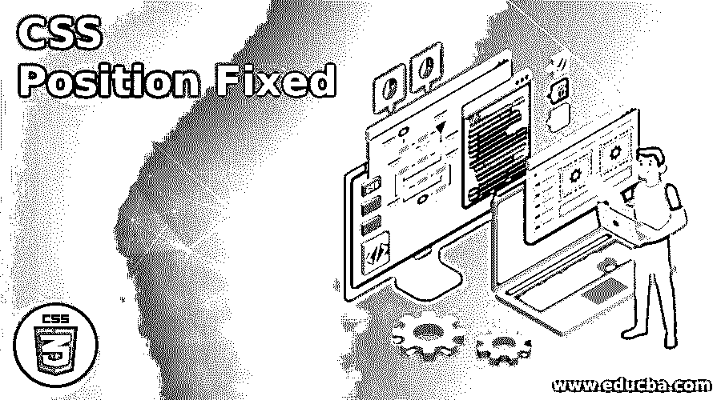
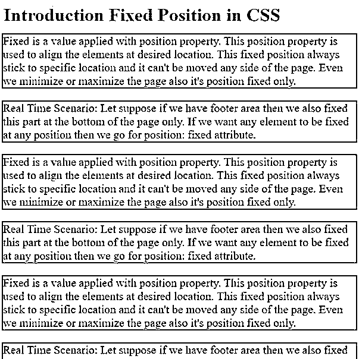
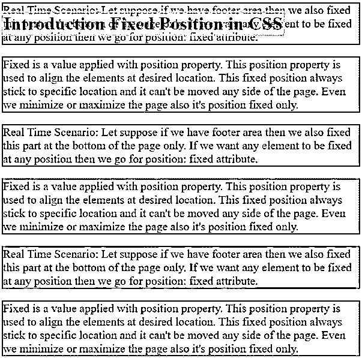
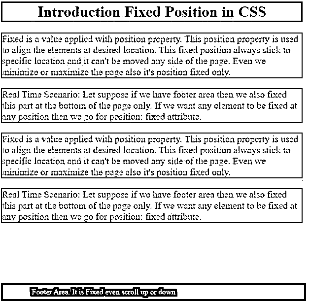
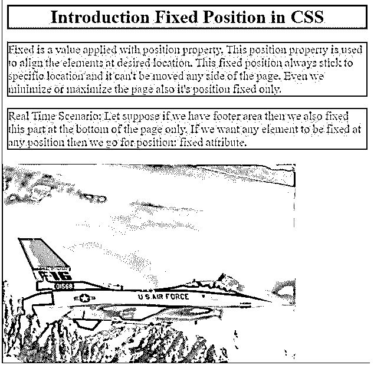

# CSS 位置固定

> 原文：<https://www.educba.com/css-position-fixed/>




## CSS 简介定位固定

在 CSS Position Fixed 中，Fixed 是应用了 Position 属性的值。此位置属性用于在所需位置对齐元素。这个固定位置总是固定在一个特定的位置，不能移动到页面的任何一边。即使我们最小化或最大化页面，它的位置也只是固定的。

**实时场景:**假设我们有一个页脚区，那么我们也只在页面底部固定这个部分。如果我们想要任何元素被固定在任何位置，那么我们选择位置:固定属性

<small>网页开发、编程语言、软件测试&其他</small>

### 职位固定是如何工作的？

固定值总是与位置属性一起应用。这个固定值将任何 HTML 元素固定在一个固定的位置，即使我们向上或向下滚动页面。

**代码:**

```
element
{
position: fixed;
}
```

### 例子

下面是提到的一些例子:

#### 示例#1

标题固定位置

**代码:**

```
<!DOCTYPE html>
<html>
<head>
<style>
h1 {
position: fixed;
border: 3px solid pink;
}
p
{
color: green;
border: 2px solid gray;
font-size: 20px;
}
h1
{
color: blue;
}
</style>
</head>
<body>
<h1>Introduction Fixed Position in CSS</h1>
<br>
<br>
<br>
<p>Fixed is a value applied with position property. This position property is used to align the elements at desired location. This fixed position always stick to specific
location and it can't be moved any side of the page. Even we minimize or maximize the page also it's position fixed only.</p>
<p>Real Time Scenario: Let suppose if we have footer area then we also fixed this part at the bottom of the page only. If we want any element to be fixed at any position then
we go for position: fixed attribute.</p>
<p>Fixed is a value applied with position property. This position property is used to align the elements at desired location. This fixed position always stick to specific
location and it can't be moved any side of the page. Even we minimize or maximize the page also it's position fixed only.</p>
<p>Real Time Scenario: Let suppose if we have footer area then we also fixed this part at the bottom of the page only. If we want any element to be fixed at any position then
we go for position: fixed attribute.</p>
<p>Fixed is a value applied with position property. This position property is used to align the elements at desired location. This fixed position always stick to specific
location and it can't be moved any side of the page. Even we minimize or maximize the page also it's position fixed only.</p>
<p>Real Time Scenario: Let suppose if we have footer area then we also fixed this part at the bottom of the page only. If we want any element to be fixed at any position then
we go for position: fixed attribute.</p>
<p>Fixed is a value applied with position property. This position property is used to align the elements at desired location. This fixed position always stick to specific
location and it can't be moved any side of the page. Even we minimize or maximize the page also it's position fixed only.</p>
<p>Real Time Scenario: Let suppose if we have footer area then we also fixed this part at the bottom of the page only. If we want any element to be fixed at any position then
we go for position: fixed attribute.</p>
</body>
</html>
```

**输出:**

向下滚动前:




向下滚动后:




#### 实施例 2

页脚固定位置

**代码:**

```
<!DOCTYPE html>
<html>
<head>
<style>
h1 {
border: 3px solid brown;
}
p
{
color: fuchsia;
border: 2px solid red;
font-size: 20px;
}
h1
{
color: blue;
text-align: center;
}
.container{
width: 80%;
margin: 0 auto;
}
.fixed-header, .fixed-footer{
width: 100%;
background: black;
padding: 10px 0;
color: white;
position: fixed;
}
.fixed-footer{
bottom: 0;
}
</style>
</head>
<body>
<h1>Introduction Fixed Position in CSS</h1>
<p>Fixed is a value applied with position property. This position property is used to align the elements at desired location. This fixed position always stick to specific
location and it can't be moved any side of the page. Even we minimize or maximize the page also it's position fixed only.</p>
<p>Real Time Scenario: Let suppose if we have footer area then we also fixed this part at the bottom of the page only. If we want any element to be fixed at any position then
we go for position: fixed attribute.</p>
<p>Fixed is a value applied with position property. This position property is used to align the elements at desired location. This fixed position always stick to specific
location and it can't be moved any side of the page. Even we minimize or maximize the page also it's position fixed only.</p>
<p>Real Time Scenario: Let suppose if we have footer area then we also fixed this part at the bottom of the page only. If we want any element to be fixed at any position then
we go for position: fixed attribute.</p>
<div class="fixed-footer">
<div class="container">Footer Area. It is Fixed even scroll up or down</div>
</div>
</body>
</html>
```

**输出:**




#### 实施例 3

图像固定位置

**代码:**

```
<!DOCTYPE html>
<html>
<head>
<style>
h1 {
border: 3px solid brown;
}
.static {
top: 300px;
left: 0;
width: 100px;
height: 80%;
position: fixed;
}
p
{
color: fuchsia;
border: 2px solid red;
font-size: 20px;
}
h1
{
color: blue;
text-align: center;
}
</style>
</head>
<body>
<h1>Introduction Fixed Position in CSS</h1>
<p>Fixed is a value applied with position property. This position property is used to align the elements at desired location. This fixed position always stick to specific
location and it can't be moved any side of the page. Even we minimize or maximize the page also it's position fixed only.</p>
<p>Real Time Scenario: Let suppose if we have footer area then we also fixed this part at the bottom of the page only. If we want any element to be fixed at any position then
we go for position: fixed attribute.</p>
<div class="static">

</div>
</body>
</html>
```

**输出:**




### 结论

固定位置用于将元素固定在任何特定位置。一旦我们修复了 HTML 元素，即使我们向上或向下滚动页面，它也不能移动。

### 推荐文章

这是一个 CSS 定位指南。这里我们讨论 CSS 位置固定的介绍，它是如何工作的，以及代码和输出的例子。您也可以浏览我们的其他相关文章，了解更多信息——

1.  [CSS 剪辑](https://www.educba.com/css-clip/)
2.  [CSS 覆盖图](https://www.educba.com/css-overlay/)
3.  [CSS 位置](https://www.educba.com/css-position/)
4.  [CSS 表格样式](https://www.educba.com/css-table-styling/)


