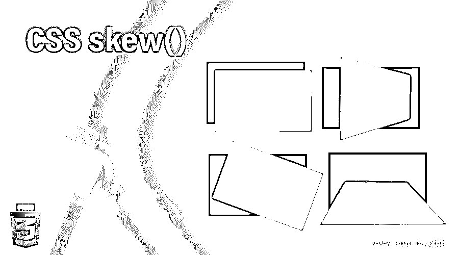
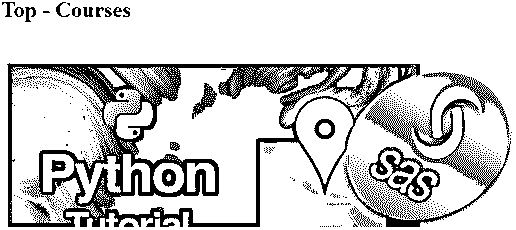
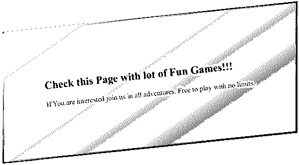
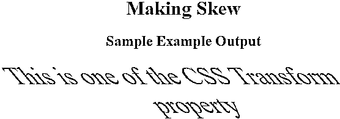

# CSS 倾斜()

> 原文：<https://www.educba.com/css-skew/>




## CSS 偏斜介绍()

CSS skew()函数被定义为具有内置函数的 CSS3 的 Transform 属性，该函数允许使用一些参数在二维平面中倾斜一个元素，它在任意轴上选取一个点，并在不同的方向上拉动它(它倾斜一个元素)。换句话说，倾斜或剪切变换允许改变元素的外观，如倾斜它(用 x 和 y 轴改变或弯曲相应的元素)。这个 CSS3 转换使用 4 * 4 矩阵来表示。这个 skew()沿着任意边拖动它的线来扭曲一个元素。

**语法**

<small>网页开发、编程语言、软件测试&其他</small>

由于没有关于方向的特定声明，所以语法很好，一般语法如下所示:

```
skew(ax, ay)
```

对于 Transform 属性，语法如下所示:

```
Transform: skew (<angle degree> [, <angle>]?);
```

例如，如果样本是这样的:

```
.class
{skew(-45 deg, 20 deg);
}
```

所以这个声明说它倾斜了元素，水平方向 45 度，也就是 x 轴的角度，垂直方向 20 度，沿着平面的 Y 轴。

它采用两个参数 ax 和 ay 作为角度值。这里 ax 是默认值，该值是为 Y 轴提供的。如果没有提供值，则假设值为零。这种 2D 倾斜会在任一方向上扭曲元素，它们的距离值以度为单位计算。这里避免了像百分比和像素这样的其他度量。

*   **ax:** 该参数沿 X 轴倾斜元素，即沿边倾斜。
*   **ay:** 该参数沿 Y 轴倾斜元素，意思是垂直地向相反的方向倾斜。

在这里，被赋予度数的值表示将元素向左移动的正值和向右移动的负值。由此，通过使用倾斜来倾斜原始图像。它看起来像背景中的镜像。

### CSS 中的 skew()方法是如何工作的？

到目前为止，在以前的文章中，我们已经看到了 CSS 允许应用文本颜色等概念。CSS 也转化了一系列的函数来帮助塑造一个元素。转换属性的一种类型是 skew()。这个 skew()函数有助于倾斜给定的文本或某个元素。有 X 轴和 Y 轴两个轴。这里，X 轴倾斜被设置为默认值，Y 轴倾斜被设置为给定的度数。要在两个方向上都倾斜，我们必须在 transform 属性中使用 skewX \()和 skewY()函数。

| **Sr 号** | **偏斜函数示例** | **描述** |
| 1. | 变换:skewY(-20 度)； | 将值向负 Y 方向倾斜。 |
| 2. | transform:skewX(-20 度)； | 在 X 轴正方向倾斜数值。 |
| 3. | 变换:倾斜(30 度，30 度)； | 它向两个方向倾斜。它说第一个值代表“x”值，第二个值代表“Y 轴”。 |
| 4. | 变换:倾斜(45 度)； | 这里我们有一个值，所以它被认为是 x 值，y 值被设置为默认值零 |

**Note:** skew() function can take negative values and larger values as well with the angle degree. The important thing to be noted is if it is set to 90 degrees an element vanishes its appearance as their two parallel sides touch together and become a long image. And 190 deg and 10 deg are of same. The value greater than 90 deg less than 180 deg appears as a mirror image.

### 实现 CSS skew()的示例

在本节中，我们将看到这个函数的例子。

#### 示例#1

在这个例子中，我使用属性转换将元素向负方向倾斜。

**代码:**

```
<!DOCTYPE html>
<html>
<head>
<style>
.original_pic {
transform: translate(10px, 12%);
}
.after_skew {
transform-origin: top right;
transform: skew(-0.11turn, 30deg);
}
</style>
</head>
<body>
<h1>Top - Courses</h1>


</body>
</html>
```

**输出:**




#### 示例# 2-**倾斜旋转**

**a)new.html**

```
<html>

<div class="bgm">
<h1> <b>Check this Page with lot of Fun Games!!!</b></h1>
<p>If You are interested join us in all adventures. Free to play with no limits.</p>
</div>

</html>
```

**b)new.css**

```
content {
background-image: linear-gradient(150deg, yellow, red);
padding: 6rem;
transform: rotate(-6deg) skew(-6deg);
margin-top: 6rem;
}
.bgm {
transform: skew(6deg);
}
```

**输出:**




#### 示例 3–倾斜文本

```
<!DOCTYPE html>
<html>
<head>
<title> skew()function with text</title>
<style>
body {
text-align:center;
}
h1 {
color:purple;
}
.Text {
font-size:40px;
font-weight:italic;
color:red;
transform: skew(40deg);
}
</style>
</head>
<body>
<h1> Making Skew</h1>
<h2> Sample Example Output</h2>
<div class="Text">This is one of the CSS Transform property</div>
</body>
</html>
```

**输出:**




#### 示例# 4–一侧倾斜–使用伪元素

**a)oneside.css**

```
a {
color: yellow;
}
.oneside {
position: absolute;
width: 130px;
padding: 12px 30px 12px 12px;
font-size: 15px;
position: relative;
color: #e300ff;
background: #00ff00;
}
.oneside:after {
content: " ";
position: absolute;
display: block;
width: 120%;
height: 120%;
top: 1;
left: 1;
z-index: -1;
background: #FF0000;
transform-origin: left bottom;
-ms-transform: skew(-35deg, 0deg);
-webkit-transform: skew(-35deg, 0deg);
transform: skew(-35deg, 0deg);
}
```

**b)oneside.html**

```
<html>
<div class="oneside">
<a href="#">Scandivian Country</a>
</div>
</html>
```

**输出:**


### 结论

这就是 CSS 转换偏斜函数。为了在设计中引入一些角度，这个 Skew()函数是在 CSS 中使用的一个小技巧，它没有添加对 web 开发人员非常有帮助的空白特性。当然，这个 CSS Skew()函数有一些令人兴奋和酷的东西可以使用。

### 推荐文章

这是 CSS skew()的指南。这里我们讨论 skew() css 如何使用适当的语法和相应的例子。您也可以浏览我们的其他相关文章，了解更多信息——

1.  [CSS Clearfix](https://www.educba.com/css-clearfix/)
2.  [CSS 中心分区](https://www.educba.com/css-center-div/)
3.  [CSS 相对位置](https://www.educba.com/css-position-relative/)
4.  [CSS 线条高度](https://www.educba.com/css-line-height/)


