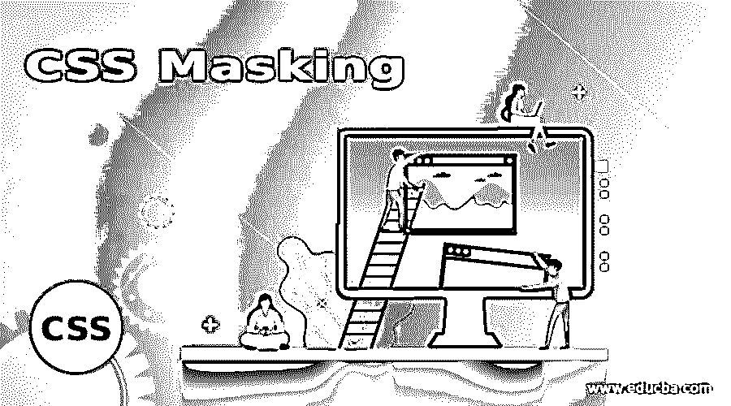
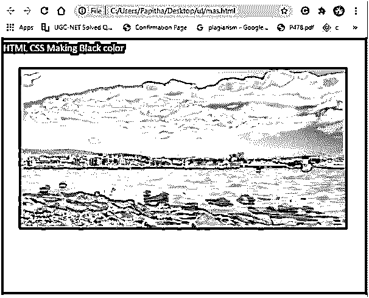
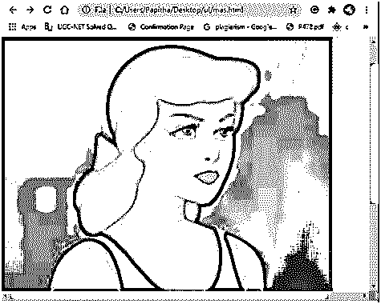

# CSS 屏蔽

> 原文：<https://www.educba.com/css-masking/>




## CSS 遮罩介绍

CSS 遮罩定义为遮罩图像或元素，完全隐藏图像或图像的某些部分不可见，具有不同的不透明度。在 CSS 中，遮罩是使用 mask-image 属性执行的，当应用遮罩时，文本内容和背景都会被遮罩。这是一种图形操作，隐藏图像的一部分。它是可见的，通过这种方式，通过面具的背景将像画。这个遮罩可以应用于 HTML 和 SVG 图像，并且这些元素可以有多个层。

**语法:**

<small>网页开发、编程语言、软件测试&其他</small>

一般语法如下所示:

有了这个 CSS，就可以使用#mask Id 找到掩码。

```
mask-image: <mask-reference>
```

其中，屏蔽-参考是 img 或屏蔽源。#标记表示由逗号分隔的任意数量的掩码引用。多个图像遵循堆栈属性规则。

### CSS 中的遮罩是如何工作的？

被遮罩的图像被用作某种颜色模糊或通过使用滤镜来遮罩元素的属性。这种遮蔽部分隐藏了视觉元素。在 PNG、CSS gradient 和少数 SVG 等文件中执行遮罩，以隐藏图像的一些部分或隐藏页面中的另一个元素，这是通过 CSS mask-property 完成的。

使用这种蒙版技术，网页设计变得有趣而灵活，不需要手动改变图像或创建新的图像。我们在这里使用一些属性，如蒙版图像、蒙版模式、蒙版重复、蒙版位置、蒙版剪辑、蒙版原点、蒙版尺寸。因此，该掩码要么应用于整个元素，要么有时不包括边框填充。

**1。mask-image 属性:**通过用一个 URL 值来设置图像元素中的层。因此这可以作为要被遮罩的图像文件的路径。我们需要一个将被屏蔽的图像链接文件。可以添加任意数量的蒙版图像层，并用逗号分隔。示例:以下示例引用了 PNG 文件。

```
masked-element {
mask-image: url(pic.png);
}
```

要设置多个蒙版图像层，我们需要两个 URL 值。这里我们看到两个面具是如何结合的。

```
.double mask {
mask-image: url(pic.png),url(pic.png);
}
```

接下来使用梯度图像，这是非常适合这个属性

```
. masked-element {
mask-image: linear-gradient (black 0%,  white 0%,transparent 100%);
}
```

**2。mask-size:** 在这里设置像素值。这是创造效果的一个重要案例。

**3。蒙版-重复:**这有不同的效果，像空间，圆形到遍布整个区域。它只有一个面具。

### CSS 遮罩的类型

有两种类型的面具。它们是:

1.  亮度
2.  希腊字母的第一个字母

**亮度掩蔽:**在这种类型中，图像被转换成灰度类型。如果面具的一部分较亮，面具的更多部分是可见的。黑色表示完全透明，灰色表示部分透明。

**Alpha 蒙版:** Alpha 是默认蒙版。除了元素的不透明部分之外，这与亮度遮罩相同。在这两种情况下，透明度都很重要。

### 实现 CSS 屏蔽的示例

在这一节中，我们将讨论如何显示 CSS 屏蔽功能。建议使用浏览器 chrome。

#### 示例#1

展示渐变和文本蒙版示例的演示

**代码:**

**mas.css**

```
body {
color: yellow;
font-size: 1.2em;
font-family: 'calibri', Helvetica, Arial, sans-serif;
}
p {
padding: 1.2em;
color: white;
}
.advent {
margin: 21px auto;
max-width: 660px;
height: 300px;
margin: 32px auto;
overflow-y: scroll;
background: url(floral1.png) no-repeat;
-webkit-mask-image: linear-gradient(black, transparent);
mask-image: linear-gradient (black, transparent);
}
```

**mas.html**

**代码:**

```
<html>
<head>
<link rel="stylesheet" href="mas.css">
</head>
<body>
<div class="advent">
<p>
Russia has natural beauty on nature which has a list of travel destinations around them. They too celebrate a nature protection day. Russia has majestic lakes, mountains and rivers.
</p>
<p>
Russia has natural beauty on nature which has a list of travel destinations around them. They too celebrate a nature protection day. Russia has majestic lakes, mountains and rivers.
<p>
Russia has natural beauty on nature which has a list of travel destinations around them. They too celebrate a nature protection day. Russia has majestic lakes , mountains and rivers.
</p>
<p>
Russia has natural beauty on nature which has a list of travel destinations around them.They too celebrate a nature protection day. Russia has majestic lakes , mountains and rivers.
</p>
</div>
</body>
</html>
```

**输出:**


#### 实施例 2

借助边框进行遮罩。

**代码:**

```
<html>
<head>
<link rel="stylesheet" href="mas.css">
</head>
<body>
HTML CSSResult
EDIT ON


</body>
</html>
```

**mas.css**

**代码:**

```
img {
width: 300px;
margin: 30px;
}
.normask {
mask: url("floral1.png");
}
.bordmask {
-webkit-mask-box-image: url("floral1.png") 20 repeat;
mask-border: url("floral1.png") 20 repeat;
}
body {
transform-origin: top right;
transform: scale(0.8);
white-space: nowrap;
overflow: hidden;
}
```

左边是原图。右侧显示了两个图像是如何被遮罩的。

**输出:**


#### 实施例 3

这个实现展示了对图像应用蒙版。这里使用的遮罩是 alpha。所以黑色区域充满了图像。

**代码:**

```
body {
background-color: black;
color: pink;
font-size: 1.2em;
font-family: 'Calibri', Helvetica, Arial, sans-serif;
}
img {
margin: 30px auto;
display: block;
width: 90%;
height: 300px;
-webkit-mask-image: url(https://images.pexels.com/photos/1040499/pexels-photo-1040499.jpeg?auto=compress&cs=tinysrgb&dpr=2&h=650&w=940);
mask-image: url(https://images.pexels.com/photos/1040499/pexels-photo-1040499.jpeg?auto=compress&cs=tinysrgb&dpr=2&h=650&w=940);
-webkit-mask-position: centercenter;
mask-position: centercenter;
-webkit-mask-repeat: no-repeat;
mask-repeat: no-repeat;
}
```

**mask2.html**

**代码:**

```
<html>
<head>
<link rel="stylesheet" href="mas.css">
</head>
<body>
HTML CSS Making Black color

</body>
</html>
```

**输出:**




#### 实施例 4

使用遮罩拉伸图像。

**代码:**

**ppp.html**

```
<html>
<head>
<link rel="stylesheet" href="mas.css">
</head>
<body>
<h1> CSS MASK demo </h1>
<div class="stretch">
<div class="exmask">
CSS MASK demo
</div>
</div>
<div class="para"></div>
</body>
</html>
```

**mas.css**

**代码:**

```
body {
width:100%;
margin:0;
}
.stretch {
width: 90%;
height:100vh;
background: url("cind.png");
background-size: cover;
position: absolute;
}
.para {
width: 110%;
height: 150vh;
}
.title {
font-family: Impact, 'Arial Narrow Bold', sans-serif;
font-size: 300px;
color: white;
position: fixed;
top:21vh;
width:100%;
text-align: center;
text-shadow: 2px 2px 12px rgba(0,0.1,0,0.1);
}
.exmask {
mask:url("sketch.png");
mask-size: cover;
-webkit-mask:url("sketch.png");
-webkit-mask-size:cover;
width:100%;
height:100%;
}
```

**输出:**




### 结论

最后，本文介绍了在 CSS 中屏蔽对象的方法，这取决于目的。此外，我们已经看到了他们的属性和演示。并且当建立遮罩时，它们的边界属性和多个背景具有这种能力。

### 推荐文章

这是一个 CSS 遮罩的指南。在这里，我们讨论了 CSS 屏蔽及其各种类型的简要概述，以及示例和代码实现。您也可以浏览我们推荐的其他文章，了解更多信息——

1.  [CSS 在技术中的应用](https://www.educba.com/what-is-css/)
2.  [使用 CSS 命令的技巧和诀窍](https://www.educba.com/css-commands/)
3.  [CSS 的六大优势介绍](https://www.educba.com/advantages-of-css/)
4.  [CSS 页眉设计(示例)](https://www.educba.com/css-header-design/)


