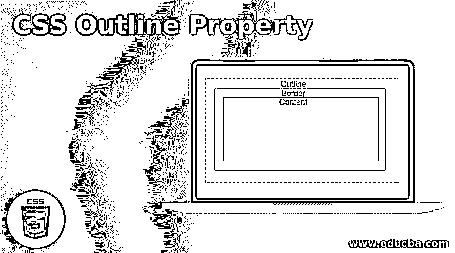
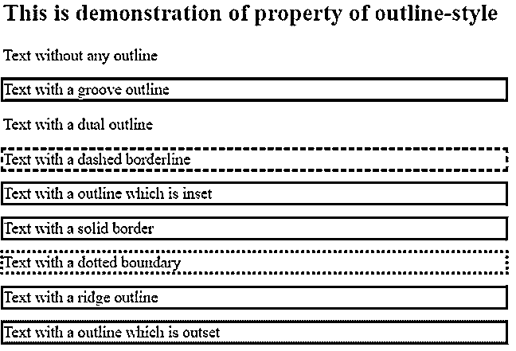
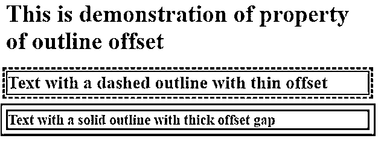

# CSS 大纲属性

> 原文：<https://www.educba.com/css-outline-property/>




## CSS 大纲属性的定义

CSS outline 属性帮助您使用 CSS 调整 HTML 页面元素轮廓的样式、宽度和颜色，CSS 基本上是元素边界区域外的一条线，使元素引人注目，这在您的网页设计中可能是必需的，以引起用户对该元素的注意。在本文中，我将通过一些插图向您介绍这些技术，您可以将这些技术放入代码中，这样您就可以创建一些具有所需轮廓的元素，使它们从 HTML 页面的其他元素中脱颖而出。

### 语法和参数

CSS outline 属性对于调整元素轮廓的样式和设计非常有用。CSS 在元素边界外的轮廓中拥有以下属性:轮廓样式、颜色、宽度和偏移量。

<small>网页开发、编程语言、软件测试&其他</small>

1.  轮廓样式定义了多种类型的轮廓类型:

凹槽、双点、虚线、内嵌、实线、虚线、脊形、外轮廓

**大纲样式的语法:**

```
body
{
outline-style:<name of style>;
}
```

2.  轮廓颜色定义轮廓的颜色

**轮廓颜色语法:**

```
body
{
outline-color:<name of color>;
}
```

3.  轮廓宽度定义轮廓的厚度

**轮廓宽度语法:**

```
body
{
outline-width:<value of thickness>;
}
```

4.  轮廓偏移定义元素的边框和轮廓之间的间隙

**轮廓偏移语法:**

```
body
{
outline-offset:<value of offset>;
}
```

### CSS 中的 Outline 属性是如何工作的？

我们需要利用 HTML 中 CSS 的基本语法来放置 CSS 大纲参数的属性，以实现所需的大纲样式。

在下一节中，我将展示许多例子，这些例子将涵盖在 HTML 代码中演示 CSS 的所有大纲属性的每个方面。为了更实际的理解，你应该自己动手去做。

### CSS 大纲属性的示例

以下是 css 大纲属性的示例:

#### 示例#1

在第一个例子中，我将用许多大纲样式的例子来说明。在输出部分，您将能够看到如何使用 CSS outline style 属性的各种值，根据自己的选择实现不同的设计大纲样式。如果在代码中引用内联注释，你会更容易理解。

**代码:**

```
<!DOCTYPE html>
<html>
<head>
<style>
p.groove {outline-style: groove;} //defining many outline styling
p.double {outline-style: double;}
p.dashed {outline-style: dashed;}
p.inset {outline-style: inset;}
p.solid {outline-style: solid;}
p.dotted {outline-style: dotted;}
p.ridge {outline-style: ridge;}
p.outset {outline-style: outset;}
</style>
</head>
<body>
<h2>This is demonstration of property of outline-style</h2>
<p>Text without any outline</p>
<p class="groove">Text with a groove outline</p>
<p class="double">Text with a dual outline</p>
<p class="dashed">Text with a dashed borderline</p>
<p class="inset">Text with a outline which is inset</p>
<p class="solid">Text with a solid border</p>
<p class="dotted">Text with a dotted boundary</p>
<p class="ridge">Text with a ridge outline</p>
<p class="outset">Text with a outline which is outset</p>
</body>
</html>
```

**输出:**




#### 实施例 2

有时，一个元素的轮廓也需要根据设计进行着色，这样页面看起来更吸引人，更吸引眼球。在第二个场景中，我们将看到一些轮廓着色的插图。我们在这里展示了如何借助 CSS outline 属性为 HTML 页面中的元素轮廓添加不同的颜色。

**代码:**

```
<!DOCTYPE html>
<html>
<head>
<style>
h3
{
outline-style:solid;
outline-color:blue; //defining many outline coloring
}
h2
{
outline-style:dashed;
outline-color:green;
}
</style>
</head>
<body>
<h1>This is demonstration of property of outline color</h1>
<h2>Text with a colored dashed outline</h2>
<h3>Text with a colored solid outline</h3>
</body>
</html>
```

**输出:**


看看上面的输出。虚线轮廓为绿色，实线轮廓为蓝色。想想一个元素的轮廓颜色是如何使它在 HTML 页面中与其他元素一起突出显示，从而吸引用户的。

#### 实施例 3

默认情况下，有一个与轮廓相关联的厚度值。但是在这里，CSS 给了你充分的灵活性来根据你的需要改变它。在这个例子中，我将演示如何根据需要调整轮廓的边框厚度。如果某些元素需要用粗边框括起来，以便作为网页的重要部分吸引用户的注意，这将非常有用。

**代码:**

```
<!DOCTYPE html>
<html>
<head>
<style>
h3
{
outline-width:2px;  //defining many outline width
outline-style:solid;
}
h2
{
outline-width:9px;
outline-style:dashed;
}
</style>
</head>
<body>
<h1>This is demonstration of property of outline width</h1>
<h2>Text with a thick  dashed outline</h2>
<h3>Text with a thin  solid outline</h3>
</body>
</html>
```

**输出:**


看看上面的输出。与宽度较窄的实线轮廓相比，虚线轮廓的宽度较宽。

#### 实施例 4

最后但同样重要的是偏移值。偏移定义元素的边框和轮廓之间的间隙。这里，我们已经展示了如何根据需要增加或减少边框和轮廓之间的间隙。我们有不同值的彩色边框和轮廓，以便于识别它们之间的差距。

**代码:**

```
<!DOCTYPE html>
<html>
<head>
<style>
h3
{
border:solid red 3px;
outline-style:solid;
outline-offset:6px; //defining many outline offset values
}
h2
{
border:solid red 2px;
outline-offset:2px;
outline-style:dashed;
}
</style>
</head>
<body>
<h1>This is demonstration of property of outline offset</h1>
<h2>Text with a dashed outline with thin offset </h2>
<h3>Text with a solid outline with thick offset gap</h3>
</body>
</html>
```

**输出:**




仔细看看上面的输出。虚线轮廓与其边框的间隙较小，而实线轮廓与其边框的间隙较大。

### 结论

关于“CSS 大纲属性”的主题在这里得到了一个结论。在这个主题中，我们已经给出了很多例子，这些例子表明了那些可以通过使用前端 HTML 页面的 CSS 编码的许多轮廓特征的值的机制。这篇文章可以被认为是对那些有兴趣在前端网页开发中使用 CSS 设计 HTML 页面样式的编码人员的一种。

### 推荐文章

这是一个 CSS 大纲属性的指南。在这里，我们还将讨论 css 中大纲属性的定义和工作原理。以及一个不同的示例及其代码实现。您也可以看看以下文章，了解更多信息–

1.  [CSS 行](https://www.educba.com/css-row/)
2.  [CSS 分页](https://www.educba.com/css-page-break/)
3.  [CSS 内容属性](https://www.educba.com/css-content-property/)
4.  [CSS 背景色](https://www.educba.com/css-background-color/)


