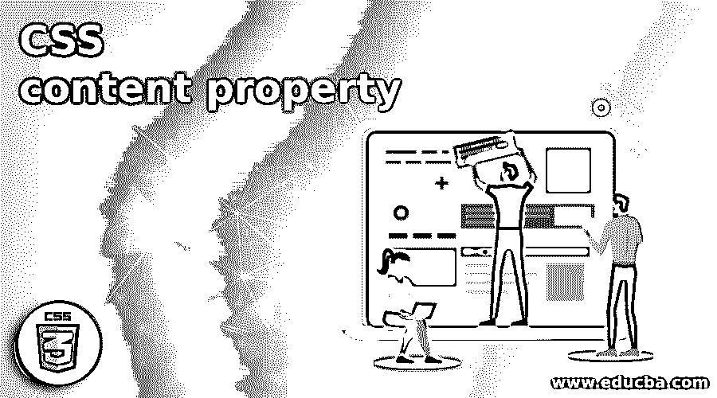
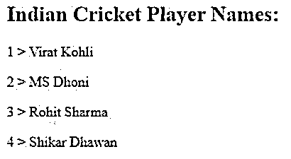

# CSS 内容属性

> 原文：<https://www.educba.com/css-content-property/>




## CSS 内容属性介绍

下面的文章提供了 CSS 内容属性的概要。content 属性将用于::before 和::after 伪元素，以添加创建的内容。它被定义为一个伪选择器(带有冒号)，但它被认为是一个伪元素，因为它并不真正选择页面上的某些内容，而是添加一些不同的内容。简单地说，这个属性可以用来改变 HTML 标签中的文本。所有现代浏览器都用伪元素:after/:before 来认可 CSS 内容。这里重要的是，JavaScript 不能使用，但也有其他方法来完成某个结果。

**语法和属性:**

<small>网页开发、编程语言、软件测试&其他</small>

下面给出了 CSS 内容属性的语法:

```
content:normal|counter|attr|string|open-quote|close-quote|no-open-quote|no-close-quote|url|initial|inherit;
```

下面给出了 CSS 内容属性的属性列表:

*   **正常:**默认值，如果内容属性指定为正常，则定义内容。
*   **counter:** 创建的文本已经是名称的最内层计数器的值，它指定了作用域中的伪元素。
*   **attr:** 它将用于添加指定属性的值。如果没有属性，则返回空字符串。
*   **字符串:**它有助于将文本设置为您定义的内容。
*   **开盘价:**帮助设置内容的开盘价。
*   **结束引用:**它有助于为内容设置结束引用。
*   **无左引号:**如果指定，从内容中删除左引号。
*   **无结束引号:**如果指定，从内容中删除结束引号。
*   **url:** 帮助将内容设置为某种形式的媒体，如图片、声音、视频等。
*   **initial:** 这个属性可以被它的父元素继承。
*   **继承:**定义默认属性值。

### 内容属性在 CSS 中是如何工作的？

内容属性在 CSS 中的工作方式如下:

*   该属性使用文本、数字、url 等等来根据 HTML 页面内部的需求修改内容。
*   它与::before 和::after 伪元素一起使用，可用于在网页中添加生成的内容。

### CSS 内容属性的示例

下面是提到的例子:

#### 示例#1

以下示例描述了 CSS 内容属性的用法。

**代码:**

```
<!DOCTYPE html>
<html lang="en">
<head>
<meta charset="utf-8">
<title> CSS content property example </title>
<style>
p:before {
content: "Introduction: ";
display: inline;
}
</style>
</head>
<body>
<p> Welcome to EDUCBA... !!! It is an online learning model along with amazing 2500+ courses prepared by top-notch professionals. </p>
</body>
</html>
```

**输出:**


上述示例显示了 string 属性的使用，该属性将内容设置为字符串，可以是任何文本内容。

#### 实施例 2

**代码:**

```
<!DOCTYPE html>
<html lang="en">
<head>
<meta charset="utf-8">
<title> CSS content property example </title>
<style>
p::before {
content: "Hello World... Welcome ";
}
a::before {
content: initial;
}
</style>
</head>
<body>
<p> to EDUCBA... </p>
<p id = "a"> you to the online learning model... </p>
</body>
</html>
```

**输出:**


上面的示例使用 initial property 将 property 设置为默认值。这可以与任何 CSS 属性和任何 HTML 元素一起使用。

#### 实施例 3

**代码:**

```
<!DOCTYPE html>
<html lang="en">
<head>
<meta charset="utf-8">
<title> CSS content property example </title>
<style>
a::after {
content: attr(href);
}
</style>
</head>
<body>
<p> Welcome to EDUCBA... </p>
<a href= "https://www.educba.com/about-us/">
Click this link to visit website...
</a>
</body>
</html>
```

**输出:**


上述示例使用 attr 属性提供 HTML 元素属性的值，并使用(name)定义与属性名称匹配的字符串。

#### 实施例 4

**代码:**

```
<!DOCTYPE html>
<html lang="en">
<head>
<meta charset="utf-8">
<title> CSS content property example </title>
<style>
p::before {
content: open-quote;
}
</style>
</head>
<body>
<p> Welcome to EDUCBA... </p>
</body>
</html>
```

**输出:**


上面的例子使用了左引号属性，它用属性引号插入了指定的字符串。当您设置该属性时，它将生成左引号。

#### 实施例 5

**代码:**

```
<!DOCTYPE html>
<html lang="en">
<head>
<meta charset="utf-8">
<title> CSS content property example </title>
<style>
.myclass::after {
content: close-quote;
}
.myclass::before {
content: open-quote;
}
</style>
</head>
<body>
<p class="myclass"> Welcome to EDUCBA... </p>
</body>
</html>
```

**输出:**


上面的示例使用了左引号和右引号属性，这些属性使用属性引号插入指定的字符串。当您设置这些属性时，它们将生成左引号和右引号。

#### 实施例 6

**代码:**

```
<!DOCTYPE html>
<html lang="en">
<head>
<meta charset="utf-8">
<title> CSS content property example </title>
<style>
.myclass::before {
content: open-quote;
}
.myclass::before {
content: no-open-quote;
}
</style>
</head>
<body>
<p class="myclass"> Welcome to EDUCBA... </p>
</body>
</html>
```

**输出:**


上面的示例使用了 no-open-quote 属性，该属性从指定的元素中删除了左引号。

#### 实施例 7

**代码:**

```
<!DOCTYPE html>
<html lang="en">
<head>
<meta charset="utf-8">
<title> CSS content property example </title>
<style>
.myclass::before {
content: open-quote;
}
.myclass::after {
content: no-close-quote;
}
</style>
</head>
<body>
<p class="myclass"> Welcome to EDUCBA... </p>
</body>
</html>
```

**输出:**


上面的示例使用了 no-close-quote 属性，该属性从指定的元素中删除了右引号。

#### 实施例 8

**代码:**

```
<!DOCTYPE html>
<html lang="en">
<head>
<meta charset="utf-8">
<title> CSS content property example </title>
<style>
.players {
counter-increment: IndexValue;
}
.players::before {
content: counter(IndexValue) " > ";
}
</style>
</head>
<body>
<h2> Indian Cricket Player Names: </h2>
<p class="players"> Virat Kohli </p>
<p class="players"> MS Dhoni</p>
<p class="players"> Rohit Sharma </p>
<p class="players"> Shikar Dhawan </p>
</body>
</html>
```

**输出:**




上面的示例使用了 counter 属性，其中 content 将是已命名的 counter 的值，并通过递增每个值来按顺序显示这些值。

### 结论

到目前为止，我们已经看到了 CSS 内容属性，它帮助您很好地了解 CSS 内容属性的每个值，以及如何在许多场景中使用它们。它被称为伪元素，因为它通常不选择页面上的任何内容，而是给文档带来一些新的东西。

### 推荐文章

这是一个 CSS 内容属性的指南。这里我们分别讨论 CSS 内容属性的介绍，这个属性是如何与编程实例一起工作的。您也可以看看以下文章，了解更多信息–

1.  [CSS 中的径向梯度](https://www.educba.com/radial-gradient-in-css/)
2.  [CSS 字母间距](https://www.educba.com/css-letter-spacing/)
3.  [CSS 动画过渡](https://www.educba.com/css-animation-transition/)
4.  [CSS 根](https://www.educba.com/css-root/)


