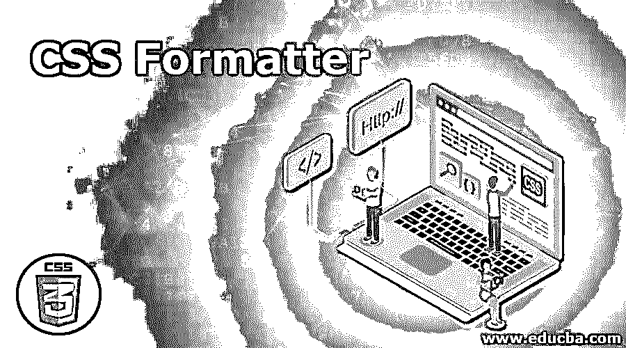
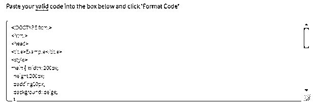
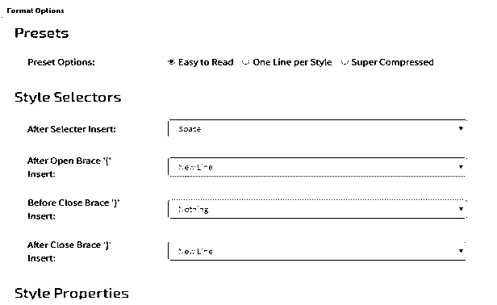
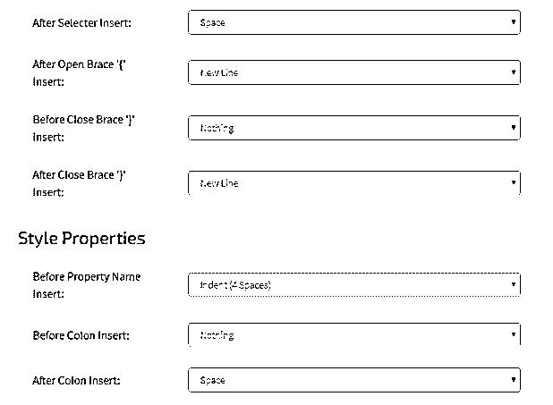
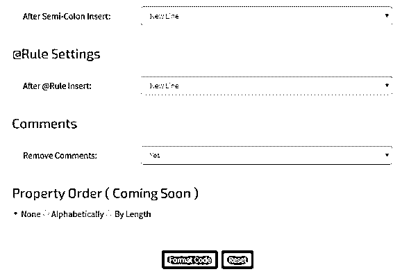

# CSS 格式化程序

> 原文：<https://www.educba.com/css-formatter/>




## CSS 格式化程序介绍

CSS formatter 是 CSS 中用于格式化 CSS 代码的工具之一。格式化程序也被称为美化 CSS 代码的工具。该工具有助于将 CSS 样式添加到代码中。这个过程非常简单，CSS 代码被粘贴到格式化程序中，你想要的代码被格式化或者样式化，然后你需要选择你想要它显示的代码类型的选项。这个工具用来格式化和美化你的代码。

### CSS 格式化程序的工作示例

在本文中，我们将演示 CSS formatter，这是一个在将代码粘贴到格式化程序后添加代码样式的工具。

<small>网页开发、编程语言、软件测试&其他</small>

CSS 文件用于格式化网页布局或内容中的元素。这个文件包含一个自定义的全局属性，允许显示 HTML 的元素。格式化的概念是完全不同的，与 CSS 函数无关。这种格式有助于轻松编写代码，也便于阅读，还有助于轻松导航等。由于有许多不同的选项，格式没有适当的间距和换行符语法规则。这可以从下面看出:

```
div      {         width:             50px               }
```

上面的语句类似于下面的其他语句

```
div{width : 50px}
```

或者

```
div
{
Width: 50px
}
```

上面的三个语句意思相同，功能相同，但是当我们将代码添加到格式化程序时，它可能会采用上面的任何一种方式，因为它依赖于不同的格式化程序。

有不同的格式化程序，其中一些是 AH formatter，它是一个软件程序，使用 CSS 将 XML 或 HTML 文档的任何代码转换为任何其他格式，如 PDF、SVG、XPS 等。另一个格式化程序，如 Cleancss.com，也是一个可以用来格式化代码的格式化程序。我们也可以在 notepad++中格式化代码。

#### 1.AH 格式化程序

在这个格式化程序中，它提供了很少的样式访问级别，这些级别用于设置 CSS 样式表的样式。这些级别是:它提供了文档默认样式，它还提供了广泛的样式表，这些样式表也可以应用于另一个样式表。它还提供了用于设计文档样式的布局命令。这个最新版本的格式化程序为代码的格式化提供了更好的支持，同时也满足了最新版本的 CSS 规范。

#### 2.在 notepad++中格式化 CSS

我们需要首先安装这种格式器，它需要在 notepad++中安装 JS 工具插件。然后安装后，它可以打开 JS 格式，并开始在 CSS 编码，它会格式化成 CSS 格式的混乱代码。

这也可以通过下载 JStoolnpp 插件来手动完成，并通过解压缩下载的文件来安装它。然后我们就可以进入 notepad++的插件选项卡，然后选择 JS 格式，将代码格式化为 CSS 格式。

让我们看一个简单的例子，我们粘贴代码来格式化代码，我们使用门户工具来提供不同的选项来样式化您的代码。

首先，我们需要粘贴在门户网站的空间给定的代码，这看起来像下面的截图。




其次，这个门户提供了不同的选项来样式化上面粘贴的代码，这可以通过这个门户提供的选项很容易地完成，这可以在下面的截图中看到。










我们可以在上面的截图中看到，门户提供了格式化 CSS 代码的选项。正如我们可以看到的格式选项一样，预置提供了“易于阅读”，“每种风格一行”，超压缩等选项。这也提供了一些样式选择器选项，比如你想在花括号之后、花括号之前等等。在这种情况下，它还提供了一些样式属性选项来格式化代码，比如在冒号前、冒号后、分号后插入什么，等等。这个门户还提供了一些规则设置，如是否插入新行、空格或无设置等。这也提供了像注释这样的选项，允许用户选择是否需要注释，或者你想从代码中删除注释，然后我们可以使用它。最后，在相应地编辑所有选项后，我们可以单击格式选项，或者如果我们想再次更改，我们可以单击重置，您可以编辑选项来格式化代码。

### 例子

我们提供了下面的代码来格式化它

```
<!DOCTYPE html>
<html>
<head>
/* This is a single-line comment */
<title>Example</title>
<style>
main {  width: 200px;
height 200px;
padding10px;
background: beige;
}
h1 {
font-family: fantasy, cursive, serif;
color: olivedrab;
border-bottom: 1px dotted darkgreen;
}
p {
font-family: sans-serif;
color: orange;
}
</style>
</head>
<body>
<main>
<h1>HTML Page</h1>
<p>This is a basic web page.</p>
</main>
</body>
</html>
```

因此，上述代码的格式如下，因为我们已选择删除上述代码中的注释，并格式化代码，格式化后的代码如下:

```
<!DOCTYPE html>
<html>
<head>
<title>Example</title>
<style> main {
width: 200px;
height 200px;
padding10px;
background: beige;
}
h1 {
font-family: fantasy, cursive, serif;
color: olivedrab;
border-bottom: 1px dotted darkgreen;
}
p {
font-family: sans-serif;
color: orange;
}
</style>
</head>
<body>
<main>
<h1>HTML Page</h1>
<p>This is a basic web page.</p>
</main>
</body>
</html>
```

### 结论

在本文中，我们看到了如何使用 CSS 格式化程序来格式化代码，使其易于阅读和理解，并提供 CSS 自定义样式，从而可以轻松设置任何元素布局的样式。我们已经看到不同的格式化程序提供了哪些选项。我们还看到了一个门户格式化程序中的代码格式化示例。这些格式化程序最适合将杂乱的 CSS 代码清理成一些有吸引力和可读性的 CSS 格式。

### 推荐文章

这是一个 CSS 格式化程序的指南。在这里，我们讨论 CSS 格式化程序的工作，并以 CSS 门户格式化程序中的代码格式化为例。您也可以看看以下文章，了解更多信息–

1.  [CSS 翻译](https://www.educba.com/css-translate/)
2.  [CSS 溢出](https://www.educba.com/css-overflow/)
3.  [CSS 颜色透明](https://www.educba.com/css-color-transparent/)
4.  [CSS 表格单元格填充](https://www.educba.com/css-table-cell-padding/)


