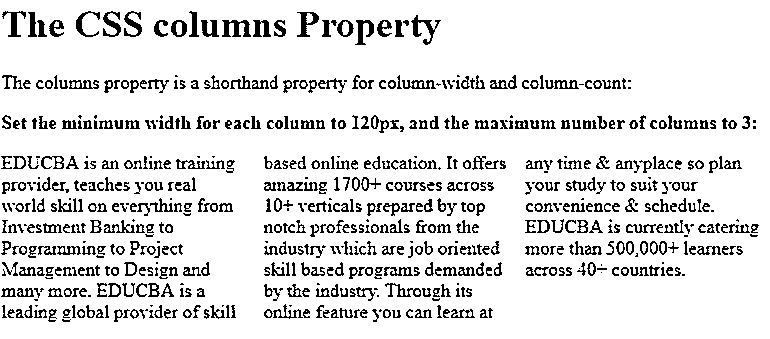
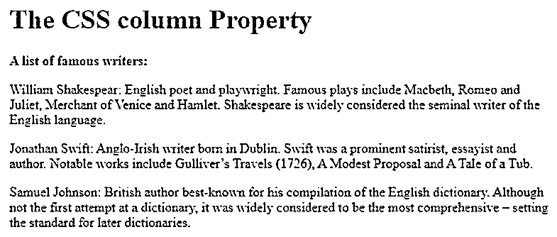
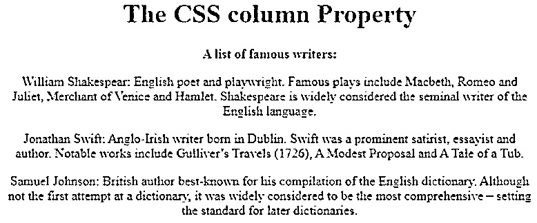
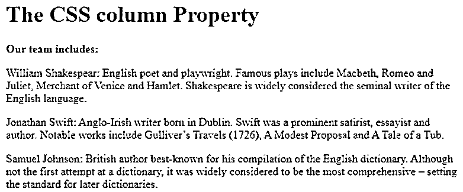

# CSS 列

> 原文：<https://www.educba.com/css-column/>


## CSS 专栏简介

以下文章提供了 CSS 专栏的概要。当我们想要设置一个元素中可以创建多少列或者如何设置列宽时，就会用到这个属性。这个属性也可以接受多个值，因为这也是 CSS 中的一个简写属性。在 CSS 中，column 属性有 column- count 和/或 column-width 作为 column 属性的其他子属性。这些子属性用于为元素创建灵活的多栏布局。column-count 属性用于设置最大列数，column-width 属性用于设置任何元素布局中每列的宽度。

### CSS 列属性的使用示例

column 属性是 CSS 的属性之一，用于设置最大列数，还可以使用 column 属性的子属性(如 column-count 和 column-width)设置每列的宽度。这两个属性用于多栏布局，可以使元素的布局更加灵活。还有其他一些列属性，如列填充、列跨度、列间距、列规则、内折等。以下不同版本的浏览器支持该列属性，如 Google Chrome、Edge、Firefox、Opera、Safari 等。

<small>网页开发、编程语言、软件测试&其他</small>

**列属性的语法:**

```
Column: column-width | column-count | auto | initial | inherit;
```

**举例:** **代号:**

```
<!DOCTYPE html>
<html>
<head>
<Title>Educba Training </Title>
<style>
.newspaper1 {
columns: 120px 3;
}
</style>
</head>
<body>
<h1>The CSS columns Property</h1>
<p>The columns property is a shorthand property for column-width and column-count:</p>
<p><strong>Set the minimum width for each column to 120px, and the maximum number of columns to 3:</strong></p>
<div class="newspaper1">
EDUCBA is an online training provider, teaches you real world skill on everything from Investment Banking to Programming to Project Management to Design and many more.
EDUCBA is a leading global provider of skill based online education. It offers amazing 1700+ courses across 10+ verticals prepared by top notch professionals from the industry which are job oriented skill based programs demanded by the industry. Through its online feature you can learn at any time & anyplace so plan your study to suit your convenience & schedule. EDUCBA is currently catering more than 500,000+ learners across 40+ countries.
</div>
</body>
</html>
```

**输出:**




在上面的程序中，我们可以看到我们将列宽指定为 120px，将列数指定为“3”。

#### 1.汽车

此属性设置由浏览器设置的默认值的列数和列宽。如果未指定列数或列宽，此属性指定浏览器给出的默认值。

**语法:**

```
column : auto auto;
```

**样本代码:**

```
<!DOCTYPE html>
<html>
<head>
<title>
Educba Training
</title>
<style>
body {
text-align: left;
color: blue;
}
.GFG {
-webkit-columns: auto auto;
-moz-columns: auto auto;
columns: auto auto;
}
</style>
</head>
<body>
<h1>The CSS column Property</h1>
<div class="GFG">
<p>
<strong>A list of famous writers:</strong>
<p>
William Shakespeare:  English poet and playwright. Famous
plays include Macbeth, Romeo and Juliet, Merchant of Venice
and Hamlet. Shakespeare is widely considered the seminal
writer of the English language.
</p>
<p>
Jonathan Swift: Anglo-Irish writer born in Dublin. Swift was
a prominent satirist, essayist and author. Notable works
include Gulliver’s Travels (1726), A Modest Proposal and A
Tale of a Tub.
</p>
<p>
Samuel Johnson: British author best-known for his
compilation of the English dictionary. Although not the
first attempt at a dictionary, it was widely considered to
be the most comprehensive – setting the standard for later
dictionaries.
</p>
</p>
</div>
</body>
</html>
```

**输出:**




在上面的程序中，我们已经用 auto value 指定了 column 属性，它将使用浏览器本身指定的缺省值来获取列数和列宽。

#### 2.最初的

此属性值将属性值初始化为初始默认值。

**语法:**

```
column: initial;
```

**样本代码:**

```
<!DOCTYPE html>
<html>
<head>
<title>
Educba Training
</title>
<style>
body {
text-align: center;
color: red;
}
.GFG {
-webkit-columns: initial initial;
-moz-columns: initial initial;
columns: initial initial;
}
</style>
</head>
<body>
<h1>The CSS column Property</h1>
<p>
<strong>A list of famous writers:</strong>
<p>
William Shakespeare:  English poet and playwright. Famous
plays include Macbeth, Romeo and Juliet, Merchant of Venice
and Hamlet. Shakespeare is widely considered the seminal
writer of the English language.
</p>
<p>
Jonathan Swift: Anglo-Irish writer born in Dublin. Swift was a prominent satirist, essayist and author. Notable works
include Gulliver’s Travels (1726), A Modest Proposal and A
Tale of a Tub.
</p>
<p>
Samuel Johnson: British author best-known for his
compilation of the English dictionary. Although not the
first attempt at a dictionary, it was widely considered to
be the most comprehensive – setting the standard for later
dictionaries.
</p>
</p>
</div>
</body>
</html>
```

**输出:**




在上面的程序中，我们可以看到列属性的值为 initial。该值将最初分配给列属性的值作为值。

#### 3.继承

当您希望将该值作为父元素时使用该值，然后我们可以将 value 指定为 inherit 的列属性，这样我们就可以从父元素继承该值。

**语法:**

```
column: inherit;
```

**样本代码:**

```
<!DOCTYPE html>
<html>
<head>
<title>
Educba Training
</title>
<style>
body {
text-align: left;
color: green;
}
.GFG {
-webkit-columns: inherit inherit;
-moz-columns: inherit inherit;
columns: inherit inherit;
}
</style>
</head>
<body>
<h1>The CSS column Property</h1>
<p>
<strong>Our team includes:</strong>
<p>
William Shakespeare: English poet and playwright. Famous plays include Macbeth, Romeo and Juliet, Merchant of Venice and Hamlet. Shakespeare is widely considered the seminal writer of the English language.
</p>
<p>
Jonathan Swift: Anglo-Irish writer born in Dublin. Swift was a prominent satirist, essayist and author. Notable works include Gulliver’s Travels (1726), A Modest Proposal and A Tale of a Tub.
</p>
<p>
Samuel Johnson: British author best-known for his compilation of the English dictionary. Although not the first attempt at a dictionary, it was widely considered to be the most comprehensive – setting the standard for later dictionaries.
</p>
</p>
</div>
</body>
</html>
</html>
```

**输出:**




在上面的程序中，我们可以看到我们指定为 inherit value 的列属性将它的父元素的值作为当前值。

### 结论

在本文中，我们得出结论，CSS 中的 column 属性用于指定或创建列中的文本，这是通过使用 column 属性来完成的，column 属性将 column-count 和 column width 作为该属性的最佳值。这些值有助于指定最大列数，也有助于指定每列的列宽。有些值，如 auto 采用浏览器指定的默认值，initial-采用初始默认值，inherit 采用该值作为其父元素的值。

### 推荐文章

这是一个 CSS 指南专栏。这里我们讨论 CSS 列的介绍和列属性的使用示例代码。您也可以看看以下文章，了解更多信息–

1.  [CSS 过渡效果](https://www.educba.com/css-transition-effects/)
2.  CSS 中的[按钮](https://www.educba.com/button-in-css/)
3.  [CSS 颜色图表](https://www.educba.com/css-color-chart/)
4.  [CSS 表格单元格填充](https://www.educba.com/css-table-cell-padding/)


