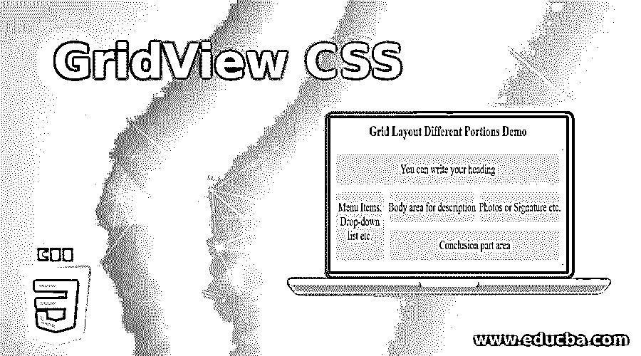
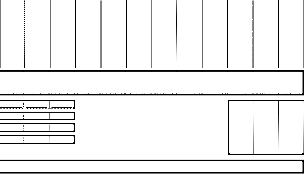
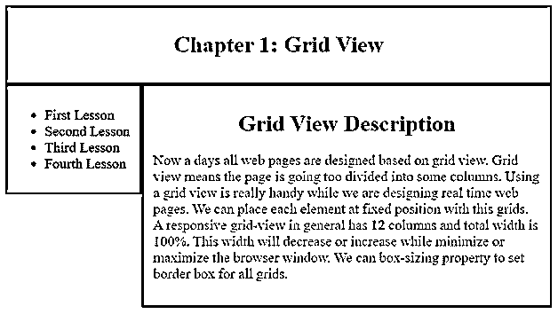
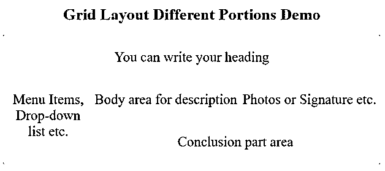
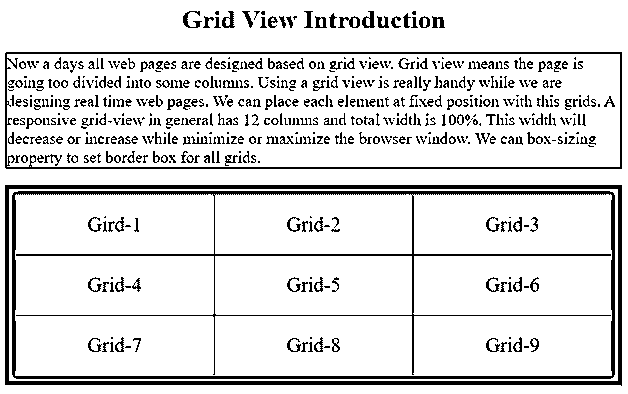

# 网格视图 CSS

> 原文：<https://www.educba.com/gridview-css/>




## GridView CSS 简介

现在所有的网页都是基于网格视图设计的。网格视图意味着页面被分成了很多列。当我们设计实时网页时，使用网格视图非常方便。我们可以用这些网格将每个元素放置在一个固定的位置。通常，响应网格视图有 12 列，总宽度为 100%。当最小化或最大化浏览器窗口时，该宽度将减小或增大。我们可以使用 box-sizing 属性为所有网格设置边框。

您可以观察下面不同的网格结构:

<small>网页开发、编程语言、软件测试&其他</small>




### CSS 中 GridView 是如何工作的？

网格视图的工作原理是将页面分成许多网格。实际上每个网页有 12 列网格。根据我们的要求，我们也可以在网格中包含子网格。

**语法:**

```
.col-1
{
width: value;
}
.col-2
{
width: value;
}
.col-3
{
width: value;
}
.col-4
{
width: value;
}
.col-5
{
width: value;
}
.col-6
{
width: value;
}
.col-7
{
width: value;
}
.col-8
{
width: value;
}
.col-9
{
width: value;
}
.col-10
{
width: value;
}
.col-11
{
width: value;
}
.col-12
{
width: value;
}
```

**说明:**

*   首先，我们计算了单个列的百分比，即 100% /12 =8.33%。
*   然后，我们为 12 列中的每一列都选择了一个单独的类，即 class="col-number "。

### 实现 GridView CSS 的示例

以下是 GridView 的示例:

#### 示例#1

**代码:**

```
<!DOCTYPE html>
<html>
<head>
<meta name="viewport" content="width=device-width, initial-scale=1.0">
<style>
* {
box-sizing: border-box;
}
.main {
border: 3px ridge blue;
padding: 13px;
}
h1
{
color: green;
text-align: center;
}
.rows::after {
content: "";
clear: both;
display: table;
}
p
{
font-size: 20px;
color: brown;
}
li
{
font-size: 20px;
color: orange;
}
[class*="column-"] {
float: left;
padding: 13px;
border: 3px ridge blue;
}
.column-1 {width: 8.33%;}
.column-2 {width: 16.66%;}
.column-8 {width: 66.66%;}
.column-9 {width: 75%;}
.column-4 {width: 33.33%;}
.column-5 {width: 41.66%;}
.column-6 {width: 50%;}
.column-7 {width: 58.33%;}
.column-10 {width: 83.33%;}
.column-11 {width: 91.66%;}
.column-12 {width: 100%;}
.column-3 {width: 25%;}
</style>
</head>
<body>
<div class="main">
<h1>Chapter 1: Grid View</h1>
</div>
<div class="rows">
<div class="column-3">
<ul>
<li>First Lesson</li>
<li>Second Lesson</li>
<li>Third Lesson</li>
<li>Fourth Lesson</li>
</ul>
</div>
<div class="column-9">
<h1>Grid View Description</h1>
<p>Now a days all web pages are designed based on grid view. Grid view means the page is going too divided into some columns. Using a grid view is really handy while we are designing real time web pages. We can place each element at fixed position with this grids. A responsive grid-view in general has 12 columns and total width is 100%. This width will decrease or increase while minimize or maximize the browser window. We can box-sizing property to set border box for all grids.</p>
</div>
</div>
</body>
</html>
```

**输出:**




#### 实施例 2

**代码:**

```
<!DOCTYPE html>
<html>
<head>
<style>
.a1 { grid-area: header; }
.a2 { grid-area: menu; }
.a4 { grid-area: right; }
.a5 { grid-area: footer; }
.a3 { grid-area: main; }
h1
{
color: green;
text-align: center;
}
.gridView {
display: grid;
grid-gap: 11px;
background-color: pink;
padding: 8px;
grid-template-areas:
'header header header header header header'
'menu main main main right right'
'menu footer footer footer footer footer';
}
.gridView > div {
padding: 21px 0;
font-size: 28px;
background-color: rgba(253, 254, 254, 0.7);
text-align: center;
}
</style>
</head>
<body>
<h1>Grid Layout Different Portions Demo</h1>
<div class="gridView">
<div class="a1">You can write your heading</div>
<div class="a2">Menu Items, Drop-down list etc.</div>
<div class="a3">Body area for description</div>
<div class="a4">Photos or Signature etc.</div>
<div class="a5">Conclusion part area</div>
</div>
</body>
</html>
```

**输出:**




#### 实施例 3

**代码:**

```
<!DOCTYPE html>
<html>
<head>
<style>
.gridView {
display: grid;
background-color: purple;
padding: 12px;
grid-template-columns: auto auto auto;
}
.g {
background-color: gray;
padding: 22px;
font-size: 25px;
text-align: center;
border: 1px solid red;
}
p
{
color: brown;
border: 2px solid red;
font-size: 20px;
}
h1
{
color: green;
text-align: center;
}
</style>
</head>
<body>
<h1>Grid View Introduction</h1>
<p>Now a days all web pages are designed based on grid view. Grid view means the page is going too divided into some columns. Using a grid view is really handy while we are designing real time web pages. We can place each element at fixed position with this grids. A responsive grid-view in general has 12 columns and total width is 100%. This width will decrease or increase while minimize or maximize the browser window. We can box-sizing property to set border box for all grids.</p>
<div class="gridView">
<div class="g">Gird-1</div>
<div class="g">Grid-2</div>
<div class="g">Grid-3</div>
<div class="g">Grid-4</div>
<div class="g">Grid-5</div>
<div class="g">Grid-6</div>
<div class="g">Grid-7</div>
<div class="g">Grid-8</div>
<div class="g">Grid-9</div>
</div>
</body>
</html>
```

**输出:**




**结论:**网格视图用于将页面分成不同的栏目。每个网格将元素对齐到一个准确的位置。所有实时网页都是基于网格视图设计的。

### 推荐文章

这是一个 GridView CSS 的指南。在这里，我们讨论一个关于 GridView CSS 和它的不同例子以及它的代码实现的简要概述。您也可以浏览我们推荐的其他文章，了解更多信息——

1.  [CSS 在技术中的应用](https://www.educba.com/what-is-css/)
2.  [使用 CSS 命令的技巧和诀窍](https://www.educba.com/css-commands/)
3.  [CSS 的六大优势介绍](https://www.educba.com/advantages-of-css/)
4.  [CSS 页眉设计(示例)](https://www.educba.com/css-header-design/)


