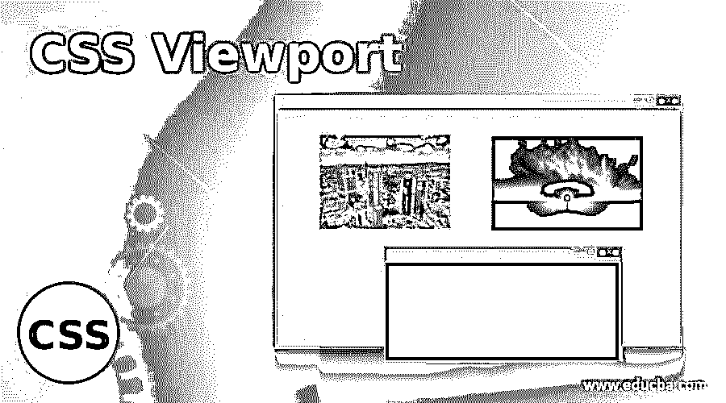
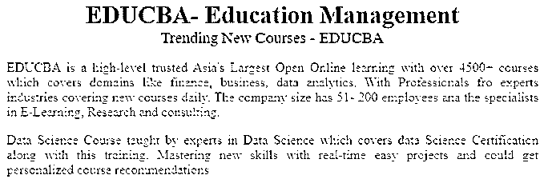
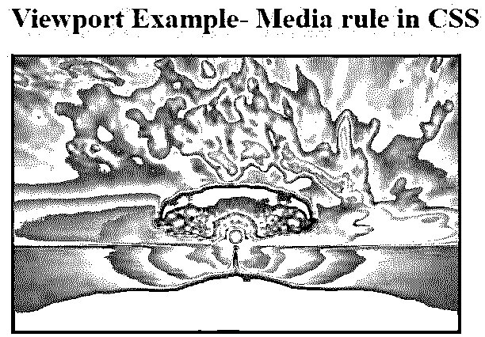
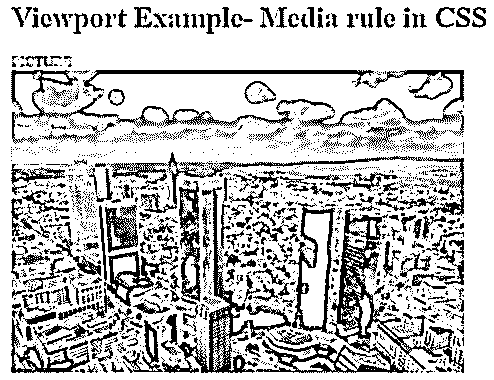

# CSS Viewport

> 原文：<https://www.educba.com/css-viewport/>




## CSS 视口的定义

CSS 视口被定义为窗口屏幕上的可视区域，它指的是移动设备的显示器。添加带有 viewport 的 CSS 标签是改善网页在较小屏幕上显示的有效方法。视窗与原始网页的大小不同。它不是一个标准，但仍然被认为是响应性网页设计的关键方法。简单地说，viewport 帮助 web 浏览器将页面拆分，并以可读的格式添加到小屏幕上(防止侧滚)。这里让我们学习 CSS 中的 Viewport meta 标签。

### 语法和参数

我们可以用两种方式集成这个 CSS 视口。一个是 CSS，另一个是 HTML 文档。一般语法如下所示:

<small>网页开发、编程语言、软件测试&其他</small>

使用 CSS @viewport 规则

```
@viewport {
width: device-width;
zoom: 1.1;
min-zoom: 0.4;
max-zoom: 2;
user-zoom: fixed;
}
```

该规则具有以下参数

*   **宽度**:在普通或风景视图下，它可根据设备进行调整。它接受自动、设备宽度、设备高度、长度、百分比等值。宽度设置速记属性，即最大和最小宽度。
*   **Zoom:** 通过在 meta 标签中给出初始比例来设置缩放。即使这样也能控制最小和最大缩放因子。缩放系数 1.0 或 100%表示不缩放。这里，较大的值放大，较小的值缩小。
*   **方向描述符**:有助于使文件显示为纵向或横向。

HTML 文档中的

 **```
<meta name="viewport" content="width=device-width, initial-scale=1">
```

这是在不同的移动优化网站中使用的 Viewport 的通用格式。这里，meta viewport 标签必须做一些设置来改变视口的比例点。参数 content=" width=device-width 设置页面宽度以响应屏幕宽度。第二个参数 initial-scale=1 有助于设置页面的初始缩放点。我们可以利用高度值来确定屏幕的高度。

### CSS 中如何使用视口？

在这篇文章中，我们将告诉你如何在浏览器中使用视窗来放大屏幕尺寸。那么，我们开始吧。可以通过两种方式在 HTML 中导入视口:一种是直接在文档中使用，另一种是通过引用 CSS 文件。指定使用 CSS 文件是在文件的开头完成的，以完美地显示输出。为了获得一个响应良好的网页，建议使用一个带有 CSS 的设备，并为其添加一些样式。任何响应式设计中的主要角色之一是视口大小。

例如

```
@viewport {
width: 640px;
}
```

在这里，我们已经将宽度设置为数值 640 像素，我们也可以添加自动宽度。接下来，我将此视口与媒体规则相结合，以优化嵌套视口规则的布局。

```
article, main {width :100%;}
@media screen and (min-width: 40px) {
article {float:right; width:70%;}
Main {float:right;width: 77%;}
}
@media screen and (min-width: 400px)
{article {padding: 30px;
}
}
```

当谈到浏览器支持时，CSS 中的这个@viewport 仅在 Internet Explorer 和 Opera 中支持。我们已经看到了使用 Viewport 的几个步骤，通过这些步骤您将了解它们在日常 web 设计开发中的用法。此外，它属于新的 CSS 功能，为不同的设备优化网站。

### CSS 视口示例

在这里，让我们看看一些例子与视口的行动。

#### 示例# 1–带有 meta 标签的简单示例

```
<!DOCTYPE html>
<html>
<head>
<title>EDUCBA- Education Management</title>
<meta charset="utf-8" name="viewport"
content= "width=device-width, initial-scale=1.0">
<style>
.edu {
font-size:30px;
font-weight:bold;
color:red;
text-align:center;
}
.edum {
font-size:19px;
text-align:center;
}
p {
color :aqua;
text-align:justify;
}
</style>
</head>
<body>
<div class = "edu">EDUCBA- Education Management</div>
<div class = "edum"> Trending New Courses - EDUCBA</div>
<p>EDUCBA is a high-level trusted Asia's Largest Open Online learning with over 4500+ courses which covers domains like finance, business, data analytics.With Professionals froexperts industriescovering new courses daily. The company size has 51- 200 employees ana the specialists in E-Learning, Research and consulting. </p>
<p> Data Science Course taught by experts in Data Science which covers data Science Certification along with this training. Mastering new skills with real-time easy projects and could get personalized course recommendations </p>
</body>
</html>
```

正如我们在上面的代码中看到的，内容是以设备宽度定义的横向方向显示的。

**输出:**




#### 示例# 2–使用 CSS @viewport。

```
<!doctype html>
<html>
<head>
<style>
@viewport { width: auto; }
@media (max-width: 600px) {
@viewport { width: 620px; }
}
body {
margin: 1;
}
img {
min-width: 505px;
}
h1
{ color: red;
}
</style>
<title>Viewport Example with Media rule</title>
</head>
<body>
<h1> Viewport Example- Media rule in CSS </h1>
<imgsrc="lights.jpg">
</body>
</html>
```

上面的代码使图像适合视窗的宽度大小。

**输出:**




#### 示例# 3–组合媒体+视口

```
<!doctype html>
<html>
<head>
<style>
@viewport {
width: 320;
}
@media screen and (min-width: 420px) {
div { color: aqua; }
}
@media screen and (max-width: 420px) {
div { color: green; }
}
body {
margin: 1;
}
img {
min-width: 500px;
}
h1
{ color: red;
}
</style>
<title>Viewport Example 2 with Media rule</title>
</head>
<body>
<h1> Viewport Example- Media rule in CSS </h1>
<div> PICTURE </div>
<imgsrc="frankfurt.jpg">
</body>
</html>
```

在这里，我使用了一个名为 media 的查询组合，并将视口宽度渲染为 420 像素。用户选择该尺寸并缩放布局以适合显示器中的相应空间。

**输出:**




#### 实施例 4

```
<!doctype html>
<html>
<head>
<title>My @viewport Rule with auto value</title>
<style>
@viewport {width: auto;}
</style>
</head>
<body>
<h1>My @viewport Rule with auto value </h1>
Responsive Web page promotes in creating a web pages to look good on all devices.
It seeks help on CSS file to resize. This sets the viewport of a page to make a good control on dimensions and scaling.
</body>
</html>
```

上面的代码非常简单，可以使用 auto 来演示任意大小视窗的文档。输出如下所示。

**输出:**


### 结论

总结 CSS 中的视口——我们已经讨论了在 CSS 中实现视口的方法，并给出了一个演示。它是在 HTML 代码或 CSS 文件的上下文中完成的，以确保在移动设备上正确显示。通过这个 viewport 标签进入 CSS，据说我们正在建立一个灵活的布局，这是很好的网站开发。

### 推荐文章

这是一个 CSS 视口指南。这里我们也讨论 css 中 viewport 的定义和使用方法？以及不同的示例及其代码实现。您也可以看看以下文章，了解更多信息–

1.  [CSS 文本效果](https://www.educba.com/css-text-effects/)
2.  [CSS 旋转文本](https://www.educba.com/css-rotate-text/)
3.  [CSS 偏斜()](https://www.educba.com/css-skew/)
4.  [CSS 水平对齐](https://www.educba.com/css-horizontal-align/)


**