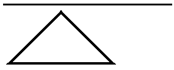

# React 中的 CSS

> 原文：<https://www.educba.com/css-in-react/>


## React 中 CSS 的介绍

在 react 中，js CSS 可以作为任何带有所有属性的常量使用，或者我们可以创建一个单独的文件来存放所有的 CSS。在 react js 中 CSS 的帮助下，我们可以设计组件的外观。我们可以根据我们的要求设计组件。在反应 js 中，它给了我们灵活性，我们可以编写通用的 css，这意味着可以由许多组件使用，我们也可以编写独特的 css，这意味着我们可以编写只能由一个组件使用的 CSS。

### 怎么用 CSS 反应？

在 react js 中使用 css 有多种方式，我们将讨论两种主要使用的方式，一种是在同一个组件上作为常量使用，另一种是在可以被许多其他组件使用的单独文件上使用。让我们讨论它们的方式和好处。

<small>网页开发、编程语言、软件测试&其他</small>

#### 将 CSS 编写为组件内部的常量

在这种方法中，我们定义了一个常量，在这个常量中，我们设计了所有重要的属性，例如，const x ={color: red，width:20px}并且这个常量将作为 style 属性的值赋给任何 HTML 标签。例如，如果我们有 Html 标签 div，那么就在

上。在这里，我们将 x 的值赋给了 HTML 标签 div 上的 x 的值。在这种方法的帮助下，我们可以在常量 x 上编写任何 css，并且 x 的值可以在组件 HTML 标签上的任何地方使用。这里，我们获得了可重用性，但这种方法的问题是，我们在这里设计的 css 将不会被其他组件使用，这意味着 x 的值仅限于当前的组件，我们不能在其他组件上使用 x。

#### 在单独的文件中编写 CSS

在这种方法中，我们将创建一个单独的文件来存放所有的 css 逻辑。我们需要创建一个具有任何名称的类，如 classname="test-class ",并且在文件上，我们可以放置任何 css，如。test-class{css 属性名}，在此，我们可以放入任何 css。这种方法的主要好处是我们可以在任何组件中使用这个文件，因此我们可以为任何数量的组件恢复 css。但是这种方法有一个问题，那就是我们希望不同的组件有不同的外观，那么在这种情况下，如果我们对这些组件进行任何更改，都会影响其他组件，因为它们也使用相同的 css。因此，它总是取决于我们的要求，我们想如何使用它。如果我们需要任何独特的设计，那么我们应该在同一个文件中使用 css 作为常量，如果我们认为给定的 css 对于所有组件都是相同的，那么我们可以将 css 放在单独的文件中。

以上两个例子的一个例子是，如果我们有一个按钮，我们知道所有的按钮在整个应用程序中都是一样的，那么我们可以对 css 使用一个普通的文件。同样，如果我们有不同目的的文本，那么我们需要在组件本身上编写 css，因为对于组件来说，更改是唯一的。

### 在 React 中实现 CSS 的示例

在下文中，我们给出了 react css 的四个示例，在这些示例中，前三个示例以常量的形式解释了 css 的使用方式，该常量仅可用于同一文件，在第四个示例中，我们采用了一个单独的文件，在该文件中我们编写了 css，该文件可用于 react 组件的许多其他文件。如果我们想运行这些示例，我们可以创建一个以 HTML 为扩展名的任意名称的文件，如 xss.html，并在文件上放置 react javascript 代码部分，在 HTML 部分放置 HTML，我们可以看到文件执行的输出。

#### 示例#1

请查看以下示例以及输出屏幕:

**代码:**

```
var Shape = React.createClass({
//CSS constant for the react component shape design
stylerExample: {
height: "56px",
width: "56px",
background: "red"
},
render: function() {
return (
<div style = {this.stylerExample}></div>
);
}
});
React.render(
<Shape />,
document.getElementById('main'));
Html
<div id="main"></div>
```

**输出:**


#### 实施例 2

请查看以下示例以及输出屏幕:

**代码:**

```
var Shape = React.createClass({
//CSS constant for the react component shape design
stylerExample: {
height: "59px",
width: "59px",
backgroundColor: "red",
borderRadius: "70%"
},
render: function() {
return (
<div style = {this.stylerExample}></div>
);
}
});
React.render(
<Shape />,
document.getElementById('main'));
Html,
<div id="main"></div>
Screen,
```

**输出:**


#### 实施例 3

请查看以下示例以及输出屏幕:

**代码:**

```
var Shape = React.createClass({
//CSS constant for the react component shape design
stylerExample: {
borderBottom: "56px solid red",
borderLeft: "26px solid transparent",
height: "3",
borderRight: "26px solid transparent",
width: "135px"
},
render: function() {
return (
<div style = {this.stylerExample}></div>
);
}
});
React.render(
<Shape />,
document.getElementById('main'));
Html,
<div id="main"></div>
```

**输出:**


#### 实施例 4

请查看以下示例以及输出屏幕:

**代码:**

```
var Shape = React.createClass({
render: function() {
return (
<div className="shape-class"></div>
);
}
});
React.render(
<Shape />,
document.getElementById('main'));
Html ,
<div id="main"></div>
CSS,
//This is the css with written on the separate file showing that other file components can also use them .
.shape-class {
border-left: 90px solid transparent;
height: 0;
border-right: 90px solid transparent;
width: 0;
border-bottom: 90px solid red;
}
```

**输出:**




### 结论

从本教程中，我们学习了 react css 工作的基本概念，我们学习了在 react 中使用 css 的主要用途和各种方法。我们关注 react js 中 css 的一些重要例子，这些例子揭示了它的流程。

### 推荐文章

这是 CSS 做出反应的指南。这里我们讨论 React 中 CSS 的介绍，如何用编程例子来使用它。您也可以浏览我们的其他相关文章，了解更多信息——

1.  [React 原生库](https://www.educba.com/react-native-libraries/)
2.  [反应原生布局](https://www.educba.com/react-native-layout/)
3.  [CSS 按钮边框](https://www.educba.com/css-button-border/)
4.  [CSS 属性选择器](https://www.educba.com/css-attribute-selector/)


