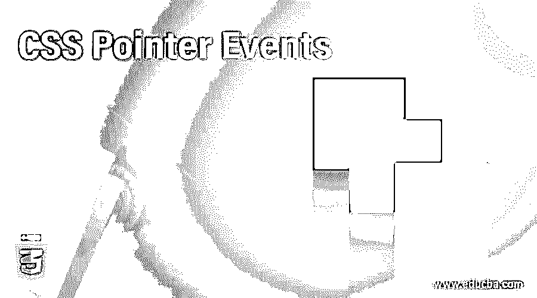
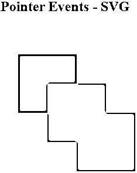

# CSS 指针事件

> 原文：<https://www.educba.com/css-pointer-events/>




## CSS 指针事件简介

CSS pointer-events 属性允许控制 HTML 元素如何对鼠标或触摸事件做出反应，包括 CSS 悬停或活动状态、JavaScript 单击或点击事件，以及光标是否可见。CSS pointer-events 属性规定了在什么情况下(如果有的话)一个指定的图形元素可以成为指针事件的对象。CSS 指针事件是指向设备被触发的 DOM 事件。它们旨在创建 DOM 事件的单一模型来处理鼠标之类的定点输入设备。

指针事件的属性更像 JavaScript，以防止:

<small>网页开发、编程语言、软件测试&其他</small>

*   点击动作来做某事
*   要显示的默认光标指针
*   CSS 悬停并导致活动状态
*   点击 JavaScript 来触发事件

**语法**

CSS 指针事件的语法可以写成如下所示:

```
pointer-events: auto|none;
```

*   **auto** :该参数可用于指定元素必须对指针事件做出反应。
*   **none** :该参数可以用来定义元素可能不会对指向事件做出反应。

举个例子，

考虑下面的代码:

```
<div class="myclass"> click here <a href="https://www.google.com/html"> Google </a> </div>
```

对于这个类，我们将为 CSS 提供指针事件属性，如下所示:

```
div.myclass {
pointer-events: auto;
}
```

当你悬停或点击上面的链接时，元素将对指针事件作出反应。

### CSS 指针事件属性是如何工作的？

拥有一个单一的指针事件模型可以促进网站和应用程序的开发，还可以提供良好的用户体验，而不管用户的硬件如何。即使这样，在需要特定于设备的处理的情况下，指针事件标识一个指针类型属性来检查生成事件的设备的类型。类似于鼠标事件，如鼠标按下/指针按下、鼠标移动/指针移动等，是处理一般指针输入所需的事件。因此，指针事件的类型故意等同于鼠标事件的类型。

### 实现 CSS 指针事件的示例

下面是提到的例子:

#### 示例#1

**代码:**

```
<!DOCTYPE html>
<html lang="en">
<head>
<meta charset="utf-8">
<title> CSS pointer-events Example </title>
<style>
.mytext {
pointer-events: auto;
}
</style>
</head>
<body>
<h2> Pointer Events - Auto </h2>
<br>
<div class = "mytext">
<a href="https://www.educba.com/"> EDUCBA (Corporate Bridge Consultancy Pvt Ltd) </a> is a leading global provider of skill based education addressing the needs of 500,000+ members across 40+ Countries. Our unique step-by-step, online learning model along with amazing 2500+ courses prepared by top-notch professionals from the Industry help participants achieve their goals successfully.
</div>
</body>
</html>
```

**Output—**在浏览器中打开文件，会产生以下结果:


**解释:**如上例所示，我们将指针属性设置为 auto，这决定了当用户悬停在链接上时，元素将对指针事件做出反应。换句话说，当鼠标悬停在链接上时，我们可以看到鼠标指针，因为我们已经为指针事件设置了属性。

#### 实施例 2

**代码:**

```
<!DOCTYPE html>
<html lang="en">
<head>
<meta charset="utf-8">
<title> CSS pointer-events Example </title>
<style>
.mytext {
pointer-events: none;
}
</style>
</head>
<body>
<h2> Pointer Events - None </h2>
<br>
<div class = "mytext">
<a href="https://www.educba.com/"> EDUCBA (Corporate Bridge Consultancy Pvt Ltd) </a> is a leading global provider of skill based education addressing the needs of 500,000+ members across 40+ Countries. Our unique step-by-step, online learning model along with amazing 2500+ courses prepared by top-notch professionals from the Industry help participants achieve their goals successfully.
</div>
</body>
</html>
```

**输出:**


**解释:**如上例所示，我们将指针属性设置为 none，这决定了当用户悬停在链接上时，元素不会对指针事件做出反应。换句话说，当鼠标悬停在链接上时，我们看不到鼠标指针，因为我们已经为指针事件设置了 none 属性。

#### 实施例 3

**代码:**

```
<!DOCTYPE html>
<html lang="en">
<head>
<meta charset="utf-8">
<title> CSS pointer-events Example </title>
<style>
.one {
fill: grey;
}
.two {
fill: cyan;
}
.three {
fill: orange;
pointer-events: none;
}
.pntrevnt:hover {
stroke: red;
stroke-width: 3;
}
</style>
</head>
<body>
<h2> Pointer Events - SVG </h2>
<br>
<svg width="250" height="250">
<g transform="translate(30, 30)">
<path class="one pntrevnt" d="M 0 0 L 100 0 L 100 100 L 0 100 z" />
<path class="two pntrevnt" d="M 50 50 l 100 0 l 0 100 l -100 0 z" />
<path class="three pntrevnt" d="M 100 100 l 100 0 l 0 100 l -100 0 z" />
</g>
</svg>
</body>
</html>
```

**输出:**




**解释:**在上面的例子中，我们使用了 SVG 元素，并使用了 stroke 值，该值指定了当用户将鼠标指针移动到元素的边界上时指针事件的目标。fill 值指定当用户将鼠标指针移到元素内部时指针事件的目标。

### 结论

到目前为止，我们已经使用了 CSS 指针事件属性和示例。采用指针事件来防止一个元素成为指针事件的目标并不意味着它不会触发指针事件侦听器。CSS 指针事件在设置为 none 时非常有效，可以禁用目标点击，并允许下面的元素点击。

### 推荐文章

这是一个 CSS 指针事件的指南。这里我们讨论一个 CSS 指针事件的介绍，语法，它是如何工作的编程例子。您也可以浏览我们的其他相关文章，了解更多信息——

1.  [CSS Flexbox 属性](https://www.educba.com/css-flexbox-properties/)
2.  [CSS 表格单元格填充](https://www.educba.com/css-table-cell-padding/)
3.  [CSS 文本下划线](https://www.educba.com/css-text-underline/)
4.  [文本装饰 CSS](https://www.educba.com/text-decoration-css/)


