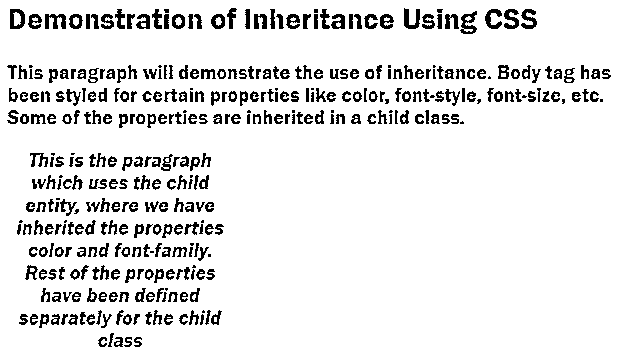
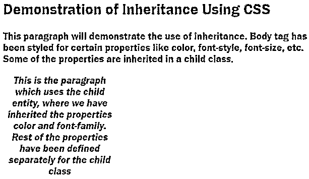

# CSS 继承

> 原文：<https://www.educba.com/css-inheritance/>


## CSS 继承介绍

下面的文章提供了 CSS 继承的概要。级联样式表提供了开发人员使编码实践标准化所需的所有动态特性。继承就是这样一种特性，它利用了在子实体中使用父实体的样式特性的能力。这使得编码变得容易，因为一个公共属性不需要被设计两次或多次。这确保了检查代码行并遵循最佳实践。“inherit”关键字的使用确保了属性从父实体被采用到子实体。

### CSS 继承的语法

当我们为 body、head 等父实体定义属性时，它们就成为了可以在段落、类、id 等子实体中继承的父属性。

<small>网页开发、编程语言、软件测试&其他</small>

语法:

```
Parent{
property1: value1;
property2:value2;
}
child{
property1: inherit;
propert2:value3;
}
```

正如我们在上面的语法示例中看到的，使用关键字“inherit”可以确保特定的属性(在我们的示例中为 property1)是从父属性继承的。子类的其他属性可以不同。

### CSS 继承的例子

下面是提到的例子:

#### 示例#1

使用外部 CSS 演示继承。

形容词（adjective 的缩写）由于这个例子使用外部 CSS，我们将首先创建 CSS 文件。

b.在 CSS 文件中，我们将为父属性设置样式。对于这个例子，我们将为 body 元素设置样式。

**代码:**

```
body{
color: blueviolet;
font-family: 'Franklin Gothic Medium', 'Arial Narrow', Arial, sans-serif;
font-style: normal;
height: 100px;
width: 500px;
}
```

碳（carbon 的缩写）一旦主体被样式化，我们将定义一个子类并继承属性。

**代码:**

```
.extra{
color: inherit;
font-family: inherit;
font-style: italic;
height: 80px;
width: 180px;
text-align: center;
}
```

d.最终的 CSS 代码应该与此类似。请注意，可以根据选择添加其他属性。

**代码:**

```
body{
color: blueviolet;
font-family: 'Franklin Gothic Medium', 'Arial Narrow', Arial, sans-serif;
font-style: normal;
height: 100px;
width: 500px;
}
h2{
color: maroon;
}
.extra{
color: inherit;
font-family: inherit;
font-style: italic;
height: 80px;
width: 180px;
text-align: center;
}
```

e.转到 HTML 文件，因为这是一个外部 CSS 示例，我们将在 header 部分调用 CSS 文件。应该是这样的。

**代码:**

```
<head>
<title>Inheritance Using CSS</title>
<link rel="stylesheet" type="text/css" href="inheritance.css">
</head>
```

氟（fluorine 的缩写）在正文部分，我们将要求一个段落，然后和全班一起要求另一个段落。

**代码:**

```
<body>
<h2>Demonstration of Inheritance Using CSS</h2>
<p>This paragraph will demonstrate the use of inheritance. Body tag    has been styled for certain properties like color, font-style, font-size, etc. Some of the properties are inherited in a child class. </p>
<p class="extra">This is the paragraph which uses the child entity, where we have inherited the properties color and font-family. Rest of the properties have been defined separately for the child  class</p>
</body>
```

g.HTML 页面的最终代码将如下所示。

**代码:**

```
<html>
<head>
<title>Inheritance Using CSS</title>
<link rel="stylesheet" type="text/css" href="inheritance.css">
</head>
<body>
<h2>Demonstration of Inheritance Using CSS</h2>
<p>This paragraph will demonstrate the use of inheritance. Body tag has been styled for certain properties like color, font-style, font-size, etc. Some of the properties are inherited in a child class.</p>
<p class="extra">This is the paragraph which uses the child entity, where we have inherited the properties color and font-family. Rest of the properties have been defined separately for the child class</p>
</body>
</html>
```

h.当我们保存这些文件并通过浏览器打开 html 文件时，将会生成以下输出。

**输出:**




正如我们在上面的截图中看到的，写在

标签下的第一段继承了 body 的所有属性。然而，下一段是用一个类定义的，因此它继承了显式定义的属性，其余的是 CSS 代码中定义的自己的属性。

#### 实施例 2

使用内部 CSS 演示继承。

形容词（adjective 的缩写）我们将执行相同的代码，在这个例子中使用内部 CSS。

b.由于这个例子使用了内部 CSS，我们将在 header 部分声明样式。

**头部代码:**

```
<style>
body{
color: blueviolet;
font-family: 'Franklin Gothic Medium', 'Arial Narrow', Arial, sans-serif;
font-style: normal;
height: 100px;
width: 500px;
}
h2{
color: green;
}
.extra{
color: inherit;
font-family: inherit;
font-style: italic;
height: 80px;
width: 180px;
text-align: center;
}
</style>
```

碳（carbon 的缩写）一旦造型完成，在正文部分，我们将调用两个段落。一个没有任何阶级，一个有阶级。

**车身部分代码:**

```
<body>
<h2>Demonstration of Inheritance Using CSS</h2>
<p>This paragraph will demonstrate the use of inheritance. Body tag has been styled for certain properties like color, font-style, font-size, etc. Some of the properties are inherited in a child class.</p>
<p class="extra">This is the paragraph which uses the child entity, where we have inherited the properties color and font-family. Rest of the properties have been defined separately for the child class</p>
</body>
```

d.HTML 文件的最终代码将如下所示。

**代码:**

```
<html>
<head>
<title>Inheritance Using CSS</title>
<style>
body{
color: blueviolet;
font-family: 'Franklin Gothic Medium', 'Arial Narrow', Arial, sans-serif;
font-style: normal;
height: 100px;
width: 500px;
}
h2{
color: green;
}
.extra{
color: inherit;
font-family: inherit;
font-style: italic;
height: 80px;
width: 180px;
text-align: center;
}
</style>
</head>
<body>
<h2>Demonstration of Inheritance Using CSS</h2>
<p>This paragraph will demonstrate the use of inheritance. Body tag has been styled for certain properties like color, font-style, font-size, etc. Some of the properties are inherited in a child class.</p>
<p class="extra">This is the paragraph which uses the child entity, where we have inherited the properties color and font-family. Rest of the properties have been defined separately for the child class</p>
</body>
</html>
```

e.将该文件保存为 HTML 将会产生以下输出。

**输出:**




在上面的两个例子中，我们了解了 CSS 中的继承是如何工作的。

### 推荐文章

这是一个 CSS 继承的指南。这里我们分别讨论 CSS 继承的介绍和例子。您也可以看看以下文章，了解更多信息–

1.  [CSS 阴影](https://www.educba.com/css-drop-shadow/)
2.  [CSS 3D 变换](https://www.educba.com/css-3d-transforms/)
3.  [CSS 伪元素](https://www.educba.com/css-pseudo-elements/)
4.  [粘滞页脚 CSS](https://www.educba.com/sticky-footer-css/)


