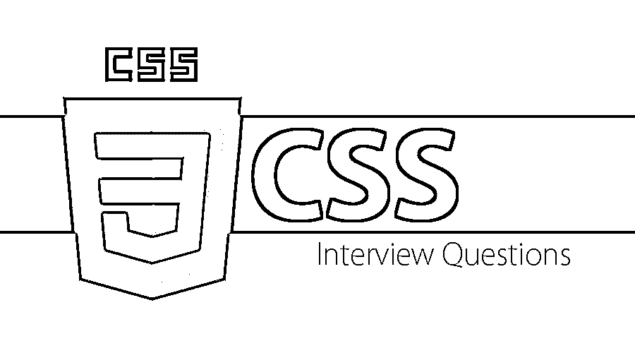

# CSS 面试问题

> 原文：<https://www.educba.com/css-interview-questions/>

## CSS 面试问答介绍

下面这篇文章提供了 CSS 面试问题的大纲。CSS 被称为级联样式表。它是一种用于呈现 HTML 网页的样式表语言。它是由哈肯·维姆·莱和布雷特博斯开发的。它最初是在 1998 年被标记的。它有助于定义字体、颜色和其他属性。CSS 预处理器用于编写更有效的 CSS，将它分成多个文件，可以用于大量的函数和变量，如 Sass。文件分割用于减少页面加载时间，并使事情更容易管理。有些区域您不会使用所有的样式，因此可以创建单独的样式表和区域。CSS 预处理器有助于实现这一点，并使性能更好，更安全。它主要用于大中型项目。

现在，如果你正在寻找一份与 CSS 相关的工作，那么你需要准备 2022 年的 CSS 面试问题。的确，每个面试都因不同的职位而不同。在这里，我们准备了重要的 CSS 面试问题和答案，这将有助于你在面试中取得成功。

<small>网页开发、编程语言、软件测试&其他</small>

在这篇 2022 CSS 面试问题的文章中，我们将呈现 10 个最重要和最常用的 CSS 面试问题。这些问题将帮助学生围绕 CSS 建立他们的概念，并帮助他们赢得面试。

### 第 1 部分–CSS 面试问题(基础)

第一部分包括基本的面试问题和答案:

#### Q1。CSS 的优势是什么？

**答案:**

CSS 的优势如下:

*   它有助于更快地加载页面，因为不需要每次都编写 HTML 标记属性。在 CSS 中，可以声明一次，多次使用 cab。
*   这也有助于节省时间，因为相同的 CSS 样式表也可以在其他 HTML 页面中使用。
*   这是很容易维护，如果有任何风格的变化，它可以在一个地方完成，而不需要在不同的地方做改变。
*   与 [HTML 属性](https://www.educba.com/html-attributes/)或标签相比，它有助于提供更好的 HTML 页面外观。
*   它有助于在不同的设备和网站的不同版本上使用相同的 HTML 文档。
*   它有助于离线浏览。它将应用程序存储在离线缓存中，这也有助于更快的加载和更好的性能。
*   它也是独立于平台的。也可以在最新的浏览器中浏览。

#### Q2。解释 CSS 组件？

**答案:**

它由三部分组成:

*   选择器是一个 HTML 标签，样式将应用于它。标签类似于

    # 等。

*   属性是一种 HTML 标记属性，它被转换为 CSS 属性。例如边框、颜色等。
*   分配给属性的值，如定义 CSS 中的任何颜色值或任何其他已定义的属性。

#### Q3。解释不同种类的选择器和定位元素的方法？

**答案:**

不同种类的选择器是标签、id 和类。CSS 中的标签有助于引用 HTML 标签。id 有助于引用 HTML 标记 ID 属性，类有助于引用 HTML 标记上的类属性。

定位元素的不同方法是标记、类和 ID。在标签的帮助下，它可以被定位到主体，并且在 HTML 中已经指定了类，它可以是带有'的目标。“类名”。ID 可以以' #ID '为目标，

#### Q4。解释 CSS 盒子模型及其元素？

**答案:**

CSS 盒子模型由以下项目组成:边距、边框、填充和内容。页边空白是最上面的一层，它描述了整个结构。边框位于边距和填充之间，或者它可以被定义为带边框的填充和内容。背景颜色会影响边框。填充是边框和内容之间的空间。这意味着如果一个元素有背景色，并且该颜色也将填充填充。内容是显示的实际数据。

#### Q5。解释字体大小的首选方式？

**答案:**

在 CSS 中，定义字体大小对于按照要求制作内容非常重要。文本的大小主要集中在你所使用的单位上。单位可以是 px、em、rem、%、vs 和 vh。像素(px)主要用于定义字体大小。众所周知，并非所有的浏览器都支持相同的字体。系统中安装的主要是网络安全字体，浏览器有时无法识别它们。为了避免这种回退，使用字体在浏览器中显示内容。

### 第 2 部分–CSS 面试问题(高级)

现在让我们来看看高级面试问题。

#### Q6。解释一下优雅退化这个术语？

**答案:**

在 CSS 中，如果任何组件失败，适度降级有助于组件根据需要正常工作。设计网页时，使用最新的浏览器应用程序。如果图像无法查看，则可以显示其文本。

#### Q7。定义的维度属性是什么？

**答案:**

定义的尺寸属性包括高度、最小高度、最大高度、宽度、最小宽度和最大宽度。

#### Q8。解释各种媒体类型？

**答案:**

使用的各种媒体类型有屏幕、投影、听觉、印刷和手持。CSS 可以用于不同的屏幕，如电脑或笔记本电脑屏幕。它可用于手机等手持设备。CSS 用于在投影仪上投影。它被用于声音合成器和演讲。它还可以在打印文档时预览内容。

#### Q9。解释如何处理 CSS 中的浏览器差异？

**答案:**

这是面试中问的高级 CSS 面试问题。最新的浏览器更新了几乎所有处理网站或网络应用程序的功能。浏览器之间总是存在差异，因为有些支持 CSS 样式，有些不支持相同的样式。因此，在使用回退样式时，总是有一个样式限制。CSS 中的 feature @support 有助于定义某个特性在浏览器中是否可用。如果它可用，则使用其他方式，也可以使用一些替代回退方式。

#### Q10。解释 Flexbox 和 CSS 网格？

**答案:**

Flexbox 是一个布局工具，在站点的较小区域非常有用。它的主要功能是在水平或垂直轴上对齐项目。它用于与其他布局选项一起自动分隔项目，并按定义的顺序显示项目。

CSS grid 几乎是单个页面的布局工具。它用于水平轴和垂直轴的布局，与 flexbox 工具不同，flexbox 工具一次仅用于一个轴。

### 推荐文章

这是 CSS 面试问题和答案列表的指南，以便候选人可以轻松地解决这些面试问题。在这篇文章中，我们研究了在面试中经常被问到的 CSS 面试问题。您也可以阅读以下文章，了解更多信息——

1.  [CSS3 面试问题](https://www.educba.com/css3-interview-questions/)
2.  [HTML 面试问题](https://www.educba.com/html-interview-questions/)
3.  [网页设计面试问题](https://www.educba.com/web-design-interview-questions/)
4.  [网页开发面试问题](https://www.educba.com/web-development-interview-questions/)

