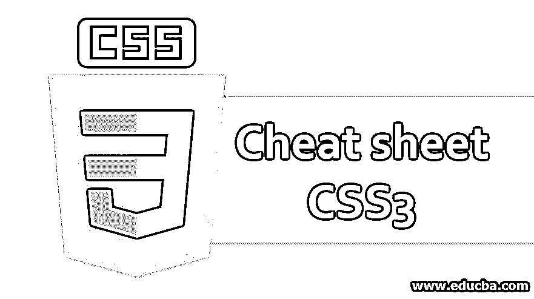

# 备忘单 CSS3

> 原文：<https://www.educba.com/cheat-sheet-css3/>

## 备忘单 CSS3 简介

级联样式表(CSS)基本上是一种样式表语言，用于实现以标记语言开发的文档的外观和格式。CSS 规范主要由万维网联盟(W3C)维护。实现 CSS 的主要目的是展示表示和内容的分离，包括正面、布局格式。CSS3 是继 CSS2 之后 CSS 的最新版本或标准。CSS3 主要是 CSS2 规范和一些新功能的混合。

**备忘单 CSS3 的重要模块**

<small>网页开发、编程语言、软件测试&其他</small>

1.  箱式模型
2.  选择器
3.  文本效果
4.  2D 变换
5.  3D 转换
6.  图像表示
7.  用户界面
8.  多列布局
9.  动画片
10.  内容调整和重新分配

在这篇 CSS3 文章中，我们将讨论什么是 CSS3 以及不同的 CSS3 命令。

### 备忘单 CSS3 上的命令和内容

CSS3 有一个丰富的库，是交互式的，可扩展的，并包含许多计算常见操作的内置方法。下面是提到的 Cheatsheet CSS3 命令，它们执行不同的命令行操作:

| **命令** | **描述** |
| **:焦点** | 聚焦于一个元素 |
| **:活动** | 显示和选择活动元素 |
| **:启用** | 显示已启用的元素 |
| **:选中** | 显示选中的元素 |
| **:郎** | 使开发人员能够为特定元素指定语言 |
| **:选择** | 显示高亮显示并选中的元素 |
| **:根** | 显示文档中的根元素 |
| **:第一个孩子** | 显示第一个同级元素 |
| **:最后一个孩子** | 显示最后一个同级元素 |
| **:独生子女** | 显示唯一的子元素 |
| **:第一类** | 显示特定类型的第一个同级元素 |
| **:类型的最后一个** | 显示特定类型的最后一个同级元素 |
| **:唯一类型** | 显示特定类型的唯一同级元素 |
| **:空** | 显示没有子元素的元素 |
| **::第一个字母** | 将特定样式添加到文本的首字母 |
| **::一线** | 将特定样式添加到文本的首行 |
| **:**之后 | 在文本元素后插入一些内容 |
| **:**之前 | 在文本元素前插入一些内容 |

**运算符:**CSS3 中不同类型的运算符有比较(关系)运算符、赋值运算符、逻辑运算符和恒等运算符。

**衡量标准:**备忘单 CSS3 衡量标准变化如下

| **比例/参数** | **描述** |
| 全身长的 | 当前元素的字体大小 |
| 前夫;前妻;前男友;前女友 | 元素的字体高度 |
| 像素 | 查看设备像素 |
| 雷姆 | 根元素字体大小 |
| vh | 视口的高度 |
| 大众汽车（Volkswagen 的缩写） | 视口的宽度 |
| % | 百分率 |
| 个人计算机 | 异嗜症 |
| 元素铂的符号 | 要点 |

**颜色代码:**颜色名称=红色、蓝色、绿色和深绿色。在下面找到相同的代码

| **代码** | **描述/含义** |
| rgb(x，y，z) | 对于红色= rgb(255，0，0) |
| rgb(x%，y%，z%) | 对于红色= rgb(100%，0，0) |
| #rrggbb | 对于红色= #ff000 |
| 风味 | 用户选择颜色以自定义用户界面 |
| rgba(x，y，z，alpha) | 对于红色= rgb(255，0，0) |

**用户界面属性:** CSS3 备忘单用户界面属性如下。

| **属性值** | **描述** |
| **图标** | 在区域上提供图标 |
| **调整大小** | 调整指定区域元素的大小 |
| **装箱尺寸** | 要固定指定的元素区域 |
| **外观** | 将元素实现为 UI 元素 |
| **向下导航** | 根据键盘向下箭头按钮向下移动元素 |
| **向左导航** | 根据键盘左箭头按钮向左移动元素 |
| **导航向上** | 根据键盘左箭头按钮向上移动元素 |
| **右导航** | 根据键盘右箭头按钮向右移动元素 |
| **轮廓偏移** | 绘制选定文本区域的轮廓 |

**选择器类型**:备忘单 CSS3 选择器类型如下。

| **类型名称** | **描述/含义** |
| **通用** | 要显示任何元素 |
| **类型** | 显示任何特定类型的元素 |
| **类** | 显示不同类型的多个元素 |
| **Id** | 显示和标识单个特定元素类型，而不影响其他元素类型 |
| **孩子** | 显示直接位于另一个元素下的元素 |
| **分组** | 识别不同类型的多个元素 |
| **相邻的兄弟姐妹** | 获取具有相同父元素和元素并且在直接序列中的所有元素 |
| **一般兄弟姐妹** | 获取具有相同父元素和元素并且不一定在直接序列中的所有元素 |

### 使用备忘单 CSS3 命令的免费提示和技巧

下面是一些提示和技巧:

1.  CSS3 混合模式可用于统一指定内容的外观，它还允许用户设置不同的图像颜色版本。CSS3 备忘单中大约有 15 个混合模式值。从用户界面表示的角度来看，它还增加了额外的优势。
2.  剪辑是 CSS 的另一大特色。使用裁剪功能，用户可以根据需要定义图像区域的可见性。因此，如果任何图像部分落在期望的区域之外，则可以实施裁剪来隐藏该额外的图像区域。
3.  在 CSS 的情况下，可以实现 shape-inside 和 shape-outside 属性来包装 CSS 自定义路径周围的内容，并且可以根据最终用户的要求来定义和分配它。它基本上使用户能够根据定义的规格设计相间。
4.  使用 SVG(可缩放矢量图形)动画是 CSS3 的另一个优势。将 SVG 与 CSS3 动画一起使用，界面将变得更具交互性，SVG 也有自己的 DOM API。
5.  映射功能将应用于输入列表中的所有项目。
6.  reduce 函数用于对列表进行一些计算并返回值
7.  悬停效果可以使用 CSS3 备忘单实现
8.  可以使用 CSS3 和 SVG 过滤器实现粘性菜单，从用户界面的角度来看，这有助于一种新的代表性方法
9.  从网页设计的角度来看，使用 CSS3 可以产生视差效果。
10.  可以使用 CSS3 生成交互式 3d 结构和用户界面
11.  使用不同的选择器组合，可以使用 CSS3 生成下载链接旁边的文件格式图标。

### 结论

在这篇备忘单 CSS3 文章中，我们看到 CSS3 易于使用，其语法也更容易记忆。通过使用支持 CSS3 的不同方法和样式表技术，CSS3 可以用于表示 web 开发技术。基于项目需求的类型、工作时间和所有其他不同的讨论方面，应该使用 CSS3 来达到预期的目标。

### 推荐文章

这是一个备忘单 CSS3 的指南。在这里，我们讨论了 CSS3 的重要模块、命令和内容，以及使用备忘单 CSS3 的提示和技巧。您也可以阅读以下文章，了解更多信息——

1.  [备忘单 CSS](https://www.educba.com/cheat-sheet-css/)
2.  [备忘单 HTML](https://www.educba.com/cheat-sheet-html/)
3.  [令人惊讶的 UNIX 备忘单](https://www.educba.com/cheat-sheet-for-unix/)
4.  [备忘单 JavaScript:特性](https://www.educba.com/cheat-sheet-javascript/)

