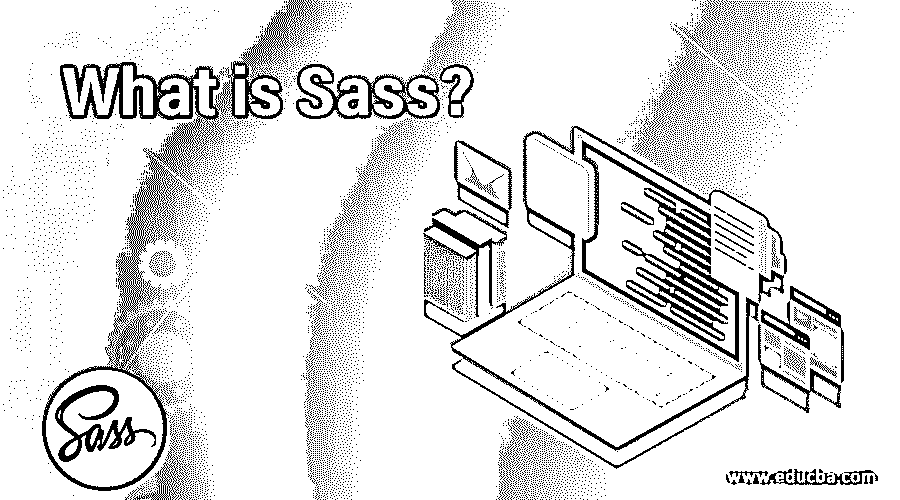

# 什么是萨斯？

> 原文：<https://www.educba.com/what-is-sass/>

## Sass 简介

Sass 是一个 CSS 预处理器，有助于减少 CSS 的重复，从而节省时间。与 CSS 相比，它被认为更加稳定和强大。它非常清晰地从结构上描述了文档的风格。它有助于更快更好地完成工作。由于它的所有特性，它比 CSS 更受欢迎。它允许定义以$符号开头的变量。变量赋值可以通过使用冒号来完成。它还支持 CSS 不支持的逻辑嵌套。它使用户能够拥有嵌套的代码，这些代码可以相互插入。

### 什么是萨斯？

SASS 是由 Hampton Catlin 设计的样式表语言。它是语法上很棒的样式表的缩写。它是一种预处理器脚本语言，可以被解释或编译成[级联样式表](https://www.educba.com/introduction-to-css/)。它是一个更加稳定和强大的 CSS 版本，从结构上描述了任何文档的风格。它仅仅是 CSS 的一个扩展。它包括新的功能，如变量，嵌套规则，混合，内嵌导入，内置函数，有助于操纵颜色和其他价值。这些都是完全兼容 CSS 的。

<small>网页开发、编程语言、软件测试&其他</small>

### 理解 SASS

SASS 被认为是强大、稳定和快速的。这是因为它具有不同的特性，如变量、嵌套、混合等。

让我们一个接一个地看一下，更好地理解 SASS:

#### 1.变量

变量使用户能够定义某些值，并在代码中再次使用它们。这些变量[类似于 JavaScript](https://www.educba.com/what-is-javascript/) 。任何变量都可以通过添加一个$符号来轻松定义。

**例**:$ variable-name:variable-value；

用户可以根据需要定义任意数量的变量。一旦变量被编译，它们就会被 CSS 中的实际值所取代。

#### 2.嵌套

嵌套有助于在父选择器中定义子选择器。CSS 不支持这一点，因此使 SASS 成为一种更加优化的编码语言。它有助于编写更干净、重复性更少的代码。

#### 3.混合蛋白

Mixin 是另一个有用的特性，它可以减少冗余并使代码重用成为可能。它类似于函数，代码一旦定义就可以被重用任意次。

#### 4.部分和进口

分部文件是独立的文件，可以包含使代码模块化的代码。通过使用此功能，您可以轻松地为不同的组件创建单独的文件。部分名称总是通过在名称前添加下划线来定义。

### SASS 是如何工作的？

要获得代码，你必须利用 SASS 预处理器。它有助于将 SASS 代码翻译成 CSS。这个过程被称为蒸发。它类似于编译，但这里不是将人类可理解的代码转换成机器代码，而是从一种人类可读的语言转换成另一种语言。从 SASS 转换到 CSS 很容易。在 SASS 中定义的所有变量都被 CSS 中的值所替代。这使得为您的应用程序创建和维护不同的 CSS 文件变得很容易。

### 如何使用 SASS？

下面的步骤将指导你以最简单的方式使用 SASS。

*   在系统的任何地方创建一个演示文件夹。
*   在这个文件夹中创建两个文件夹/CSS 和/scss。
*   一旦创建了这两个文件夹，转到/scss 文件夹，创建一个名为 demo.scss 的文件。这个扩展名是 scss，这意味着它是一个 SASS 文件。
*   转到命令提示符并导航到演示文件夹。
*   一旦你进入这个文件夹，你将看到你的 scss 文件被编译成 css。键入以下命令以便观看:

sass–观看 scss: CSS

watch 是一个标志，用于检测更改，并将 scss 文件编译成最终的 css 文件，该文件可以在您的应用程序中使用。

### 优势

*   SASS 使用户能够编写干净的代码。这使得它更容易被处理，并且使用较少的 CSS 来构造程序。
*   它包含更少的代码，这使得它更容易更快地拥有相应的 CSS。
*   它更稳定，更有力，更优雅。它供设计人员和开发人员使用，帮助他们更高效、更快速地工作。
*   它与 CSS 兼容，因此可以使用所有的 CSS 库。
*   它提供了像嵌套这样的工具，有助于编写嵌套语法，并利用了像颜色处理、数学函数和其他值这样的函数。

### 为什么要用 SASS？

以下是你应该使用 SASS 的五个要点:

1.  **变量:**不像 CSS，你总是要回去检查你以前的样式，SASS 有存储信息的变量，可以重用。所有的颜色值、字体堆栈等都可以存储起来，并在需要的时候使用。
2.  **@import:** CSS 确实有@import，它会拉取所有其他样式，但它不会创建另一个 HTTP 请求。SASS 是一个预处理器，在编译 CSS 之前会提取所有文件。因此，CSS 页面由一个 HTTP 请求处理。请求可以被分解成块，并且仍然只为浏览器提供一个页面。
3.  **颜色功能:** SASS 具有与 CSS 类似的不同功能。所有这些都可以很容易地在 SASS 中使用。
4.  **@extend:** @extend 允许我们从一个选择器到另一个选择器共享一组 CSS 属性。
5.  mixin:mixin 是可以在整个站点使用的声明。

### 这项技术如何帮助你在职业生涯中成长？

SASS 速度更快，效率更高。SASS 代码可以重复使用，因此节省了时间。从 SASS 到 CSS 的代码转换并不麻烦，因此使用它可以节省时间。它是 CSS 的高级版本。一旦你知道 SASS，你可以很容易地得到自由职业者和大公司的工作。它有助于您更快地工作，并通过它提供的功能展示您的技能。无论是使用 CSS 的程序员，还是正在寻找一种更高效、更省时的技术来构建 web 应用程序的程序员，都可以使用 SASS 并体验新特性。

### 结论

SASS 是一种非常有效的替代 CSS 的方法。通过变量、嵌套、混合和其他特性，它有助于提供比 CSS 更好的结果。当你用 SASS 替换 CSS 时，你可以很容易地重用你的代码，而不是一遍又一遍地写同样的代码。因此，使用 SASS，让你的应用程序变得 SASS。

### 推荐文章

这是什么是 SASS 的指南？在这里，我们讨论了 SASS 的概念、工作、优势和职业发展。您也可以浏览我们推荐的其他文章，了解更多信息——

1.  [情景应用程序的主要优点和缺点](https://www.educba.com/advantages-of-sas/)
2.  [SASS if else(流程图)](https://www.educba.com/sass-if-else/)
3.  [SASS 嵌套|示例](https://www.educba.com/sass-nesting/)
4.  [SASS @at-root](https://www.educba.com/sass-at-root/)
5.  [SASS @media |如何工作？](https://www.educba.com/sass-media/)

