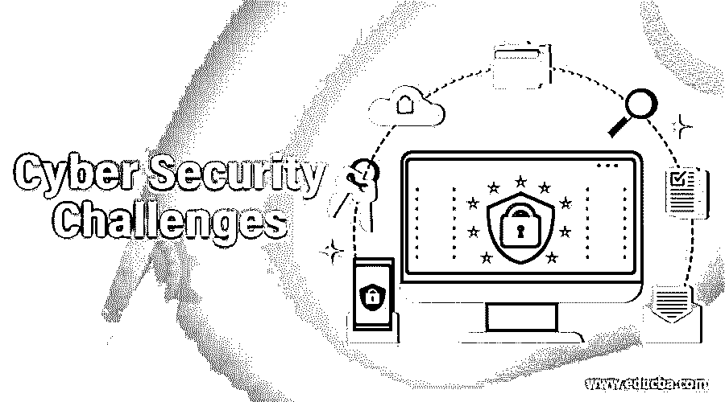
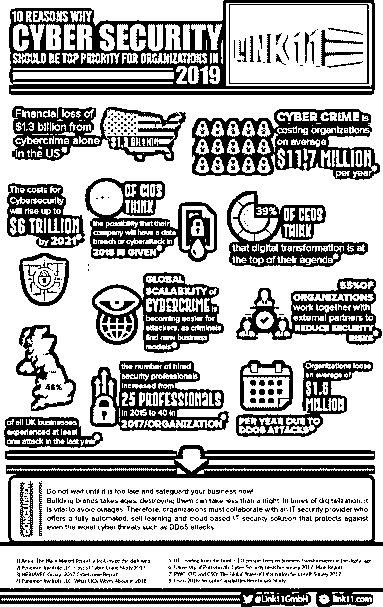
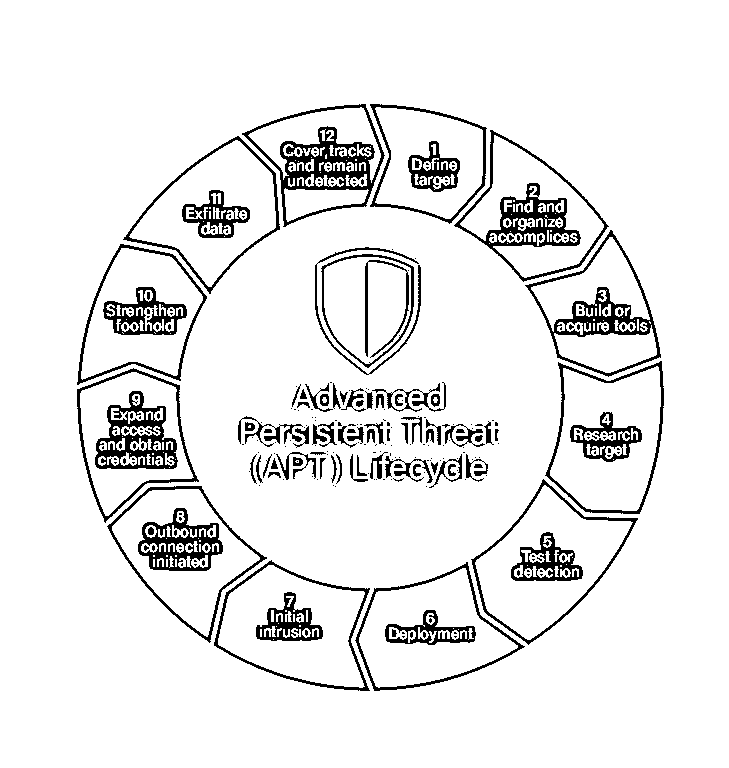
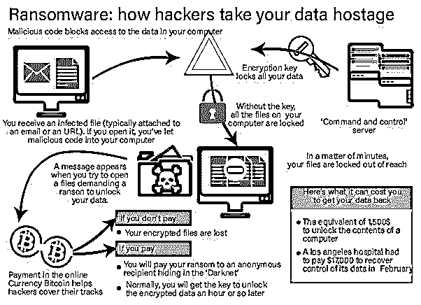
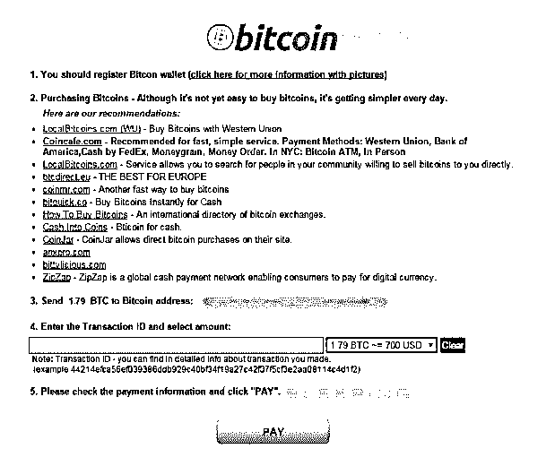
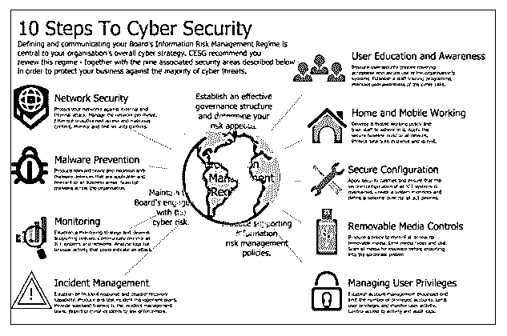

# 网络安全挑战

> 原文：<https://www.educba.com/cyber-security-challenges/>

## 网络安全挑战简介

网络安全挑战一直是当今世界的国家安全问题，从小型到大型企业、政府和私立大学、医院的组织都容易受到来自全球的网络攻击。此外，在我们寻求应对新出现的威胁的过程中，我们经常面临为了保护自己的领土而必须应对的挑战。

你可能最近听说维基百科在中东国家的一些地区被离线(2019 年 9 月 9 日)，因为它受到了大规模和广泛分布的[拒绝服务攻击](https://www.educba.com/denial-of-service-attack/)。因此，如果坏人不提供免费教育，我们还能从他们那里期待什么呢？

<small>网页开发、编程语言、软件测试&其他</small>

下面是一个 crisp，它详细说明了为什么网络安全挑战应该是顶级组织的首要任务。

### 主要网络安全挑战

以下是主要网络安全挑战的详细情况:

#### 1.高级持续威胁

*   [高级持久](https://www.educba.com/advanced-persistent-threats/)威胁以隐秘的方式渗透系统和服务器，并在那里停留更长时间，而不会被任何人注意/检测到。
*   它们是专门为挖掘高度敏感的信息而设计的，如今，许多组织无法保护自己免受高级持续威胁攻击。
*   apt 不同于典型的恶意软件，它们是专门为某个目的而设计的，换句话说，它们是为有针对性的攻击而制造的。例如，下面描述了高级持续威胁的一个生命周期。

#### 2.勒索软件的演变

*   在过去的几年里，勒索软件攻击普遍增加。勒索软件也可以归类为 APT 攻击的一种[类型](https://www.educba.com/advanced-persistent-threats/)，恶意软件渗透到你的系统内部，随着时间的推移，它开始慢慢加密你所有的文件。
*   最后，一个人系统上的所有文件都被锁定，并被索要赎金，通常是以比特币的形式(因为很难追踪到它)。
*   一旦支付完毕，黑客就会提供一个解密密钥，用这个密钥可以解密所有的数据，并返回访问权限。
*   可能有这样的情况，一个心态非常糟糕的黑客可能拿走了所有要求的钱，但仍然没有给出解密密钥。
*   勒索软件是网络安全、数据专业人员、IT 和高管的祸根。下面是一个勒索病毒攻击的剖析。

勒索软件的一些例子是 Cryptolocker、Bad Rabbit、Wanna cry、Goldeneye、Zcrypter、Jigsaw、Petya 等。

#### 3.物联网威胁(通过受损 IoT 设备的攻击)

*   IoT 代表物联网。物联网是一个由相互关联的计算、数字和机械设备组成的系统，可以通过网络传输数据，而无需任何人对人和人对计算机的干预。
*   所有这些[物联网设备](https://www.educba.com/iot-devices/)都有一个唯一的标识符，通过唯一的代码来识别设备。在当今世界，我们使用的每一台数字设备都可以与网络相连，是的，这种情况几乎在全球各地都在发生。
*   通过这样做，我们可以从一个操作点控制大多数电器和设备，比如说你的手机。在当今世界，你可以用手机关灯，操作 Alexa，操作冰箱和洗衣机等。所以，现在许多消费设备都是互连的。
*   换句话说，如果你访问了一个设备，你就访问了所有设备，这导致攻击和安全漏洞的风险增加。
*   这些差距可能有许多原因，如不安全的网络界面和数据传输、缺乏安全知识、身份验证方法不足、不安全的 wifi 等。下图显示了与物联网相关的威胁。

#### 4.云安全

*   存在恐惧，许多组织不愿意将他们的数据放在云上，他们希望保留一段时间，除非确保云是一个高度安全的地方，并且符合[本地安全标准](https://www.educba.com/cyber-security-standards/) s。
*   主要原因是，大机构都有自己的数据中心。他们对它有完全的控制权；数据位于他们的站点和网络(即内部网络)中。相比之下，在云的情况下，数据不再位于公司自己的数据中心，而且网络变成了外部网络，这带来了风险。
*   很少有问题会导致云攻击，很少有问题会导致云攻击——云配置错误、不安全的 API、Meltdown 和 Specter 漏洞、自然灾害导致的数据丢失或人为错误。

#### 5.对加密货币和区块链采用的技术的攻击

*   加密货币和区块链等技术开始实施的时间并不长。
*   由于这些技术刚刚跨过它们的婴儿期，并且存在着它们进化的巨大路径，所以公司采用这些技术但不实施适当的安全控制是一个很大的威胁；首先，他们可能没有意识到差距本身。
*   因此，建议在实施这些技术之前了解安全控制。一些攻击是 Eclipse 攻击、Sybil 攻击和 DDOS 攻击。

#### 6.在人工智能和机器学习的帮助下设计的攻击

毫无疑问，来自世界各地的大数据正出于各种目的被输入到人工智能系统中，它帮助我们做出决策。虽然这是好的一面，但也有不好的一面。黑客还可以使用人工智能和机器学习来设计创新的解决方案，以执行更复杂的攻击。

这都是关于网络安全的挑战，我们已经谈到了主要挑战，但我们也可能有兴趣了解关于网络安全步骤的信息。

### 推荐文章

这是网络安全挑战指南。在这里，我们讨论了简介和主要的网络安全挑战，包括高级持续威胁、勒索软件的演变、物联网威胁、云安全、加密货币攻击和区块链采用的技术。您也可以阅读以下文章，了解更多信息——

1.  [什么是网络安全？](https://www.educba.com/what-is-cyber-security/)
2.  [网络安全的类型](https://www.educba.com/types-of-cyber-security/)
3.  [网络安全职业](https://www.educba.com/careers-in-cyber-security/)
4.  [网络营销](https://www.educba.com/cyber-marketing/)

