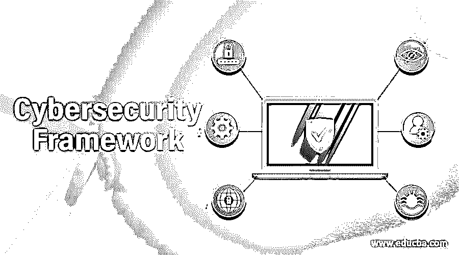

# 网络安全框架

> 原文：<https://www.educba.com/cybersecurity-framework/>

## 网络安全框架简介

对于任何行业来说，都有一些标准可以帮助该行业平稳地开展业务，同时遵守政府政策。同样，网络安全中也存在一些标准或框架，帮助组织遵守被认为是强制性的[安全政策](https://www.educba.com/security-policies/)，同时保持运营安全和平稳运行。

标准取决于组织或行业的类型，以及选择标准的目的。安全专业人员必须注意所有必须满足的要求，以便符合特定的标准。这些标准旨在保护企业或组织的安全，因此每个有资格的人都必须遵守这些标准。在这里，我们将看到一些非常常用的重要网络安全框架。

<small>网页开发、编程语言、软件测试&其他</small>

### 什么是网络安全框架？

*   它可被定义为组织或任何合格机构为遵守特定框架或标准而必须遵循的一套政策。
*   这些策略由检查审计报告的认证机构定义，以便最终确定组织是否实际遵守特定的框架。根据组织的要求，这取决于哪种框架适合他们，或者他们应该选择加入以安全的方式确保业务连续性。在某些情况下，组织需要遵循不止一个框架，以确保涵盖其业务的所有安全方面。
*   换句话说，网络安全框架也可以解释为企业为了其业务安全而必须遵守的规则。因此，对于组织来说，这不是一件可有可无的事情，而是一件政府发挥重要作用的强制性事情。
*   针对不同的目的，有不同的框架。例如，如果一个组织愿意接受在线支付，在这种情况下，他们需要遵守 PCI DSS 合规性，然后才能在其系统中实施在线支付机制。同样，对于处理患者数据的医院来说，必须遵守 HIPAA 合规性，同样，市场上也有一些组织为了运营而必须遵守的框架。

### 网络安全框架的类型

有几种网络安全框架可供组织根据其要求进行选择。

以下是世界各地经常使用的一些最重要的框架。

#### 1.NIST 框架

NIST 是用于提高关键基础设施安全性的最重要框架之一。基础设施安全是任何组织的重要组成部分。NIST 框架确保一些严格的政策能够导致对基础设施的保护。

#### 2.PCI DSS

PCI DSS 代表支付卡行业数据安全标准。这可以被定义为愿意接受或处理在线支付的组织必须遵循的标准。这个标准关注的是保护用户免受在线欺诈。为了符合这一标准，组织必须确保非常小心地处理用户的敏感信息。例如，除非需要，否则不应该存储用户的卡的详细信息。交易必须在安全模式下完成，诸如此类。这种标准遵从性使用户对组织感到信任，因为他们的关键数据仍然是安全的。

#### 3.ISO 270001

ISO 270001 是网络安全领域的主要标准之一。为了符合该标准，组织必须遵循一些基本规则。例如，在申请符合该标准时，组织的系统必须没有漏洞；组织应该经常生成健康报告，应该有一个 SOC 设置来保护网络，以防止用户的数据等类似的事情。**T3】**

### 成分

网络安全由用于处理此问题的组件组成。这些组件对于任何组织的利用都起着至关重要的作用。

以下是组件:

*   **核心:**它是网络安全框架三个组成部分中的第一个。顾名思义，它与网络安全框架的初始阶段有关。
*   **实施层:**实施层是网络安全框架的下一个重要组成部分。它关注的是框架在任何组织中的实施。因此，在实际实现特定框架时，安全专家必须小心实现层。
*   **配置文件:**配置文件是网络安全框架的最后一个组成部分，它关注的是用户，这些用户应该是符合标准或框架的系统的一部分。

### 如何实施网络安全框架？

它完全是关于在组织中实施安全措施，以便保持业务连续性。为了实现它，组织必须需要遵循特定框架下的一组特定规则。有几件事情必须注意，如基础设施应该是安全的，系统中应该没有漏洞，用于保护系统的软件应该更新，等等。因此，任何确保遵循特定框架下定义的整套政策的组织都被认为是实施网络安全框架的良好组织。

### 结论

以安全的方式确保业务连续性是保护组织系统的最重要的部分。为了符合这些框架，企业必须遵循一些重要的规则。如果企业需要引入特定的功能来运行其运营，比如创建一个接受在线支付的系统，那么企业必须遵守特定的标准或框架。

### 推荐文章

这是一个网络安全框架指南。在这里，我们讨论网络安全框架的介绍、类型和各种组件，以及如何实现它。您也可以浏览我们推荐的其他文章，了解更多信息——

1.  [网络安全基础知识](https://www.educba.com/cybersecurity-basic/)
2.  [投资网络安全](https://www.educba.com/invest-in-cybersecurity/)
3.  [网络安全基础知识](https://www.educba.com/cybersecurity-fundamentals/)
4.  [网络营销](https://www.educba.com/cyber-marketing/)

