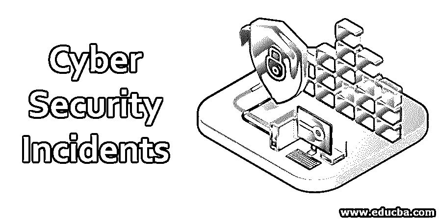

# 网络安全事件

> 原文：<https://www.educba.com/cyber-security-incidents/>

## 网络安全事件介绍

当组织中的系统受到危害时，会使用术语“网络安全事件”,而不是“破坏”,或者使用黑客术语。这意味着网络安全事件和入侵或黑客这两个术语是有区别的。让我们理解这两个术语之间的区别。incident 这个词听起来没有恶意，但是从来不用来形容积极的事情。事件是一个很麻烦的词，网络安全事件这个词也是。

如果信息受到威胁而没有被泄露，那么就说明这是一次网络安全事件。例如，如果一次网络攻击被一个组织成功击退，那么它就是一次事故，而不是一次违规。指示组织中的系统或数据受损的事件，或者组织中保护系统或数据的措施是否存在故障的事件，称为安全事件。

<small>网页开发、编程语言、软件测试&其他</small>

### 检测网络安全事件

有几种方法可以检测安全事件。它们是:

*   **特权用户帐户异常行为:**如果特权用户帐户的行为出现异常，这表明有人正在使用特权用户帐户对网络进行未经授权的访问。
*   **未经授权的内部人员访问的服务器和数据:**内部人员可以访问的系统和数据将由内部人员进行测试。如果未经授权的用户试图访问服务器和数据，试图访问与其工作无关的数据，异常时间从异常位置登录，或试图在短时间内从多个位置登录，都是警告信号。
*   **出站网络流量异常:**组织不仅应该担心进入网络的流量，还应该担心监控离开其边界的流量。离开其外围的流量包括内部人员上传到个人云应用程序的大文件、下载到外部存储设备(如 USB 闪存驱动器)的大文件，或者公司外部发送的带有附件的大量电子邮件。
*   **发送到未知位置的流量或从未知位置发送的流量:**假设某个组织仅在一个国家/地区运营，发送到其他国家/地区的流量表明存在恶意活动。对任何未知网络流量的调查必须由管理员完成，以确保流量是合法的。
*   **消耗过多:**服务器内存或硬盘性能提升，意味着攻击者在非法访问服务器内存或硬盘。
*   **配置更改:**未经批准的服务重新配置、启动程序安装或防火墙更改等更改表示可能存在恶意活动。这同样适用于添加的计划任务。
*   **隐藏的文件:**隐藏的文件被认为是可疑的，因为它们的文件名、大小或指示数据或日志的位置可能被泄露。
*   **意外更改:**意外更改是指用户帐户被锁定、密码更改或组成员资格更改。
*   **异常浏览行为:**异常浏览行为包括不必要的重定向、浏览器配置更改或不断重复的弹出窗口。
*   **可疑的注册表项:**当 windows 系统被恶意软件感染[时，就会出现可疑的注册表项，这是恶意软件确保自己留在被感染系统中的主要方式之一。](https://www.educba.com/what-is-malware/)

### 网络安全事件的攻击媒介

黑客获取对计算机或网络服务器的访问权以传递恶意结果的途径或手段称为攻击媒介。黑客可以通过攻击媒介来利用系统的漏洞。病毒、电子邮件附件、网页、弹出窗口、即时消息、聊天室、欺骗等。都是攻击媒介。所有这些方法都涉及到硬件和编程。任何事件都可以由组织来处理，但主要重点应该是使用常见的攻击媒介来处理事件。使用常见攻击媒介的安全事件有:

*   **可移动介质或外部介质:**可移动介质，如光盘、闪存盘或外围设备执行攻击。
*   **损耗:**损耗攻击使[使用暴力方法](https://www.educba.com/what-is-a-brute-force-attack/)来危害、降低或破坏网络、系统和服务。
*   **Web:** 利用网站或基于 Web 的应用程序来执行攻击。
*   **电子邮件:**电子邮件消息或电子邮件中的附件执行攻击。黑客诱使收件人要么点击指向受感染网页的链接，要么打开受感染的附件。
*   **不当使用:**此类事件的根本原因是用户违反了组织的可接受使用政策。
*   **偷渡式下载:**在用户不知情的情况下，用户打开触发恶意软件下载的网站。网络浏览器中的漏洞被偷渡式下载利用来注入恶意代码[，这些代码使用 javascript](https://www.educba.com/uses-of-javascript/) 和浏览器的其他功能。
*   **基于广告的恶意软件:**基于广告的恶意软件也叫 malvertising。恶意软件嵌入在网站的广告中，通过这些广告执行攻击。只要打开恶意广告，就可以将恶意软件注入不安全的设备。受信任的应用程序也会受到恶意广告的影响。
*   **鼠标悬停:【PowerPoint 等知名软件中的漏洞被鼠标悬停利用。当用户将鼠标悬停在链接上而不是点击它时，shell 脚本将自动启动。**
*   Scareware: 通过吓唬用户，诱使用户下载和购买不想要的、看起来很危险的软件，这就是 Scareware 所做的。Scareware 使用户相信他的计算机有病毒，并建议用户下载并让他支付假冒的杀毒软件来清除病毒。如果用户下载并执行软件中的程序，系统就会感染恶意软件。

### 结论

影响系统完整性或可用性的安全漏洞被称为网络安全事件。网络安全事件的典型案例包括试图获得对系统或数据的未授权访问、使用未授权的系统处理或存储数据、未经所有者同意更改系统的固件、软件或硬件、恶意破坏或拒绝服务等。

### 推荐文章

这是网络安全事件指南。在这里，我们讨论网络安全事件以及攻击媒介的介绍和检测。您也可以浏览我们的其他相关文章，了解更多信息——

1.  [网络安全工具](https://www.educba.com/cyber-security-tools/)
2.  [网络安全标准](https://www.educba.com/cyber-security-standards/)
3.  [安全策略](https://www.educba.com/security-policies/)
4.  [网络安全挑战](https://www.educba.com/cyber-security-challenges/)

