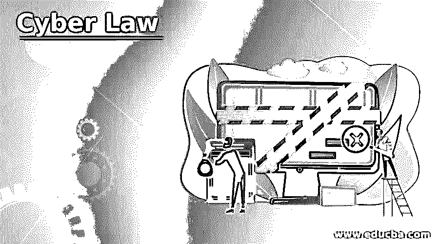

# 网络法律

> 原文：<https://www.educba.com/cyber-law/>

## 网络法导论

网络法的总体法律框架与信息基础设施有关，并规范信息、电子商务、应用程序和信息保护的自动交换。它与合法的计算和电子相关，包括 It、应用程序、计算机和硬件。它涵盖多个部门，如互联网连接和使用，包括不同的副主题、言论自由和在线隐私。网络法规通过保护未经授权的个人获取信息、与互联网使用有关的言论自由、匿名、通信、电子通信、网站、知识产权、硬件和软件(例如数据存储设备)来预防或防止大规模网络犯罪主义。

由于每天快速增长的互联网流量，全球范围内出现了更多的法律问题。由于网络法规的差异，赔偿从罚款到监禁各不相同，合规也很复杂。对于那些使用互联网和经营在线企业的人来说，网络法提供了法律保障。网民最重要的是了解自己国家的当地和网络法律，从中可以了解网络上的哪些行为合法与否。他们也可以禁止我们擅自行动。

<small>网页开发、编程语言、软件测试&其他</small>

### 为什么网络法很重要？

*   使用互联网还有安全问题，甚至还有各种恶意的个人想要对计算机设备进行未授权的访问并实施未来的欺诈。
*   因此，每一个规则，网络法是为了保护互联网组织和个人在网络上免受不必要的访问和恶意的人。
*   当一个人实施犯罪行为或违反网络法律时，他们会向个人或协会提出建议或对其采取行动。

### 网络法涉及什么？

出于各种原因，这些法律涉及众多互联网实践和领域。有些法律是为了定义某个实体内的互联网和设备政策而制定的，而其他法律则是为了向公民提供保护，防止未经授权的用户进行有害活动。

网络立法有不同的一般类别:

#### 1.骗局

有许多互联网欺诈和骗局可以直接损害任何企业或个人。网络立法提供了许多保护个人和打击网络数据欺诈和金融犯罪的手段。

#### 2.欺骗

制定网络法是为了遏制网络金融犯罪，如身份欺诈、信用卡抢劫等。如果一个人犯了某种形式的身份欺诈，他可能会面临联邦或州的刑事指控。在这些规则中明确了继续使用互联网和防止互联网使用投诉的严格政策。

#### 3.版权问题

互联网是众多数据表单的中心，可以在任何地方访问。但是抄袭其他人的内容是每个人的权利。在网络法中，如果任何人违反版权保护个人和公司的艺术作品，就会制定严格的规则。

### 如何在网上保护自己？

尽管互联网是一个包含众多类型内容的资源，但许多黑客或未经授权的用户很可能会伤害您，窃取您的个人信息。以下是所有的预防措施，将有助于您在使用互联网时保持个人数据和计算机的安全。即使他们使用那种机器、软件或操作系统，所有的措施或建议对所有的计算机用户都是有用的。

#### 1.使用安全密码

强烈建议您使用非常安全的通行证，如网上银行网站或其他包含敏感信息的网站；对于所有需要用户 ID 和密码的站点，您可以使用单独的强密码。如果你需要帮助来回忆你的秘密，你可以使用密码生成器。

#### 2.电子邮件没有加密

如果您通过电子邮件发送敏感信息，未经授权的用户将会阅读或解读这些信息，因为电子邮件没有加密。借记卡、信用卡、地址等机密信息。，则不能通过电子邮件提交。

#### 3.网络钓鱼诈骗

有几种网络钓鱼骗局和策略会使机密信息变得更加危险。因此，必须熟悉各种方法。黑客攻击的网站大多需要登录易贝，包括贝宝、亚马逊、网上银行等。

### 网络法的重要性

*   建立网络法规是为了起诉那些实施非法网络行为的人。
*   这些问题，如网络滥用，攻击另一个网站或个人，窃取记录，扰乱每个企业的在线工作流程，以及其他犯罪活动，都有必要受到起诉。
*   当任何人违反网络法时，将根据他违反的网络法类型、他住在哪里以及他在哪里违反了法律，对个人采取行动。
*   最关键的是起诉或撤销黑客，因为大多数网络犯罪超出了重罪的界限，而不是典型的犯罪。

### 结论

在这篇文章中，我们看到了什么是网络法，以及它如何帮助规范用户的在线活动。

### 推荐文章

这是一个网络法律指南。这里我们讨论一下引言，它为什么重要？涉及到什么？在网上如何保护自己？重要性。您也可以看看以下文章，了解更多信息–

1.  [网络取证](https://www.educba.com/cyber-forensics/)
2.  [网络安全工具](https://www.educba.com/cyber-security-tools/)
3.  [网络安全标准](https://www.educba.com/cyber-security-standards/)
4.  [什么是白帽黑客？](https://www.educba.com/what-is-white-hat-hackers/)

