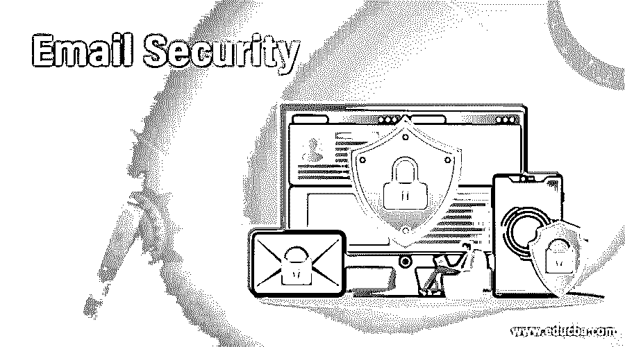

# 电子邮件安全性

> 原文：<https://www.educba.com/email-security/>

## 电子邮件安全协议简介

电子邮件也许是互联网上最广泛使用的应用。使用电子邮件，互联网用户可以向其他互联网用户发送信息或数据，如图片、视频、声音、文件等。因此，电子邮件信息的安全已经成为一个极其重要的问题。电子邮件安全是保护电子邮件帐户及其内容免受黑客(即未经授权的用户)攻击的过程。有一些电子邮件安全协议已被用来保护用户的帐户和数据免受黑客攻击。

### 电子邮件安全协议

有三种主要的电子邮件安全协议，即 PEM、PGP 和 MIME。让我们逐一讨论这些协议。

<small>网页开发、编程语言、软件测试&其他</small>

#### 1.PrivacyEnhancedMail 增强的私密电子邮件

PEM 代表 Privacy-Enhanced Mail，是 IAB(互联网架构委员会)采用的一种电子邮件安全协议，用于在互联网上提供安全的电子邮件通信。PEM 最初是由 IRTF(互联网研究任务组)和 PSRG(隐私安全研究组)开发的。然后他们把这个 PEM 协议交给了 IETF(互联网工程任务组)PEM 工作组。在四个规范文档 RFC 1421、RFC 1422、RFC 1423 和 RFC 1424 中描述了隐私增强邮件。它支持加密功能，如加密、不可否认性和消息完整性。

##### PEM 的工作

隐私增强邮件从规范对话开始，随后是数字签名，然后是加密，最后是 Base-64 编码。

第一步:规范对话

很有可能发送者和接收者的电子邮件消息使用具有不同操作系统和不同体系结构的计算机，因此这些计算机可能以两种不同的方式显示相同的概念。例如，在运行 MS-DOS 的计算机上计算的电子邮件消息的消息摘要可能不同于在运行 Unix 操作系统的计算机上计算的消息摘要，因为在这两种情况下用于创建消息摘要的输入是不同的。PEM 将每封电子邮件转换成抽象、规范的表示形式。也就是说，不管发送和接收计算机的操作系统及其体系结构如何，电子邮件消息总是以统一和独立的格式传输。

**第二步:**数字签名

在此步骤中，使用 MD2、MD5 等算法创建电子邮件的消息摘要。一旦创建了消息摘要，就用发件人的私钥对其进行加密，以便为发件人创建数字签名。

**第三步:**加密

在此步骤中，原始电子邮件和数字签名使用对称密钥一起加密。

**第四步:** Base-64 编码

Base-64 编码过程将任意二进制输入转换为可打印的字符输出。

#### 2.电子邮件加密程序

PGP 代表相当好的隐私，是一种电子邮件安全协议，由 Phil Zimmerman 开发。pretty Good Privacy 的好处是它支持基本的加密要求，使用简单，并且完全免费，包括其源代码和文档。但是，对于那些需要支持组织，可以从一个名为 via crypt 的组织获得一个低成本的 PGP 商业版本。与 PEM 协议相比，PGP 协议已经变得非常流行并且使用最广泛。相当好的隐私支持加密功能，如加密、不可否认性和消息完整性。

##### PGP 的工作

相当好的隐私工作如下

**第一步:**数字签名

在电子邮件的消息编辑过程中，消息是使用 SHA-1 算法创建的。然后，用发送方的私钥对该消息摘要进行加密，以创建数字签名。

**第二步:**压缩

在这一步骤中，为了减小将要传输的消息的大小，输入消息和数字签名被一起压缩。

**第三步:**加密

在这一步中，步骤 2 的压缩输出用对称密钥加密。

**第四步:**数字包络

在此步骤中，步骤 3 中使用的密钥用接收方的公钥加密。步骤 3 和步骤 4 的输出一起形成数字包络

**第五步:** Base-64 编码

在这一步中，如果步骤 4 的输出被编码。

#### 3.哑剧

MIME 代表多用途互联网邮件扩展，是一种电子邮件安全协议，它通过允许用户使用基本电子邮件系统发送二进制文件来扩展基本电子邮件系统。

##### MIME 函数

MIME 提供的功能如下

*   **封装数据:**由任何类型的加密内容和用接收方公钥加密的加密密钥组成
*   **签名数据:**由消息摘要组成，消息摘要是发送方的加密私钥。内容和数字签名都是 Base-64 编码的。
*   **明文签名数据:**与签名数据相似，唯一的区别是这里的数字签名是 Base-64 编码的
*   **签名和封装-数据:**仅签名和仅封装实体。可以合并，以便可以对封装的数据进行签名，或者可以封装已签名的数据。

##### MIME headers

*   **MIME 版本:**包含 MIMR 版本号，当前值为 1
*   **content-type:** 描述消息体中包含的数据。所提供的细节是足够的，使得电子邮件系统能够以适当的方式处理所接收的电子邮件消息
*   **内容传输编码:**它指定了用于表示消息体的转换类型。
*   **内容 ID:** 唯一标识多个上下文的 MIME 实体
    内容描述:当正文不是可读格式时使用，如图像、视频。

### 推荐文章

这是电子邮件安全指南。这里我们讨论各种电子邮件安全协议，这些协议有助于加密互联网上计算机之间的通信信道。您也可以看看以下文章，了解更多信息–

1.  [专业邮箱](https://www.educba.com/professional-email/)
2.  [JavaScript 中的电子邮件验证](https://www.educba.com/email-validation-in-javascript/)
3.  [自动营销邮件](https://www.educba.com/automated-marketing-emails/)
4.  [PHP 电子邮件表单](https://www.educba.com/php-email-form/)

