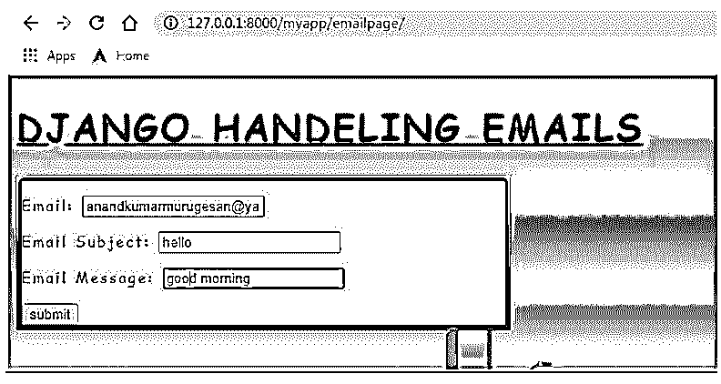
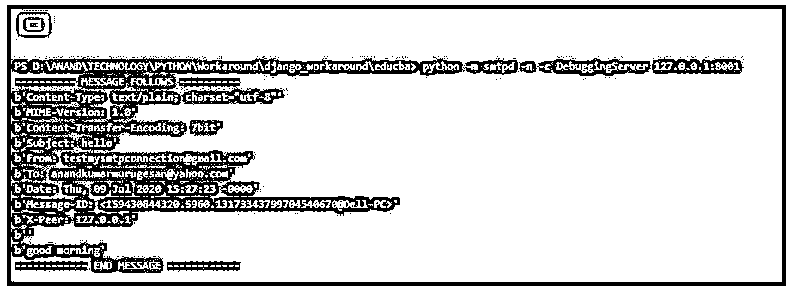

# 姜戈邮报

> 原文：<https://www.educba.com/django-mail/>

## Django 邮件简介

除了 python 提供的 smtp 邮件连接，Django 还提供了 django.core.mail 库来处理电子邮件请求。因此，任何面向电子邮件的过程都可以由这个库以非常灵活的方式来处理。我们可以使用这个库发送电子邮件给外部用户，网站管理员，网站经理，也可以触发电子邮件的附件，甚至电子邮件的大批量用户。它灵活地改变了基于 Django 的框架中的电子邮件交付过程，并且精确地加速了电子邮件交付过程。

### Django 邮件是如何工作的？

下面给出了 Django 邮件的工作方式:

<small>网页开发、编程语言、软件测试&其他</small>

1.要将电子邮件设置连接到 Django，下面列出的电子邮件配置应该在设置中。PY 文件。

*   EMAIL _ HOST-SMTP 服务器。
*   电子邮件主机用户 SMTP 服务器登录凭据。
*   电子邮件主机密码 SMTP 服务器密码凭据
*   EMAIL _ PORT SMTP 服务器的端口。
*   EMAIL_USE_TLS 或 _ SSL 如果是安全连接，则为 True。

**代码:**

`#---------- EMAIL HANDELING ----------#
EMAIL_BACKEND = 'django.core.mail.backends.smtp.EmailBackend'
EMAIL_HOST = 'smtp.gmail.com'
EMAIL_PORT = 587
EMAIL_HOST_USER = 'testmysmtpconnection@gmail.com'
EMAIL_HOST_PASSWORD =  '*********'
EMAIL_USE_TLS = True`

#### 形容词（adjective 的缩写）电子邮件 _ 后端

使用的电子邮件后端协议在 EMAIL_BACKEND 变量中引用。其中一些协议是 SMTP，SMTPS，IMAP 等。默认情况下，django 使用 smtp 协议，将变量设置为' django . core . mail . backends . SMTP . email back end '只代表 SMTP，唯一的问题是这里明确提到了它。

#### b.电子邮件 _ 主机

电子邮件主机是指预期到达的电子邮件提供商，它代表该电子邮件提供商的 smtp 主机名。

**举例:**

smtp.mail.yahoo.com

#### 碳（carbon 的缩写）电子邮件端口

电子邮件端口是指为 smtp 连接打开的电子邮件提供商端口。

**举例:**

雅虎的端口号是 465

#### d.电子邮件 _ 用户

这代表要连接的电子邮件帐户的用户名。

**举例:**

user1@gmail.com

#### e.电子邮件 _ 密码

这代表相应电子邮件帐户的密码。

#### 氟（fluorine 的缩写）电子邮件 _ 使用 _TLS

此参数用于说明是否需要打开 TLS 安全连接。

2.下一个关键步骤是使用 django.core.mail。

django.core.mail 库有四种处理电子邮件的方法。

*   send_mail()
*   发送大量邮件()
*   mail_admins()
*   邮件管理器()

#### 形容词（adjective 的缩写）send_mail()

**语法:**

`send_mail(subject, message, from_email, recipient_list, fail_silently=False, auth_user=None, auth_password=None,connection=None, html_message=None)`

**描述:**

此方法发送电子邮件，并公布发送的邮件数量。

#### b.发送大量邮件()

**语法:**

`send_mass_mail(datatuple, fail_silently=False, auth_user=None, auth_password=None, connection=None)`

**描述:**

向广泛的人群发送邮件，数据元组是以下元素的组合。

(主题、消息、发件人电子邮件、收件人列表)

#### 碳（carbon 的缩写）mail_admins()

**语法:**

`mail_admins(subject, message, fail_silently=False, connection=None, html_message=None)`

**描述:**

发送邮件给管理员，因为管理员的名字是在管理员设置中声明的。

#### d.邮件管理器()

**语法:**

`mail_managers(subject, message, fail_silently=False, connection=None, html_message=None)`

**描述:**

在经理设置中声明经理姓名时，向副经理发送邮件。

**举例:**

**代码:**

`send_mail(
'Subject',
'Message.',
'from_email@example.com',
['end_email1@example.com', 'end-email2@example.com'],
)`

**Note:** The major difference between send_mail() and send_mass_mail() is for send_mass_mail() the server connections remains permanent, whereas for send emails it is established for each and every send mail call.3\. Creating a temporary smptp server within the system for debugging purpose.

**代码:**

`python -m smtpd -n -c DebuggingServer 127.0.0.1:8001`

**输出:**

### Django 邮件示例

下面是提到的例子:

#### 示例#1

在第一个示例中，电子邮件在临时 smtp 服务器中被捕获，该服务器被设置为在端口 8001 监听。django 服务器本地主机 id (127.0.0.1)也被设置为主机名。

形容词（adjective 的缩写）在 SETTINGS.py 文件中进行电子邮件配置。

**SETTINGS.py**

**代码:**

`#---------- EMAIL HANDELING ----------#
EMAIL_BACKEND = 'django.core.mail.backends.smtp.EmailBackend'
EMAIL_HOST = '127.0.0.1'
EMAIL_PORT = 8001
EMAIL_HOST_USER = ''
EMAIL_HOST_PASSWORD = ''
EMAIL_USE_TLS = True`

b.设置电子邮件处理的视图。该视图有三个通过表单的字段，这些字段是从前端网页捕获的，并标记到 send_email()方法以触发电子邮件。

**Views.py**

**代码:**

`def email_sending(request):
email = emailform()
if request.method == 'POST':
email_id =  request.POST['email'] email_subject =  request.POST['email_subject'] email_message =  request.POST['email_message'] res = send_mail(email_subject,email_message,'testmysmtpconnection@gmail.com',[email_id],fail_silently = False)
return HttpResponse('%s'%res)
return render(request, 'emailpage.html',{"email":email})`

**forms.py**

**代码:**

`from django import forms
class emailform(forms.Form):
email = forms.EmailField()
email_subject =  forms.CharField()
email_message =  forms.CharField(max_length = 2000)`

碳（carbon 的缩写）制定准备网页的模板。

**代码:**

`<!DOCTYPE html>
<html lang="en" dir="ltr">
<head>
<meta charset="utf-8">
<title>Django App1</title>

<link href="" rel="stylesheet">

</head>
<body>
<h1> <u> DJANGO HANDELING EMAILS </u> </h1>

<form method =  'POST'>
{{ email.as_p }}

<input type="submit" class="btn btn-primary" value="submit" style="text-align:center">
</form>

</body>
</html>`

d.在调试模式下启动电子邮件服务器。一旦启动，服务器的端口将监听接收发布到该端口的任何消息。

**输出:**

**网页:**

**服务器端口:**

#### 实施例 2

在第二个示例中，使用有效的邮件帐户触发电子邮件。

形容词（adjective 的缩写）在 SETTINGS.py 文件中进行电子邮件配置。

**SETTINGS.py**

**代码:**

`#---------- EMAIL HANDELING ----------#
EMAIL_BACKEND = 'django.core.mail.backends.smtp.EmailBackend'
EMAIL_HOST = 'smtp.gmail.com'
EMAIL_PORT = 587
EMAIL_HOST_USER = 'testmysmtpconnection@gmail.com'
EMAIL_HOST_PASSWORD =  '*********'
EMAIL_USE_TLS = True`

b.制定准备网页的模板。

**代码:**

`<!DOCTYPE html>
<html lang="en" dir="ltr">
<head>
<meta charset="utf-8">
<title>Django App1</title>

<link href="" rel="stylesheet">

</head>
<body>
<h1> <u> DJANGO HANDELING EMAILS </u> </h1>

<form method =  'POST'>
{{ email.as_p }}

<input type="submit" class="btn btn-primary" value="submit" style="text-align:center">
</form>

</body>
</html>`

**输出:**

**网页:**

**电子邮件快照:**

### 结论

在上面的文章中，用合适的工作示例解释了调试面向电子邮件设置和触发电子邮件到实时电子邮件 SMTP 的过程。

### 推荐文章

这是 Django 邮件指南。这里我们讨论 Django 邮件的介绍，它是如何工作的，并分别举例说明。您也可以看看以下文章，了解更多信息–

1.  [Django 中的表单验证](https://www.educba.com/form-validation-in-django/)
2.  [Django 框架](https://www.educba.com/django-framework/)
3.  Django 的应用
4.  [姜戈饼干](https://www.educba.com/django-cookies/)

