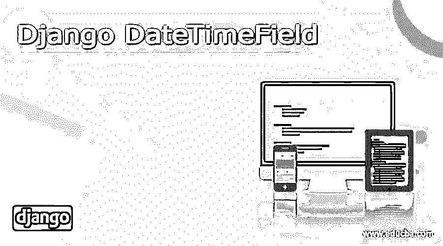
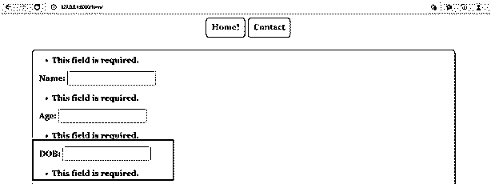

# Django 日期时间字段

> 原文：<https://www.educba.com/django-datetimefield/>

## Django DateTimeField 简介

根据 Django 所关心的，有几个字段类型，通过它们可以将日期和时间值注入到模型的存储中。这些字段之间的差异在于存储的数据的格式。有选项只存储日期值，甚至时间值可以单独捕获。根据日期时间字段，将捕获日期和时间值。用户将被期望在注入存储值时放置日期和时间值。存储的值可以再次被取回并显示在控制台上。

例如:2019 年 7 月 10 日 00 时 20 分

<small>网页开发、编程语言、软件测试&其他</small>

**语法:**

`Name_of_field = models.DateTimeField(**options)`

上述语法对应于 Django DateTimeField 示例。这里提到的第一列是相关字段的名称。第一列将形成字段名，接下来是模型。DateTimeField 扩展。这个扩展意味着从模型的部分导出 DateTime 字段方法。因此，模型的部分现在将导入 DateTimeField 方法来生成预期的字段。然后必须声明 DateTimeField()方法的参数。这里通常的值是 null 参数，它表示有效日期时间不在的记录的值。下一个参数将是空白参数。

### 创建 Django 日期时间字段

**1。Models.py 文件的变化:**

如语法部分所述，日期时间字段需要在 models.py 文件中声明。我们可以注意到日期时间字段在模型中被声明为年龄字段。

**(模型. py)**

`from django.db import models
from django.contrib.auth.models import User
# Model variables
# Create your models here.
class Bride(models.Model):
DATE_TIME_name = models.CharField(max_length=200,null=True)
DATE_TIME_age = models.Date Time field_Example_Field(null=True)
DATE_TIME_DOB = models. DateTimeField (null=True)
DATE_TIME_thegai = models.CharField(max_length=200,null=True)
DATE_TIME_State = models.CharField(max_length=50,null=True)
DATE_TIME_District = models.CharField(max_length=50,null=True)
DATE_TIME_Address = models.TextField(null=True)
DATE_TIME_Phone = models.BigInteger(null=True)
DATE_TIME_profession = models.CharField(max_length=200,null=True)
DATE_TIME_salary = models.BigInteger(null=True)
DATE_TIME_Under_Graduation_Degree = models.CharField(max_length=200,null=True)
DATE_TIME_Under_Graduation_college = models.CharField(max_length=400,null=True)
DATE_TIME_Post_Graduation_Degree = models.CharField(max_length=200,null=True)
DATE_TIME_Post_Graduation_college = models.CharField(max_length=400,null=True)
DATE_TIME_Rasi = models.CharField(max_length=200,null=True)
DATE_TIME_Nakshatra = models.CharField(max_length=200,null=True)
def __str__(self):
return self.name`

**2。Settings.py 文件中的更改:**

确保在 settings.py 文档中很好地设置了所有的值和数据库连接，以便可以灵活地执行风险。下面陈述的中间件对象需要在 settings.py 文档中很好地声明，因为即使在处理 GET 和 PUT 消息时，这些中心软件也要对软件的功能负责。此外，所使用的模板需要额外的填充，以便模板处理在后台进行。

**(Settings.py):**

`MIDDLEWARE = [
'django.middleware.security.SecurityMiddleware',
'django.contrib.sessions.middleware.SessionMiddleware',
'django.middleware.common.CommonMiddleware',
'django.middleware.csrf.CsrfViewMiddleware',
'django.contrib.auth.middleware.AuthenticationMiddleware',
'django.contrib.messages.middleware.MessageMiddleware',
'django.middleware.clickjacking.XFrameOptionsMiddleware',
] ROOT_URLCONF = 'Matrimony.urls'
TEMPLATES = [
{
'BACKEND': 'django.template.backends.django.DjangoTemplates',
'DIRS': [Template_DIR,],
'APP_DIRS': True,
'OPTIONS': {
'render_dict_processors': [
'django.template.render_dict_processors.debug',
'django.template.render_dict_processors.request',
'django.contrib.auth.render_dict_processors.auth',
'django.contrib.messages.render_dict_processors.messages',
],
},
},
]`

**3。url.py 文件的变化:**

媒体根和文档根变量需要在 url.py 文件中实例化，如下所示。url.py 文件的更改如下所述。

**url.py:**

`from django.contrib import admin
from django.urls import path
from django.conf.urls import url
from matrimony_pages import views
from django.conf import settings
from django.conf.urls.static import static
urlpatterns = [
url(r'^$',views.Welcome_page,name='Welcome_page'),
url(r'Mainpage/',views.Main_page,name='Main_page'),
url(r'form/',views.form_view,name='form_view'),
url(r"signup/", views.Sign_up_request, name="register"),
url(r"login/", views.login_request, name="login"),
path(r'profile/<str:pk>/',views.DATE_TIME_page,name='profile'),
url(r'logout/',views.logout_request,name='logout'),
url(r'reg/',views.DATE_TIME_reg_user,name='reg'),
path(r'update/<str:pk>/',views.form_update,name='update'),
path('admin/', admin.site.urls),
]+ static(settings.MEDIA_URL,document_root=settings.MEDIA_ROOT)`

**4。为表单创建视图:**

提交时必须存储日期时间字段值，检索时必须从数据库中提取。这可以通过为模型创建的对象来实现。下面的 views.py 部分解释了这样做的过程。

**Ex: views.py**

`@login_required
def DATE_TIME_page(request,pk):
render_dict2 = {}
Key_details = Bride.objects.get(id=pk)
DATE_TIME_name = Key_details.name
DATE_TIME_Age = Key_details.age
DATE_TIME_DOB = Key_details.DOB
DATE_TIME_Thegai = Key_details.thegai
DATE_TIME_state = Key_details.State
DATE_TIME_district = Key_details.District
DATE_TIME_Address = Key_details.Address
DATE_TIME_Phone = Key_details.Phone
DATE_TIME_Profession = Key_details.profession
DATE_TIME_Salary = Key_details.salary
DATE_TIME_UG = Key_details.Under_Graduation_Degree
DATE_TIME_UGC = Key_details.Under_Graduation_college
DATE_TIME_PG = Key_details.Post_Graduation_Degree
DATE_TIME_PGC = Key_details.Post_Graduation_college
DATE_TIME_UG = Key_details.Under_Graduation_Degree
DATE_TIME_UGC = Key_details.Under_Graduation_college
DATE_TIME_PG = Key_details.Post_Graduation_Degree
DATE_TIME_PGC = Key_details.Post_Graduation_college
DATE_TIME_Rasi = Key_details.Rasi
DATE_TIME_Nakshatra = Key_details.Nakshatra
render_dict2['Age'] = DATE_TIME_Age
render_dict2['DOB'] = DATE_TIME_DOB
render_dict2['name'] = DATE_TIME_name
render_dict2['thegai'] = DATE_TIME_Thegai
render_dict2['State'] = DATE_TIME_state
render_dict2['district'] = DATE_TIME_district
render_dict2['Address'] = DATE_TIME_Address
render_dict2['Phone'] = DATE_TIME_Phone
render_dict2['profession'] = DATE_TIME_Profession
render_dict2['Under_Graduation_Degree'] = DATE_TIME_UG
render_dict2['Under_Graduation_college'] = DATE_TIME_UGC
render_dict2['Post_Graduation_Degree'] = DATE_TIME_PG
render_dict2['Post_Graduation_college'] = DATE_TIME_PGC
render_dict2['Rasi'] = DATE_TIME_Rasi
render_dict2['Nakshatra'] = DATE_TIME_Nakshatra
print(Key_details.Creator)
print(render_dict2)
return render(request,'Profilepage.html',render_dict2)`

4)制定用于显示表单的 HTML 文件:必须对 HTML 页面进行相应的更改。

**Profilepage.html**

`<!DOCTYPE html>
<html style="font-size: 16px;">
<head>
<title>Profile</title>

<link rel="stylesheet" href="" media="screen">
<meta name="viewport" content="width=device-width, initial-scale=1, maximum-scale=1, minimum-scale=1" />
<!-- Script -->

</head>
<body class="body">
<nav class='navbar'>

<a class="navbar" onclick="redirect2()" >Home </a>
<a class="navbar" onclick="redirect2()" >Contact</a>
<a class="navbar" onclick="redirect1()" >Profiles</a>

</nav>

 






  
<h6><strong>Name : &nbsp&nbsp {{name}}</strong></h6>
<h6><strong>Age : &nbsp&nbsp {{Age}}</strong></h6>
<h6><strong>DOB : &nbsp&nbsp {{DOB}}</strong></h6>
<h6><strong>Thegai : &nbsp&nbsp {{thegai}}</strong></h6>
<h6><strong>State : &nbsp&nbsp {{State}}</strong></h6>
<h6><strong>district : &nbsp&nbsp {{district}}</strong></h6>
<h6><strong>Address : &nbsp&nbsp {{Address}}</strong></h6>
<h6><strong>Phone : &nbsp&nbsp {{Phone}}</strong></h6>
<h6><strong>profession : &nbsp&nbsp {{profession}}</strong></h6>
<h6><strong>Under Graduation Degree : &nbsp&nbsp {{Under_Graduation_Degree}}</strong></h6>
<h6><strong>Post_Graduation_Degree : &nbsp&nbsp {{Post_Graduation_Degree}}</strong></h6>
<h6><strong>Post_Graduation_college : &nbsp&nbsp {{Post_Graduation_college}}</strong></h6>
<h6><strong>Rasi : &nbsp&nbsp {{Rasi}}</strong></h6>
<h6><strong>Nakshatra : &nbsp&nbsp {{Nakshatra}}</strong></h6>


</body>
</html>`

**输出:**

### 结论

上述文章显示了与 DateTimeField 功能相对应的各种细节。还讨论了如何使用 Datetimefield、可以存储什么类型的值、字段的实际语法以及选择和存储值的一个实例。创建的示例的输出快照也共享以供参考。

### 推荐文章

这是 Django DateTimeField 的指南。在这里我们讨论了简介，语法，创建 Django DateTimeField，代码实现的例子。您也可以看看以下文章，了解更多信息–

1.  [姜戈集团由](https://www.educba.com/django-group-by/)
2.  [Django 静态文件](https://www.educba.com/django-static-files/)
3.  [姜戈回应](https://www.educba.com/django-response/)
4.  [姜戈会议](https://www.educba.com/django-session/)

