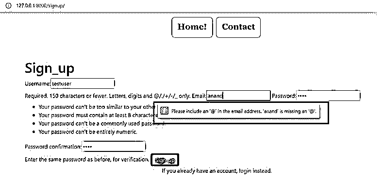

# Django 验证器

> 原文：<https://www.educba.com/django-validators/>

## Django 验证器简介

验证器可以用在 Django 的模型层或表单层。这些验证器负责验证字段。验证器有助于分析字段的性质以及字段中填充的值。更重要的是，这些验证器判断传递的数据，并将错误发布到屏幕上。这是 Django 验证器的主要优点。Django 验证器可以使用 clean()之类的方法来完成，甚至可以使用字段级验证器。这取决于所使用的验证器消息。

**语法:**

<small>网页开发、编程语言、软件测试&其他</small>

`Raise validationerror(“”)`

引发验证错误的过程是通过验证器进行的。这可以通过验证错误异常来归档，验证错误异常可以在表单级别甚至字段级别引发。在这里使用这个将引发错误，并显示在控制台上。预期要引发的消息必须放在双引号之间。双引号之间的值将显示为与错误相关的消息。像 clean()或 clean_fieldname 这样的方法可以用来引发这些基于验证的错误。验证错误还可用于检查表单部分中使用的所有类型的字段。从语法上警告到屏幕上的错误消息对于确定正在打印的消息类型非常有用。

### 创建一个 Django 验证器

下面给出了 Django 验证器的创建过程:

#### 1.Models.py 文件中的更改

如语法部分所述，需要在 models.py 文件中声明 email 字段。我们可以注意到 email 字段在模型中被声明为 age 字段。在这里，默认情况下将从用户表中检索电子邮件字段。用户表是一个与四个不同字段相关联的内置表。这些字段是用户名、密码、电子邮件、密码确认等。这些字段将使用所用的表格显示来显示。用户表是一个与四个不同字段相关联的内置表。

**models.py:**

**代码:**

`from django.db import models
from django.contrib.auth.models import User
# Model variables
# Create your models here.
class Bride(models.Model):
Django_Validators_Example_name = models.CharField(max_length=200,null=True)
Django_Validators_Example_thegai = models.CharField(max_length=200,null=True)
Django_Validators_Example_State = models.CharField(max_length=50,null=True)
Django_Validators_Example_District = models.CharField(max_length=50,null=True)
Django_Validators_Example_Address = models.TextField(null=True)
Django_Validators_Example_Phone = models.BigInteger_Example_Field(null=True)
Django_Validators_Example_profession = models.CharField(max_length=200,null=True)
Django_Validators_Example_salary = models.BigInteger_Example_Field(null=True)
Django_Validators_Example_Under_Graduation_Degree = models.CharField(max_length=200,null=True)
Django_Validators_Example_Under_Graduation_college = models.CharField(max_length=400,null=True)
Django_Validators_Example_Post_Graduation_Degree = models.CharField(max_length=200,null=True)
Django_Validators_Example_Post_Graduation_college = models.CharField(max_length=400,null=True)
Django_Validators_Example_Rasi = models.CharField(max_length=200,null=True)
Django_Validators_Example_Nakshatra = models.CharField(max_length=200,null=True)
def __str__(self):
return self.name`

#### 2.Settings.py 文件中的更改

确保在 settings.py 文件中正确设置所有值和数据库连接，以便灵活地执行项目。此外，下面提到的中间件项目必须在 settings.py 文件中正确声明，因为这些中间件在处理 GET 和 PUT 消息时负责应用程序的运行。此外，使用的模板也需要填充，以便模板处理发生在后台。

**Settings.py:**

**代码:**

`MIDDLEWARE = [
'django.middleware.security.SecurityMiddleware',
'django.contrib.sessions.middleware.SessionMiddleware',
'django.middleware.common.CommonMiddleware',
'django.middleware.csrf.CsrfViewMiddleware',
'django.contrib.auth.middleware.AuthenticationMiddleware',
'django.contrib.messages.middleware.MessageMiddleware',
'django.middleware.clickjacking.XFrameOptionsMiddleware',
] ROOT_URLCONF = 'Matrimony.urls'
TEMPLATES = [
{
'BACKEND': 'django.template.backends.django.DjangoTemplates',
'DIRS': [Template_DIR,],
'APP_DIRS': True,
'OPTIONS': {
'render_dict_processors': [
'django.template.render_dict_processors.debug',
'django.template.render_dict_processors.request',
'django.contrib.auth.render_dict_processors.auth',
'django.contrib.messages.render_dict_processors.messages',
],
},
},
]`

#### 3.url.py 文件中的更改

此处需要添加注册页面；这里，它是使用 url 函数添加的。views.sign_up_request 将在需要时获取要呈现的签名页面。这里与页面相关联的名称是 register。因此，这个页面将有助于用户注册。

**url.py:**

**代码:**

`from django.contrib import admin
from django.urls import path
from django.conf.urls import url
from matrimony_pages import views
from django.conf import settings
from django.conf.urls.static import static
urlpatterns = [
url(r'^$',views.Welcome_page,name='Welcome_page'),
url(r'Mainpage/',views.Main_page,name='Main_page'),
url(r'form/',views.form_view,name='form_view'),
url(r"signup/", views.Sign_up_request, name="register"),
url(r"login/", views.login_request, name="login"),
path(r'profile/<str:pk>/',views.Integer_Field_Example_page,name='profile'),
url(r'logout/',views.logout_request,name='logout'),
url(r'reg/',views.Integer_Field_Example_reg_user,name='reg'),
path(r'update/<str:pk>/',views.form_update,name='update'),
path('admin/', admin.site.urls),
]+ static(settings.MEDIA_URL,document_root=settings.MEDIA_ROOT)`

#### 4.forms.py 中的更改

forms.py 具有实际的验证功能。验证放在 NewuserForm 的这里。这个表单将充当注册请求，这里已经放置了验证值来检查 email 字段，以验证值是否正确，如果有任何意外的值通过 email 字段传递，则会引发错误。

**Ex: views.py**

**代码:**

`from django import forms
from .models import Bride
from django.contrib.auth.forms import UserCreationForm
from django.contrib.auth.models import User
from django.core.exceptions import ValidationError
# Create your forms here.
Rasi_CHOICES =(
("1", "Mesham"),
("2", "Rishabam"),
("3", "Mithunam"),
("4", "Kadakam"),
("5", "Simmam"),
("6", "Kanni"),
("7", "Thulam"),
("8", "Viruchikam"),
("9", "Thanusu"),
("10", "Makaram"),
("10", "Kumbam"),
("10", "Meenam"),
)
State_Choices = (
("1", "Mesham"),
("1", "Mesham"))
class Valueform(forms.ModelForm):
Rasi = forms.ChoiceField(choices = Rasi_CHOICES)
class Meta:
model = Bride
fields = "__all__"
class NewUserForm(UserCreationForm):
email = forms.EmailField(required=True,error_messages={'required': 'Please enter your name'})
def clean(self):
cleaned_data = super(NewUserForm, self).clean()
email_passed = cleaned_data.get("email")
if not "gmail.com" in email_passed:
print("came here")
raise forms.ValidationError("Sorry, the email submitted is invalid. All emails have to be registered on this domain only.")
return email_passed
class Meta:
model = User
fields = ("username", "email", "password1", "password2")
def save(self, commit=True):
user = super(NewUserForm, self).save(commit=False)
user.email = self.cleaned_data['email'] if commit:
user.save()
return user`

#### 5.为显示注册表单制定一个 HTML 文件

必须对 HTML 页面进行相应的更改。

**signuppage.html:**

**代码:**

`<!DOCTYPE html>
<html style="font-size: 16px;">
<head>
<title>Sign_up</title>
</head>
<body class="body">
<nav class='navbar'>

<a class="navbar" onclick="redirect2()" >Home! </a>
<a class="navbar" onclick="redirect2()" >Contact</a>

</nav>
<body class="body">
<nav class='navbar'>

<a class="navbar" onclick="redirect2()" >Home! </a>
<a class="navbar" onclick="redirect2()" >Contact</a>

</nav>

<!--Sign_up-->

<h1>Sign_up</h1>
<form method="POST">

{{ Sign_up_form }}
<button class="btn btn-primary" type="submit">Sign_up</button>
</form>

If you already have an account, <a href="/login">login</a> instead.



</body>
</html>`

**输出:**

### 结论 Django 验证器

这篇文章描述了在 Django 设置中如何顺从地声明 email 字段，以及当放置了一个错误的值时，可以在 html 页面上显示验证错误。

### 推荐文章

这是 Django 验证器的指南。为了更好地理解，我们在这里讨论介绍并创建一个 Django 验证器。您也可以看看以下文章，了解更多信息–

1.  [姜戈集团由](https://www.educba.com/django-group-by/)
2.  [姜戈回应](https://www.educba.com/django-response/)
3.  [Django 静态文件](https://www.educba.com/django-static-files/)
4.  [姜戈邮件](https://www.educba.com/django-mail/)

