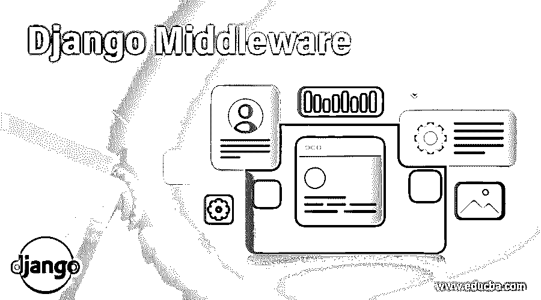
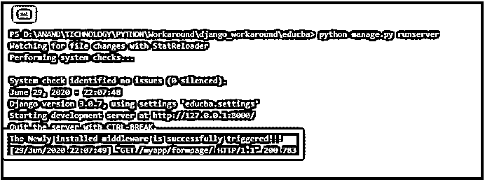
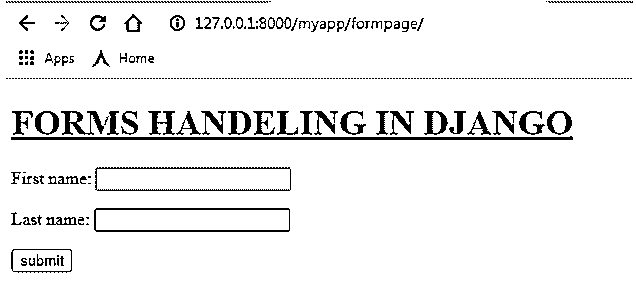

# Django 中间件

> 原文：<https://www.educba.com/django-middleware/>

## Django 中间件简介

中间件必须将每个请求和响应拉至 web 应用程序，并处理中间件对请求和响应的处理。简单来说，这些中间件组件只不过是一个 python 类；这些中间件元素被称为组件；这些组件中的每一个都负责执行一些操作。这些组件在 settings.py 文件中表示为 python 列表变量中间件中的字符串。中间件组件可以在应用程序的任何路径中声明，唯一要确保的是该路径是否在 settings.py 文件的中间件元组中声明。在这个主题中，我们将学习 Django 中间件。

### 中间件激活

可以通过在 settings.py 文件的中间件列表中提及中间件项目来激活中间件。下面提到的列表包含了 Django 项目启动时生成的中间件项目的默认列表。中间件组件的声明顺序非常重要。

<small>网页开发、编程语言、软件测试&其他</small>

`MIDDLEWARE = [
'django.middleware.security.SecurityMiddleware',
'django.contrib.sessions.middleware.SessionMiddleware',
'django.middleware.common.CommonMiddleware',
'django.middleware.csrf.CsrfViewMiddleware',
'django.contrib.auth.middleware.AuthenticationMiddleware',
'django.contrib.messages.middleware.MessageMiddleware',
'django.middleware.clickjacking.XFrameOptionsMiddleware',`

下面解释 Django 框架中上述默认中间件的必要性和用法，

| **默认中间件** | **操作** | **描述** |
| djangosecure . middleware . security middleware | x-Frame-选项:拒绝 | 将显示的页面限制在一个框架内。 |
| HTTP 严格的传输安全性 | 设置此项将允许浏览器只能通过 HTTPS 访问网站，而不能通过 HTTP 访问。 |
| x-内容-类型-选项:nosniff | 此选项有助于防止 MIME 嗅探漏洞。 |
| x-XSS-保护:1；模式=块 | 当检测到 XSS(跨站脚本)攻击时，它会阻止网站页面进一步加载。 |
| SSL 重定向 | 这将把所有 http 连接重定向到 https 连接。 |
| 检测代理 SSL | 在极少数情况下，对于有效请求，request.is_secure()方法返回 false 设置此选项将有助于为安全的外部连接设置备用标头。 |
| django . middleware . common . common 中间件 | 基于 APPEND_SLASH 和 PREPEND_WWW 设置重写 URL。当 APPEND_SLASH 为 TRUE，并且 url 没有'/，'时，新的 URL 将在 URL 的末尾有一个斜杠。 | 钠 |
| 限制不允许的用户代理设置中列出的用户的访问 |
| django . contrib . sessions . middleware . session middleware | 当会话中间件被激活时，每个 HttpRequest 对象都将有一个会话属性标记为第一个参数。这是一种字典类型的对象，可以使用 request 将会话值插入到这个字典对象中。视图文件中任意位置的会话。 |
| django . middleware . csrf . csrfview middleware | 这个中间件选项允许防止所有跨站点请求伪造。 |
| django . contrib . auth . middleware .authentication 中间件 | 设置这个中间件选项会将当前登录的用户添加到每个正在进入的 httpRequest 对象中。 |
| django . contrib . messages . middleware . message 中间件 | 这个中间件将处理网站和网络浏览器之间的所有临时消息。 |
| django . middleware . click jacking . xframeoptions middleware | 将显示的页面限制在一个框架内。 |

### Django 中的中间件是如何工作的？

以下是 Django 中间件工作的要点，

*   中间件组件的声明顺序非常重要。
*   中间件类在请求/响应生命周期中执行两次。
*   在请求过程中，这些类按照从上到下的顺序执行。
*   在响应过程中，这些类按照自下而上的顺序执行。这就是为什么组件的顺序非常重要。
*   _init_ method 在服务器启动时执行。
*   为每个请求执行 _call__ 方法。

### 中间件中的强制方法

下面列出的方法中至少有一个必须声明为中间件的一部分，

*   如果中间件需要在请求期间进行处理:
    *   流程 _ 请求(请求)
    *   process_view(请求，查看功能，查看参数，查看参数)
*   如果中间件需要在响应期间进行处理:
    *   process_exception(request，exception)(仅当视图引发异常时)
    *   process_template_response(请求，响应)(仅用于模板响应)
    *   process_response(请求，响应)

### 定制中间件

为了在适当的位置设置一个定制的中间件，应该遵循下面提到的步骤；这个定制中间件将是一个用户定义的中间件，位于中间，对传递的请求和响应消息进行所需的或受指导的处理。定制中间件为中间件服务提供了极大的灵活性。所以这些定制级别的中间件服务在 Django 中间件设置中起着非常重要的作用。此外，内置中间件服务的属性也可以调整到几种可能的程度，以获得中间件功能。

1.将名为 middleware.py 的文件放在项目中的任意位置。按照 Django 的设置，放置这个中间件文件的位置并不重要。重要的是确保在 settings.py 文件的中间件列表中精确地提到为该文件放置的路径的过程。这是最重要的元素。

2.将中间件的类放在 middleware.py 文件中。这是这个过程中最重要的一步；因为中间件的执行顺序非常重要，所以确保新添加的中间件项目作为中间件列表中的最后一个元素是很重要的。另外，需要严格保证中间件项是字符串格式，

 <u>**middleware.py:**

`class NewMiddleware:
def __init__(self, get_request):
self.get_request = get_request
def __call__(self, request):
request = self.get_request(request)
print("The Newly installed middleware is successfully triggered!!!")
return request`

**中间件=**

`[
'django.middleware.security.SecurityMiddleware',
'django.contrib.sessions.middleware.SessionMiddleware',
'django.middleware.common.CommonMiddleware',
'django.middleware.csrf.CsrfViewMiddleware',
'django.contrib.auth.middleware.AuthenticationMiddleware',
'django.contrib.messages.middleware.MessageMiddleware',
'django.middleware.clickjacking.XFrameOptionsMiddleware',
# Userdefined Middleware
'Django_app1.middleware.NewMiddleware',
]`

根据上面提到的条目，可以确定 middleware.py 文件放在 Django_app1 文件夹中，该文件中有一个名为 NewMiddleware 的中间件类作为实例。如果必须在 middleware.py 文件中安装几个新的中间件，那么必须为所有这些中间件放置单独的条目。

3.使用 python manage.py runserver 命令重新加载服务器，并验证网页。

一旦服务器被加载，并且从页面接收到任何请求，中间的消息提到“新安装的中间件被成功触发！!!"显示在屏幕上。这证明新安装的中间件工作正常。

### 推荐文章

这是 Django 中间件的指南。在这里，我们讨论中间件设置中的所有主要概念，在上面的文章中以非常精确的方式进行了解释，并提供了必要的示例。您也可以看看以下文章，了解更多信息–

1.  什么是 Django？
2.  Django 的用途
3.  [Django 面试问题](https://www.educba.com/django-interview-questions/)
4.  [如何安装 Django](https://www.educba.com/install-django/)

</u>