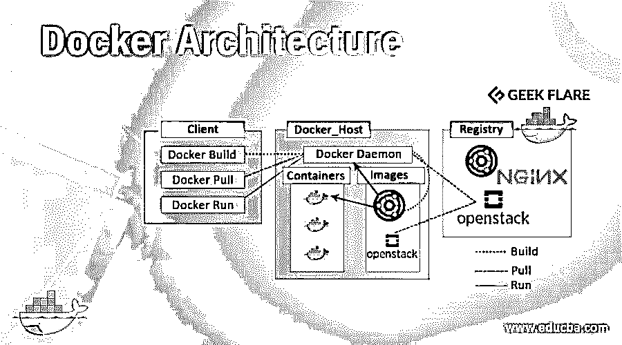
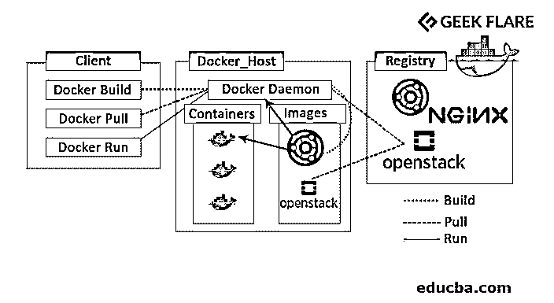
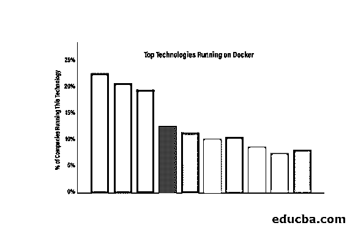

# 码头建筑

> 原文：<https://www.educba.com/docker-architecture/>

## Docker 架构介绍

这种 Docker [技术使用像 Cgroups 和 namespaces 这样的 Linux](https://www.educba.com/what-is-linux/) 内核来分离进程，并使它们在没有任何依赖性的情况下运行。这种独立的特性使得 docker 能够同时运行单独的实例或应用程序，并更好地利用基础设施，从而取得成功。Docker 和 container 工具提供了基于映像的部署模型，这使得跨多个环境共享应用程序变得很容易。建立在容器之上的工具使得 Docker 独特、快速、灵活、独立和用户友好。在本主题中，我们将学习 Docker 架构。

### Docker 是什么？

Docker 这个词包含几个东西，比如来自开源项目的工具、项目的主要支持者以及公司直接支持的工具。在 IT 领域，Docker 是一种容器化技术，用于创建和使用 Linux 容器。开源 docker 社区致力于增强这些技术，为用户带来更多好处。建立在 Docker 社区上的企业使其更加可靠、安全，并促进和共享企业的高级功能。使用 Docker，可以轻松控制轻量级、模块化和虚拟机等容器，还可以用来创建、部署、复制和移动容器。

<small>网页开发、编程语言、软件测试&其他</small>

### 码头建筑

Docker 引擎是整个系统的重要组成部分。Docker 引擎是一种服务，它遵循客户机-服务器基础结构，设置在客户机上。

重要的三个组成部分是

1.  **服务器:**服务器是名为 dockerd 的 docker 守护进程，可以管理和创建 Docker 容器、映像、网络等
2.  Rest API : Rest API 控制其进程上的 docker 守护进程
3.  命令行界面是用于在 docker 中输入命令的用户界面

**Docker 客户端:**Docker 的用户可以通过主机与 Docker 进行通信。如果有任何 docker 命令运行，主机会将它们移动到 docker 守护进程，后者会将它们取出。来自 docker 的命令处理 docker 的 API。Docker 客户端可以与多个实例进行交互。

Docker 注册中心: Docker hub 是公共注册中心的 Docker 图像的存储位置。它既可以用作私有 docker 注册表，也可以用作公共 docker 注册表。客户端也可以创建和执行他们自己的私有注册表。

### Docker 对象

使用 docker 的客户机使用卷、容器、映像、网络和所有可用的 Docker 对象。

#### 1.形象

docker 的图像是只读标准，带有设计新 docker 容器的命令。对接者图像可以从对接者的中枢检索并被利用。它可以向最后一个图像添加额外的步骤，并设计一个修改的 docker 图像。客户可以通过使用 docker 文件来创建他的 docker 图像。第一步是制作一个容器，它创建一个 docker 文件，并根据需要的指令创建自己的 docker 映像。Docker 图像，底层是只读的，第一层是可写的。客户端只能编辑和修改 docker 图像的顶层。

#### 2.容器

运行 docker 映像后，会创建一个 Docker 容器。所有实例和应用程序都在容器内部运行。客户端可以使用 Docker API 来删除、启动或停止容器。

这是一个执行 docker 容器的示例命令:

dock run-it Ubuntu/bin/bash

#### 3.卷

docker 执行的当前数据由 Docker 容器使用，并保存在卷中。整个系统通过 docker 的 API 进行控制。在 [Linux 和 Windows](https://www.educba.com/linux-vs-windows-server/) 平台上应用的卷。相反，要在容器的可编辑层中编辑信息，最好利用卷来写入卷的内容存在于容器外部，这样就不会影响容器的大小和属性

使用-v 或 mount 标志启动容器中的卷。

如果客户端对容器使用 geek volume，

dock run-d–名称 geekflar-v geekvvolume:/app engine:latest

#### 4.网络

Docker 联网是所有隔离容器的通信通道。

**docker 中的网络驱动:**[桥](https://www.educba.com/what-is-bridge/)是一个容器的固定网络驱动。客户端为在自支持容器上运行的应用程序占用该网络，即许多容器与公共 docker 主机交互。主机是消除 docker 容器和 docker 主机之间的网络隔离的驱动程序。

**覆盖:**网络呈现团队服务以与他人交互。只有当容器在由许多应用程序生成的多个 Docker guest 或 team 服务上执行时，这一点才适用。断开所有网络连接的驱动程序称为无驱动程序。

**Macvlan:** 驱动程序在 MAC 中为所有容器分配一个唯一的地址，使它们看起来像硬件系统。它们用自己的 MAC 地址控制容器之间的流量。如果需要，启用网络。例如，当虚拟机设置迁移时。

### 利益

让我们看看 Docker 的一些好处。

*   **投资回报&成本节约:** Docker 可以通过利用最少的基础设施资源来降低成本。由于在简单的设置上运行广泛的应用，它使得工程系统具有成本效益。
*   **标准化&生产力:** Docker 通过为生产环境中的服务器提供持续的开发、部署和测试来实现标准化。它速度很快，允许进行复制和冗余。
*   **CI 效率:**它构建 docker 映像，并有效地用于整个部署流程。
*   **兼容性&可维护性:**更加便携，易于安装调试。
*   **简单性&更快的配置:**可以在最短的响应时间内，在可承受的范围内，在几秒钟内创建和销毁数据。
*   **快速部署:**它可以在几秒钟内管理各种环境的部署
*   **持续部署&测试:** Docker 确保从开发到生产的逻辑环境。Docker 容器被配置为在内部管理所有配置和依赖关系。因此，客户可以从开发到生产使用同一个容器，没有任何差异或人工干预。

### 结论

Docker 支持像 AWS、GCP 这样的多云平台，并允许实例在 amazon EC2 实例、机架空间服务器或虚拟箱内运行。它还支持微软 Azure，这是一个管理 chief、puppet 和 ansible 的开放堆栈。使用 docker 的好处是安全。Docker 检查运行在容器上的实例是否完全分离和相互隔离，提供对流量和管理的控制。当客户端运行 docker pull 或 docker run 命令时，将从已配置的注册表中提取所需的 docker 映像。当客户端运行 docker 推送命令时，docker 映像存储在已配置的注册表中。

### 推荐文章

这是 Docker 架构的指南。这里我们讨论 Docker 的体系结构、对象和网络驱动程序的好处。您也可以看看以下文章，了解更多信息–

1.  [什么是 Docker Swarm？](https://www.educba.com/what-is-docker-swarm/)
2.  [安装对接器](https://www.educba.com/install-docker/)
3.  [码头工人备选方案](https://www.educba.com/docker-alternatives/)
4.  [Docker 命令](https://www.educba.com/docker-commands/)

