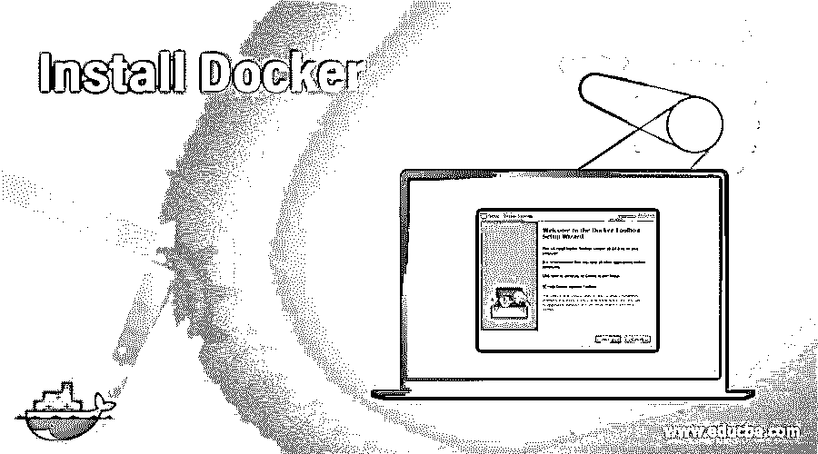
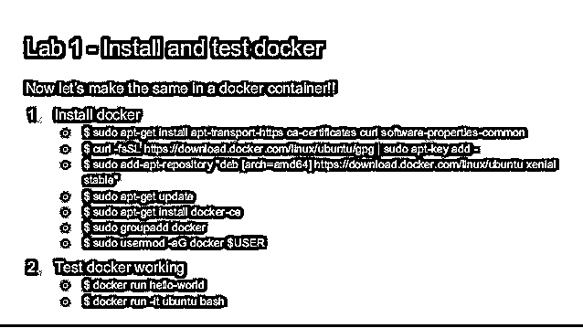
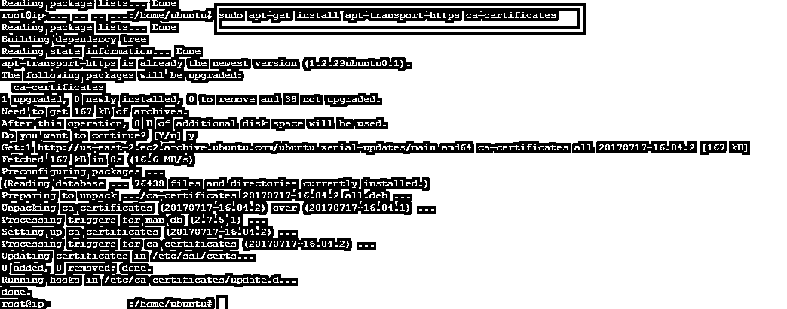
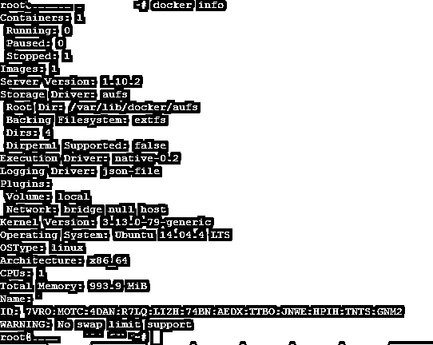
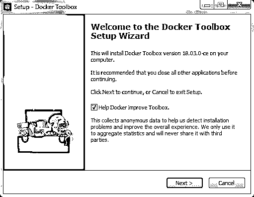
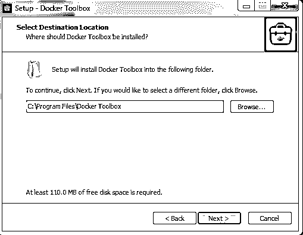
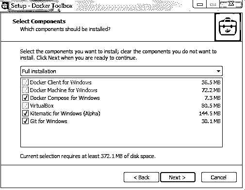
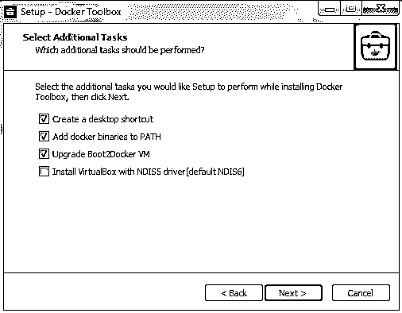

# 安装 Docker

> 原文：<https://www.educba.com/install-docker/>

## 如何安装 Docker？

在这篇文章中，我们将看看安装 Docker 的所有必要步骤。

但是在我们开始之前，让您知道可用的版本是很重要的:

<small>网页开发、编程语言、软件测试&其他</small>

*   社区版(CE)
*   企业版(EE)

虽然 Community Edition Docker 是一个免费的 Docker 平台，主要适合个人开发人员和小型组织，但企业版 Docker 需要许可费用，适合业务关键型生产应用程序。此外，企业版还附带了额外的企业功能，如映像管理、附加安全性、容器应用程序管理等。

在本文中，我们将讨论 Docker CE 在 Linux 和 [Windows 操作系统上的安装步骤。](https://www.educba.com/introduction-to-windows/)

### 在 Linux 上安装 Docker CE 的步骤

以下是在 Linux 上安装 Docker CE 的一些步骤:

**<u>

</u>** 

**来源:**【https://www.google.co.in/imgres】T2

在我们的教程中，我们将[使用 Linux 操作系统的 Ubuntu 发行版](https://www.educba.com/install-ubuntu/)。但是，如果您希望将它安装在其他 Linux 发行版上，我们将在文章末尾提供相同的链接。

1.  安装 Docker 的先决条件之一是拥有 3.8 及更高版本的 Linux 内核。

要进行同样的检查，请运行以下命令:

**代码:**

`name -a`

**输出:**

如果你想创建自己的图片并把它们推送到 Docker Hub 上，还需要 Docker Hub 上的一个[帐户](https://hub.docker.com/)。

2.  应该用最新的软件包更新操作系统。

**代码:**

`sudo apt-get update`

**输出:**

“sudo”命令确保您拥有 root 访问权限。

3.  现在，我们将下载所有必要的证书，这是安装 Docker 之前的先决条件。

**代码:**

`sudo apt-get install apt-transport-https ca-certificates`

**输出:**

4.  我们还必须确保在为 Docker 下载包时数据是加密的。这可以通过添加 GNU 隐私保护密钥或 GPG 密钥来实现。

**代码:**

`sudo apt-key adv --keyserver hkp://p80.pool.sks-keyservers.net:80 -- recv-keys 58118E89F3A912897C070ADBF76221572C52609D`

**输出:**

这个键是特定的，用于下载必要的 Docker 包。

池 hkp://p80 . pool . sks-key servers . net 是服务器的子集，也可以在端口 80 上使用。因此，它对防火墙和公司更友好。

5.  现在你可能有不同的 Ubuntu 版本；在这种情况下，您需要在 Docker 列表上注册您的版本，以便 apt 包管理器能够检测 Docker 包并下载它。

可以在以下链接中找到它:

让我们试试我们的版本，Ubuntu trusty main，

**代码:**

`echo "deb https://apt.dockerproject.org/repo ubuntu-trusty main” | sudo tee /etc/apt/sources.list.d/docker.list` 

6.  现在我们将执行 apt-get update 命令来更新 Ubuntu 系统上的包，就像我们之前做的那样。
7.  请检查软件包管理器是否指向正确的库。

**代码:**

`apt-cache policy docker-engine`

8.此外，对于 Ubuntu Trusty、Wily 和 Xenial，我们必须安装 Linux-image-extra-*内核包，这允许用户使用 aufs 存储驱动程序。较新版本的 Docker 使用这个驱动程序。

这可以通过使用以下命令来完成:

**代码:**

`sudo apt-get install Linux-image-extra-$(uname -r) Linux-image-extra-virtual`

9.  最后，是安装 Docker 的时候了，可以在下面这个命令的帮助下完成。

**代码:**

`sudo apt-get update && sudo apt-get install docker-ce -y`

10.  现在，当 Docker 安装后，我们可以检查一些东西，如 Docker 版本、Docker 信息等。为了检查 Docker 版本，我们可以使用 Docker 提供的 Docker 实用程序。

**代码:**

`docker version or docker info`

**输出:**

要获得系统上运行的 Docker 的更多信息，可以执行以下命令:

**代码:**

`docker info`

这个命令返回关于已安装的 Docker 服务的详细信息。

**输出:**

### 如何在 Windows 上安装 Dockers

*   Docker for windows 可以在[https://docs.docker.com/docker-for-windows/](https://docs.docker.com/docker-for-windows/)下载。
*   如果您使用的是较旧版本的 windows(如 Windows 7 和 Windows 8.1)，则需要安装 Docker Toolbox。你可以从[这里](https://docs.docker.com/docker-for-windows/)下载 Docker 工具箱。
*   一旦下载了 exe 安装程序，运行它并同意其许可(如果您安装了 Windows 10，或者如果您安装了以前版本的 Docker toolbox ),然后只需单击下一步，如下所示:

*   安装完成后，单击 finish 按钮并启动 Docker。
*   现在来看看旧版本的 windows，让我们看看如何安装 Docker Toolbox。
*   从[https://www.docker.com/products/docker-desktop](https://www.docker.com/products/docker-desktop)下载安装程序并运行，接受许可并点击下一步。
*   请选择 Docker 工具箱安装的目标文件夹；您可以将此路径保留为默认路径。然后点击下一步。

*   对于其余屏幕，请选择默认选项，然后单击下一步。

*   最后，点击 install 按钮，Docker 工具箱将被安装到您的 windows 机器上。

*   安装完成后，请启动它。您将被提示进入 Docker Shell。为了运行任何 Docker 命令，您可以通过给 docker run 来运行它。例如 docker 运行图像。

Image 命令将运行容器。

此外，如前所述，如果你使用 Ubuntu 之外的任何其他 Linux 发行版，下面是一些有用的链接，可以帮助你安装 Docker CE。

1.  [https://docs.docker.com/install/](https://docs.docker.com/install/)
2.  [将此装置固定在数百](https://docs.docker.com/install/linux/docker-ce/centos/)
3.  [将此装置停靠在 Debian](https://docs.docker.com/install/linux/docker-ce/debian/)
4.  [将此装置固定在 Fedora](https://docs.docker.com/install/linux/docker-ce/debian/) 上
5.  [将此装置停靠在 Mac](https://docs.docker.com/docker-for-mac/install/)

### 推荐文章

这是如何安装 Docker 的指南。这里我们已经分别讨论了在 Linux 和 Windows 上安装 Docker 的基本概念和步骤。您也可以阅读以下文章，了解更多信息——

1.  [Docker ps](https://www.educba.com/docker-ps/)
2.  [Docker 列表图像](https://www.educba.com/docker-list-images/)
3.  [GitLab 坞站](https://www.educba.com/gitlab-docker/)
4.  [Docker 曝光](https://www.educba.com/docker-expose/)

