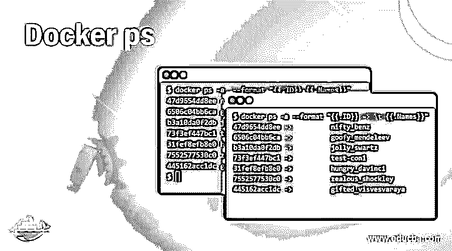
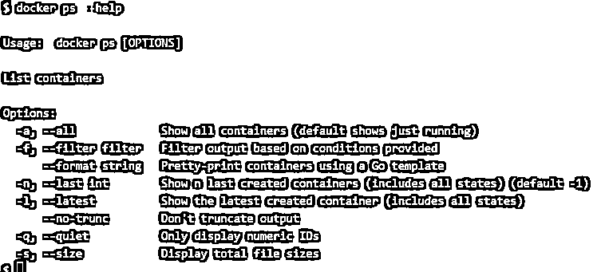
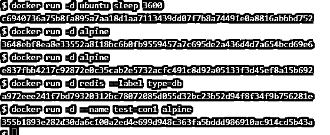
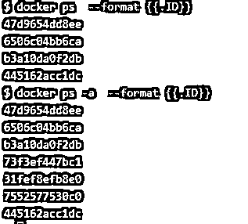
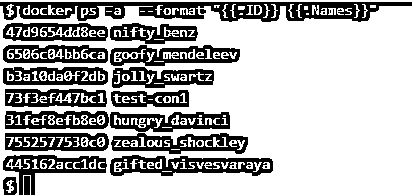
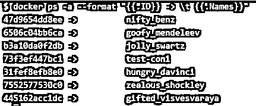
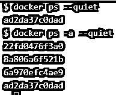

# Docker ps

> 原文：<https://www.educba.com/docker-ps/>

## Docker ps 简介

“docker ps”是一个 docker 命令，用于默认列出正在运行的容器；但是，我们可以使用不同的标志来获取处于停止或退出状态的其他容器的列表。我们还可以根据需要使用标志来操作输出。Docker 已经使用了来自 Linux 的 ps 的命名约定；ps 在 Linux 中的意思是‘进程状态’，容器实际上是作为一个进程在 Linux 服务器上运行的；这就是为什么用“docker ps”来列出集装箱。

**语法**

<small>网页开发、编程语言、软件测试&其他</small>

`docker ps [OPTIONS]`

**选项:**

*   **-a，–all:**用于显示所有容器
*   **-f，–filter:**用于根据应用的条件过滤列表
*   **–format:**用于使用 GO 模板操作输出，这意味着输出应该是什么样子
*   **-n，–last:**显示最后创建的容器，包括所有状态
*   **-l，–latest:**用于显示最新创建的容器，与状态无关
*   **–no-trunc:**显示输出，不截断数据
*   **-q，–quiet:**仅显示集装箱的数字 ID
*   **-s，–size:**显示容器的总文件大小

**命令:**

`docker ps --help`

### Docker 中的 ps 命令是如何工作的？

我们需要在系统上安装 Docker CLI，以便执行“docker ps”命令。当我们在 docker CLI 上运行“docker ps”命令时，Docker CLI 解析 JSON 中的命令，并对 Docker 守护进程进行 API 调用，如果命令中没有提到任何选项，Docker 守护进程会将正在运行的容器列表发送回标准输出，即终端。

### Docker ps 的示例

我们将通过场景学习“docker ps”命令中使用的不同选项，但在此之前，让我们使用下面的命令创建几个容器，我们将使用这些命令来执行和测试“docker ps”命令选项:

`docker run -d ubuntu sleep 3600
docker run -d alpine
docker run -d redis --label type=db
docker run -d --name test-con1 alpine`

#### 示例#1

仅列出正在运行的容器。

**解决方案:**我们可以简单地使用‘docker PS’命令来获取正在运行的容器列表，因为默认情况下它只显示正在运行的容器。

`docker ps`

**解释:**根据上面的快照，我们可以看到现在只有一个容器在运行。

#### 实施例 2

列出所有容器，无论它是否正在运行。

**解决方案:**我们必须在“docker ps”命令中使用“-a”或“–all”选项，如下所示:–

`docker ps -a
docker ps –all`

**解释:**在上面的快照中，我们可以看到有 5 个容器，因为如果您看到创建容器的第一个快照，我已经运行了两次相同的命令。

#### 实施例 3

使用'-f '或'–filter '选项过滤掉特定的容器。

1.  让我们根据容器 ID 筛选出容器，如下所示:–

`docker ps -a -f "id=355b1893e282"
docker ps -a -f "id=35"`

**注意:–**在上面的快照中，我们还使用了“-a”标志来列出容器，即使它没有运行。建议对过滤器使用“-a”标志。我们也可以使用短 ID，但它必须是唯一的。

2.  我们还可以根据容器的名称过滤容器，如下所示:–

`docker container ls -a -f "name=test-con1"
docker container ls -a -f "name=test"`

**注意:–**我们可以使用容器名称的几个关键字，如果 Docker 守护进程发现任何名称中包含这些关键字的容器，它就会输出这些容器。

`docker container ls -a -f "name=t"
docker container ls -a -f "name=con"`

3.  如果容器上有标签，我们可以使用标签来过滤容器，所以让我们再创建两个有标签的容器。

`docker run -d --label type=web nginx
docker run -d --label env=prod ubuntu sleep 3600`

`docker ps -f "label=env"
docker ps -f “label=type”
docker ps -f “label=type=web”`

**说明:**在上面的快照中，我们可以看到我们可以列出具有特定标签的容器；为了前任。，第一个和第二个命令显示所有分别带有标签“env”和“type”的容器，而不考虑其值，第三个命令显示所有带有标签“type”的容器，并且标签“type”的值必须是“web”。

4.  我们还可以根据它们的图像名称、图像 ID、标签和层来过滤容器。

`docker ps -a -f ancestor=alpine
docker ps -a -f ancestor=3fd9065eaf02`

#### 实施例 4

使用带有 Format 选项的 GO 模板格式化“docker ps”命令的输出。

1.  让我们只显示容器 ID，如下所示:–

`docker ps --format {{.ID}}
docker ps -a --format {{.ID}}`

2.  我们可以输出多个字段；只是我们需要添加如下字段:-

`docker ps -a  --format "{{.ID}} {{.Names}}"`

3.  我们可以使用' \t '来留出一些空间，并在中间提供任何符号，使输出看起来很漂亮，如下所示:-

`docker ps -a --format "{{.ID}} -> \t {{.Names}}”`

4.  我们还可以输出默认情况下不可见的字段，并使用“table”指令在输出中显示标题，如下所示:–

`docker ps -a --format "table {{.ID}} \t {{.Names}} \t {{.Labels}} \t {{.Size}}"`

在上面的快照中，我们现在也可以看到字段标题。

#### 实施例 5

如果我们想要显示最近创建的 n 个容器，我们可以使用'-n '选项，如下所示:-

`docker ps -n 2`

**注意:–**它也包括停止的容器，所以不需要指定'-a '标志。

#### 实施例 6

列出最近创建的容器。

**解决方案:**我们可以使用“-l”选项列出最近创建的容器，如下所示:–

`docker ps -l`

#### 实施例 7

有时少数几列的数据会因为屏幕尺寸而被截断。列出容器，但不截断列数据。

**解决方案:**我们可以使用'–no-trunc '选项显示所有列的数据，如下所示:–

`docker ps -n 2 --no-trunc`

**注意:-** 我们也可以将此选项与其他选项一起使用，如格式、过滤器等。

#### 实施例 8

仅显示容器的容器 ID。

**解决方案:**我们可以使用'–quiet '或'-q '选项仅列出容器 ID，如下所示:–

`docker ps --quiet
docker ps -a --quiet`

#### 实施例 9

不使用“格式”选项显示容器的大小。

**解决方案:**我们有单独的选项'–size '或'-s '来列出容器的大小。

`docker ps -a -s`

### 优势

1.  此命令在进行故障排除时非常有用，尤其是在使用“filter”选项时。
2.  它有助于根据我们的需要使用“格式”选项输出容器列表，我们可以使用该选项进行报告。
3.  它有多个选项，可以一起用来过滤和格式化容器列表。

### 使用 ps 的规则和规定？

1.  如果我们基于标签进行过滤，即使我们使用了'-a '选项，过滤器选项也只显示正在运行的容器。
2.  “-n”和“-l”选项的输出显示容器是否正在运行，因此不需要用这些选项指定“-a”标志。
3.  我们可以将'–no-trunc '选项与该命令中几乎所有可用的其他选项一起使用。

### 结论–Docker PS

与“docker 容器 ls”相比,“docker ps”命令更容易使用，因为这两个命令具有相同的选项，并提供相同的输出，但“docker 容器 ls”很长，所以我更喜欢“docker ps”命令而不是“docker 容器 ls”。

### 推荐文章

这是 Docker ps 的指南。这里我们讨论 ps 命令如何在 Docker 和 Examples 中工作，以及解决方案和解释。您也可以看看以下文章，了解更多信息–

1.  [Docker 卷](https://www.educba.com/docker-volume/)
2.  [Docker 储存库](https://www.educba.com/docker-repositories/)
3.  [对接按钮](https://www.educba.com/docker-push/)
4.  [码头工人的优势](https://www.educba.com/advantages-of-docker/)

