# Docker 仓库

> 原文：<https://www.educba.com/docker-repositories/>

## Docker 存储库简介

Docker 存储库用于存储或托管具有多个标签或版本的相同图像。它允许我们与不同的团队、客户或整个 Docker 社区共享容器图像。docker 存储库是名称相同但标签不同的不同 Docker 图像的集合。标签就像 Docker 映像的一个版本，例如 v1、v2、v2.1 等。如果我们在推送到存储库时没有为图像提供任何标签，默认情况下，它会创建一个带有“最新”标签的图像。我们可以保密，也可以公开。Docker 存储库托管在 Docker hub 上。

### Docker 中的存储库是如何工作的？

我们需要登录 Docker Hub 来使用 Docker 存储库。我们可以在命令行的帮助下使用“docker login”命令，或者直接登录 Docker Hub。我们先创建一个 Docker 存储库，然后再从 web 控制台向其推送 Docker 映像，但是如果我们向 Docker Hub 推送任何新的 Docker 映像，它会自动为我们创建一个新的 Docker 存储库。

<small>网页开发、编程语言、软件测试&其他</small>

我们使用下面显示的命令从命令行登录 Docker Hub

$docker 登录

出现提示时，我们需要提供用户名和密码。我们也可以用 login 命令给出用户名和密码，但是它采用不安全的明文形式，所以不推荐使用。我们可以这样做:

我们使用“docker logout”命令从主机中删除凭据，如下所示:

$docker 注销

让我们登录到[https://hub.docker.com](https://hub.docker.com)

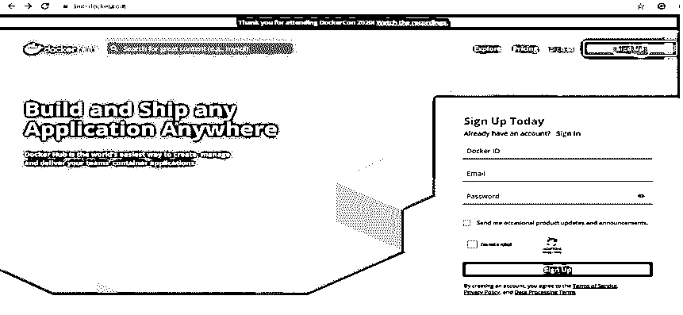

如果已经有 Docker ID，我们单击“登录”按钮，或者单击“注册”按钮或填写同一页面上显示的“立即注册”表格。我们点击“登录”按钮，因为已经注册了。我们得到下面的页面来输入凭证:

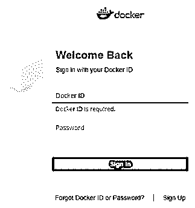

点击“登录”按钮登录 Docker Hub，进入以下网页:-

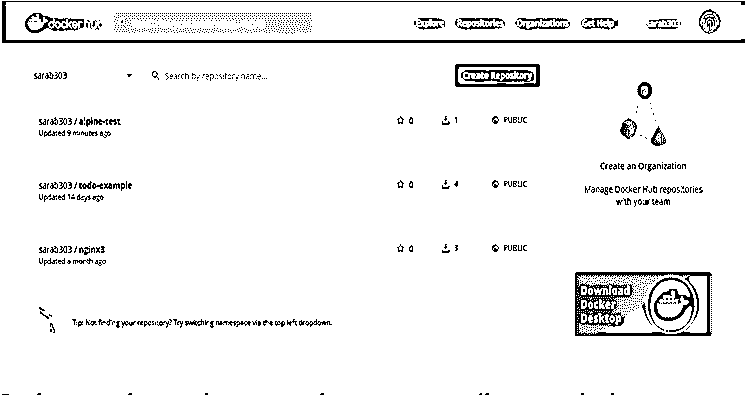

它将我们带到存储库页面，在这里我们可以看到我们所有的存储库。

### 如何在 Docker 中创建资源库？

我们可以使用 web 控制台创建一个没有任何标记的空白存储库，但是，如果我们推送一个新的 Docker 映像，并且不存在具有该名称的存储库，它将自动为该 Docker 映像创建存储库。

1.我们可以通过单击“创建存储库”按钮从 web 控制台创建存储库。

单击“创建存储库”按钮后，我们会看到下面的窗口:

2.我们必须选择这个存储库将要驻留的名称空间。默认情况下，它会用我们的 Docker ID 创建一个名称空间，但是如果我们没有名称空间，我们可以通过单击右上角的“Organizations”按钮来创建一个新的组织。

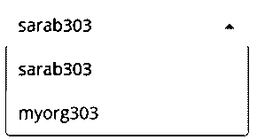

在上面的快照中，有两个名称空间，顶部的是 Docker ID 名称空间，底部的是 organization 名称空间。

3.现在给出存储库的名称和描述，如下所示:

4.然后我们必须选择可见性选项。它有两个选项，第一个是“公共”，这意味着它将显示在 Docker Hub 搜索中，任何人都可以下载和使用它，第二个选项是“私人”，这意味着只有所有者可以查看这个存储库。

在上面的快照中，可以看到突出显示的一行，上面写着“使用 1 个私有存储库中的 0 个”,这意味着我们只能在一个自由存储库计划中创建 1 个私有存储库。我们需要升级到专业无限私人回购。如果我们点击“获取更多”链接，它会将我们带到账单页面，在那里我们可以更改计划。

5.我们在最后有“构建设置”选项，这是可选的。在这里，我们可以链接 Github 或 Bitbucketsource 代码库来触发自动构建。

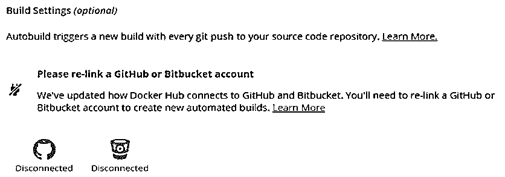

6.现在是最后一步，单击“Create”按钮创建名为“my-nginx-app”的新存储库。这里,“创建和构建”按钮是灰色的，因为没有配置构建设置。

7.创建新的存储库后，我们会看到下面的存储库页面，在这里我们可以管理该存储库，例如修改描述和自述文件部分:

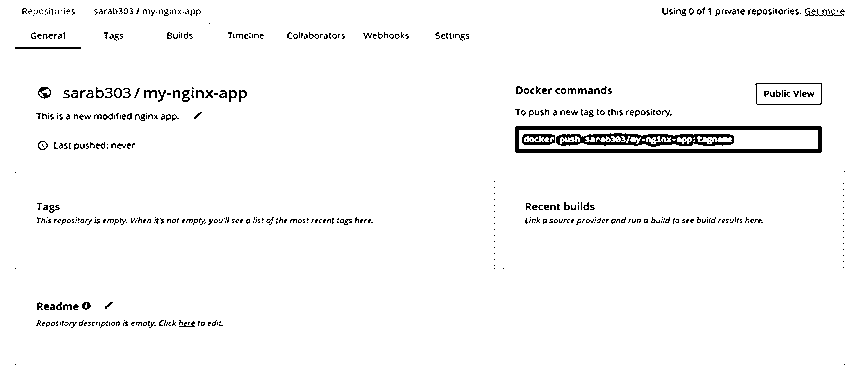

在上面的快照中，存储库是空的，没有标记，但是在右上角有一个 docker 命令，用于将标记推送到该存储库。

### Docker 知识库的操作及实例

我们可以在 Docker 存储库上执行的操作如下:

让我们将 Docker 映像推送到新创建的存储库中。出于测试目的，我们只需使用我们的存储库名称重新标记现有的 nginx 映像，并登录 Docker Hub(如果尚未登录),然后推送映像，如下所示:

**语法:**

`$docker tag <existing_image_name><docker_id>/<repository_name>[:<tag>]`

或者

`$docker tag <existing_image_name><organization_namespace>/<repository_name>[:<tag>]`

#### 例子

`$docker tag nginx sarab303/my-nginx-app:v1
$docker login
$docker push sarab303/my-nginx-app:v1`

**注意:**在构建新的 Docker 映像时，我们可以给出存储库的名称。

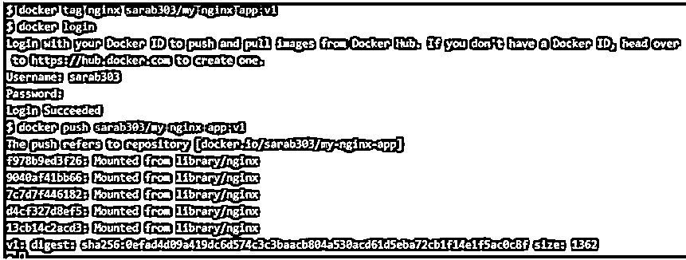

在上面的快照中，我们将“sarab303/my-nginx-app:v1”Docker 映像推送到存储库，其中“sarab 303”是 Docker ID，“my-nginx-app”是我们刚刚创建的存储库名称，“v1”是映像的标记。

让我们登录 Docker Hub 进行检查。在下面的快照中，我们可以看到‘my-nginx-app’存储库现在有一个标签‘v1’。

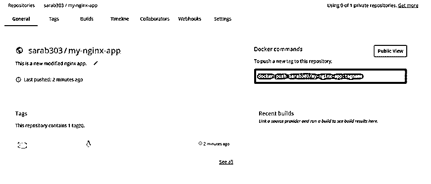

让我们搜索这个新的存储库。同样，我们可以通过命令行或直接在 Docker Hub 上完成。我们使用“docker search”命令从命令行搜索任何存储库，如下所示:-

**语法:**

`$docker search <repository_name>`

#### 例子

`$docker search my-nginx-app`

在上面的快照中，我们看到如果我们先搜索 Docker Id，然后搜索存储库名称，这不起作用，因此我们只能给出存储库名称，然后我们可以通过管道将它发送到 grep 来过滤我们的存储库。我们可以使用搜索命令搜索任何 Docker 图像，如果它是公开可用的。

我们也可以在 Docker Hub 上搜索存储库，只需在搜索框中输入存储库的名称，如下所示:

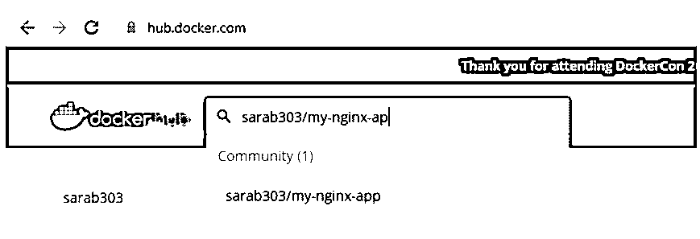

这里我们可以把 Docker ID 过滤掉。一旦我们点击它，它就会重定向到那个存储库。

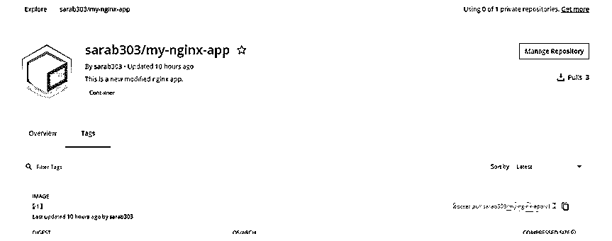

现在，如果我们单击“tags ”,我们可以看到“v1”出现在这里，这里还提到了一个命令来本地提取此图像。

让我们搜索任何其他图像，例如 Ubuntu。一旦我们点击输入，我们得到下面的搜索结果页面，在右手边，它提到了“官方图像”，这意味着这个图像是由 Canonical 管理的。它还显示下载和星级计数。

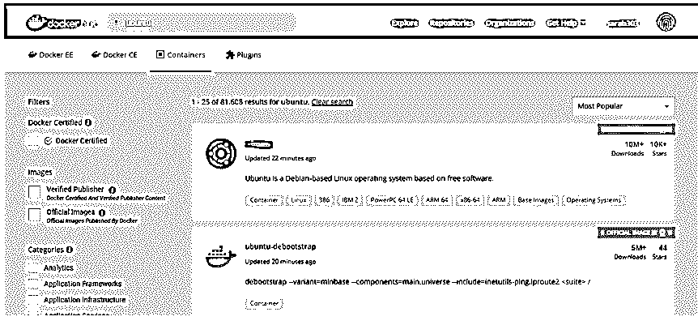

让我们提取 docker 映像，我们使用“docker pull”命令提取带有特定标记的 Docker 映像，但这是可选的，默认情况下，它采用“最新”标记。如果存储库中没有带有最新标签的 Docker 图像，我们会得到一个错误。

**语法:**

`$docker pull <image_name>`

或者

`$docker pull <Docker_ID>/<repository_name>[:<tag>]`

#### 例子

`$docker pull ubuntu
$docker pull sarab303/my-nginx-app:v1`

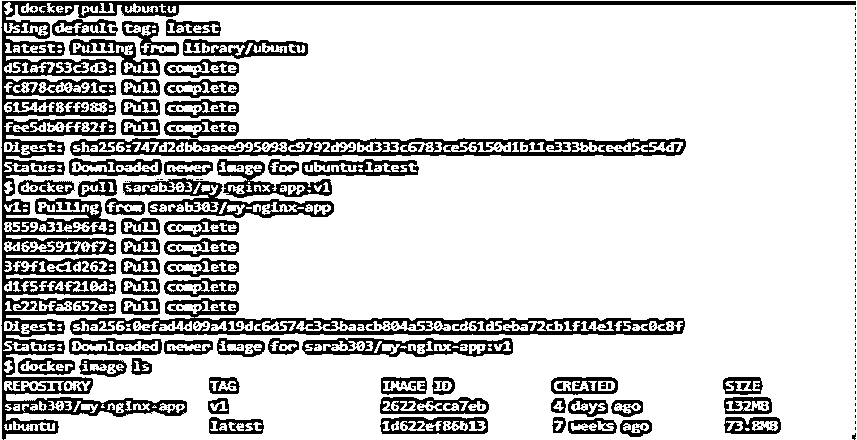

我们可以通过单击“协作者”选项卡，将访问权限授予想要拉或推我们的私有存储库的人，但是协作者不能执行任何管理任务，例如删除存储库或将可见性从私有更改为公共，反之亦然。

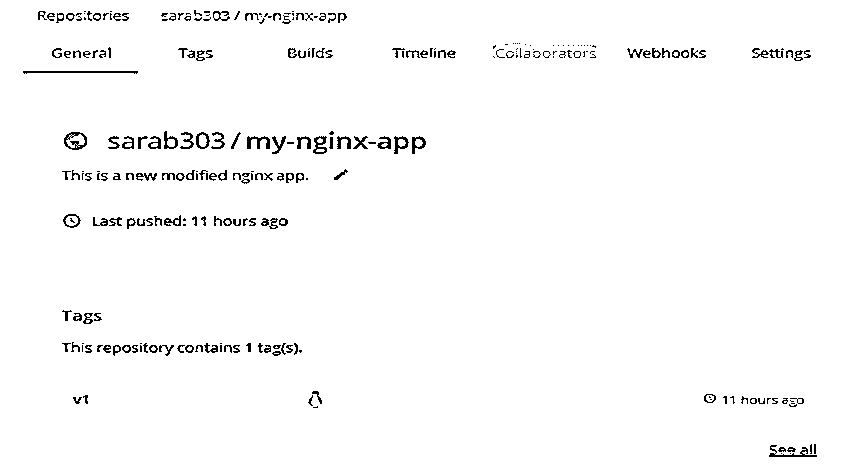

当我们点击“合作者”选项卡时，我们得到下面的页面，在这里我们必须键入合作者的 Docker ID 并点击“+”按钮。没有协作者被添加到“sarab303/my-nginx-app”存储库中。

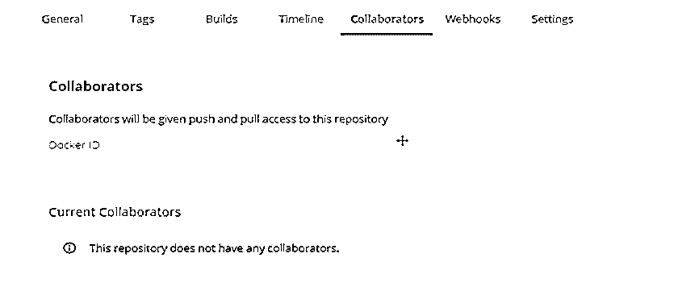

如果我们想要修改可见性设置或删除存储库，请单击“设置”选项卡，我们会看到下面的页面:

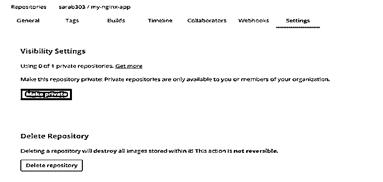

要将存储库设为私有，请单击“设为私有”按钮，并提供存储库的名称，如下图所示:

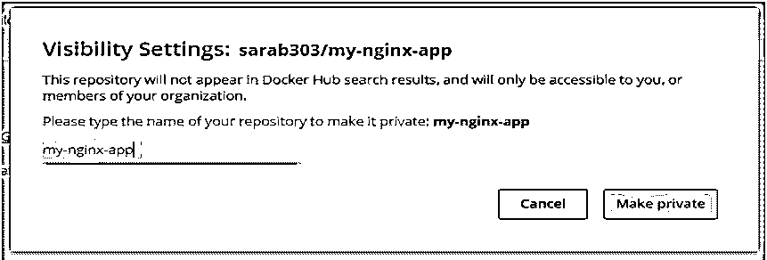

存储库的可见性现在已更改为私有。

要删除存储库，请单击“删除存储库”按钮，给出存储库的名称，然后单击“删除”按钮，如下图所示:

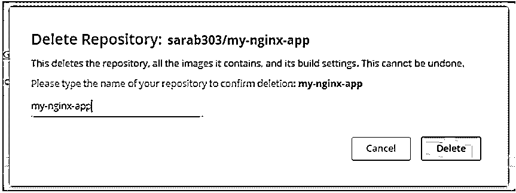

在这里，sarab303 名称空间下没有名为“my-nginx-app”的回购。

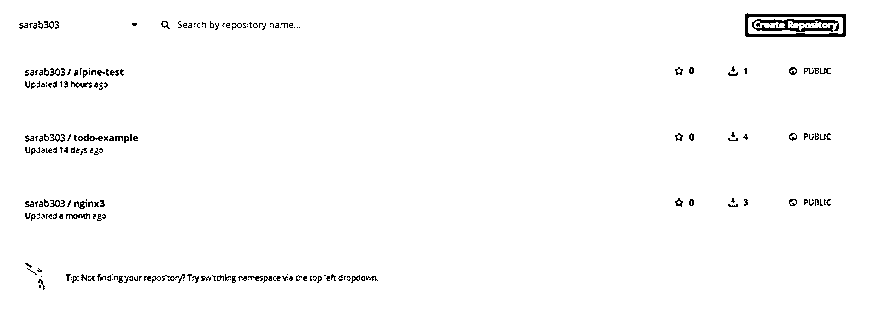

### 结论

Docker 资源库非常有用，在付费版本中提供了更多的选项。我们也可以托管我们的 know Docker 私有注册表作为一个容器，并创建存储库，但它不提供 web 控制台，控制能力也较弱。Docker 企业版提供 DTR，即 Docker 可信注册中心提供 web 控制台和基于角色的访问控制。

### 推荐文章

这是 Docker 知识库的指南。在这里，我们还将讨论 docker 中的介绍以及存储库是如何工作的？以及不同的示例及其代码实现。您也可以看看以下文章，了解更多信息–

1.  [立方注释](https://www.educba.com/kubernetes-annotations/)
2.  [Gitlab CI vs Jenkins](https://www.educba.com/gitlab-ci-vs-jenkins/)
3.  [LXD vs 码头](https://www.educba.com/lxd-vs-docker/)
4.  [码头工人的优势](https://www.educba.com/advantages-of-docker/)

