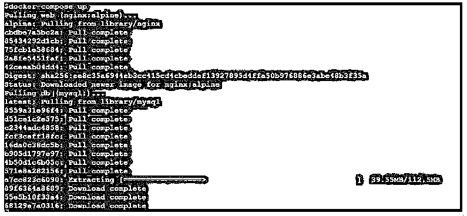
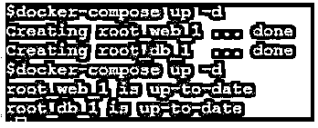

# 坞站-合成 up

> 原文:# t0]https://www . educba . com/docker-compose-up/

## docker 简介-撰写

“docker-compose up”是一个 docker 命令，用于在包含多种服务(例如 Web、DB 等)的独立主机上启动和运行整个应用程序。它还可以同时创建卷和网络，并附加到名为“docker-compose.yml”的文件中定义的容器。它用于所有环境，如开发、试运行和生产环境。

**语法:**

<small>网页开发、编程语言、软件测试&其他</small>

`docker-compose up [options] [--scale SERVICE=NUM...] [SERVICE...]`

**<u>

</u>** 

### Docker 中的排版是如何工作的？

*   docker-compose up 命令在当前目录中搜索名为“docker-compose.yml”的文件。我们定义所有服务、卷、网络等。在这个文件里。
*   当我们从 docker CLI 执行“docker-compose up”命令时，Docker CLI 将“docker-compose.yml”转换为“json ”,并对 Docker API 服务器进行 REST API 调用，Docker 守护程序创建所有服务、网络、卷等。为了我们。
*   它有多个选项来控制部署，例如，如果服务有正在运行的容器，并且我们对服务的配置进行了一些更改，并且希望使用“docker-compose up”命令来应用它，那么 docker 守护程序会停止所有现有的容器并重新创建它，但是，我们可以使用“–no-recreate”命令来阻止这些更改。

### docker-compose up 示例

下面是一些例子:

我们将创建一个 docker-compose.yml ',它有两个服务，web 和 db，以及一个卷。

以下是“docker-compose.yml”文件:

**代码:**

`version: '2'
services:
web:
image: "nginx:alpine"
ports:
- "80:80"
volumes:
- my-vol:/var/www/html
db:
image: "mysql"
restart: always
environment:
MYSQL_ROOT_PASSWORD: password
volumes:
my-vol: {}`

#### 示例#1

让我们运行“docker-compose up”命令来立即启动这些服务:

**代码:**

`docker-compose up`

**输出:**

**说明:**

*   在上面的快照中，我们可以看到服务正在创建和运行，但是，它也在控制台上给出了一些输出，因为服务是在前台运行的，而不是在后台。
*   如果我们使用“ctrl+c”快捷方式从这里退出，Docker 守护进程将停止在服务下运行的容器。

#### 实施例 2

我们可以根据需要指定标志来控制命令的行为。

让我们通过示例了解一些基本标志:

**a .使用'-d '标志**

我们可以使用'-d '标志在分离模式下运行服务，就像我们在运行新容器时使用的一样。

**代码:**

`docker-compose up -d`

**输出:**

**b .使用‘安静拉动’标志**

如果我们简单地运行“docker-compose up”命令，并且如果“docker-compose.yml”文件中提到的 docker 映像在本地不存在，那么它将从注册表中提取映像，并显示相同的进度条，如果我们对进度条不感兴趣，我们使用“–quiet-pull”标志来静默提取没有进度条的 Docker 映像，如下所示:

`docker-compose up --quiet-pull`

*   没有“安静拉动”标志

**代码:**

`docker-compose up`

**输出:**

**

** 

*   带有“安静拉动”标志

**代码:**

`docker image ls -a`

**输出:**

**说明:**

*   在上面的快照中，我们可以看到本地没有 Docker 映像，但在启动服务时仍然没有显示进度条，因为我们使用了'–quiet-pull '命令。

**c .使用'–强制重新创建'和'–不重新创建'命令**

以上旗帜互相矛盾。我们一次只能使用一面旗帜。“–force-recreate”标志用于重新创建容器，即使没有对“docker-compose.yml”文件进行任何配置更改，而如果我们对该文件进行了一些更改，但不想重新创建已经在运行的容器，则我们使用“—no-recreate”标志。默认情况下，如果“docker-compose.yml”中没有更改，docker 守护程序什么也不做，如果在文件中检测到任何更改，Docker 守护程序将创建新的容器，如下所示。

**代码:**

`docker-compose up -d`

**输出:**

在上面的例子中，我们可以看到，如果我们运行' docker-compose up -d '两次，它会显示'最新'。

在某些情况下，我们希望重新创建容器，不管文件是否有任何更改。

让我们使用'–force-recreate '来重新创建容器，而不对文件进行任何更改。

**代码:**

`docker-compose up --force-recreate`

**输出:**

**说明:**

*   在上面的快照中，我们可以看到，在运行带有“–force-recreate”标志的命令后，容器的容器 ID 已经更改。

有时，我们会对“docker-compose.yml”文件进行更改，但如果容器已经在运行，我们不想重新创建它们。

在将 web 服务的图像名称从' nginx:alpine '更改为' nginx '之后，让我们使用'–no-recreate '标志。

**代码:**

`docker-compose up --d --no-recreate`

**输出:**

**说明:**

*   在上面的示例中，我们可以看到新的 Docker 映像已被提取，但是如果我们使用'–no-recreate '标志检查运行命令前后容器的容器 ID 是否相同，这意味着没有创建新的容器。

**d .使用‘禁止启动’标志**

它用于创建容器，但不启动它。它不能与'-d '标志一起使用。

**代码:**

`docker-compose up --no-start`

**输出:**

**

** 

**说明:**

*   在上面的快照中，我们可以看到刚刚创建了容器，但是它没有运行。

**e .使用'–移除孤儿'标志**

如果有任何不再需要的服务，我们可以使用'–remove-orbonds '标志来删除不需要的容器。这里，只需从“docker-compose”文件中删除“db”服务，并运行如下所示的命令。

**代码:**

`docker-compose up -d --remove-orphans`

**输出:**

**说明:**

*   在上面的快照中，我们可以看到，从文件中删除“db”服务后，孤立容器被删除。

### docker-compose 的优点

下面是提到的优点:

*   我们可以使用这个命令一次性启动一个完整的应用程序。
*   它提供了对我们的应用程序的单点管理，该应用程序具有多个服务，这使得管理容器变得更加容易。
*   我们甚至可以在使用“build”指令部署服务时构建 Docker 映像。

### 结论

docker-compose up 是一个启动完整应用程序的命令，但是，它只能在独立主机上工作，而不能在 Docker swarm 模式下工作，因此不推荐用于生产。我们必须使用“docker 堆栈”来启动 Docker swarm 中的成熟应用程序。

### 推荐文章

这是一个 docker-compose up 指南。这里我们分别用例子和优点来讨论 docker-compose up 的介绍。您也可以看看以下文章，了解更多信息–

1.  [Dockerfile](https://www.educba.com/dockerfile/)
2.  [对接按钮](https://www.educba.com/docker-push/)
3.  [码头工人的优势](https://www.educba.com/advantages-of-docker/)
4.  [Docker 架构](https://www.educba.com/docker-architecture/)

