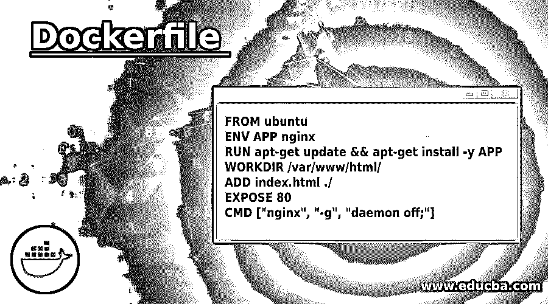
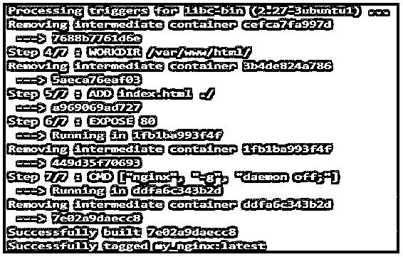

# Dockerfile

> 原文：<https://www.educba.com/dockerfile/>

## Dockerfile 简介

Dockerfile 用于构建 Docker 映像。它是一个简单的文本文件，由一组指令或命令组成，由自动构建过程自顶向下逐步执行。它用于创建我们自己的 Docker 映像，我们通常使用父 Docker 映像来创建我们自己的 Docker 映像，但是，我们也可以创建基本映像。Dockerfile 的名称必须是“Dockerfile ”,否则 Docker 守护程序将抛出错误，并且区分大小写。我们使用“docker build”命令从 docker 文件创建 Docker 映像。

### Dockerfile 在 Docker 中是如何工作的？

下面给出了 Dockerfile 如何在 Docker 中工作的例子。

<small>网页开发、编程语言、软件测试&其他</small>

**代码:**

`FROM ubuntu
ENV APP nginx
RUN apt-get update && apt-get install -y APP
WORKDIR /var/www/html/
ADD index.html ./
EXPOSE 80
CMD ["nginx", "-g", "daemon off;"]`

让我们看看上面的 Dockerfile 样本中提到的 Dockerfile 的每一条指令:

#### 1.从

大多数情况下，我们使用官方形象，在此基础上，我们将建立我们的码头工人形象，使其成为我们码头工人形象的基础。如果我们想创建一个基础映像，我们在 Dockerfile 文件中使用“从头开始”。在上面的 Dockerfile 中，‘Ubuntu’被用作基础映像，它被称为父映像。Docker 文件中提到的其他指令将修改这个 Docker 映像。

#### 2.包封/包围（动词 envelop 的简写）

它用于在创建 Docker 映像时设置环境变量。它有键值对，我们可以使用“ <key>= <value>”设置多个变量。如果我们不使用等号(=)，那么它允许一个变量，如上面的 docker 文件所示。</value></key>

**代码:**

`ENV key1=”value1” key2=”value2” \
key3=”value3”`

`ENV key1 value1
ENV key2 value2
ENV key3 value3`

#### 3.奔跑

RUN 指令用于在新层中执行 shell 命令，并将结果提交到新的 Docker 映像中。我们可以使用反斜杠在多行中运行单独的长或复杂的运行指令，如下所示:

**代码:**

`RUN apt-get update && apt-get install –y \
package1 \
package2 \
package3`

#### 4\. WORKDIR

它改变了 Docker 映像中的当前工作目录，可以被进一步的指令使用。在上面的例子中，工作目录已经改为“/var/www/html”，然后在下一条指令中我们使用“.”指定将文件“index.html”添加到工作目录“/var/www/html”中。

#### 5.注意缺陷障碍 (Attention Deficit Disorder)

它用于将文件从本地主机添加到 Docker 映像。复制指令有类似的功能，但是，添加有一些其他功能，以及像焦油提取和远程网址支持。在上面的 Docker 文件中，来自 localhost 的 index.html 文件已经被添加到 Docker 镜像的当前工作目录中。

**Note:** index.html file must present in our current working directory locally else build will fail.

#### **6。**曝光

EXPOSE 指令告诉容器监听连接的端口。它不会在构建映像时公开端口。如果我们使用这个映像运行容器，它会提供关于端口的一般信息。在上面的示例中，如果容器是使用由上述 Dockerfile 构建的映像创建的，并且在创建容器以从外部访问它时必须公开该映像，则容器将在端口 80 上侦听。

#### 7.煤矿管理局

它定义了当使用 Docker 映像创建容器时将执行什么，或者只是为正在执行的容器提供默认值。我们应该在一个 docker 文件中只定义一个 CMD，但是如果我们在一个 docker 文件中定义了多个 CMD 指令，那么只有最后一个 CMD 会被执行。此外，如果我们在运行容器时指定了任何命令，指定的命令将优先执行，CMD 指令将不会执行。

我们可以使用允许创建可执行容器的入口点指令。它有两种形式，一种是“执行”形式，另一种是“外壳”形式。如果我们在使用' docker run '命令运行容器时传递命令行参数，指定的命令会附加在 exec 表单 ENTRYPOINT 中的所有元素之后。在使用' docker run '命令运行容器时，我们使用标志'–entrypoint '来覆盖 entry point 指令。

让我们使用上面的示例 Docker 文件，使用下面的命令来构建 Docker 映像:

**语法:**

`$docker build -t <image_name>:<image_tag><path_of_Dockerfile>`

**举例:**

**代码:**

`$docker build -t my_nginx .`

**Note:** If we do not provide any tag, docker daemon adds the ‘latest’ tag to the image and use ‘.’, if Dockerfile is located in working directory else provide full path of the Dockerfile.

**说明:**

*   在上面的快照中，可以清楚地看到，构建总共有 7 个步骤，它等于 Dockerfile 中指定的指令数，这意味着每个指令都是一个接一个地执行的。

**步骤 1:** Docker 守护进程搜索 FROM 指令中提到的映像，即 ubuntu，如果映像在本地不可用，则从 hub 下载，在上述情况下，ubuntu 已经在本地存在。

**第二步:**将环境变量 APP 设置为 nginx。

**第三步:**更新 OS，安装 nginx。

**第四步:**将工作目录改为'/var/www/html '。

**第五步:**将本地' index.html '文件复制到 Docker 镜像到'/var/www/html '。

**步骤 6:** 显示需要暴露 80 端口，以便外部访问。

**步骤 7:** 这是最后一步，设置默认命令，当使用这个 Docker 映像创建任何容器时，该命令将 nginx 守护进程作为后台作业运行。

**Note:** In each step, there is one intermediate container and an image is getting created. It uses cache as well to make build faster as seen in step 2\. If we run the build again after making changes to any instruction or adding a new instruction to the Dockerfile, then docker daemon only creates a new container and image for the instruction which is altered or for newly added instruction.

### Dockerfile 的优势

下面给出了一些优点:

*   它通过在构建期间自动执行指令集的所有步骤来节省我们的时间，因此我们不必手动对容器进行更改并提交它。
*   我们可以在任何源代码控制管理工具上保存 Dockerfiles，比如 git、svn 等。并利用版本控制、分支等工具提供的优势。
*   我们可以很容易地与其他队友或小组共享 Dockerfile，即使我们没有图像的中央注册表。
*   Dockerfile 中的每条指令都会在 Docker 映像中创建一个层，这有助于通过检查映像的历史来了解映像在幕后做了什么。通过使用缓存，它还有助于更快地构建映像。

### 结论

我们可以在对容器进行必要的更改后使用“docker commit”来创建 docker 映像，但我们不建议这样做，因为我们错过了上面提到的关于 Dockerfile 的优点。Dockerfile 中还有更多的指令可供使用。

### 推荐文章

这是 Dockerfile 的指南。在这里，我们讨论了 dockerfile 的介绍以及一步一步的工作，优势和各自的例子。您也可以看看以下文章，了解更多信息–

1.  [Docker 架构](https://www.educba.com/docker-architecture/)
2.  [码头工人的优势](https://www.educba.com/advantages-of-docker/)
3.  [Docker Swarm 架构](https://www.educba.com/docker-swarm-architecture/)
4.  [什么是 Docker Swarm？](https://www.educba.com/what-is-docker-swarm/)

