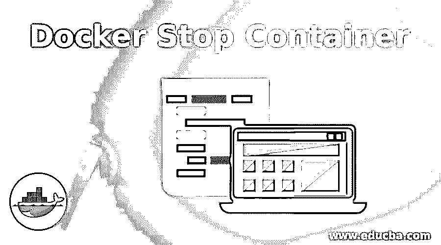

# 码头集装箱

> 原文：<https://www.educba.com/docker-stop-container/>

## 码头集装箱简介

码头停止集装箱用于停止码头集装箱。我们可以通过指定名称或容器 ID 来同时停止一个或多个 Docker 容器。当我们运行这个命令时，它首先将 SIGTERM 发送给在容器内运行的进程，并等待一段时间，如果它无法停止容器内的进程，那么它将发送 SIGKILL 信号来终止该进程。

**语法:**

<small>网页开发、编程语言、软件测试&其他</small>

`docker stop [OPTIONS] CONTAINER [CONTAINER…]`

**选项:**

我们在该命令中只有一个选项可以指定，即'–time '或'-t '。

**–time，-t:** 我们可以使用这个选项来控制宽限期，这意味着我们可以指定当 SIGTERM 不起作用时 Docker 守护程序应该何时发送 SIGKILL 信号。

`docker stop --help`

### Docker 中的停止容器命令是如何工作的？

当我们从 docker CLI 运行命令“docker stop container”时，Docker CLI 对 Docker 守护程序进行 API 调用，Docker 守护程序向在容器内运行的进程发送 SIGTERM 信号，默认情况下等待 10 秒钟，然后发送 SIGKILL 信号终止该进程。如果命令执行成功，它会在 STDOUT(即终端)上显示容器 ID 作为输出。

### 停靠站容器的示例

让我们通过下面的例子来理解这个命令。创建几个 nginx 容器，我们来玩玩吧。我们现在正在运行以下容器:-

`docker ps`

1.  只需使用容器 ID:–

**语法:**

`docker stop <container ID>`

**举例:**

`docker stop d207f7679ce5`

2.  让我们使用其名称来停止单个容器:–

**语法:**

`docker stop <container_name>`

**举例:**

`docker stop jovial_panini`

3.  现在，在同一个命令中使用容器 ID 停止多个容器:–

**语法:**

`docker stop <container1 ID><container2 ID> ......`

**举例:**

`docker stop 034cb3abe35c11967042830d`

4.  让我们用下面的容器名做同样的事情:-

**语法:**

`docker stop <container1 name><container2 name> .....`

**举例:**

`docker stop nifty_bellelated_dubinsky`

5.  比方说，我们有多个名称以“web”开头的容器，我们希望停止所有名称以“web”开头的容器。我们可以使用带有'–filter '和'–format '选项的' docker ps '命令，如下所示:–

`docker stop $(docker ps --filter "name=web" --format="{{.ID}}")`

**说明:**在上面的例子中，我们可以看到有 3 个名为‘web 1’、‘web 2’、‘web 3’的容器在运行。我们必须使用“filter”选项来过滤掉名称以“web”开头的容器，然后只列出容器的容器 ID，这样“docker stop”命令将只获得容器 ID，否则整个输出将被发送到“docker stop”命令，命令将失败。我们也可以使用容器名代替 ID，如下所示:–

`docker stop $(docker ps --filter "name=web" --format="{{.Names}}")`

我们还可以使用'-a '标志来输出所有容器，无论这些容器是否正在运行，但是，我们在这里停止容器，所以这不是必需的，因为我们只能停止正在运行的容器。我们可以在启动多个容器时使用'-a '标志。

6.  我们可以使用与上面相同的方法来停止带有特定 Docker 映像的容器运行。创建几个具有相同 Docker 映像的容器，并尝试使用以下命令一次性删除它们:-

`docker stop $(docker ps --filter "ancestor=nginx" --format="{{.Names}}")`

**说明:**在上面的例子中，我们可以看到我们只需要更换滤镜。通过使用不同的过滤器，我们可以根据需要停止容器，但是，格式必须是“名称”或“ID”。

7.  我们可以使用'–time '或'-t '选项来控制在将 SIGKILL 信号发送到容器内部运行的进程之前的宽限期，如下所示:–

`docker stop -t 20 web2`

`docker stop -t 20 web1`

**解释:**在上面的例子中，我们看不到任何区别，因为在这些容器下运行的进程被优雅地停止了。如果容器中的任何进程停止时间超过 10 秒，我们就可以使用这个方法，这样 docker 守护进程就不会试图杀死这个进程。

**注意:**我们可以在停止多个容器或查询 Docker 守护进程时使用这个选项。

### 码头集装箱的优势

下面给出了一些优点:

1.  我们可以使用这个命令优雅地停止在容器内部运行的进程，并且我们可以稍后使用“docker start”命令启动容器。
2.  我们可以通过在同一个命令中指定容器名或 ID 来停止一个或多个容器。
3.  我们还可以根据需要查询或过滤容器，并使用 stop 命令来停止这些容器。

### 结论

“停靠站停止”命令很容易记住停止集装箱的命令。还有另一个命令稍微大一点，但是做同样的事情，这个命令是 docker 容器停止<container name="" or="" id="">’。我们可以根据自己的喜好使用这两个命令。</container>

### 推荐文章

这是码头集装箱指南。在这里，我们还将讨论 docker 中的简介和停止容器命令是如何工作的？以及不同的示例及其代码实现。您也可以看看以下文章，了解更多信息–

1.  [Docker 导出](https://www.educba.com/docker-export/)
2.  [Docker 卷](https://www.educba.com/docker-volume/)
3.  [Docker 储存库](https://www.educba.com/docker-repositories/)
4.  [Dockerfile](https://www.educba.com/dockerfile/)

