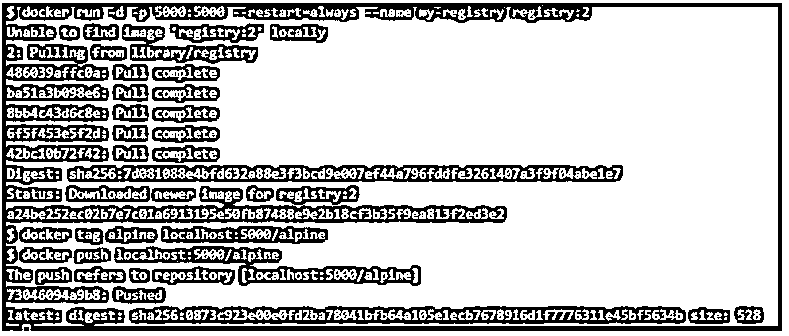
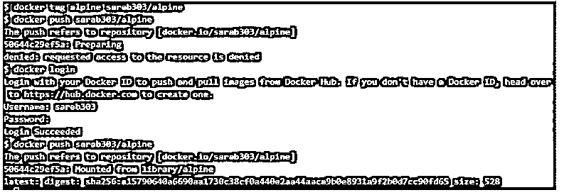
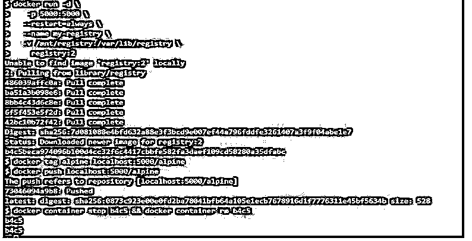
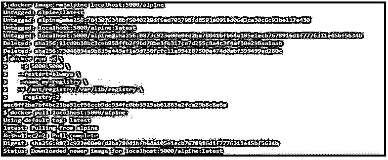
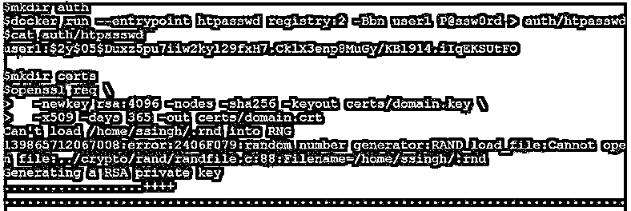
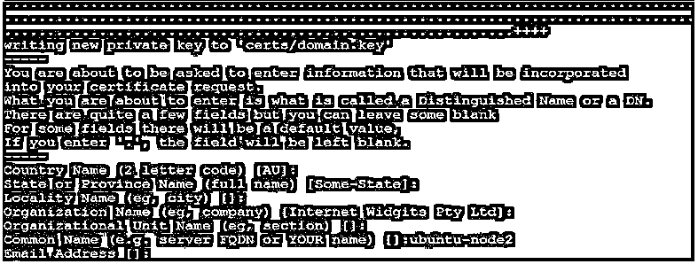

# 坞站注册表

> 原文：<https://www.educba.com/docker-registry/>

## Docker 注册表简介

Docker 注册表用于存储 Docker 图像，即只读模板。换句话说，Docker 注册表存储了以不同标记版本保存 Docker 图像的 Docker 储存库。它是一个开源、无状态、高度可伸缩的服务器端应用程序。它允许我们控制我们想要存储 Docker 图像的位置，我们完全拥有我们的图像分发管道，并将其与内部开发工作流程相集成。Docker 注册表仅与 Docker 引擎版本 1.6.0 或更高版本兼容。对于开发或小型部署，我们可以使用默认存储驱动程序，即 POSIX 文件系统，但是建议使用受支持的基于云的存储驱动程序，如 S3、微软 Azure、Openstack Swift 等。

### Docker 中的 Registry 是如何工作的？

我们可以运行我们自己的注册表来与我们的 CI/CD 管道集成。因此，如果有任何对源代码的提交，配置管理工具将在我们的 CI 系统上触发一个构建，如果构建成功，它将把新的映像推送到我们的注册中心。然后，注册中心发送通知，这将触发在分段环境中的部署。我们可以使用 CI/CD 模型在大型机器集群上快速部署新映像。我们可以使用 Docker 注册表在隔离的网络中共享 Docker 映像。它支持 TLS 和基本身份验证，以确保对托管图像的访问。

<small>网页开发、编程语言、软件测试&其他</small>

我们可以使用以下命令将私有注册表作为容器运行:

**代码:**

`$docker run -d -p 5000:5000 --restart=always --name my-registry registry:2
$docker tag alpine localhost:5000/alpine
$docker push localhost:5000/alpine`

**输出:**

在上面的例子中，我们已经使用“registry:2”Docker 映像启动了一个名为“my-registry”的注册表容器，它侦听端口 5000，重启选项设置为“always ”,因此如果容器在任何情况下停止，Docker 守护程序都会自动启动它。

现在，如果我们想要将任何 Docker 映像推送到这个私有注册中心，我们必须用“localhost:5000/ <docker_image_name>”重新标记现有的 Docker 映像，因为 Docker 映像的第一部分告诉我们应该将这个映像推送到哪个注册中心。这也适用于我们提取 Docker 图像的时候。但是，如果我们只指定 docker 映像名称，Docker 守护程序默认会在 Docker 映像名称前添加“docker.io/library/”,并指示从官方 Docker Hub 获取映像。例如，如果我们想从官方 Docker Hub 获取“Ubuntu”Docker 映像，我们可以运行如下命令:</docker_image_name>

**代码:**

`$docker pull ubuntu`

**输出:**

当我们试图推广“阿尔卑斯山”码头形象时，同样的事情也会发生。Docker 守护程序会自动将“docker.io/library/”添加到映像中，并尝试将其推送到官方 Docker Hub，但是它需要验证才能将映像推送到官方 Docker Hub。我们可以创建我们的 Docker ID，并将 Docker 图像推送到我们的 Docker ID，但是我们再次用我们的 Docker ID 和 Docker 图像名称重新标记 Docker 图像。

**代码:**

`$docker push alpine`

**输出:**

**代码:**

`$docker tag alpine sarab303/alpine
$docker push sarab303/alpine`

**输出:**

我们可以传递附加选项或修改选项来更改注册表的基本配置。例如，更改默认监听端口、定制存储位置、实现 TLS 以保护注册表等。

假设我们已经有一个应用程序在端口 5000 上进行侦听，我们希望在端口 5003 上公开注册表，我们可以按如下方式进行:

**代码:**

`$docker run -d -p 5003:5000 --restart=always --name my-registry registry:2
$docker tag alpine localhost:5003/alpine
$docker push localhost:5003/alpine`

**输出:**

如果我们想使用不同的端口，而不是注册表在容器中监听的默认端口，我们也可以通过使用环境变量 REGISTRY_HTTP_ADDR 来更改，如以下命令所示:

**代码:**

`$docker run -d \
-e REGISTRY_HTTP_ADDR=0.0.0.0:5003 \
-p 5003:5003 \
--name my-registry \
registry:2`

**输出:**

我们可以自定义存储位置来永久存储注册表的存储库，我们可以通过将主机位置或卷安装到容器来实现这一点。在这里，我们如下运行注册表容器，将主机目录“/mnt/registry”绑定挂载到“/var/lib/registry/”处的注册表容器中。

**代码:**

`$docker run -d \
-p 5000:5000 \
--restart=always \
--name my-registry \
-v /mnt/registry:/var/lib/registry \
registry:2
$docker tag alpine localhost:5000/alpine
$docker push localhost:5000/alpine
$docker container stop my-registry &&docker container rm my-registry
$docker image rm alpine localhost:5000/alpine
$docker run -d \
-p 5000:5000 \
--restart=always \
--name my-registry \
-v /mnt/registry:/var/lib/registry \
registry:2
$docker pull localhost:5000/alpine`

**输出:**

在上面的示例中，启动了一个名为“my-registry”的新本地注册表，并将“alpine”Docker 映像标记为“localhost:5000/alpine ”,并将其推送到本地注册表，然后停止注册表容器并删除它。还从主机中删除了本地可用的“alpine”和“localhost:5000/alpine”Docker 映像。现在，再次启动一个新的注册表容器，将相同的主机目录安装到该容器，并尝试提取之前推送的 Docker 映像，即“localhost:5000/alpine ”,并且成功了。

然而，上述实现仅用于测试目的，因为没有实现认证机制。让我们通过使用下面的命令生成一个“htpasswd”文件和自签名证书来实现私有注册中心的基本身份验证。

**代码:**

`$mkdirauth
$docker run --entrypointhtpasswd registry:2 -Bbn user1 P@ssw0rd>auth/htpasswd
$mkdir certs
$ opensslreq \
-newkey rsa:4096 -nodes -sha256 -keyout certs/domain.key \
-x509 -days 365 -out certs/domain.crt`

**输出:**

在上面的示例中，我们创建了一个名为“auth”和“certs”的目录，分别存储 htpasswd 凭据和自签名证书。首先，我们创建了密码为“P@ssw0rd”的用户“user1 ”,并将其存储在“auth”文件夹下的“htpasswd”文件中，然后使用 openssl 生成自签名证书，并将“domain.key”和“domain.crt”文件存储在“certs”文件夹中，除了服务器的公用名之外，所有详细信息都保持空白。

现在，我们创建一个带有附加选项的新容器，并将 certs 和 auth 文件夹挂载到其中。

**代码:**

`$docker run -d -p 443:443 --restart=always --name my-registry \
-v /home/ssingh/certs:/certs \
-v /home/ssingh/auth:/auth \
-e REGISTRY_HTTP_ADDR=0.0.0.0:443 \
-e REGISTRY_HTTP_TLS_CERTIFICATE=/certs/domain.crt \
-e REGISTRY_HTTP_TLS_KEY=/certs/domain.key \
-e REGISTRY_AUTH=htpasswd \
-e "REGISTRY_AUTH_HTPASSWD_REALM=Registry Realm" \
-e REGISTRY_AUTH_HTPASSWD_PATH=/auth/htpasswd \
registry:2` 

**输出:**

**代码:**

`$docker tag nginx localhost:443/nginx
$docker push localhost:443/nginx
$docker login localhost:443
$docker push localhost:443/nginx`

**输出:**

在上面的快照中，将“nginx”Docker 映像标记为“localhost:443/nginx ”,并尝试推送到新设置的私有注册表，但是我们可以看到它给出了一个错误，显示“没有基本的身份验证凭据”。使用“用户 1”的凭据登录到专用注册表，并且映像已成功推送到专用注册表。

### 结论

Docker Registry 是托管预私有注册表的一个很好的解决方案，但是，Docker Registry 有其他替代方案，如 Docker Hub，它可以免费使用，Docker 托管注册表，但需要为附加功能付费，DTR(即 Docker Trusted Registry)是注册中心的商业支持版本，附带 Docker Enterprise Edition。

### 推荐文章

这是一个 Docker 注册表指南。这里我们讨论 Docker 注册中心的介绍以及注册中心是如何工作的。您也可以看看以下文章，了解更多信息–

1.  [Docker 命令](https://www.educba.com/docker-commands/)
2.  [码头工人备选方案](https://www.educba.com/docker-alternatives/)
3.  [码头工人的优势](https://www.educba.com/advantages-of-docker/)
4.  [什么是 Docker Swarm？](https://www.educba.com/what-is-docker-swarm/)

