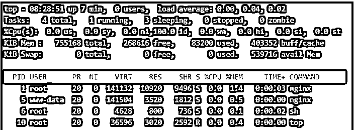

# ENTRYPOINT 坞站

> 原文:# t0]https://www . educba . com/docker-entry point/

## Docker 入口点介绍

Docker entrypoint 是 Dockerfile 指令或指示，用于指定当从 Docker 映像启动容器时应该运行的可执行文件。它有两种形式，第一种是“执行”形式，第二种是“外壳”形式。如果在 Docker 映像中没有指定 entrypoint 或 CMD，它会同时启动和退出，这意味着容器会自动停止，因此，我们必须指定 entrypoint 或 CMD，这样当我们启动容器时，它应该会执行某些操作，而不是停止。

**语法:**

<small>网页开发、编程语言、软件测试&其他</small>

如前所述，Docker 入口点有两种形式，因此我们有两种不同的语法，如下所示:-

“exec”格式语法:

`ENTRYPOINT [“executable”, “param1”, “param2”, ..]`

其中，当我们运行容器时，将启动可执行文件,“param1”和“param2”是我们必须传递给该可执行文件的参数。

“外壳”格式语法:

`ENTRYPOINT command param1 param2`

其中，command 是 shell 命令或我们希望在启动容器时运行的任何可执行文件，param1 和 param2 是参数。

### Docker 中的 ENTRYPOINT 是如何工作的？

正如我们所知，Docker ENTRYPOINT 允许我们使容器可运行，但是，我们仍然可以在启动容器时指定命令。当我们在运行时指定任何命令时，两种形式的 Docker 入口点表现不同。

*   “exec”表单允许我们为“docker run”命令指定命令行参数，并附加到“exec”表单所有元素的末尾，这意味着指定的命令将在 entrypoint 中指定的可执行文件之后运行。例如，如果我们将“-d”参数传递给“docker run”命令，那么 docker 守护程序会将该参数传递给入口点，指定的可执行文件将在后台运行。
*   “shell”形式不允许在启动容器时指定任何命令或“docker run”命令行参数，因为 ENTRYPOINT 命令作为“/bin/sh -c”的子命令运行。可执行文件的 PID 与容器的‘PID 1’不同，因此，如果我们从‘docker stop’命令传递任何 Unix 信号，如 SIGTERM，可执行文件不会收到它。

我们可以在使用'–ENTRYPOINT '标志启动容器时覆盖 entry point 指令。此外，如果我们在 Dockerfile 中提到了多个入口点指令，那么最后一个入口点将会起作用。

### Docker 入口点的示例

让我们通过一些例子来理解 Docker 入口点的工作。

#### 示例 1–“执行”表单入口点

我们希望使用 Ubuntu 创建一个 nginx Docker 映像作为基础映像，并且希望在自动运行容器时启动 nginx。

1.  我们必须首先用“exec”表单入口点创建一个 Dockerfile，如下所示:-

`FROM ubuntu
RUN apt-get update && apt-get install -y nginx
ENTRYPOINT ["nginx", "-g", "daemon off;"]`

2.  使用上述 Docker 文件构建 Docker 映像，如下所示:-

`docker build -t my-app.`

3.  使用这个新的 Docker 映像运行一个容器，并使用“docker exec”命令连接到新创建的容器，如下所示:-

`docker run -d --name my-web my-app
docker exec -it my-web sh`

4.  现在，如果我们在容器内部运行“top”命令，我们可以看到“nginx”已经在运行，PID 为 1。

#### 示例 2–“外壳”表单入口点

我们将使用与上面相同的场景，但是，我们将在 docker 文件中将入口点从“exec”替换为“shell ”,如下所示:

1.  让我们使用构建命令构建 Docker 映像，如下所示:

`docker build -t  my-app:v2 .`

2.  现在，使用上面的 Docker 映像运行一个容器，并连接到新创建的容器，检查 nginx 可执行文件的 PID

`docker run -d --name my-web2 my-app:v2
docker exec -it my-web2 sh`

**说明:**在上面的快照中，我们可以看到‘sh’命令正在‘PID 1’下运行。这是因为 nginx 现在作为'/bin/sh -c '命令的子命令运行。

3.  这样，我们无法使用“docker stop”命令正确地停止长时间运行的入口点可执行文件。如果我们想正确地停止可执行文件，我们必须在 Dockerfile 文件中的可执行文件前使用“exec ”,如下所示:

`FROM ubuntu
RUN apt-get update && apt-get install -y nginx
ENTRYPOINT exec nginx -g “daemon off;”`

4.  要验证它是否按预期工作，请创建一个名为“my-app:v3”的新 Docker 映像，并使用它运行一个容器，一旦容器启动，连接到它并再次检查 nginx 可执行文件的 PID:

`docker run -d --name my-web3 my-app:v3
docker exec -it my-web3 sh`

**说明:**在上面的快照中，我们可以看到 nginx 可执行文件现在的 PID 为 1。

#### 实施例 3

我们想看到一个正在运行的容器的入口点。我们可以通过使用带有' format '标志的' inspect '命令或' docker ps '命令来获得更清晰的输出，如下所示:-

`docker inspect my-web2`

`docker ps --format "table  {{.ID}} \t {{.Names}} \t {{.Command}}" --no-trunc`

#### 实施例 4

我们希望在启动容器时覆盖入口点。我们有“–入口点”标志。我们可以使用'–entry point '标志来传递命令，如下所示:–

`docker run -d --entrypoint sh --name my-web4 my-app
docker run -d --entrypoint sh --name my-web5 my-app:v2
docker run -d --entrypoint sh --name my-web6 my-app:v3`

`docker ps -a --format "table {{.ID}} \t {{.Names}} \t {{.Command}}" --no-trunc`

**T2】**

 ****解释:**在上面的快照中，我们可以看到容器‘my-web 4’、‘my-web 5’和‘my-web 6’正在显示命令‘sh’，因为 entrypoint 已经被覆盖。

**优点:**

1.  它允许我们创建容器可执行文件。
2.  如果我们需要，它提供了指定附加命令行参数的灵活性。

### 结论

现在，我们知道 Docker 入口点有两种形式，但是“exec”形式更好。我们有 Docker CMD，它也允许我们使容器可运行，但是我们在 Docker 入口点上比 CMD 有一些优势。大多数 Docker 基础映像都有一个 shell，如/bin/sh 或/bin/bash，作为 CMD 可执行文件，例如 ubuntu、busybox、debian 等。

### 推荐文章

这是 Docker ENTRYPOINT 的指南。这里我们也讨论一下入门以及 entrypoint 在 docker 中是如何工作的？以及不同的示例及其代码实现。您也可以看看以下文章，了解更多信息–

1.  [Docker 容器链接](https://www.educba.com/docker-container-linking/)
2.  [Docker 储存库](https://www.educba.com/docker-repositories/)
3.  [open hift vs docker](https://www.educba.com/openshift-vs-docker/)
4.  [对接按钮](https://www.educba.com/docker-push/)

**